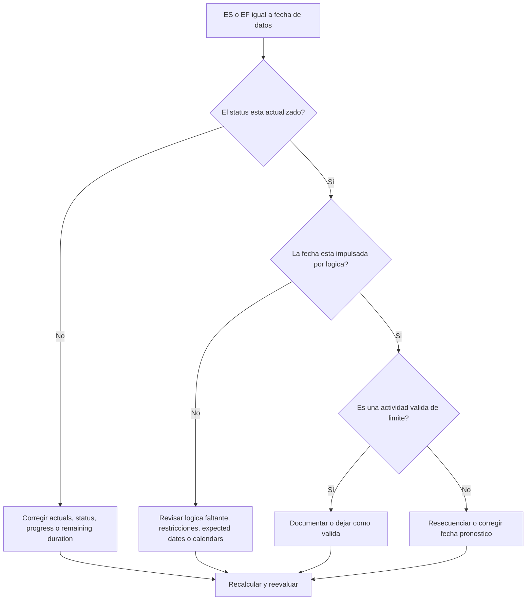

# Actividades en la fecha de datos - Guía de mejora

## Proposito

Esta guia ayuda a los planificadores a revisar actividades cuyo Early Start o Early Finish cae exactamente en la fecha de datos de Primavera P6. Soporta revisiones del ciclo de actualizacion mostrando donde el trabajo se concentra en el limite entre desempeno real y trabajo pronosticado.

## Antes de Empezar

Reuna la siguiente informacion antes de tomar accion:

- Resultado actual de la evaluacion para esta metrica.
- fecha de datos del proyecto usada en el ultimo calculo del cronograma.
- Lista de actividades donde Early Start = fecha de datos.
- Lista de actividades donde Early Finish = fecha de datos.
- Activity Status, Actual Start, Actual Finish, Remaining Duration, Start, Finish, Total Float y Calendar.
- Detalle de relaciones predecesoras y sucesoras.
- Constraints, expected dates y notas de actualizacion.

## Entender el Resultado

Un resultado solido es cero actividades sin explicacion con Early Start o Early Finish en la fecha de datos.

Algunas actividades pueden ubicarse legitimamente en la fecha de datos, especialmente trabajo de corto plazo listo para proceder o trabajo que termina en el limite de actualizacion. El problema no es la fecha por si sola; el problema es si la fecha esta explicada por status, logica e informacion de actualizacion validos.

Un resultado debil significa que muchas actividades se concentran en la fecha de datos sin una razon clara de cronograma.

## Objetivo de Mejora

El objetivo es 0 actividades sin explicacion con ES = fecha de datos o EF = fecha de datos.

La meta es confirmar que cada actividad este correctamente actualizada, impulsada por logica y pronosticado desde el limite de actualizacion correcto.

## Plan de Accion

### Paso 1: Identificar el Problema Principal

Cree un layout o reporte en P6 que filtre actividades donde Early Start es igual a la fecha de datos o Early Finish es igual a la fecha de datos. Incluya Activity ID, Activity Name, WBS, Activity Status, Early Start, Early Finish, Start, Finish, Actual Start, Actual Finish, Remaining Duration, Total Float, Calendar, restricciones, predecesores y sucesores.

Revise cada actividad y pregunte:

- La actividad esta complete, in progress o not started?
- Falta Actual Start o Actual Finish?
- La actividad esta impulsada logicamente hacia la fecha de datos?
- Un restriccion, expected date o calendar esta llevando la actividad a la fecha de datos?
- La actividad tiene open start, open finish o logica debil?
- La fecha de datos es correcta para el periodo de actualizacion?

### Paso 2: Aplicar las Correcciones Recomendadas

Si el status esta incompleto, corrija Actual Start, Actual Finish, Remaining Duration, Percent Complete y Activity Status antes de cambiar la logica.

Si una actividad inicia en la fecha de datos porque falta logica predecesora o la logica no impulsa la fecha, agregue o corrija relaciones que representen la secuencia real de trabajo.

Si una actividad termina en la fecha de datos porque el avance no fue actualizado, confirme si el trabajo termino al limite de actualizacion. Ingrese Actual Finish si esta completo, o actualice Remaining Duration y pronostico finish si queda trabajo.

Si restricciones o expected dates estan llevando actividades a la fecha de datos, eliminelos, reviselos o documentelos segun el procedimiento de project controls.

### Paso 3: Eliminar Bloqueos Comunes

Los bloqueos comunes incluyen actualizacion incompleta, open starts, open finishes, restricciones usadas como sustituto de logica y movimiento de fecha de datos sin suficiente revision de status.

Otro bloqueo es asumir que las actividades en la fecha de datos no importan. Una concentracion grande en el limite de actualizacion puede ocultar secuenciacion faltante o hacer que el pronostico cercano parezca mas limpio de lo que es.

### Paso 4: Validar los Cambios

Recalcule el cronograma despues de las correcciones. Ejecute nuevamente la metrica y confirme que cada actividad restante en la fecha de datos este explicada por status actual, logica valida o excepcion aprobada.

Revise Total Float, critical o longest path, fechas de hitos y reportes lookahead para confirmar que la correccion no creo nuevas inconsistencias.

## Cronograma de Mejora

### Dia 1: Revisar y Diagnosticar

Ejecute la metrica, confirme la fecha de datos y separe hallazgos entre ES en fecha de datos, EF en fecha de datos, issues de status, issues de logica, restricciones y actividades validas de limite.

### Dias 2-3: Implementar Acciones Prioritarias

Corrija primero actividades criticas, casi criticas y de corto plazo. Actualice status, agregue o corrija logica y revise restricciones.

### Dias 4-5: Monitorear Resultados Iniciales

Recalcule el cronograma y revise salidas lookahead, cambios de float, movimiento de hitos y actividades que todavia quedan en la fecha de datos.

### Dia 6: Ajustes Finales

Resuelva items inciertos restantes con el responsable de disciplina, lider de campo o lider de project controls.

### Dia 7: Reevaluar y Comparar

Ejecute la evaluacion nuevamente y compare el resultado contra el umbral objetivo.

## Seguimiento del Progreso

Use un tracker simple para gestionar correcciones y aprobaciones.

| Fecha | Accion Tomada | Impacto Esperado | Resultado / Observacion | Siguiente Paso |
| --- | --- | --- | --- | --- |
| [Fecha] | ES/EF en fecha de datos revisados | Identificar concentracion en el limite | [Resultado observado] | Asignar responsable |
| [Fecha] | Status o actual dates corregidos | Alinear estado con limite de actualizacion | [Resultado observado] | Recalcular cronograma |
| [Fecha] | Logica o restricciones corregidos | Reducir concentracion sin explicacion en fecha de datos | [Resultado observado] | Reevaluar metrica |

## Si los Resultados No Mejoran

Si los resultados no mejoran, revise si las actividades se llevan repetidamente a la fecha de datos por logica faltante, restricciones, expected dates obsoletas o procedimientos incompletos de actualizacion.

Escale items no resueltos cuando afecten trabajo critico, casi critico, reporte al cliente, entrega, pagos o ejecucion de corto plazo.

## Mantenimiento

Revise esta metrica en cada ciclo de actualizacion antes de emitir reportes. Es especialmente util despues de mover la fecha de datos, importar avance, resecuenciar trabajo o recalcular despues de cambios importantes de status.

## Checklist de Resumen

- [ ] Resultado actual revisado
- [ ] Umbral objetivo confirmado
- [ ] fecha de datos confirmada
- [ ] Actividades ES = fecha de datos revisadas
- [ ] Actividades EF = fecha de datos revisadas
- [ ] Status y actual dates revisados
- [ ] Remaining Duration revisado
- [ ] Logica y restricciones revisados
- [ ] Actividades validas de limite documentadas
- [ ] Cronograma recalculado
- [ ] Evaluacion repetida
- [ ] Siguientes pasos documentados
## Contenido relacionado
- [Actividades en la fecha de datos: Revisiones de Early Start y Early Finish en Primavera P6 - Descripción general](01_overview_template.md)
- [Actividades en la fecha de datos: Revisiones de Early Start y Early Finish en Primavera P6](03_blog_template.md)
- [Que Es Un Cronograma](../../02b_blogs_es/01_WHAT%20A%20SCHEDULE%20IS/01_blog.md)
- [Logica Robusta](../../02b_blogs_es/02_ROBUST%20LOGIC/02_ROBUST%20LOGIC.md)
