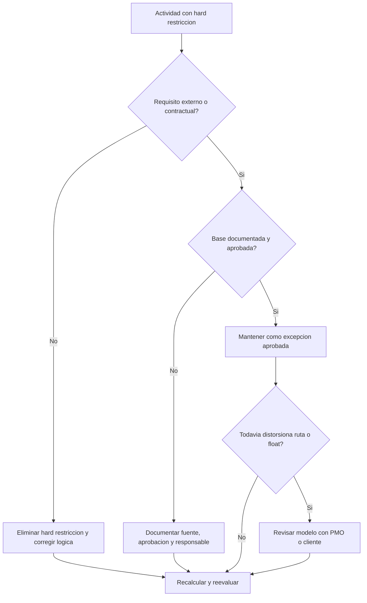

## Proposito

Esta guia ayuda a los planificadores a revisar y reducir hard restricciones en Primavera P6. Se enfoca en restricciones que controlan fuertemente las fechas de actividad, especialmente Mandatory Start y Mandatory Finish.

## Antes de Empezar

Reuna la siguiente informacion antes de tomar accion:

- Resultado actual de la evaluacion para esta metrica.
- Lista de actividades con hard restricciones.
- Constraint Type y Constraint Date para cada actividad.
- Activity ID, Activity Name, WBS, Activity Status, Start, Finish, Total Float y estado critical o longest path.
- Detalle de relaciones predecesoras y sucesoras.
- Base contractual, cliente, permiso, acceso, regulatoria o entrega para cualquier restriccion requerido.
- Comparacion contra baseline o actualizacion previa que muestre cuando se agrego el restriccion.

## Entender el Resultado

Un resultado solido es cero hard restricciones sin explicacion.

Los hard restricciones pueden reemplazar o restringir fuertemente el calculo CPM normal. Pueden ser validos para fechas contractuales, ventanas de acceso, permisos, hold points regulatorios o requisitos indicados por el owner, pero no deben usarse como sustituto de logica faltante.

Un resultado debil significa que el cronograma contiene fechas impuestas que pueden estar controlando el pronostico en lugar de la red logica.

## Objetivo de Mejora

El objetivo es 0 hard restricciones sin explicacion.

La meta es eliminar hard restricciones innecesarios y documentar cualquier restriccion que sea realmente requerido.

## Plan de Accion

### Paso 1: Identificar el Problema Principal

Cree un layout o reporte en P6 que filtre actividades con tipos de hard restriccion. Incluya Activity ID, Activity Name, WBS, Activity Status, Start, Finish, Constraint Type, Constraint Date, Total Float, estado critical o longest path, predecesores y sucesores.

Revise cada actividad con restriccion y pregunte:

- Cual es la fuente del hard restriccion?
- Es requerido por contrato o por una condicion externa?
- Esta reemplazando logica predecesora o sucesora faltante?
- Esta forzando una fecha objetivo que deberia ser calculada por el cronograma?
- Afecta Total Float, ruta critica o reporte de hitos?
- La razon esta documentada y aprobada?

### Paso 2: Aplicar las Correcciones Recomendadas

Si el hard restriccion no es requerido externamente, eliminelo y agregue o corrija logica CPM. Use relaciones, secuencia de actividades, calendarios y duraciones realistas para modelar el trabajo en lugar de forzar fechas.

Si el hard restriccion es requerido, documente la base. Capture la fuente, aprobacion, fecha, responsable y razon por la cual no puede modelarse con logica normal.

Si el restriccion se esta usando para preservar una fecha objetivo, revise si un restriccion mas suave, hito, deadline o nota de reporte seria mas apropiado.

### Paso 3: Eliminar Bloqueos Comunes

Los bloqueos comunes incluyen restricciones heredados de baselines antiguas, fechas objetivo del cliente ingresadas como mandatory dates, recovery plans que dejan restricciones temporales y logica de interfaces faltante.

Otro bloqueo es asumir que un hard restriccion es aceptable porque la fecha es importante. Las fechas importantes deben ser visibles, pero el cronograma todavia debe explicar como el trabajo llega a ellas.

### Paso 4: Validar los Cambios

Recalcule el cronograma despues de las correcciones. Ejecute nuevamente la metrica y confirme que los hard restricciones restantes esten aprobados y documentados.

Revise Total Float, critical o longest path, fechas de hitos y salidas de comparacion del cronograma para confirmar que la correccion no creo movimientos inesperados.

## Cronograma de Mejora

### Dia 1: Revisar y Diagnosticar

Ejecute la metrica y agrupe hallazgos por WBS, tipo de restriccion, criticidad y base documentada.

### Dias 2-3: Implementar Acciones Prioritarias

Elimine primero hard restricciones innecesarios en actividades criticas, casi criticas, contractuales y de corto plazo. Agregue logica faltante donde sea necesario.

### Dias 4-5: Monitorear Resultados Iniciales

Recalcule el cronograma y revise movimiento de float, cambios de ruta critica e impactos en hitos.

### Dia 6: Ajustes Finales

Resuelva excepciones restantes con el planificador, lider de project controls, revisor PMO o representante del cliente.

### Dia 7: Reevaluar y Comparar

Ejecute la evaluacion nuevamente y compare el resultado contra el umbral objetivo.

## Seguimiento del Progreso

Use un tracker simple para gestionar correcciones y aprobaciones.

| Fecha | Accion Tomada | Impacto Esperado | Resultado / Observacion | Siguiente Paso |
| --- | --- | --- | --- | --- |
| [Fecha] | Hard restricciones revisados | Identificar controles de fecha impuestos | [Resultado observado] | Asignar responsable |
| [Fecha] | Hard restriccion innecesario eliminado | Restaurar calculo basado en logica | [Resultado observado] | Recalcular cronograma |
| [Fecha] | Hard restriccion aprobado documentado | Mantener excepcion justificada | [Resultado observado] | Reevaluar metrica |

## Si los Resultados No Mejoran

Si los resultados no mejoran, revise si los hard restricciones se reintroducen por importaciones, fragnets copiados, actualizaciones de baseline o cambios de recovery schedule.

Escale items no resueltos cuando afecten ruta critica, hitos contractuales, reporte al cliente, analisis de demora, eventos de pago o fechas de entrega.

## Mantenimiento

Revise esta metrica en cada ciclo de actualizacion y antes de aprobar una baseline. Los hard restricciones deben formar parte de los health checks normales, especialmente despues de resecuenciacion importante, recovery planning y preparacion de entregas al cliente.

## Checklist de Resumen

- [ ] Resultado actual revisado
- [ ] Umbral objetivo confirmado
- [ ] Lista de hard restricciones generada
- [ ] Constraint type y date revisados
- [ ] Base externa confirmada
- [ ] Hard restricciones innecesarios eliminados
- [ ] Logica faltante corregida
- [ ] Excepciones aprobadas documentadas
- [ ] Cronograma recalculado
- [ ] Float y ruta critica revisados
- [ ] Evaluacion repetida
- [ ] Siguientes pasos documentados
## Contenido relacionado
- [Hard Constraints en Primavera P6](03_blog_template.md)
- [Que Es Un Cronograma](../../02b_blogs_es/01_WHAT%20A%20SCHEDULE%20IS/01_blog.md)
- [Logica Robusta](../../02b_blogs_es/02_ROBUST%20LOGIC/02_ROBUST%20LOGIC.md)
