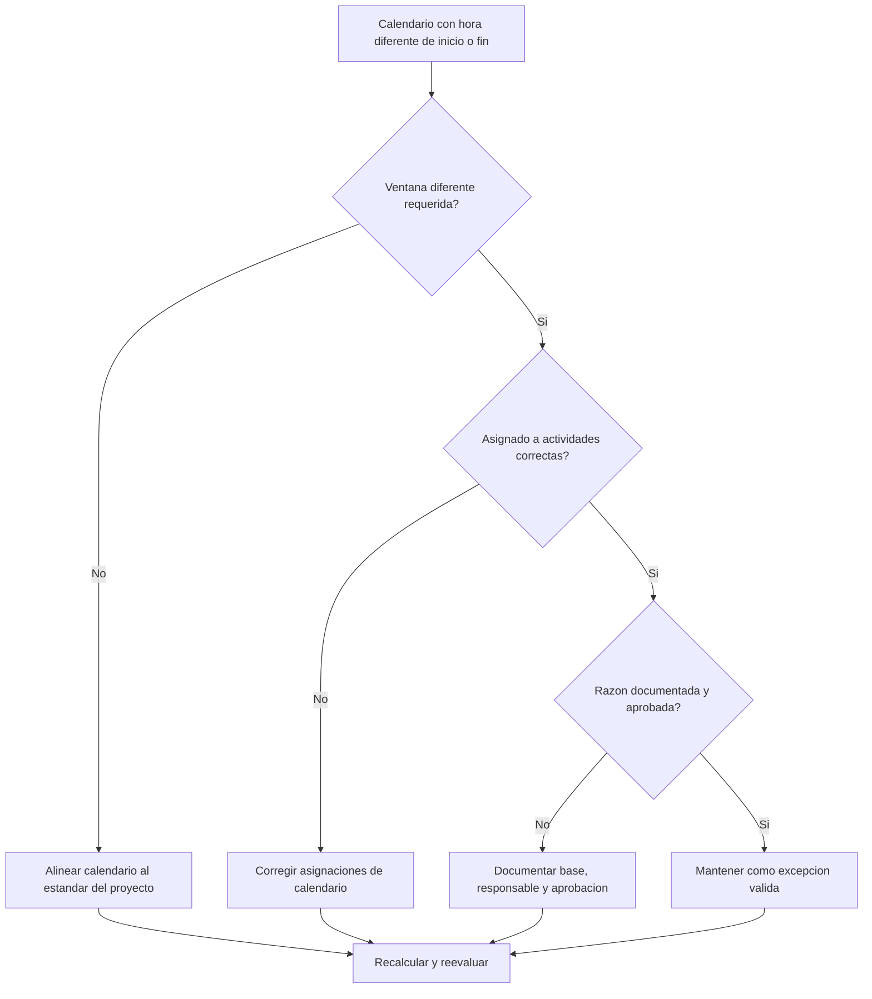

# Calendarios con Diferentes Horas de Inicio y Fin en Primavera P6 - Guía de mejora

## Proposito

Esta guia ayuda a los planificadores a revisar calendarios de Primavera P6 que usan diferentes horas de inicio o fin del dia laboral. Soporta revisiones de calidad confirmando que las diferencias de horario sean intencionales, aprobadas y entendidas.

## Antes de Empezar

Reuna la siguiente informacion antes de tomar accion:

- Resultado actual de la evaluacion para esta metrica.
- Estandar aprobado del calendario del proyecto y ventana diaria normal de trabajo.
- Lista de calendarios con diferentes start times, finish times, ventanas de turno o patrones de dia parcial.
- Actividades asignadas a cada calendario afectado.
- Tipo de calendario, como global, project o resource calendar.
- Actividades criticas o casi criticas que usan calendarios afectados.
- Razon de cada calendario no estandar, como turno nocturno, trabajo durante paradas, acceso restringido o horario especial de cuadrilla.

## Entender el Resultado

Un resultado solido es cero calendarios sin explicacion con diferentes horas de inicio o fin.

Las diferencias de calendario pueden ser validas cuando el trabajo realmente sigue diferentes turnos, ventanas de acceso o disponibilidad de recursos. La preocupacion aparece cuando los calendarios difieren por hora del dia sin una razon clara.

Un resultado debil significa que el cronograma puede contener supuestos ocultos de calendario que afectan fechas, float y comportamiento de la logica.

## Objetivo de Mejora

El objetivo es 0 calendarios sin explicacion con diferentes horas de inicio o fin.

La meta es confirmar si cada ventana de trabajo diferente es requerida, documentada y asignada solo a las actividades correctas.

## Plan de Accion

### Paso 1: Identificar el Problema Principal

Cree una exportacion de revision de calendarios desde P6 o una herramienta de evaluacion que liste cada calendario, su hora normal de inicio, hora de fin, horas diarias, excepciones y actividades asignadas.

Revise cada calendario no estandar y pregunte:

- Cual es el dia laboral estandar aprobado del proyecto?
- Que calendarios usan horas diferentes de inicio o fin?
- Las diferencias son intencionales o accidentales?
- Que actividades usan cada calendario?
- Actividades criticas o casi criticas estan afectadas?
- La diferencia de calendario esta documentada y aprobada?

### Paso 2: Aplicar las Correcciones Recomendadas

Si la diferencia de calendario es accidental, alinee la hora de inicio, hora de fin y periodos diarios de trabajo con el estandar aprobado del proyecto.

Si la diferencia de calendario es valida, documente la razon. Casos comunes validos incluyen turno nocturno, trabajo de fin de semana, ventanas de parada, restricciones de acceso del owner, restricciones ambientales o periodos de trabajo especificos de recursos.

Si las actividades estan asignadas al calendario incorrecto, corrija la asignacion del calendario de actividad antes de cambiar el calendario. Un calendario especial valido puede crear problemas si se asigna demasiado ampliamente.

### Paso 3: Eliminar Bloqueos Comunes

Los bloqueos comunes incluyen calendarios copiados de cronogramas antiguos, calendarios importados con configuraciones ocultas de hora, resource calendars usados como activity calendars y pequenas diferencias de hora que no son visibles en layouts normales de fecha.

Otro bloqueo es revisar solo la fecha y no la hora. En P6, la hora del dia puede afectar la ubicacion de actividades, float, comportamiento de relaciones y aparentes movimientos de un dia.

### Paso 4: Validar los Cambios

Recalcule el cronograma despues de corregir calendarios. Ejecute nuevamente la metrica y confirme que las diferencias restantes sean validas y esten documentadas.

Revise fechas de actividades afectadas, Total Float, critical o longest path, relaciones logicas y reportes lookahead para confirmar que la correccion no creo movimientos inesperados.

## Cronograma de Mejora

### Dia 1: Revisar y Diagnosticar

Ejecute la metrica y agrupe hallazgos por calendario, ventana de trabajo, tipo de calendario, actividades asignadas y criticidad.

### Dias 2-3: Implementar Acciones Prioritarias

Corrija primero diferencias accidentales de horario y asignaciones incorrectas en actividades criticas, casi criticas y de corto plazo.

### Dias 4-5: Monitorear Resultados Iniciales

Recalcule el cronograma y revise movimiento de float, cambios de fecha, impactos en hitos y cambios en lookahead.

### Dia 6: Ajustes Finales

Resuelva excepciones restantes de calendario con el planificador, responsable de disciplina, lider de project controls o revisor PMO.

### Dia 7: Reevaluar y Comparar

Ejecute la evaluacion nuevamente y compare el resultado contra el umbral objetivo.

## Seguimiento del Progreso

Use un tracker simple para gestionar correcciones y aprobaciones.

| Fecha | Accion Tomada | Impacto Esperado | Resultado / Observacion | Siguiente Paso |
| --- | --- | --- | --- | --- |
| [Fecha] | Horas de inicio y fin de calendario revisadas | Identificar ventanas no estandar | [Resultado observado] | Asignar responsable |
| [Fecha] | Calendario alineado al estandar del proyecto | Eliminar diferencia accidental | [Resultado observado] | Recalcular cronograma |
| [Fecha] | Excepcion valida de calendario documentada | Mantener ventana justificada | [Resultado observado] | Reevaluar metrica |

## Si los Resultados No Mejoran

Si los resultados no mejoran, revise si calendarios no estandar se reintroducen por importaciones, cronogramas copiados, asignaciones de recursos o actualizaciones de baseline.

Escale diferencias de calendario no resueltas cuando afecten ruta critica, reporte al cliente, hitos de pago, trabajo durante paradas, fechas de entrega o ejecucion de corto plazo.

## Mantenimiento

Revise esta metrica durante el desarrollo de baseline, importaciones de cronograma y cada ciclo importante de actualizacion. Las configuraciones de hora de calendario deben formar parte de los health checks antes de emitir reportes.

## Checklist de Resumen

- [ ] Resultado actual revisado
- [ ] Umbral objetivo confirmado
- [ ] Estandar de calendario del proyecto confirmado
- [ ] Horarios no estandar identificados
- [ ] Actividades asignadas revisadas
- [ ] Impactos criticos y casi criticos revisados
- [ ] Diferencias accidentales corregidas
- [ ] Excepciones validas documentadas
- [ ] Cronograma recalculado
- [ ] Cambios de fechas y float revisados
- [ ] Evaluacion repetida
- [ ] Siguientes pasos documentados
## Contenido relacionado
- [Calendarios con Diferentes Horas de Inicio y Fin en Primavera P6 - Descripción general](01_overview_template.md)
- [Calendarios con Diferentes Horas de Inicio y Fin en Primavera P6](03_blog_template.md)
- [Que Es Un Cronograma](../../02b_blogs_es/01_WHAT%20A%20SCHEDULE%20IS/01_blog.md)
- [Logica Robusta](../../02b_blogs_es/02_ROBUST%20LOGIC/02_ROBUST%20LOGIC.md)
