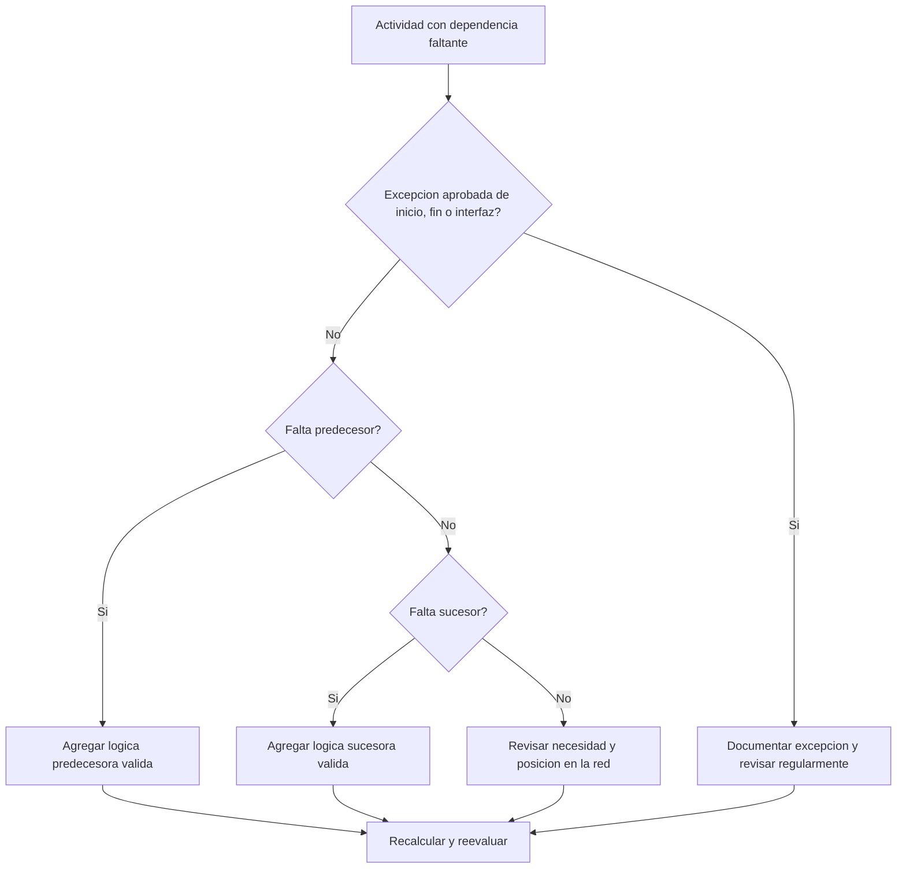

# Dependencias Faltantes en Primavera P6 - Guía de mejora

## Proposito

Esta guia ayuda a los planificadores a identificar y corregir logica predecesora o sucesora faltante en Primavera P6. Soporta la calidad del cronograma mejorando la integridad de la red CPM.

## Antes de Empezar

Reuna la siguiente informacion antes de tomar accion:

- Resultado actual de la evaluacion para esta metrica.
- Lista de actividades sin predecesores.
- Lista de actividades sin sucesores.
- Lista de actividades sin logica predecesora ni sucesora.
- Activity ID, Activity Name, WBS, Activity Type, Activity Status, Start, Finish, Total Float y Calendar.
- Lista aprobada de excepciones de inicio de proyecto, fin de proyecto, interfaces externas y contractuales.
- Ultimas notas de actualizacion y responsable de disciplina o paquete.

## Entender el Resultado

Un resultado solido es cero actividades sin resolver con logica de dependencia faltante.

Algunas actividades pueden legitimamente no tener predecesor o sucesor, como el hito aprobado de inicio del proyecto, el hito final de completacion o hitos aprobados de interfaz externa. Estas excepciones deben ser limitadas y documentadas.

Un resultado debil significa que el cronograma contiene actividades que no estan correctamente conectadas a la red CPM.

## Objetivo de Mejora

El objetivo es 0 actividades sin resolver con dependencias faltantes.

La meta es conectar cada actividad con logica predecesora y sucesora valida, o documentar la razon aprobada por la que es una excepcion.

## Plan de Accion

### Paso 1: Identificar el Problema Principal

Cree un layout o reporte en P6 que filtre actividades sin predecesores, sin sucesores o sin ninguno de los dos. Incluya Activity ID, Activity Name, WBS, Activity Type, Activity Status, Start, Finish, Total Float, Calendar, restricciones, predecesores y sucesores.

Revise cada actividad y pregunte:

- Esta actividad es un item aprobado de inicio o fin de proyecto?
- Es una interfaz externa, fecha controlada por el owner o excepcion contractual?
- Que trabajo debe ocurrir antes de que esta actividad pueda iniciar?
- Que trabajo depende de que esta actividad termine o inicie?
- La actividad esta obsoleta, duplicada o con status incorrecto?
- Que responsable puede confirmar la dependencia real?

### Paso 2: Aplicar las Correcciones Recomendadas

Para open starts, agregue logica predecesora que represente la condicion real requerida antes de que la actividad pueda iniciar. Esto puede incluir trabajo previo, aprobaciones, acceso, procura, liberacion de diseno, inspeccion o entrega.

Para open finishes, agregue logica sucesora que represente lo que depende de la actividad. Esto puede incluir trabajo siguiente, pruebas, commissioning, turnover, closeout o un hito de completacion.

Para actividades aisladas sin predecesores ni sucesores, confirme si la actividad todavia es necesaria. Si es trabajo valido, conectela a la red. Si esta obsoleta, elimine o cierrela segun el procedimiento de project controls.

### Paso 3: Eliminar Bloqueos Comunes

Los bloqueos comunes incluyen actividades copiadas, fragnets incompletos, handoffs poco claros entre disciplinas, informacion de interfaz faltante y presion por cargar actividades antes de conocer la secuencia.

Otro bloqueo es agregar relaciones placeholder solo para pasar la metrica. Las relaciones deben representar dependencias reales, no enlaces artificiales.

### Paso 4: Validar los Cambios

Recalcule el cronograma despues de las correcciones. Ejecute nuevamente la metrica y confirme que cada actividad restante este conectada o documentada como excepcion aprobada.

Revise Total Float, critical o longest path, fechas de hitos y reportes lookahead para confirmar que la logica agregada no creo movimientos inesperados.

## Cronograma de Mejora

### Dia 1: Revisar y Diagnosticar

Ejecute la metrica y agrupe hallazgos en predecesores faltantes, sucesores faltantes, actividades aisladas, excepciones validas y actividades obsoletas.

### Dias 2-3: Implementar Acciones Prioritarias

Corrija primero actividades criticas, casi criticas, contractuales y de corto plazo. Agregue logica valida y elimine actividades obsoletas cuando corresponda.

### Dias 4-5: Monitorear Resultados Iniciales

Recalcule el cronograma y revise float, ruta critica, fechas lookahead e impactos en hitos.

### Dia 6: Ajustes Finales

Resuelva preguntas restantes de dependencia con lideres de disciplina, responsables de paquete, construction managers o liderazgo de project controls.

### Dia 7: Reevaluar y Comparar

Ejecute la evaluacion nuevamente y compare el resultado contra el umbral objetivo.

## Seguimiento del Progreso

Use un tracker simple para gestionar correcciones y aprobaciones.

| Fecha | Accion Tomada | Impacto Esperado | Resultado / Observacion | Siguiente Paso |
| --- | --- | --- | --- | --- |
| [Fecha] | Dependencias faltantes revisadas | Identificar open starts y open finishes | [Resultado observado] | Asignar responsable |
| [Fecha] | Logica predecesora agregada | Mejorar logica de inicio | [Resultado observado] | Recalcular cronograma |
| [Fecha] | Logica sucesora agregada | Mejorar continuidad de finish | [Resultado observado] | Reevaluar metrica |

## Si los Resultados No Mejoran

Si los resultados no mejoran, revise si se agregan nuevas actividades sin logica, si los fragnets importados estan incompletos o si las reglas de excepcion son demasiado amplias.

Escale items no resueltos cuando afecten ruta critica, reporte al cliente, hitos de pago, entrega, procura o ejecucion de corto plazo.

## Mantenimiento

Revise esta metrica en cada ciclo de actualizacion, despues de importaciones de cronograma y antes de aprobar una baseline. Las dependencias faltantes deben formar parte de los health checks normales del cronograma.

## Checklist de Resumen

- [ ] Resultado actual revisado
- [ ] Umbral objetivo confirmado
- [ ] Open starts revisados
- [ ] Open finishes revisados
- [ ] Actividades aisladas revisadas
- [ ] Excepciones validas documentadas
- [ ] Logica predecesora faltante agregada
- [ ] Logica sucesora faltante agregada
- [ ] Actividades obsoletas resueltas
- [ ] Cronograma recalculado
- [ ] Evaluacion repetida
- [ ] Siguientes pasos documentados
## Contenido relacionado
- [Dependencias Faltantes en Primavera P6 - Descripción general](01_overview_template.md)
- [Dependencias Faltantes en Primavera P6](03_blog_template.md)
- [Que Es Un Cronograma](../../02b_blogs_es/01_WHAT%20A%20SCHEDULE%20IS/01_blog.md)
- [Logica Robusta](../../02b_blogs_es/02_ROBUST%20LOGIC/02_ROBUST%20LOGIC.md)
