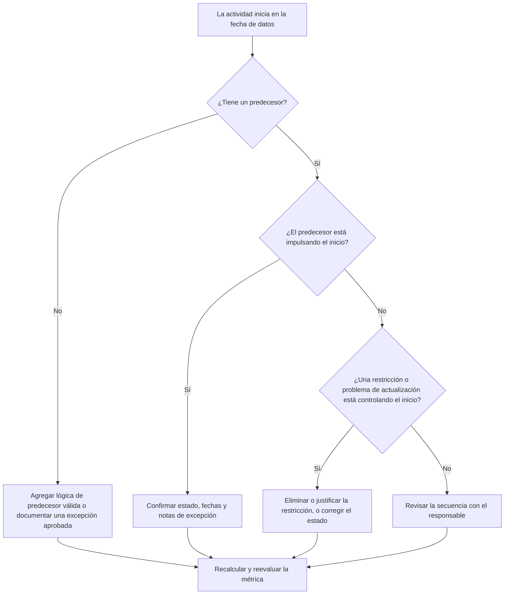

## Propósito

Esta guía ayuda a programadores y equipos de control de proyectos a reducir o eliminar las actividades que están programadas para iniciar en la fecha de datos (data date) de Primavera P6 sin lógica de predecesor válida que impulse el inicio. Aplica a revisiones de calidad del cronograma, verificaciones de salud del PMO y validación en ciclos de actualización.

El objetivo es confirmar que el trabajo de corto plazo está respaldado por una lógica CPM clara y que las actividades no están iniciando en la fecha de datos únicamente por relaciones faltantes, restricciones, fechas manuales o actualizaciones de avance incompletas.

## Antes de comenzar

Recopile la siguiente información antes de actuar:

- Resultado actual de la evaluación para esta métrica.
- Fecha de datos del proyecto utilizada en el cálculo más reciente del cronograma.
- Lista de actividades abiertas o no iniciadas con fecha de inicio igual a la fecha de datos.
- Detalles de relaciones de predecesor y sucesor para cada actividad.
- Restricciones, fechas esperadas, fechas reales y asignaciones de calendario.
- Opciones de programación de P6 utilizadas para la actualización, incluyendo configuraciones de lógica retenida o sustitución de avance (progress override) donde corresponda.
- Cualquier excepción aprobada, como actividades de inicio del proyecto, hitos de interfaz externa o inicios dirigidos por el propietario.

## Entender su resultado

Un resultado sólido es cero actividades sin resolver que inicien en la fecha de datos sin lógica de predecesor conductora. Esto significa que el trabajo actual y de corto plazo está conectado a la red del cronograma y que la fecha de datos no está ocultando secuenciamiento faltante.

Un resultado aceptable puede incluir un pequeño número de excepciones documentadas. Estas deben ser revisadas y aprobadas, no ignoradas. Por ejemplo, un hito de aviso de procedencia o una actividad autorizada externamente puede no necesitar un predecesor normal, pero el motivo debe ser visible para los revisores.

Un resultado débil significa que múltiples actividades están iniciando en la fecha de datos sin un impulsor lógico claro. Esto puede indicar inicios abiertos, relaciones de predecesor faltantes, restricciones excesivas, actualizaciones de avance incompletas o actividades que no fueron correctamente reordenadas tras la última actualización.

## Objetivo de mejora

El objetivo es 0 actividades sin resolver que inicien en la fecha de datos sin lógica conductora válida.

El objetivo de mejora no es solo reducir el conteo. El objetivo de fondo es asegurarse de que cada actividad cercana a la fecha de datos tenga una razón defendible para su inicio pronosticado. Tras la corrección, cada actividad afectada debe tener lógica de predecesor apropiada, una excepción documentada, o un estado y fecha corregidos.

## Plan de acción

### Paso 1: Identificar el problema principal

Cree una vista o reporte en P6 que filtre actividades abiertas o no iniciadas con fecha de inicio igual a la fecha de datos. Incluya columnas para ID de actividad, nombre de actividad, EDT (WBS), inicio, finalización, estado, holgura total, calendario, restricción primaria, predecesores, sucesores e indicadores de relación conductora si están disponibles.

Revise cada actividad y pregúntese:

- ¿Tiene la actividad algún predecesor?
- Si existen predecesores, ¿están realmente impulsando el inicio?
- ¿Está la actividad siendo retenida o movida por una restricción?
- ¿Le falta a la actividad un inicio real o una actualización de avance?
- ¿Es la actividad una excepción válida, como un hito de inicio del proyecto?
- ¿Pertenece la actividad a un área del EDT donde la lógica es generalmente débil?

Agrupe los hallazgos en causas prácticas: predecesores faltantes, predecesores no conductores, restricciones o fechas esperadas, errores de actualización/estado, o excepciones aprobadas.

### Paso 2: Aplicar las correcciones recomendadas

Comience con la lógica faltante o débil. Agregue relaciones de predecesor válidas que representen la secuencia real del trabajo, como relaciones fin a inicio (FS), inicio a inicio (SS) o fin a fin (FF) según corresponda. Evite agregar relaciones solo para satisfacer la métrica; cada relación debe reflejar una dependencia real de construcción, ingeniería, compras, acceso, aprobación o transferencia.

Revise las restricciones a continuación. Si una actividad está iniciando en la fecha de datos por una restricción de inicio, confirme si la restricción está justificada contractual u operacionalmente. Elimine las restricciones innecesarias y permita que la actividad sea impulsada por la lógica. Si la restricción es válida, documente el motivo y confirme que no distorsiona la ruta crítica.

Verifique el estado de avance. Si el trabajo ya comenzó, actualice el inicio real y la duración restante correctamente. Si el trabajo no ha comenzado, confirme que el inicio pronosticado debe permanecer en la fecha de datos. Una actividad no debe aparecer lista para iniciar simplemente porque el ciclo de actualización la arrastró hacia la fecha actual.

Tras realizar los cambios, recalcule el cronograma y revise nuevamente las actividades afectadas. Confirme que la fecha de inicio ahora está impulsada por la lógica, correctamente estatusada o documentada como excepción aprobada.

### Paso 3: Eliminar los bloqueos comunes

Los bloqueos comunes incluyen retroalimentación de campo poco clara, información de interfaz faltante y presión para que el trabajo de corto plazo parezca listo. Resuélvalos revisando las actividades afectadas con los líderes de disciplina, gerentes de construcción, responsables de compras o gerentes de paquetes.

Otro bloqueo común es el uso incorrecto de restricciones como sustituto de la lógica. Las restricciones pueden ser necesarias en algunos casos, pero no deben reemplazar la red del cronograma. Si se mantiene una restricción, documente por qué existe y cómo afecta la holgura y la ruta más larga.

También verifique si el problema está causado por configuraciones de cálculo del cronograma o prácticas de actualización. Si la sustitución de avance (progress override), la lógica retenida (retained logic), el avance fuera de secuencia o la actualización incompleta están afectando el resultado, alinee el método de actualización con el procedimiento de control de proyectos antes de reevaluar la métrica.

### Paso 4: Validar los cambios

Valide el cronograma corregido antes de la próxima evaluación. Vuelva a ejecutar el filtro para actividades abiertas o no iniciadas que inician en la fecha de datos sin lógica conductora. Confirme que cada elemento restante esté corregido o documentado como excepción aprobada.

Revise la holgura total, la ruta más larga y las actividades de lookahead de corto plazo tras el recálculo. Una corrección de lógica puede cambiar la ruta crítica o revelar problemas adicionales de secuenciamiento. Si el movimiento del cronograma es significativo, comunique el impacto al líder de control de proyectos o al revisor del PMO.

## Calendario de mejora

### Día 1: Revisión y diagnóstico

Ejecute la métrica, confirme la fecha de datos y produzca la lista de actividades. Separe los resultados en lógica faltante, lógica no conductora, restricciones, errores de estado y posibles excepciones.

### Días 2-3: Implementar las acciones prioritarias

Corrija primero las actividades de mayor impacto, especialmente las actividades críticas o casi críticas. Agregue lógica de predecesor válida, elimine restricciones innecesarias, actualice el estado incorrecto y documente las excepciones.

### Días 4-5: Monitorear los resultados iniciales

Recalcule el cronograma y revise si las actividades afectadas ahora están impulsadas por la lógica. Verifique si hay cambios inesperados en la holgura total, la ruta más larga y las fechas de los hitos.

### Día 6: Ajustes finales

Resuelva los bloqueos restantes con la disciplina o el responsable del paquete correspondiente. Confirme que las excepciones retenidas estén justificadas y claramente documentadas.

### Día 7: Reevaluar y comparar

Ejecute la evaluación nuevamente y compare el nuevo resultado con el resultado anterior y el umbral objetivo. Confirme si la métrica está ahora en cero actividades sin resolver o si se requiere una acción adicional.

## Seguimiento del progreso

Utilice un rastreador simple para gestionar las correcciones y aprobaciones.

| Fecha | Acción realizada | Impacto esperado | Resultado / Observación | Próximo paso |
| --- | --- | --- | --- | --- |
| [Fecha] | Revisadas actividades que inician en la fecha de datos sin lógica conductora | Identificar lógica faltante o débil | [Resultado observado] | Asignar correcciones al responsable |
| [Fecha] | Agregadas relaciones de predecesor válidas | Mejorar el secuenciamiento CPM | [Resultado observado] | Recalcular y revisar impacto en la holgura |
| [Fecha] | Eliminadas o justificadas restricciones | Reducir inicios artificiales | [Resultado observado] | Confirmar excepciones restantes |
| [Fecha] | Actualizado estado incorrecto de actividades | Mejorar la precisión de la actualización | [Resultado observado] | Volver a ejecutar la evaluación |

## Si los resultados no mejoran

Si el resultado no mejora, revise si las mismas actividades siguen fallando o si están apareciendo nuevas actividades en la fecha de datos. Las fallas repetidas pueden indicar un problema más amplio en el desarrollo del cronograma, como lógica incompleta en un área del EDT, disciplina de actualización débil o uso inconsistente de restricciones.

Escale los problemas persistentes al líder de control de proyectos, al gerente de planificación o al revisor del PMO. Para cronogramas importantes, considere un taller de revisión lógica enfocado en los paquetes de trabajo afectados. Si el cronograma se utiliza para reportes contractuales, análisis de retrasos o pronóstico de valor ganado, los elementos sin resolver deben tratarse como una preocupación de calidad.

## Mantenimiento

Revise esta métrica durante cada ciclo de actualización antes de emitir el cronograma. La verificación debe ser parte de la revisión de salud estándar del cronograma, especialmente tras actualizaciones de avance, reordenamientos, cambios importantes de alcance o planificación de recuperación.

Los buenos hábitos de mantenimiento incluyen mantener visibles las columnas de predecesores y sucesores en las vistas de P6, revisar los inicios abiertos antes de cada entrega, documentar las excepciones aprobadas y verificar que el avance de la fecha de datos no cree un nuevo grupo de actividades sin impulsor.

## Lista de verificación resumida

- [ ] Resultado actual revisado
- [ ] Umbral objetivo confirmado
- [ ] Fecha de datos confirmada
- [ ] Actividades que inician en la fecha de datos identificadas
- [ ] Problema principal identificado
- [ ] Lógica faltante o débil corregida
- [ ] Restricciones revisadas y justificadas o eliminadas
- [ ] Fechas de estado verificadas
- [ ] Excepciones aprobadas documentadas
- [ ] Cronograma recalculado
- [ ] Resultados monitoreados
- [ ] Evaluación repetida
- [ ] Próximos pasos documentados
