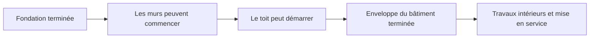
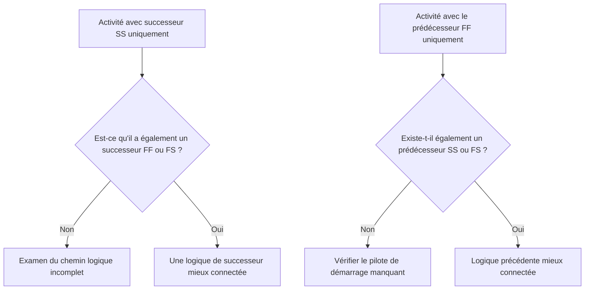

# Logique robuste

La logique est la représentation mathématique du séquençage et des dépendances à l'intérieur d'un calendrier de projet. Il explique ce qui doit se passer avant quoi, quelles activités peuvent avoir lieu en même temps et comment l'équipe de projet entend passer de la première activité à l'achèvement final.

Dans un bon planning Primavera P6, la logique n'est pas la décoration. C'est le moteur qui permet au planning de calculer les dates, la marge, le chemin critique et les mouvements prévus. Il raconte l’histoire de l’exécution d’une manière qui peut être revue, remise en question et améliorée.

Si le calendrier dit « poser les fondations, puis construire les murs, puis construire le toit », la logique est ce qui transforme cette séquence en un réseau calculable. Le planificateur ne se contente pas de tracer un calendrier. Le planificateur définit le chemin de livraison.

## La logique raconte l'histoire de l'œuvre

Chaque équipe de projet a une manière prévue d'exécuter le projet. L’ingénierie peut publier la conception par zone. L'approvisionnement peut livrer l'équipement par colis. Des travaux de génie civil peuvent préparer les accès avant le début des travaux de gros œuvre. Il faudra peut-être terminer les travaux mécaniques avant que la mise en service puisse commencer.

Les liens logiques sont l'expression mathématique de ce plan.

Ce simple diagramme n’est pas seulement une séquence. C'est un modèle de décision. Si les fondations sont en retard, les murs peuvent être en retard. Si les murs sont en retard, le toit peut être en retard. Si la toiture est en retard, les travaux intérieurs peuvent être affectés. Le calendrier ne peut montrer cet impact que si la logique est présente.

Une logique robuste signifie que le calendrier peut expliquer pourquoi les activités commencent, pourquoi elles se terminent et ce qui se passe lorsqu'une partie du plan bouge.

## Pourquoi une logique robuste est importante à la date des données

La métrique « Activités commençant à la date de données sans logique pilotante » est un test rigoureux de la qualité du planning.

La date des données constitue la limite entre les performances réelles et les travaux prévus. Lorsqu'une activité commence exactement à la date des données, l'examinateur doit se poser une question simple : qu'est-ce qui motive ce démarrage ?

Si l'activité possède une logique de prédécesseur valide, le planning peut expliquer le début. Peut-être qu'une zone a été libérée. Peut-être qu'une livraison de matériel a été effectuée. Peut-être que l'activité précédente s'est terminée et a permis à l'équipage suivant de commencer.

Si l’activité n’a pas de logique pilotante, le démarrage est plus faible. L'activité peut se trouver à la date de données parce qu'elle n'a pas de prédécesseur, parce que la logique est incomplète, parce qu'une contrainte la force ou parce que la mise à jour n'a pas été entièrement statutée.

C'est pourquoi une logique robuste est importante. Un planning ne doit pas permettre au travail de paraître prêt simplement parce que la date des données a été déplacée. Il doit montrer l'état réel qui permet de commencer les travaux.

## L’équilibre : suffisamment de logique, pas de logique redondante

Une bonne logique est équilibrée. Le calendrier a besoin de suffisamment de relations pour relier correctement les activités aux prédécesseurs et aux successeurs. Dans le même temps, il convient d’éviter toute logique redondante qui répète inutilement la même dépendance.

Trop peu de logique crée des départs et des arrivées ouverts, une marge peu fiable et des résultats de chemin critique faibles. Trop de logique peut rendre le réseau difficile à examiner et cacher le véritable moteur d’une activité.

Le but n’est pas de maximiser le nombre de relations. L’objectif est de représenter clairement les dépendances obligatoires et requises.

Pour chaque activité, le planificateur doit être capable de répondre :

- Qu'est-ce qui permet à cette activité de démarrer ?
- Que permet cette activité ensuite ?
- Quelle relation est réellement le moteur de l’activité ?
- Une relation est-elle en double ou inutile ?
- Un critique comprendrait-il la séquence prévue ?

Cet équilibre est au cœur des révisions du calendrier du PMO. Un réseau dense n’est pas automatiquement un réseau solide. Un réseau léger n’est pas automatiquement un réseau propre. Le bon réseau explique le plan d’exécution sans encombrement.

## Chaque activité a besoin d'un pilote de démarrage

Une logique robuste signifie que chaque activité a un prédécesseur qui autorise ou déclenche son démarrage, sauf en cas de démarrage de projet valide ou d'exceptions autorisées en externe.

Pour une activité de construction, le facteur de départ peut être l'accès à la zone, l'achèvement du prédécesseur, la disponibilité des matériaux, l'autorisation de conception, l'approbation du permis ou l'achèvement préalable de l'échange. Pour une activité d’approvisionnement, il peut s’agir d’une approbation de conception ou d’une validation de bon de commande. Pour la mise en service, il peut s'agir de l'achèvement mécanique, de la préparation du package de tests ou du renouvellement du système.

Lorsque ce pilote de départ est absent, l'activité peut flotter vers une position artificielle dans le planning. Lors des mises à jour, il peut apparaître à la Date des Données. Cela crée un faux sentiment de préparation.

Considérons une activité intitulée « Installer des pompes ». S'il commence à la date de données mais n'a pas de prédécesseur pour l'achèvement des fondations, la livraison de la pompe ou le transfert de la zone, le calendrier n'explique pas pourquoi l'installation peut commencer. L'activité est peut-être planifiée, mais la logique n'est pas robuste.

## SS et FF sont des demi-relations

Les relations de début à début et de fin à fin sont utiles, mais elles doivent être utilisées avec précaution. Dans de nombreuses révisions de calendrier, il est préférable de les comprendre comme des « demi-relations », car elles ne placent pas entièrement l'activité dans un chemin logique complet.

Une relation SS peut expliquer quand une activité peut commencer, mais elle ne peut pas expliquer quand l'activité doit se terminer ni ce qu'elle transmet. Une relation FF peut expliquer l'alignement final, mais elle peut ne pas expliquer le moment où l'activité est autorisée à démarrer.

Cela ne rend pas SS ou FF erronés. Le chevauchement des travaux est courant et souvent réaliste. La question est de savoir si l’activité est entièrement connectée.

Par exemple:

- Une activité avec un successeur SS doit généralement avoir également un successeur FF ou FS.
- Une activité avec un prédécesseur FF doit généralement également avoir un prédécesseur SS ou FS.

Cela permet d’éviter que les activités ne soient connectées que d’un côté de leur durée. Le calendrier doit expliquer à la fois comment les travaux commencent et comment ils se terminent.

## Logique robuste en pratique

Un examen logique pratique doit commencer par les activités proches de la date des données, les travaux critiques et quasi-critiques et les principaux chemins de transfert. Ces domaines ont le plus grand impact sur la prise de décision actuelle.

Dans P6, les colonnes de révision utiles incluent l'ID d'activité, le nom de l'activité, le WBS, le début, la fin, le statut de l'activité, la marge totale, les prédécesseurs, les successeurs, le type de relation, le décalage, les contraintes, le calendrier et les indicateurs de relation de conduite si disponibles.

Pour chaque activité commençant à la date des données, demandez :

- L’activité est-elle vraiment prête à démarrer ?
- Quel prédécesseur permet le démarrage ?
- Ce prédécesseur est-il terminé, en cours ou prévu ?
- La relation est-elle déterminante ?
- Une contrainte ou une date attendue remplace-t-elle la logique ?
- L'activité a-t-elle également une logique de successeur valide ?

Si la réponse n'est pas claire, l'activité doit être revue avec le propriétaire responsable. La correction peut consister à ajouter un prédécesseur manquant, à modifier le type de relation, à supprimer une contrainte, à mettre à jour les chiffres réels ou à documenter une exception valide.

## Éviter la logique artificielle

Une erreur consiste à ajouter des relations uniquement pour transmettre une métrique. Cela ne crée pas de logique robuste. Cela crée une logique artificielle.

Les relations doivent représenter de véritables dépendances. Si un lien ne reflète pas la séquence de construction, la version technique, le besoin d'approvisionnement, l'accès, l'approbation, les tests, la mise en service ou le transfert, il se peut qu'il n'appartienne pas au réseau.

Une autre erreur consiste à laisser une logique redondante car elle semble plus sûre. Si la même dépendance est déjà représentée par une relation plus claire, des liens supplémentaires peuvent brouiller le chemin critique et rendre le réseau plus difficile à auditer.

Une logique robuste est claire, utile et défendable.

## Conclusion

La logique est l'histoire mathématique de la façon dont le projet sera exécuté. Il définit ce qui doit se produire en premier, ce qui peut se produire ensemble et ce qui suit ensuite.

Une logique robuste ne signifie pas ajouter autant de liens que possible. Cela signifie ajouter les bons liens : suffisamment pour relier chaque activité à de véritables prédécesseurs et successeurs, mais pas au point que le réseau devienne redondant ou trompeur.

Lorsque les activités commencent à la date de données sans logique pilotante, le calendrier révèle une faiblesse dans cette histoire. L'activité peut être affichée comme prête, mais le réseau n'explique pas pourquoi.

Un calendrier fiable devrait répondre clairement à cette question. Qu’est-ce qui permet à ce travail de démarrer ? Que permet-il ensuite ? Si le planning peut répondre aux deux, la logique devient robuste. Si ce n’est pas le cas, l’équipe de projet doit effectuer un travail de séquençage supplémentaire avant de pouvoir faire confiance aux prévisions.
## Contenu associé
- [Dépendances manquantes dans Primavera P6 - Vue d’ensemble](../../metrics/21_missing_dependencies/02_guide_template.md)
- [Logique redondante dans les planifications Primavera P6 - Vue d’ensemble](../../metrics/06_redundant_logic/02_guide_template.md)
- [Qu'est-ce qu'un horaire](../01_WHAT%20A%20SCHEDULE%20IS/01_blog.md)
- [Chemin critique](../03_CRITICAL%20PATH/03_CRITICAL%20PATH.md)
