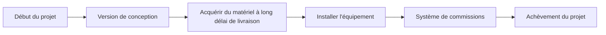

# Chemin critique

Le chemin critique est la plus longue séquence d'activités dépendantes dans un planning. Il détermine la durée la plus courte possible du projet et définit directement la date de fin du projet.

Concrètement, le chemin critique est la chaîne de tâches qui ne peut être retardée sans affecter le délai final. Si une activité du chemin critique échoue et que rien d’autre ne change, la date d’achèvement du projet glissera également.

C'est pourquoi le chemin critique est l'un des résultats les plus importants d'un calendrier Primavera P6. Ce n'est pas seulement un filtre, une couleur ou un rapport. C'est l'explication du calendrier de ce qui motive l'achèvement.

## Ce que signifie le chemin critique

Un planning contient de nombreuses activités, mais toutes les activités n'ont pas le même impact sur la date de fin. Certaines activités ont du flotteur. Ils peuvent bouger un peu avant d'affecter l'activité suivante ou la fin du projet. Les activités critiques n'ont pas cette flexibilité, ou elles ont le moins de flexibilité en fonction de la méthode et des paramètres de planification.

Le chemin critique montre le temps minimum nécessaire pour terminer le projet en fonction de la logique, des durées, des calendriers, des contraintes et du statut actuels.

S’il s’agit de la chaîne de contrôle, un retard dans l’approvisionnement peut retarder l’installation. Un retard dans l'installation peut retarder la mise en service. Un retard dans la mise en service peut retarder l’achèvement du projet. Le chemin critique aide l’équipe à voir ce lien.

## C'est la chaîne que vous ne pouvez pas retarder

Le chemin critique ne concerne pas simplement le travail qui semble important. C'est la séquence de travail dépendante qui définit la date de fin.

Cette distinction est importante. Une activité de grande valeur peut ne pas être critique si elle est margee. Un jalon visible pour le client peut ne pas être critique si un autre chemin mène à son achèvement. Une petite activité technique peut être critique si elle se situe dans la seule chaîne menant au transfert final.

Pour les équipes de contrôle de projet, cela fait du chemin critique un outil de décision. Cela aide à répondre :

- Qu’est-ce qui motive la réalisation du projet ?
- Quelles activités nécessitent le plus d’attention dans le calendrier ?
- Dans quels domaines un retard affecterait-il immédiatement l’achèvement ?
- Quelles actions de récupération pourraient protéger la date de fin ?
- Le chemin indiqué a-t-il un sens ?

La dernière question est celle que les planificateurs ne devraient jamais ignorer.

## N'acceptez pas aveuglément le filtre critique

Primavera P6 peut identifier les activités critiques, mais le logiciel ne comprend pas l'intention du projet. Il calcule en fonction des données fournies : logique, calendriers, contraintes, durées, progression et options de planning.

Si les données sont faibles, le chemin critique peut paraître étrange.

Des activités ou des jalons peuvent apparaître dans le filtre critique même s'ils ne sont pas réellement le moteur du projet. Cela peut se produire en raison d'une logique manquante, de contraintes strictes, de dates périmées, de fins ouvertes, de calendriers inhabituels, d'une marge négative, d'un statut incorrect ou de paramètres logiques conservés.

Le planificateur doit faire preuve de jugement professionnel. Le chemin critique doit être remis en question. Cela devrait paraître raisonnable. Il doit raconter une histoire que l’équipe du projet reconnaît.

Si le chemin indique que l’achèvement final est déterminé par une étape administrative sans véritable travail en aval, contestez-le. Si le chemin commence par un jalon qui ne contrôle pas réellement l’exécution, contestez-le. Si le chemin traverse des zones WBS non liées sans interface claire, contestez-le.

Le chemin critique est aussi bon que le modèle de calendrier qui le sous-tend.

## Calendriers de référence et chemin critique

Dans un calendrier qui n'a jamais été mis à jour, comme une première référence, le chemin critique commence souvent avec le jalon de début du projet et se termine avec le jalon d'achèvement du projet.

C’est courant, mais ce n’est pas une règle gravée dans le marbre.

Certains projets ont un chemin critique qui commence à une étape intermédiaire clé. Par exemple, la construction peut ne pas pouvoir démarrer tant qu'un propriétaire n'a pas cédé une zone, qu'un permis n'a pas été délivré ou qu'un dossier de conception n'a pas atteint le statut approuvé. Dans ce cas, le jalon de transfert ou de libération peut déclencher le début du chemin de contrôle.

La même idée s’applique vers la fin du projet. Le chemin critique peut se terminer à l'achèvement final, mais il peut également conduire à une étape contractuelle intermédiaire, une étape de transfert, une rotation du système ou une date d'accès client qui est actuellement plus restrictive.

L’essentiel n’est pas de savoir si le chemin commence et se termine à l’endroit le plus traditionnel. La clé est de savoir si le chemin est logique, complet et défendable.

## Calendriers en cours

Une fois qu’un planning est en cours, le chemin critique change de forme. Les travaux terminés ne devraient plus déterminer leur achèvement futur. Le chemin doit commencer à partir de la limite d’état actuelle.

Dans un planning mis à jour, le chemin critique commence souvent par une activité en cours, une activité non démarrée prête à commencer ou un jalon valide qui contrôle l'accès aux travaux futurs. Cela peut également commencer à partir d’une interface de projet ou d’une étape de transfert lorsque cet événement détermine véritablement le prochain travail critique.

C'est là que la date des données est importante. La date des données sépare les performances réelles du travail prévu. Un chemin critique après la date des données doit expliquer comment le travail restant mène à son achèvement.

Si le chemin commence par une activité qui n'a aucune logique pilotante, un début de date de données inexpliqué ou un jalon douteux, l'examinateur doit enquêter. Le calendrier montre peut-être un chemin calculé, mais pas crédible.

## Soyez prudent avec les jalons

Les jalons sont utiles car ils marquent les points clés : avis de procéder, transfert de zone, approbation de la conception, achèvement mécanique, renouvellement du système, achèvement substantiel et achèvement final.

Mais les jalons peuvent également induire en erreur lors d’une revue du chemin critique.

Un jalon peut paraître critique car il comporte une contrainte. Cela peut paraître critique car il n’a pas de durée et se situe à une limite de date. Cela peut paraître critique parce qu’il manque de logique. Cela ne signifie pas automatiquement que le jalon fait réellement partie de la chaîne d’exécution du contrôle.

Soyez très prudent lorsque le chemin critique commence par un jalon. Demander:

- Cette étape représente-t-elle un véritable événement déterminant ?
- Quelle activité ou condition externe détermine ce jalon ?
- Quel travail est libéré par le jalon ?
- Le jalon est-il contraint plutôt que logique ?
- Le chemin serait-il toujours critique si la logique des jalons était corrigée ?

Si le jalon ne contrôle pas le travail, il ne doit pas être autorisé à définir l’histoire du chemin critique.

## La logique retenue peut changer l’histoire

La logique conservée est un paramètre Primavera P6 utilisé pour gérer la progression hors séquence. Cela peut être approprié, mais cela peut également affecter le chemin critique d’une manière que les évaluateurs doivent comprendre.

Lorsque la logique conservée est utilisée, P6 peut conserver la logique du prédécesseur même si le travail du successeur a déjà commencé dans le désordre. Cela peut entraîner le maintien ou le séquençage du travail restant d'une manière qui modifie le chemin critique calculé.

Le problème n’est pas que la logique retenue soit toujours fausse. Le problème est que le planificateur doit comprendre s’il produit une prévision réaliste.

Si la logique retenue fait que le chemin critique passe par des relations qui ne reflètent plus la façon dont le travail est exécuté, l'équipe doit revoir les options de statut, de logique et de calendrier. Le chemin doit refléter un plan restant défendable, et pas seulement un calcul mécanique.

## Comment revoir le chemin critique

Un bon examen du chemin critique doit combiner les résultats P6 avec un jugement en matière de planification.

Commencez par générer le rapport sur le chemin le plus long ou le chemin critique. Revoyez ensuite le parcours activité par activité. Examinez les prédécesseurs, les successeurs, les types de relations, les décalages, les contraintes, les calendriers, les dates réelles, la durée restante et la marge totale.

Demandez si le chemin a du sens :

- Le chemin suit-il une séquence d’exécution crédible ?
- Est-ce que cela commence à partir d'un pilote actuel valide ?
- Est-ce qu'il se termine à l'étape d'achèvement ou de contrôle correcte ?
- Les contraintes forcent-elles le chemin ?
- Les relations manquantes cachent-elles le véritable moteur ?
- La logique retenue affecte-t-elle le chemin de manière trompeuse ?
- L'équipe de projet reconnaît-elle qu'il s'agit d'un travail de contrôle ?

Si la réponse est non, le calendrier doit être revu avant que le chemin critique puisse être utilisé en toute confiance.

## Conclusion

Le chemin critique est la séquence de tâches dépendantes qui définit la date de fin du projet. Il indique le temps minimum nécessaire pour réaliser le projet et identifie les travaux qui ne peuvent pas glisser sans affecter le délai.

Mais le chemin critique ne s’accepte pas aveuglément. P6 calcule ce que les données lui disent de calculer. Le planificateur doit se demander si le résultat est raisonnable, logique et aligné sur le plan d'exécution réel.

Dans un planning chargé, le chemin critique raconte une histoire claire. Il part d'un pilote actuel valide, suit les dépendances réelles, évite les contraintes trompeuses, gère correctement la progression et mène au bon jalon d'achèvement.

Lorsque cette histoire a du sens, le chemin critique devient l’un des outils les plus puissants de contrôle de projet. Dans le cas contraire, cela constitue un avertissement indiquant que le calendrier doit être révisé davantage avant de pouvoir faire confiance aux prévisions.
## Contenu associé
- [Chemin critique ou chemin de marge commençant par une contrainte - Vue d’ensemble](../../metrics/09_cp_or_float_path_starting_with_constraint/02_guide_template.md)
- [Logique robuste](../02_ROBUST%20LOGIC/02_ROBUST%20LOGIC.md)
- [Matrice de criticité](../04_CRITICALITY%20MATRIX/04_CRITICALITY%20MATRIX.md)
