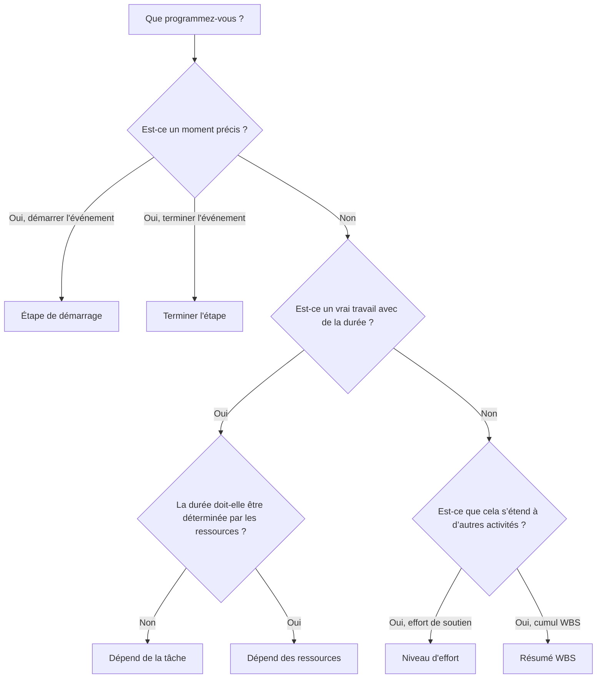

Le type d'activité est l'un des champs de configuration les plus importants de Primavera P6. Il indique à P6 quel type d'activité il calcule et comment cette activité doit se comporter dans le planning.

De nombreux planificateurs se concentrent d'abord sur les noms, les durées, les dates et les relations des activités. Ceux-ci sont essentiels, mais le type d’activité compte aussi. Une activité de tâche, un jalon, une activité de niveau d'effort et une activité de résumé WBS ne se comportent pas de la même manière. Choisir le mauvais type peut fausser les dates, la progression, le chargement des ressources, la marge et les rapports.

Le but de ce blog est d'expliquer les principaux types d'activités disponibles dans P6, à quoi sert chacun d'entre eux et comment décider quel type correspond au travail planifié.

## Pourquoi le type d'activité est important

Un type d'activité doit correspondre à l'objectif de planification de l'élément. Est-ce un vrai travail avec une durée ? Est-ce un moment précis ? S'agit-il d'un résumé d'un travail qui s'étend à d'autres activités ? Est-ce un effort qui dépend des ressources plutôt que d’une durée de tâche fixe ?

Si le type d’activité ne correspond pas à l’objectif, le calendrier peut devenir confus. Un jalon avec une durée n’est pas un jalon. Une tâche normale utilisée comme résumé peut cacher la logique. Une activité de niveau d’effort utilisée pour piloter le travail peut fausser le chemin critique. Une activité Dépendante des ressources utilisée de manière incorrecte peut être calculée différemment que prévu.

En P6, le type d’activité permet de répondre à une question pratique : comment cet élément doit-il se comporter lors du calcul du planning ?

## Les principaux types d’activités dans P6

Les types d’activités Primavera P6 les plus courants sont :

- Dépend de la tâche.
- Dépend des ressources.
- Niveau d'effort.
- Démarrez le jalon.
- Terminer le jalon.
- Résumé WBS.

Chacun a un objectif différent.

## Activités dépendantes des tâches

La tâche dépendante est le type d’activité le plus courant dans P6. Utilisez-le pour le travail planifié normal où la durée de l'activité est contrôlée par le calendrier attribué à l'activité, et non par les calendriers des ressources individuelles.

Les exemples incluent :

- Creuser les fondations.
- Installez le chemin de câbles.
- Couler la dalle en béton.
- Préparer le dossier de conception.
- Effectuer un test de pression.

Les activités dépendant de la tâche constituent généralement le meilleur choix pour la plupart des tâches de construction, d'ingénierie, d'approvisionnement, de test et de mise en service. Ils sont clairs, stables et faciles à comprendre. Le planificateur définit la durée, attribue le calendrier des activités, connecte la logique et P6 calcule les dates.

Utilisez Dépendant de la tâche lorsque l'activité représente une étendue de travail distincte et que la durée du travail ne doit pas changer en fonction des calendriers des ressources.

## Activités dépendantes des ressources

Les activités dépendantes des ressources sont utilisées lorsque la durée et le comportement de planification doivent être influencés par les ressources affectées à l'activité. Dans ce cas, P6 peut utiliser les calendriers des ressources et la disponibilité des ressources pour calculer la manière dont l'activité est planifiée.

Cela peut être utile lorsque la disponibilité des ressources est un véritable moteur du travail. Par exemple, une équipe spécialisée, un inspecteur ou une ressource en équipement peut être disponible uniquement certains jours ou certains quarts de travail.

Les exemples peuvent inclure :

- Inspection spécialisée par un inspecteur limité.
- Assistance technique du fournisseur.
- Étalonnage d’équipement à l’aide d’une ressource rare.
- Travaux de maintenance axés sur les ressources.

Les activités qui dépendent des ressources doivent être utilisées avec précaution. Si le projet n'est pas activement chargé en ressources ou au niveau des ressources, l'utilisation de Resource Dependent par habitude peut créer de la confusion. De nombreuses planifications utilisent Dépendant de la tâche par défaut, car le calendrier d'activités constitue la principale base de planification.

Utilisez Dépendant des ressources lorsque les ressources et leurs calendriers sont destinés à influencer le calcul du planning.

## Étape de démarrage

Un jalon de début est une activité de durée nulle qui représente le début d’un événement, d’une phase, d’une fenêtre d’accès, d’une autorisation ou d’une condition de travail majeure.

Les exemples incluent :

- Avis de procéder reçu.
- Accès à la zone accordé.
- Début des travaux.
- Package de conception publié pour exécution.
- Fenêtre de démarrage de la mise en service.

Les jalons de début ne représentent pas le travail en cours. Ils représentent un moment dans le temps qui permet de démarrer les travaux ou marque un événement de démarrage significatif.

Utilisez un jalon de début lorsque le calendrier doit marquer le début de quelque chose d'important. Il doit normalement être lié à une logique qui explique ce qui motive le jalon et quel travail il libère.

## Terminer l'étape

Un jalon de fin est une activité de durée nulle qui représente l'achèvement d'un événement, d'une phase, d'un livrable ou d'un point contractuel.

Les exemples incluent :

- Achèvement mécanique réalisé.
- Renouvellement du système terminé.
- Approbation du permis reçue.
- Achèvement substantiel.
- Achèvement définitif.

Les jalons de fin sont utiles pour les rapports car ils marquent la réussite. Ils ne doivent pas être utilisés dans le cadre d’activités de travail normales. Si un effort est nécessaire pour atteindre le jalon, cet effort doit être modélisé sous forme de tâches menant au jalon.

Utilisez un jalon de fin lorsque le calendrier doit marquer que quelque chose a été terminé ou réalisé.

## Niveau d'effort

Le niveau d'effort, souvent appelé LOE, est utilisé pour les activités qui couvrent d'autres travaux plutôt que de piloter directement le projet. Les activités LOE sont couramment utilisées pour la gestion, la supervision, le soutien aux inspections, les contrôles de projet ou la coordination continue.

Les exemples incluent :

- Accompagnement à la gestion de projet.
- Surveillance de chantier.
- Gestion de l'ingénierie.
- Gestion de chantier.
- Assistance au contrôle qualité.

Une activité LOE tire normalement ses dates d’autres activités. Cela devrait représenter un effort de soutien qui se poursuit pendant que d’autres travaux sont en cours. Il n’est généralement pas destiné à piloter des tâches distinctes de construction ou d’ingénierie.

Utilisez LOE lorsque l’activité représente un soutien, une surveillance ou une gestion continue qui doit s’étendre à un groupe d’activités.

Soyez prudent avec la logique LOE. Si une LOE est mal liée, elle peut sembler modifier les dates ou fausser la marge. Les activités LOE doivent être examinées lors des contrôles de qualité du planning, en particulier lorsqu'elles apparaissent sur le chemin critique ou ont des relations FS ou SF inhabituelles.

## Résumé WBS

Les activités de synthèse WBS résument un groupe d'activités au sein d'un élément WBS. Leurs dates découlent des activités menées dans le cadre du WBS et non de leur propre logique détaillée.

Les exemples incluent :

- Résumé technique.
- Résumé de l'approvisionnement.
- Zone A résumé de la construction.
- Résumé de la mise en service du système 01.

Les activités de résumé WBS peuvent être utiles pour les rapports de haut niveau, mais elles ne doivent pas remplacer les activités ou la logique réelles. Ce sont des outils de cumul, pas des tâches d'exécution.

Utilisez les activités Récapitulatif WBS lorsque vous avez besoin d'une vue de niveau résumé d'une section WBS, et uniquement lorsque la méthode de reporting du projet prend en charge leur utilisation.

## Choisir le bon type

Une règle simple aide :

- S'il s'agit d'un travail réel avec une durée, utilisez Dépendant de la tâche à moins que les calendriers de ressources ne le conduisent.
- Si la disponibilité des ressources doit le déterminer, utilisez Resource Dependent.
- S'il s'agit d'un événement de démarrage, utilisez Start Milestone.
- S'il s'agit d'un événement d'achèvement, utilisez Finish Milestone.
- S’il s’agit d’un soutien continu qui s’étend à d’autres travaux, utilisez le niveau d’effort.
- S'il s'agit d'un cumul de rapports, utilisez le résumé WBS.

Le type d’activité devrait rendre le calendrier plus facile à comprendre. Si les réviseurs doivent demander pourquoi un jalon a une durée, pourquoi une LOE génère du travail ou pourquoi un résumé WBS apparaît dans une logique détaillée, le type d'activité peut être erroné.

## Erreurs courantes

Une erreur courante consiste à utiliser des jalons comme substituts au travail. Un jalon doit marquer un moment dans le temps. Si du travail est nécessaire, créez des activités pour le travail.

Une autre erreur consiste à utiliser les activités LOE pour contrôler le travail discret. La LOE doit soutenir ou étendre le travail, et non remplacer la logique entre les activités réelles.

Une troisième erreur consiste à utiliser Resource Dependent sans processus de planification basé sur les ressources. Si les calendriers des ressources ne sont pas tenus à jour, le type d'activité peut créer plus de confusion que de valeur.

Enfin, évitez d’utiliser les activités WBS Summary comme substitut à un WBS bien construit et à une logique détaillée. Les résumés sont utiles pour les rapports, mais le calendrier nécessite toujours des activités réelles en dessous.

## Conclusion

Les types d'activités dans P6 définissent le comportement des activités. Ce ne sont pas de simples étiquettes. Le bon type d'activité aide le calendrier à calculer correctement et à communiquer clairement.

Les activités dépendant de la tâche représentent la plupart du travail normal. Les activités dépendantes des ressources sont utiles lorsque les calendriers des ressources doivent contrôler la planification. Les jalons de début et de fin marquent les points clés dans le temps. Les activités de niveau d’effort représentent un soutien qui s’étend à d’autres travaux. Les activités Récapitulatif WBS prennent en charge les rapports de cumul.

Choisir le bon type d'activité rend le calendrier plus facile à examiner, plus facile à expliquer et plus fiable pour les contrôles du projet. Un emploi du temps solide n’a pas seulement de bonnes dates et une bonne logique. Il utilise également le type d’activité approprié pour l’œuvre représentée.
## Contenu associé
- [Activités commençant à la date des données sans logique pilotante : pourquoi cette mesure de planification est importante - Vue d’ensemble](../../metrics/01_activities_starting_in_dd_with_no_logic_driving/02_guide_template.md)
- [Matrice de criticité](../04_CRITICALITY%20MATRIX/04_CRITICALITY%20MATRIX.md)
- [Types de durée dans P6](../06_DURATION%20TYPES%20IN%20P6/06_DURATION%20TYPES%20IN%20P6.md)
