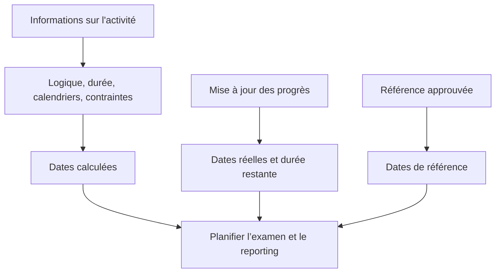

Les dates dans Primavera P6 peuvent prêter à confusion car une activité n'a pas qu'une seule date de début et une seule date de fin. Il peut avoir des dates planifiées, des dates planifiées actuelles, des dates anticipées, des dates tardives, des dates réelles, des dates de référence, des dates contraintes, des dates prévues et parfois des dates externes ou liées aux prévisions en fonction de la mise en page et des paramètres du projet.

Ces dates ne signifient pas toutes la même chose. Certains sont calculés par la logique CPM. Certains sont saisis lors des mises à jour de progression. Certains sont utilisés à titre de comparaison. Certains sont utilisés pour contrôler ou limiter le planning. Comprendre la différence est essentiel pour la qualité du planning, les rapports PMO, la préparation à l'analyse des retards et le contrôle de base du projet.

La question la plus importante est simple : que me dit cette date et d’où vient-elle ?

## Pourquoi P6 a tant de dates

P6 n'est pas seulement une liste de dates. C'est un modèle de calcul. Le logiciel calcule les dates à partir des durées d'activité, des calendriers, des relations, des contraintes, des ressources, de l'état d'avancement et de la date des données.

Différents champs de date existent car les planificateurs doivent répondre à différentes questions :

- Quel était le plan initial ?
- Quelles sont les prévisions actuelles ?
- Que s’est-il réellement passé ?
- À quelle heure l’activité peut-elle commencer ou se terminer ?
- Jusqu'à quelle date peut-il commencer ou terminer sans affecter le projet ?
- Une contrainte force l’activité ?
- Comment le plan actuel se compare-t-il au plan de référence ?

Le problème commence lorsque ces types de dates sont mélangés sans comprendre leur objectif.

## Date des données

La date des données n'est pas une date d'activité, mais elle contrôle la manière dont toutes les dates d'activité doivent être interprétées.

La date des données constitue la limite entre les performances réelles et les travaux prévus. Le travail effectué avant la date des données doit être actualisé ou statuté. Les travaux après la date de données doivent être prévus.

Si une activité a des dates réelles postérieures à la date des données, il s'agit généralement d'une erreur de statut. Si une activité ouverte commence exactement à la date des données sans logique pilotante, cela peut indiquer un séquençage manquant. Si une fin attendue est antérieure à la date des données, cela peut indiquer des informations de mise à jour obsolètes.

Avant de consulter une date d'activité, confirmez la date des données.

## Début et fin

Le début et la fin sont les principales dates de planification que la plupart des utilisateurs voient dans les mises en page P6. Ils représentent les dates actuelles calculées ou planifiées pour l'activité en fonction des données de planification.

Pour les activités non commencées, Début et Fin sont des dates prévisionnelles. Pour les activités en cours, ils peuvent combiner l'état réel et les prévisions restantes. Pour les activités terminées, elles doivent correspondre aux dates réelles.

Il s'agit généralement des dates utilisées dans les rapports, les calendriers prévisionnels et les discussions de direction. Cependant, ils ne doivent pas être acceptés sans vérifier la logique et le statut qui les sous-tendent.

Utilisez Début et Fin pour répondre : quand l'activité est-elle actuellement prévue pour commencer et se terminer ?

## Début anticipé et fin anticipée

Early Start et Early Finish sont des dates de calcul du CPM. Ils indiquent les dates au plus tôt auxquelles une activité peut commencer et se terminer en fonction de la logique des prédécesseurs, des calendriers, des contraintes et des conditions de planification actuelles.

Les dates anticipées sont importantes car elles aident à expliquer le déroulement du calcul du planning. Ils montrent comment le travail peut circuler dans le réseau dès que la logique le permet.

Si de nombreuses activités ont un démarrage anticipé à la date des données, l'examinateur doit vérifier si elles sont vraiment prêtes ou s'il s'agit de démarrages ouverts, d'activités contraintes ou d'activités faiblement liées.

Utilisez Early Start et Early Finish pour répondre : à quelle date cette activité peut-elle se produire au plus tôt en fonction du réseau actuel ?

## Départ tardif et fin tardive

Démarrage tardif et Fin tardive affichent les dernières dates auxquelles une activité peut commencer ou se terminer sans retarder la fin du projet ou le point de fin de contrôle, en fonction de la configuration du calendrier.

Les dates tardives font partie du passage en arrière. Ils sont utilisés pour calculer la marge. La différence entre les dates anticipées et tardives permet de montrer la flexibilité de l’activité.

Si les dates de retard vous semblent étranges, recherchez les contraintes, les successeurs manquants, les finitions ouvertes, les calendriers ou les paramètres de fin de projet inhabituels.

Utilisez Début tardif et Fin tardive pour répondre : jusqu'à quelle heure cette activité peut-elle être avancée avant qu'elle n'affecte la date d'achèvement de contrôle ?

## Début réel et fin réelle

Le début réel et la fin réelle sont des faits d'état. Ils doivent représenter ce qui s'est réellement passé sur le terrain ou lors de l'exécution du projet.

Le démarrage réel signifie que l'activité a réellement commencé. La fin réelle signifie que l'activité est réellement terminée. Ces dates ne doivent pas être utilisées comme objectifs de planification ou comme dates de prévision.

Les dates réelles doivent normalement être identiques ou antérieures à la date des données. Si les dates réelles sont postérieures à la date des données, le calendrier signale les travaux futurs comme déjà commencés ou terminés, ce qui affaiblit la crédibilité de la mise à jour.

Utilisez Début réel et Fin réelle pour répondre : que s'est-il réellement passé ?

## Début prévu et fin prévue

Le début planifié et la fin planifiée sont souvent mal compris. Selon la manière dont le planning est créé, mis à jour et affiché, ces champs peuvent ne pas se comporter comme une référence formelle approuvée.

Certains utilisateurs s'attendent à ce que les dates planifiées affichent pour toujours le plan d'origine. Ce n’est pas toujours une hypothèse sûre. Pour les rapports formels sur les écarts, une référence assignée est généralement plus fiable que de se fier négligemment aux dates planifiées.

Utilisez Début planifié et Fin planifiée uniquement lorsque la procédure de contrôle de votre projet définit clairement la manière dont ils sont maintenus et ce qu'ils signifient.

## Début de référence et fin de référence

Les dates de référence proviennent d'un calendrier de référence attribué. Ils sont utilisés pour comparer le calendrier actuel au plan approuvé.

Par exemple, BL1 Start et BL1 Finish peuvent afficher les dates de début et de fin de l'activité par rapport à la référence approuvée. Le début et la fin actuels affichent les dernières prévisions. La différence entre eux montre la écart.

Les dates de référence sont au cœur du reporting sur les performances, des écarts de calendrier, du contrôle des modifications et de la préparation de l'analyse des retards.

Utilisez Début de référence et Fin de référence pour répondre : comment le calendrier actuel se compare-t-il au plan approuvé ?

## Date de contrainte

Les dates contraintes sont des contrôles de date imposés. Elles sont connectées à des types de contraintes tels que Début le, Début le ou après, Fin le, Fin le ou avant, Début obligatoire ou Fin obligatoire.

Les contraintes ne sont pas automatiquement fausses. Certains représentent des dates de contrat réelles, des restrictions d'accès, des autorisations, des périodes de panne ou des exigences du propriétaire. Mais les contraintes peuvent également masquer une logique manquante ou imposer des dates irréalistes.

Les contraintes strictes, notamment le début obligatoire et la fin obligatoire, doivent être rares et documentées.

Utilisez Contrainte Date pour répondre : une date imposée contrôle-t-elle ou limite-t-elle cette activité ?

## Dates de fin prévues et dates de type prévision

La fin attendue est souvent utilisée lors des mises à jour pour capturer le moment où l'équipe de projet s'attend à ce qu'une activité se termine. En fonction des paramètres et des procédures, les dates prévues peuvent influencer la manière dont P6 calcule ou affiche les dates d'activité.

La fin attendue peut être utile pour les travaux en cours lorsque les équipes de terrain fournissent une attente de fin réaliste. Mais s’il n’est pas entretenu, il peut devenir obsolète. Une fin attendue avant la date des données est un signe d’avertissement courant.

Certains projets utilisent également des champs de date liés aux prévisions ou des champs définis par l'utilisateur pour les rapports. L’essentiel est de les définir clairement afin que l’équipe sache s’ils sont calculés, saisis manuellement ou importés.

Utilisez des dates attendues ou prévisionnelles pour répondre : quelle est la dernière attente de l'équipe et est-elle contrôlée par une procédure de mise à jour définie ?

## Dates des contraintes primaires et secondaires

P6 peut contenir plusieurs conditions de contrainte sur une activité, en fonction des champs de contrainte sélectionnés. La contrainte principale est généralement la principale affichée dans les mises en page standard, mais une contrainte secondaire peut également affecter l'interprétation.

Lors de la révision du planning, ne regardez pas uniquement le début et la fin. Ajoutez des champs de type de contrainte et de date de contrainte à la mise en page. Si les dates ne se comportent pas comme prévu, les contraintes sont l'une des premières choses à vérifier.

## Quelles dates devriez-vous utiliser ?

Utilisez chaque date à sa fin :

- Utilisez Début et Fin pour la prévision du calendrier actuel.
- Utilisez les dates anticipées et tardives pour comprendre le calcul et la marge margee du CPM.
- Utilisez les dates réelles pour les travaux terminés ou commencés.
- Utilisez les dates de référence pour les écarts par rapport au plan approuvé.
- Utilisez les dates de contrainte pour identifier les contrôles de date imposés.
- Utilisez les champs Fin attendue ou prévision uniquement lorsque la procédure de mise à jour les définit.
- Utilisez la date des données pour séparer les performances réelles du travail prévu.

## Erreurs courantes

Une erreur courante consiste à comparer les mauvaises dates. Par exemple, comparer le début actuel au début prévu peut ne pas avoir de sens si les dates planifiées ne sont pas contrôlées par la procédure du projet.

Une autre erreur consiste à traiter le démarrage réel comme une prévision. Les dates réelles doivent représenter une performance réelle et non une intention.

Une troisième erreur consiste à ignorer l’heure de la journée. P6 stocke les dates avec l'heure, et les différences de calendrier peuvent créer des décalages apparents d'un jour ou des surprises margees.

Enfin, évitez de masquer les dates contraintes. Si une date est imposée, les évaluateurs doivent la voir.

## Conclusion

Les dates dans P6 sont puissantes car elles racontent différentes parties de l’histoire du planning. Les dates actuelles montrent les prévisions. Les dates anticipées et tardives expliquent le calcul du CPM. Les dates réelles enregistrent ce qui s'est passé. Les dates de référence prennent en charge la comparaison. Les dates contraintes révèlent des contrôles imposés. Les dates prévues peuvent prendre en charge les mises à jour lorsqu'elles sont correctement maintenues.

Une révision rigoureuse du calendrier ne demande pas seulement « quelle est la date ? » Il demande « de quel genre de date s’agit-il, d’où vient-elle et est-elle crédible ? »

Lorsque l'équipe de projet comprend la signification de chaque champ de date, le calendrier devient plus facile à expliquer, plus facile à auditer et plus fiable pour le contrôle du projet.
## Contenu associé
- [Dates réelles postérieures à la date des données dans Primavera P6 - Vue d’ensemble](../../metrics/12_actual_date_greater_than_data_date/02_guide_template.md)
- [Types de durée dans P6](../06_DURATION%20TYPES%20IN%20P6/06_DURATION%20TYPES%20IN%20P6.md)
- [Calendriers dans P6](../08_CALENDARS%20IN%20P6/08_CALENDARS%20IN%20P6.md)
