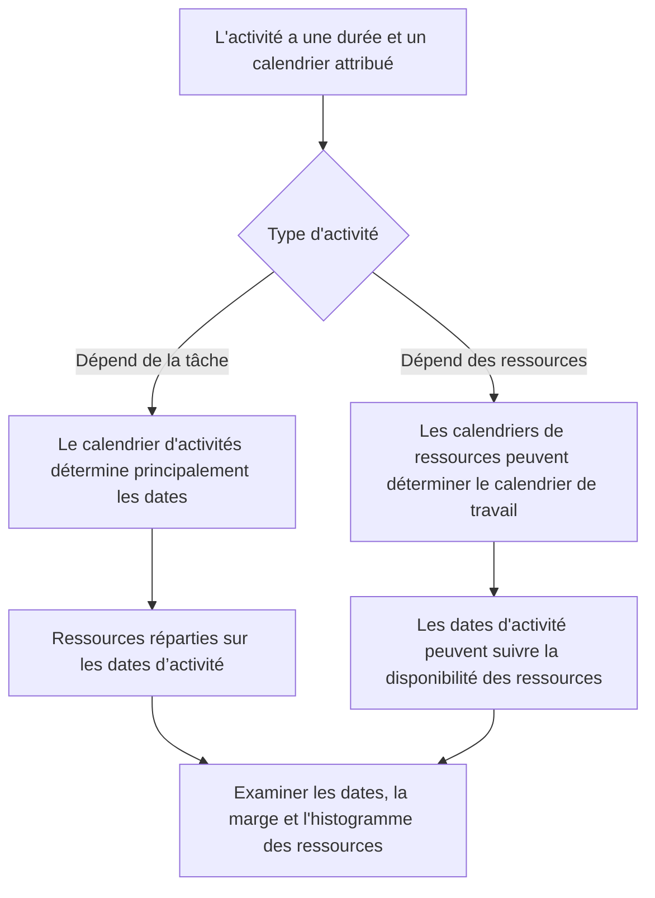

Les calendriers sont l'un des fondements discrets d'un planning Primavera P6. Ils définissent quand le travail peut avoir lieu. Ils indiquent à P6 quels jours sont ouvrables, quels jours sont chômés, combien d'heures sont disponibles dans une journée et à quelle heure de la journée le travail commence et se termine.

Parce que les calendriers fonctionnent en coulisses, ils sont faciles à sous-estimer. Un calendrier peut avoir une logique forte et des durées raisonnables, mais si les calendriers sont erronés ou incohérents, les dates peuvent toujours être trompeuses.

Comprendre les calendriers est essentiel pour la qualité du planning, la planification des ressources, l'examen du chemin critique et la discipline de mise à jour.

## Que fait un calendrier dans P6

Dans P6, un calendrier convertit la durée en dates. Si une activité dure 10 jours ouvrables, P6 doit savoir ce que signifie une journée de travail. Est-ce du lundi au vendredi ? Le samedi est-il inclus ? La journée de travail dure-t-elle 8 heures, 10 heures ou 12 heures ? Le travail commence-t-il à 7h00 ou 8h00 ? Les jours fériés sont-ils exclus ?

Le calendrier répond à ces questions.

Les calendriers influencent :

- Dates de début et de fin des activités.
- Dates anticipées et tardives.
- Flotteur total.
- Chemin critique et chemin le plus long.
- Calendrier d’utilisation des ressources.
- Interprétation du décalage relationnel.
- La date change lors des mises à jour.
- Anticipation et précision des rapports.

Un calendrier n'est pas seulement un élément de configuration administrative. Cela fait partie du calcul du planning.

## Pourquoi plusieurs calendriers peuvent être nécessaires

De nombreux projets nécessitent plusieurs calendriers, car tous les travaux ne suivent pas le même modèle de travail.

Les exemples incluent :

- Travaux d'ingénierie de bureau sur un calendrier de 5 jours.
- Travaux de construction de chantier sur un calendrier de 6 jours.
- Travaux d’arrêt ou de panne sur un calendrier de 24 heures.
- Travaux de mise en service de nuit.
- Fenêtres d'accès propriétaire.
- Restrictions environnementales.
- Activités d'approvisionnement basées sur les jours ouvrables des fournisseurs.
- Calendriers spécifiques aux ressources pour les inspecteurs, les fournisseurs ou les équipes spécialisées.

Utiliser un seul calendrier pour tout peut paraître simple, mais cela peut produire des dates irréalistes. Si la mise en service ne peut avoir lieu que la nuit, un calendrier diurne normal peut être erroné. Si un fournisseur travaille uniquement en semaine, un calendrier de construction de 7 jours peut surestimer la disponibilité.

Le but n'est pas de créer plusieurs calendriers. L’objectif est de créer suffisamment de calendriers pour modéliser les conditions réelles de travail sans rendre le planning inutilement complexe.

## Calendriers d'activités

Le calendrier des activités est affecté directement à une activité. Il définit le temps de travail utilisé pour calculer la durée et les dates de cette activité, en particulier pour les activités dépendantes de la tâche.

Par exemple, si « Installer un chemin de câbles » a un calendrier de construction de 6 jours, P6 calculera son travail en fonction de ce calendrier. Si le samedi est un jour ouvrable, l'activité peut se terminer plus tôt que sur un calendrier de 5 jours.

Les calendriers d'activités constituent généralement le principal contrôle de calendrier pour les activités planifiées normales.

Utilisez des calendriers d'activités lorsque le travail lui-même suit un modèle de travail défini, tel qu'un quart de jour, un quart de nuit, un travail d'arrêt ou un travail de bureau.

## Calendriers de ressources

Les calendriers de ressources définissent quand une ressource est disponible. Une ressource peut être une personne, une équipe, un élément d'équipement, un spécialiste du fournisseur ou toute autre ressource affectée.

Les calendriers de ressources deviennent particulièrement importants lorsque les activités dépendent des ressources ou lorsque le projet utilise le nivellement des ressources ou une planification détaillée des ressources.

Par exemple, une activité peut être affectée à un calendrier de construction de 6 jours, mais l'inspecteur spécialisé qui lui est affecté peut être disponible uniquement du lundi au mercredi. Si l'activité est pilotée par les ressources, P6 peut calculer les dates en fonction du calendrier des ressources plutôt que uniquement du calendrier des activités.

Les calendriers de ressources sont utiles lorsque la disponibilité des ressources constitue une réelle contrainte de planification. Ils peuvent également créer de la confusion s’ils sont attribués mais non conservés.

## Comment s'interfacent les calendriers d'activités et de ressources

La relation entre les calendriers d'activités et les calendriers de ressources dépend du type d'activité, des paramètres de ressources et du comportement de calcul du planning.

Pour les activités dépendantes des tâches, le calendrier des activités constitue généralement la base principale de la durée de l'activité. Les calendriers de ressources peuvent toujours affecter la répartition et l'utilisation des ressources.

Pour les activités dépendantes des ressources, les calendriers des ressources peuvent influencer le moment où le travail est effectué. Cela signifie que le calendrier des ressources peut affecter plus directement les dates d'activité.

Le point clé est que les calendriers doivent être révisés ensemble. Un calendrier d'activités peut indiquer que le travail est possible, tandis que le calendrier des ressources indique que la ressource affectée n'est pas disponible. Cette inadéquation peut créer une désynchronisation.

## Que signifie la désynchronisation du calendrier

La désynchronisation du calendrier se produit lorsque les différents calendriers du planning ne sont pas alignés sur la manière réelle dont le projet devrait fonctionner.

Les exemples courants incluent :

- L'activité utilise un calendrier de 6 jours, mais les ressources affectées utilisent un calendrier de 5 jours.
- L'activité utilise un calendrier de jour, mais les ressources utilisent un calendrier de nuit.
- Deux activités liées utilisent des heures de début et de fin différentes dans la journée.
- Le décalage est interprété à travers un calendrier qui ne correspond pas au travail.
- Une activité copiée conserve un ancien calendrier d'un autre projet.
- Un calendrier de ressources comporte des jours fériés que le calendrier d'activités n'a pas.

Le résultat peut prêter à confusion. Les dates peuvent changer de manière inattendue. Les activités peuvent sembler se terminer un jour plus tard. marge peut changer sans raison logique évidente. Les histogrammes de ressources peuvent ne pas correspondre au plan d'exécution. Le chemin critique peut évoluer en raison du comportement du calendrier plutôt que d’une séquence réelle.

## Problèmes causés par une inadéquation de calendrier

L'inadéquation des calendriers peut créer plusieurs problèmes de qualité de planning.

Premièrement, cela peut créer des dates trompeuses. Une tâche peut sembler prendre plus de temps parce que le calendrier comporte moins de périodes de travail.

Deuxièmement, cela peut déformer le flotteur. Les activités sur différents calendriers peuvent calculer des dates anticipées et tardives d'une manière difficile à expliquer.

Troisièmement, cela peut affecter le chemin critique. Un chemin peut devenir critique parce qu'un calendrier restreint le travail, et non parce que la séquence logique contrôle réellement.

Quatrièmement, cela peut nuire aux rapports sur les ressources. Un histogramme de ressources peut afficher la demande de ressources à des dates où la ressource n'est pas réellement disponible, ou peut manquer la demande qui devrait apparaître.

Enfin, cela peut créer une confusion lors des mises à jour. Lorsque la date des données change, les activités des différents calendriers peuvent réagir différemment, ce qui rend le calendrier plus difficile à statuter et à réviser.

## Comment résoudre les désynchronisations

Commencez par identifier la norme du planning du projet. Définissez la semaine de travail normale, les heures de début et de fin de la journée de travail, les jours fériés, les périodes d'arrêt et les fenêtres de travail spéciales.

Examinez ensuite tous les calendriers du calendrier. Vérifier:

- Nom et objectif du calendrier.
- Jours ouvrables.
- Horaires de travail quotidiens.
- Heures de début et de fin.
- Jours fériés et exceptions.
- Type de calendrier.
- Activités affectées au calendrier.
- Ressources affectées au calendrier.

Ensuite, passez en revue les activités pour lesquelles les dates semblent étranges. Ajoutez des colonnes pour le calendrier d'activité, le type d'activité, le début, la fin, le début anticipé, la fin anticipée, la marge total, les ressources et les calendriers de ressources si disponibles.

Si un calendrier est erroné, corrigez-le. Si l'activité est affectée au mauvais calendrier, modifiez l'affectation. Si le calendrier des ressources est valide mais génère des résultats inattendus, confirmez si l'activité doit être dépendante des ressources ou dépendante des tâches.

Après avoir apporté les corrections, recalculez le calendrier et examinez les dates concernées, la marge, le chemin critique et l'histogramme des ressources.

## Bonne gouvernance du calendrier

Les calendriers doivent être régis comme la logique et les contraintes. Ils ne devraient pas se multiplier sans contrôle.

Les bonnes pratiques comprennent :

- Utilisez une convention de dénomination claire.
- Conservez un ensemble limité de calendriers de projets approuvés.
- Documentez pourquoi des calendriers spéciaux existent.
- Évitez de copier des calendriers inutilisés à partir d’anciens plannings.
- Examinez les affectations du calendrier d’activités avant l’approbation de base.
- Examinez les calendriers des ressources si le chargement des ressources est utilisé.
- Vérifiez les heures de début et de fin du calendrier, pas seulement les jours ouvrables.

La gouvernance du calendrier est particulièrement importante dans les plannings volumineux où de nombreux utilisateurs peuvent ajouter ou copier des activités.

## Exemple pratique

Un projet de construction utilise un calendrier de 6 jours pour les travaux sur chantier. La plupart des activités de construction se déroulent du lundi au samedi de 7h00 à 17h00. Une équipe de mise en service travaille de nuit de 22h00 à 18h00, car les tests ne peuvent avoir lieu que lorsque les opérations sont hors ligne.

Les deux calendriers sont valables.

Le problème apparaît lorsque des activités de construction copiées héritent accidentellement du calendrier des équipes de nuit. Leurs rendez-vous commencent à bouger étrangement. Certaines relations semblent pousser les successeurs au lendemain. Flottez les changements d’une manière que l’équipe ne peut pas expliquer.

La solution consiste à ne pas supprimer le calendrier des équipes de nuit. La solution consiste à corriger l'affectation du calendrier d'activités, à confirmer quelles activités nécessitent réellement le calendrier des équipes de nuit et à recalculer le calendrier.

## Conclusion

Les calendriers dans P6 définissent quand le travail peut avoir lieu. Ils affectent les dates d'activité, la marge, le chemin critique, le chargement des ressources, les décalages et le comportement de mise à jour.

Plusieurs calendriers sont souvent nécessaires car les projets incluent différents modèles de travail : travail sur site, travail de bureau, quarts de nuit, arrêts, travail des fournisseurs et disponibilité des ressources. Mais plusieurs calendriers doivent être contrôlés avec soin.

Le principal risque est la désynchronisation. Lorsque les calendriers d'activités et les calendriers de ressources ne correspondent pas au plan d'exécution réel, le calendrier peut afficher des dates confuses, une marge trompeuse et des informations sur les ressources peu fiables.

Un emploi du temps chargé utilise intentionnellement les calendriers. Chaque calendrier a un objectif, chaque calendrier spécial est documenté et les affectations du calendrier des activités et des ressources sont examinées avant que le calendrier ne soit approuvé.
## Contenu associé
- [Calendriers avec différentes heures de début et de fin dans Primavera P6 - Vue d’ensemble](../../metrics/20_calendars_with_different_start_finish_time_in_day/02_guide_template.md)
- [Dattes en P6](../07_DATES%20IN%20P6/07_DATES%20IN%20P6.md)
- [Durée en P6](../09_DURATION%20IN%20P6/09_DURATION%20IN%20P6.md)
