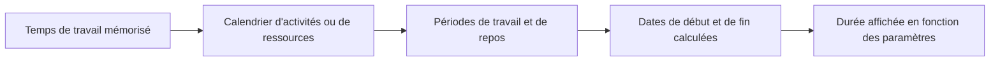

La durée dans Primavera P6 semble simple au premier abord : une activité dure un certain nombre de jours. En pratique, la durée est l’une des parties les plus importantes et les plus mal comprises d’un planning.

La durée est liée aux calendriers, au type d'activité, aux affectations de ressources, aux mises à jour de progression et aux paramètres d'affichage de l'utilisateur. Une durée affichée sous la forme « 5 jours » peut ne pas signifier la même chose dans chaque planning, dans chaque calendrier ou dans la présentation de chaque utilisateur. C'est pourquoi les planificateurs doivent comprendre non seulement ce qu'est la durée, mais également comment P6 la stocke, la calcule et l'affiche.

## Que signifie la durée

La durée est la durée du temps de travail nécessaire pour réaliser une activité. Il ne s’agit pas simplement du nombre de jours calendaires entre une date de début et une date de fin.

Par exemple, une activité d’une durée de 5 jours peut s’étendre sur :

- 5 jours calendaires sur un calendrier du lundi au vendredi sans interruption.
- 7 jours calendaires si un week-end tombe dans la période de travail.
- Moins de 5 jours calendaires sur un calendrier de 24 heures ou en horaires prolongés.
- Plus de 5 jours calendaires si des jours fériés ou chômés interrompent le travail.

C’est la première leçon clé : la durée est le temps de travail, tandis que les dates de début et de fin sont des positions calendaires.

## Comment P6 stocke la durée

P6 stocke la durée sous forme d'heure, généralement au niveau horaire dans les données de planification sous-jacentes. Ce que l'utilisateur voit dans la mise en page peut être affiché sous forme de jours, de semaines, de mois ou d'années selon ses préférences.

Cela signifie que la durée affichée est souvent une conversion. Si P6 stocke une activité sous forme de 40 heures de travail, un utilisateur peut la voir comme 5 jours si la conversion d'affichage utilise 8 heures par jour. Une autre configuration peut l'afficher différemment si la conversion de période ou la base de calendrier est différente.

C'est pourquoi deux personnes peuvent consulter le même planning et se retrouver confuses si leurs préférences utilisateur ou leurs paramètres administratifs de période ne sont pas alignés.

## Durée et calendriers

Les calendriers indiquent à P6 quand le travail peut avoir lieu. La durée indique à P6 combien de temps de travail est nécessaire. Le calendrier place ensuite ce temps de travail à des dates réelles.

S'il reste 40 heures à une activité, le calendrier détermine la répartition de ces 40 heures.

Sur un calendrier de 8 heures par jour, 40 heures peuvent apparaître comme 5 jours ouvrables. Sur un calendrier de 10 heures par jour, les mêmes 40 heures peuvent apparaître comme 4 jours ouvrables. Sur un calendrier de 24 heures, cela peut s'étendre sur beaucoup moins de temps.

C'est pourquoi les affectations du calendrier sont importantes. Changer le calendrier peut changer la date de fin même si la durée de travail stockée reste la même.

## Durée originale

La durée originale est la durée prévue de l'activité avant que la progression ne soit appliquée. Il représente l'estimation initiale du temps de travail nécessaire pour réaliser l'activité.

La durée originale est importante lors de la planification et du développement de la ligne de base. Il permet de définir l'effort attendu ou la fenêtre de temps pour une tâche. Il est également utilisé dans les discussions sur les progrès et les performances, car il fournit un point de référence sur la durée prévue de l'activité.

Utilisez la durée originale pour répondre : combien de temps cette activité était-elle prévue avant les mises à jour du statut ?

## Durée restante

La durée restante est le temps de travail encore nécessaire pour terminer l'activité à partir de la date de données actuelle.

Pour une activité non démarrée, la durée restante correspond généralement à la durée originale, sauf si elle a été révisée. Pour une activité en cours, la durée restante doit refléter le travail réaliste encore requis. Pour une activité terminée, la durée restante doit être égale à 0.

La durée restante est l'un des champs de mise à jour les plus importants de P6. Si c’est faux, les prévisions seront fausses.

Utilisez Durée restante pour répondre : combien de temps de travail est encore nécessaire ?

## Durée réelle

La durée réelle représente le temps déjà consacré à l'activité en fonction de la progression réelle. Il est lié au début réel, à la fin réelle, à la date des données, aux calendriers et à la méthode de mise à jour.

La durée réelle doit prendre en charge l'histoire du statut. Si une activité a commencé, la durée réelle doit avoir un sens par rapport au début réel et à la date des données. Si l'activité est terminée, la durée réelle doit correspondre à la période de travail réelle.

Utilisez Durée réelle pour répondre : combien de temps de travail a déjà été consommé ?

## À la fin de la durée

La durée à la fin représente la durée totale prévue de l'activité après avoir combiné le travail réel et restant.

En termes simples :

Durée réelle + Durée restante = Durée à la fin

Ceci est utile car cela montre si une activité devrait prendre plus ou moins de temps que prévu initialement. Si la durée initiale était de 10 jours mais que la durée de fin est désormais de 15 jours, l'activité devrait prendre plus de temps que prévu.

Utilisez Durée à la fin pour répondre : combien de temps cette activité devrait-elle durer au total ?

## Durée et préférences de l'utilisateur

Les préférences utilisateur contrôlent la manière dont les unités de temps sont affichées pour un utilisateur individuel. Un utilisateur peut choisir si les durées sont affichées en heures, jours, semaines, mois ou années.

Cela affecte ce que l'utilisateur voit, pas nécessairement le calcul du planning sous-jacent. Par exemple, la même durée stockée peut être affichée sous forme d’heures dans une présentation et de jours dans une autre.

C’est utile, mais cela peut aussi créer de la confusion. Un planificateur examinant un travail détaillé peut préférer des heures. Un chef de projet peut préférer des jours. Un rapport de portefeuille peut afficher des mois. Si la base de conversion n’est pas comprise, les chiffres peuvent sembler incohérents.

Lors de la révision des durées, confirmez l’unité d’affichage. Demandez si la durée indiquée est en heures, jours, semaines ou dans une autre unité.

## Préférences d'administration et périodes de temps

Les préférences d'administrateur incluent des paramètres de période qui définissent la manière dont P6 convertit les heures en unités plus grandes telles que les jours, les semaines, les mois et les années. Ces paramètres sont importants car ils influencent la manière dont les valeurs de durée sont affichées et converties.

Par exemple, si le système utilise 8 heures par jour, 40 heures s'affichent sous la forme de 5 jours. Si le système utilise 10 heures par jour, 40 heures s'affichent sous la forme de 4 jours.

Cela ne signifie pas nécessairement que le travail a changé. Cela peut simplement signifier que la conversion a changé.

Dans certaines configurations P6, l'affichage de la durée peut également dépendre du fait que le système ou l'utilisateur utilise les heures calendaires assignées pour la conversion des périodes. C'est pourquoi les équipes de projet doivent aligner les normes de calendrier, les préférences des utilisateurs et les paramètres de période d'administration avant de créer des rapports formels.

## Pourquoi la durée peut être différente

La durée peut être différente pour plusieurs raisons :

- Différents utilisateurs affichent l’heure dans différentes unités.
- Les paramètres de période d’administration convertissent les heures différemment.
- Les calendriers d'activités ont des heures différentes par jour.
- Les calendriers de ressources diffèrent des calendriers d'activités.
- Les activités utilisent différents types d'activités.
- La durée restante a été mise à jour manuellement.
- La progression n’a pas été appliquée correctement.
- L'heure de la journée est masquée dans la mise en page.

C’est pourquoi un problème de durée n’est pas toujours un problème de durée. Parfois, c'est un problème de calendrier. Il s'agit parfois d'un problème de réglage de l'affichage. Parfois, il s'agit d'un problème de mise à jour de la progression.

## Relation avec les types d'activité et les types de durée

Le type d'activité affecte la base de calendrier la plus importante. Les activités dépendantes des tâches reposent généralement principalement sur le calendrier des activités. Les activités dépendantes des ressources peuvent être davantage influencées par les calendriers des ressources.

Le type de durée affecte la façon dont P6 équilibre la durée, les unités de ressources et les unités par temps. Par exemple, l'ajout de ressources peut ou non raccourcir l'activité en fonction du type de durée.

Ainsi, lorsqu'une durée se comporte de manière inattendue, vérifiez trois éléments ensemble :

- Calendrier d'activités et calendrier de ressources.
- Type d'activité.
- Type de durée.

Ces domaines fonctionnent ensemble. En examiner un seul peut conduire à une conclusion erronée.

## Problèmes courants

Un problème courant consiste à saisir une durée en jours sans se rendre compte que le calendrier d'activités utilise un nombre d'heures par jour différent de celui prévu.

Un autre problème consiste à comparer les durées entre des activités qui utilisent des calendriers différents. Cinq jours sur un calendrier peuvent ne pas représenter la même durée de travail que cinq jours sur un autre.

Un troisième problème concerne les préférences utilisateur incohérentes. Un évaluateur peut voir des heures tandis qu'un autre voit des jours, et tous deux peuvent penser que l'horaire a changé.

Un autre problème courant est la modification des préférences d'administration une fois que les planifications existent déjà. Cela peut rendre les durées affichées différentes même lorsque les heures stockées sous-jacentes n'ont pas changé.

## Comment réviser correctement la durée

Lorsque vous examinez la durée dans P6, ne regardez pas uniquement le nombre affiché dans la colonne Durée.

Vérifier:

- Durée originale.
- Durée restante.
- Durée réelle.
- À la durée d’achèvement.
- Calendrier d'activités.
- Calendrier des ressources si des ressources sont utilisées.
- Type d'activité.
- Type de durée.
- Affichage de l’unité de temps des préférences utilisateur.
- Conversion de la période des préférences d’administration.

Si les dates ou les durées semblent étranges, ajoutez des champs de calendrier et d'heure à la mise en page. Ne cachez pas l’heure de la journée pendant le dépannage.

## Conclusion

La durée dans P6 correspond au temps de travail, pas seulement au temps calendaire écoulé. P6 stocke la durée sous forme d'heure, applique des calendriers pour placer cette heure sur le planning et l'affiche en fonction des préférences de l'utilisateur et des paramètres de période administratifs.

Cela signifie que la durée doit être revue avec son contexte. Une valeur affichée sous la forme « 5 jours » dépend des heures du calendrier, des unités d'affichage, des paramètres de conversion, du type d'activité, du type de durée et de l'état de la mise à jour.

Un planificateur compétent comprend que la durée n’est pas seulement une entrée. Il fait partie du moteur de calcul. Lorsque la durée, les calendriers et les préférences sont alignés, le calendrier devient plus facile à expliquer et plus fiable pour le contrôle du projet.
## Contenu associé
- [Activités commençant à la date des données sans logique pilotante : pourquoi cette mesure de planification est importante - Vue d’ensemble](../../metrics/01_activities_starting_in_dd_with_no_logic_driving/02_guide_template.md)
- [Calendriers dans P6](../08_CALENDARS%20IN%20P6/08_CALENDARS%20IN%20P6.md)
- [Pourcentage de types terminés dans P6](../10_PERCENT%20COMPLETION%20TYPES%20IN%20P6/10_PERCENT%20COMPLETION%20TYPES%20IN%20P6.md)
