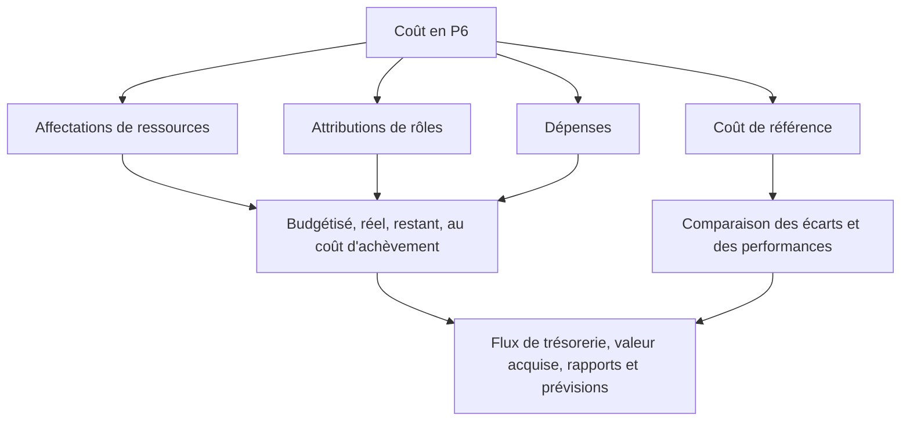

# Où vivent les coûts dans P6

Le coût dans Primavera P6 peut vivre à plusieurs endroits. C’est utile, mais cela peut aussi prêter à confusion. Un calendrier peut afficher le coût budgété, le coût réel, le coût restant, le coût à l'achèvement, le coût des ressources, le coût du rôle, le coût des dépenses, les champs de valeur acquise et le coût de référence. Ces valeurs sont liées, mais elles ne signifient pas toutes la même chose.

Pour les équipes de contrôle de projet, la question clé n’est pas seulement « quel est le coût ? La meilleure question est : d’où vient ce coût, que représente-t-il et comment doit-il être utilisé ?

Ce blog explique les principaux types de coûts disponibles dans P6, les différences entre eux et quand chacun est utile.

## Pourquoi l'emplacement des coûts est important

P6 est avant tout un outil de planification, mais il peut également prendre en charge des calendriers chargés en coûts, la valeur acquise, les flux de trésorerie et les rapports prévisionnels. Pour faire cela correctement, le coût doit être placé dans la partie droite du modèle de planning.

Si le coût de la main-d’œuvre est saisi comme dépense, les histogrammes des ressources risquent de ne pas raconter la bonne histoire. Si le coût réel est saisi manuellement mais que le projet s'attend à ce qu'il provienne des ressources réelles, les rapports peuvent devenir incohérents. Si le coût de référence est manquant, les rapports sur les écarts de calendrier et les écarts de coûts perdent leur contexte.

L'emplacement des coûts est important car la source du coût affecte la manière dont il est cumulé, mis à jour, prévisions et rapports.

## Coûts des ressources

Les coûts des ressources proviennent des ressources affectées aux activités. Une ressource peut représenter de la main d’œuvre, de l’équipement ou une autre catégorie de ressources. Chaque ressource peut avoir des taux, des unités et des calculs de coûts.

Par exemple, si une activité fait appel à une équipe de tuyauteurs pendant 80 heures à un taux horaire défini, P6 peut calculer le coût de la main d'œuvre à partir des unités et du taux attribués.

Les coûts des ressources sont utiles lorsque le projet souhaite connecter les activités planifiées aux histogrammes de main d’œuvre, d’équipement, de productivité et de ressources.

Utilisez les coûts des ressources lorsque :

- La demande de main d’œuvre ou d’équipement est importante.
- Des histogrammes de ressources sont nécessaires.
- Le coût est lié aux heures ou aux unités.
- La valeur acquise ou le progrès est basé sur les ressources.
- Le planning est utilisé pour la planification des ressources.

Le principal risque est la maintenance. Les horaires chargés en ressources nécessitent de la discipline. Si les unités, les taux, les calendriers ou les valeurs réelles ne sont pas conservés, les rapports de coûts ne seront pas fiables.

## Coûts du rôle

Les rôles sont des fonctions professionnelles génériques, telles qu'ingénieur, électricien, planificateur, inspecteur ou grutier. Dans P6, les rôles peuvent être attribués aux activités avant que les ressources nommées ne soient connues.

Les coûts de rôle peuvent faciliter une planification précoce lorsque l'équipe connaît le type de ressource nécessaire mais pas la personne ou l'équipe en particulier.

Par exemple, au début de la planification technique, une activité peut nécessiter 120 heures de temps d'« ingénieur principal ». La personne nommée n'a peut-être pas encore été affectée, mais le rôle peut fournir un taux de planification et une estimation des coûts.

Utilisez les coûts de rôle lorsque :

- Le planning est encore en préparation.
- Les ressources nommées ne sont pas encore confirmées.
- Le projet souhaite une estimation de ressources ou de coûts de haut niveau.
- Les rôles seront ensuite remplacés par de véritables ressources.

Les coûts des rôles sont utiles pour la planification initiale, mais ils doivent être réexaminés à mesure que le projet mûrit. Si les rôles demeurent après que les ressources réelles soient connues, le calendrier peut devenir trop générique pour un contrôle détaillé.

## Coûts des dépenses

Les dépenses sont des coûts hors ressources affectés directement aux activités. Ils sont utiles pour les coûts qui ne sont pas mieux représentés par les ressources en main d’œuvre ou en équipement.

Les exemples incluent :

- Permis.
- Voyage.
- Montants forfaitaires du fournisseur.
- Forfaits sous-traitants.
- Matériel acheté pour un montant fixe.
- Frais de tests.
- Frais de mobilisation.

Les coûts des dépenses peuvent être budgétisés, réels, restants ou à l'achèvement selon la façon dont le projet les suit.

Utilisez les dépenses lorsque :

- Le coût ne dépend pas des heures de ressources.
- Le coût est un élément fixe ou forfaitaire.
- L’activité nécessite un coût direct hors ressources.
- Le projet veut des flux de trésorerie pour les éléments non liés à la main-d'œuvre.

Le risque est que les dépenses deviennent un dépotoir. Si tous les coûts sont saisis en tant que dépenses, le calendrier peut perdre sa capacité à expliquer séparément la main-d'œuvre, l'équipement et la productivité.

## Coût budgété

Le coût budgétisé est le coût prévu affecté à l'activité. Cela peut provenir d’affectations de ressources, d’attributions de rôles, de dépenses ou d’une combinaison de ceux-ci.

Le coût budgétisé est important car il représente le plan de coûts avant l’exécution. Il prend en charge les flux de trésorerie, le coût de base, la configuration de la valeur acquise et les rapports de contrôle de projet.

Utilisez Coût budgétisé pour répondre : quel était le coût prévu de cette activité ?

Si le coût budgétisé est manquant ou incohérent, le calendrier peut toujours calculer les dates, mais il ne peut pas prendre en charge des rapports significatifs sur les coûts.

## Coût réel

Le coût réel représente le coût déjà engagé. En fonction de la configuration du projet, le coût réel peut être calculé à partir des unités et des taux de ressources réels, saisi manuellement, importé à partir de feuilles de temps ou chargé à partir d'un système de coûts externe.

Le coût réel est important pour les rapports d’avancement et la valeur acquise. Il montre ce qui a été dépensé ou enregistré jusqu'à présent.

Utilisez Coût réel pour répondre : quel coût a déjà été engagé ou enregistré ?

Le risque est de mélanger les sources. Si certains coûts réels sont importés de la comptabilité et que d’autres sont saisis manuellement dans P6, l’équipe a besoin d’une règle claire pour éviter les duplications ou les lacunes.

## Coût restant

Le coût restant est le coût prévu encore nécessaire pour terminer l'activité. Il est lié aux unités restantes, aux taux de ressources, aux dépenses restantes et aux hypothèses de mise à jour.

Le coût restant est l’un des champs de prévision les plus importants. Il indique à l'équipe du projet le coût restant à compter de la date de données actuelle.

Utilisez Coût restant pour répondre : quel est le coût encore attendu ?

Si la durée restante est mise à jour mais que le coût restant ne l'est pas, la prévision peut devenir incohérente. Il en va de même lorsque les unités de ressources ou les valeurs de dépenses restantes ne sont pas conservées.

## Au coût d'achèvement

Au coût d'achèvement correspond au coût total attendu de l'activité après avoir combiné le coût réel et le coût restant.

En termes simples :

Coût réel + Coût restant = Coût à l'achèvement

Au coût d'achèvement permet de montrer si une activité devrait se terminer au-dessus, en dessous ou dans les limites du budget.

Utilisez Au coût d’achèvement pour répondre : quel est le dernier coût total attendu ?

## Coût de référence

Le coût de référence provient d'un calendrier de référence attribué. Il est utilisé pour comparer les valeurs de coûts actuelles avec le plan approuvé.

Le coût de référence est important pour le reporting des écarts. Sans référence, le projet peut connaître le coût prévu actuel, mais pas si cette prévision est meilleure ou pire que le plan approuvé.

Utilisez le coût de référence pour répondre : comment le coût actuel se compare-t-il au plan de coûts approuvé ?

Le coût de base est particulièrement important lorsque vous utilisez P6 pour la valeur acquise ou pour le reporting formel du PMO.

## Champs de coût de la valeur acquise

P6 peut prendre en charge les champs de valeur acquise tels que la valeur planifiée, la valeur acquise, le coût réel, l'écart de coût et l'écart de calendrier, en fonction de la configuration du projet.

La valeur acquise utilise les informations de planification chargées en coûts pour comparer le travail planifié, le travail gagné et le coût réel.

Ces champs sont utiles lorsque le projet dispose d'un processus formel de valeur acquise. Ils nécessitent des références cohérentes, des règles de progression, des méthodes de pourcentage achevé et un chargement des coûts.

Utilisez les champs de coût de la valeur d'acquisition lorsque :

- Le projet nécessite des rapports EV.
- Des règles de progression sont définies.
- Le coût de base est approuvé.
- La source réelle des coûts est contrôlée.
- La progression de l’activité est maintenue de manière constante.

Sans ces contrôles, les résultats de la valeur acquise peuvent paraître précis tout en étant peu fiables.

## Quel type de coût devriez-vous utiliser ?

Utilisez les coûts des ressources pour la main-d'œuvre et l'équipement qui doivent prendre en charge la planification des ressources, la productivité et les histogrammes.

Utilisez les coûts de rôle pour une planification précoce lorsque les ressources nommées ne sont pas encore connues.

Utilisez les coûts de dépenses pour les coûts directs hors ressources, les sommes forfaitaires, les articles des fournisseurs, les permis, les déplacements ou les forfaits de sous-traitance.

Utilisez les champs de coût budgété, réel, restant et final pour comprendre le cycle de vie des coûts par étapes.

Utiliser le coût de référence pour comparaison avec le plan approuvé.

Utilisez les champs de valeur acquise lorsque le projet dispose de la gouvernance nécessaire pour prendre en charge les rapports EV.

## Problèmes courants

Un problème courant est la duplication des coûts. Le même coût de sous-traitant peut être saisi comme coût de ressource et à nouveau comme dépense.

Un autre problème réside dans l’absence de coût réel. Le calendrier peut contenir un budget et un coût restant, mais le coût réel peut résider dans un système comptable distinct et ne jamais atteindre P6.

Un troisième problème consiste à utiliser les dépenses pour tout. Cela peut entraîner un coût total mais une faible visibilité des ressources.

Un autre problème concerne les progrès incohérents. Si le pourcentage d'achèvement, la durée restante et le coût restant ne sont pas alignés, le coût d'achèvement devient peu fiable.

## Bonne pratique

Définissez la stratégie de coûts avant de charger le planning. Décidez où vivront la main-d’œuvre, l’équipement, les matériaux, les sous-traitants et les coûts indirects.

Utilisez des comptes de coûts, des codes d’activité, des ressources, des rôles et des catégories de dépenses cohérents.

Documentez si les coûts réels seront saisis dans P6, importés ou déclarés à partir d'un autre système.

Examinez les champs de coût à chaque cycle de mise à jour. Les coûts budgétisés, réels, restants et à l’achèvement doivent raconter une histoire cohérente.

## Conclusion

Le coût dans P6 peut résider dans les champs de ressources, de rôles, de dépenses, de références et de valeur acquise. Chaque lieu a un but différent.

Les coûts des ressources relient les coûts à la main-d'œuvre et à l'équipement. Les coûts des rôles soutiennent une planification précoce. Les coûts des dépenses capturent les éléments directs hors ressources. Les coûts budgétisés, réels, restants et à l’achèvement montrent le cycle de vie des coûts. Les champs de référence et de valeur acquise prennent en charge la comparaison et les rapports sur les performances.

Un calendrier solide et chargé de coûts ne se construit pas en plaçant des chiffres là où ils se situent. Il est construit en décidant à quelle place chaque type de coût appartient et en maintenant cette structure à chaque cycle de mise à jour.
## Contenu associé
- [Activités commençant à la date des données sans logique pilotante : pourquoi cette mesure de planification est importante - Vue d’ensemble](../../metrics/01_activities_starting_in_dd_with_no_logic_driving/02_guide_template.md)
- [Pourcentage de types terminés dans P6](../10_PERCENT%20COMPLETION%20TYPES%20IN%20P6/10_PERCENT%20COMPLETION%20TYPES%20IN%20P6.md)
- [Types de ressources dans P6](../12_RESOURCE%20TYPES%20IN%20P6/12_RESOURCE%20TYPES%20IN%20P6.md)
