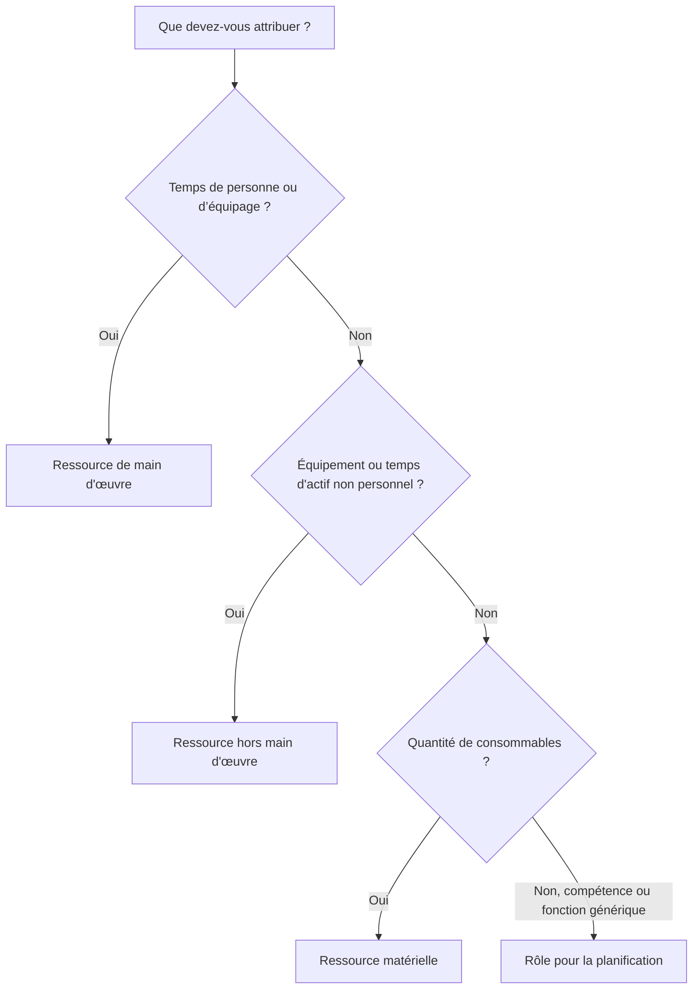

# Types de ressources dans P6

Les ressources de Primavera P6 représentent les personnes, les équipements et les matériaux nécessaires à l'exécution du travail. Ils relient le calendrier à la capacité, à la productivité, aux coûts et à la demande de ressources au fil du temps.

Un planning peut exister sans ressources, mais un planning chargé en ressources donne à l'équipe de projet une vision plus approfondie. Il peut afficher des histogrammes de main-d'œuvre, la demande d'équipement, l'utilisation des matériaux, les courbes de coûts, les contraintes de ressources et les surcharges possibles. Pour que ces informations soient utiles, le planificateur doit comprendre les différents types de ressources disponibles dans P6 et quand les utiliser.

Les principaux types de ressources dans P6 sont :

- Travail.
- Non-travail.
- Matériel.

P6 utilise également des rôles, qui ne sont pas exactement les mêmes que les ressources mais sont étroitement liés et très utiles lors de la planification.

## Pourquoi le type de ressource est important

Le type de ressource affecte la manière dont P6 gère les unités, les tarifs, les coûts, les calendriers et les rapports.

Une ressource de travail se comporte différemment d’une ressource matérielle. Une grue ne doit pas être traitée de la même manière qu’un volume de béton. Un rôle d'ingénieur générique n'est pas la même chose qu'une ressource d'ingénieur nommée. Si les types de ressources sont mal mélangés, les histogrammes, les rapports de coûts, les évaluations de productivité et les résultats de la valeur acquise peuvent devenir trompeurs.

Le type de ressource répond à une question pratique : quel genre de chose est affecté à l’activité ?

## Ressources de main d'œuvre

Les ressources en main-d'œuvre représentent des personnes ou des équipes. Ils sont généralement mesurés en heures, en jours ou en d’autres unités basées sur le temps. Les ressources de main-d'œuvre peuvent avoir des tarifs, des calendriers, des limites de disponibilité et des valeurs de coût.

Les exemples incluent :

- Planificateur.
- Equipage civil.
- Électricien.
- Équipe de soudure.
- Ingénieur.
- Inspecteur.
- Technicien de mise en service.

Utilisez les ressources de main-d'œuvre lorsque le calendrier doit montrer l'effort humain ou la demande de l'équipage. Les ressources de main-d'œuvre sont utiles pour les histogrammes de main-d'œuvre, les plans de dotation en personnel, l'analyse de la productivité et la prévision des coûts de main-d'œuvre.

Par exemple, une activité appelée « Installer un chemin de câbles » peut nécessiter 4 électriciens pendant 5 jours. L'affectation des ressources en main-d'œuvre permet au calendrier d'afficher la demande d'électriciens au cours de cette période.

Les ressources en main-d'œuvre sont également utiles lorsque le projet doit comparer les heures de travail planifiées aux heures de travail réelles.

## Ressources hors main d'oeuvre

Les ressources non liées à la main-d'œuvre représentent des équipements ou d'autres actifs non personnels réutilisables. Elles sont généralement basées sur le temps, comme la main-d'œuvre, mais ce ne sont pas des ressources humaines.

Les exemples incluent :

- Grue.
- Excavatrice.
- Machine à souder.
- Équipement de test.
- Équipement d'équipage d'échafaudage.
- Ensemble d'outils spécialisés.
- Générateur.

Utilisez des ressources autres que la main-d'œuvre lorsque la disponibilité de l'équipement est importante ou lorsque le coût de l'équipement doit être suivi au fil du temps.

Par exemple, si un transport lourd nécessite une grue pendant deux jours, l'affectation d'une ressource de grue autre que la main-d'œuvre aide l'équipe de projet à connaître la demande de grues, à éviter les conflits et à prévoir le coût de l'équipement.

Les ressources non liées à la main-d'œuvre sont importantes lorsque l'équipement est rare, coûteux, partagé entre les zones de travail ou déterminant la séquence de travail.

## Ressources matérielles

Les ressources matérielles représentent des éléments consommables. Ils sont généralement mesurés en quantités plutôt qu’en temps.

Les exemples incluent :

- Mètres cubes de béton.
- Tonnes d'acier.
- Compteurs de câbles.
- Bobines de tuyaux.
- Vannes.
- Litres de revêtement.
- Panneaux.

Utilisez des ressources matérielles lorsque le calendrier doit suivre la consommation basée sur la quantité ou les coûts liés aux matériaux.

Les ressources matérielles peuvent prendre en charge les courbes de matériaux, le suivi des quantités et le chargement des coûts. Ils sont particulièrement utiles lorsque le calendrier est lié aux quantités installées ou à la valeur acquise basée sur les quantités.

Par exemple, une activité peut comprendre 500 mètres d’installation de câbles. L'attribution de câbles en tant que ressource matérielle aide l'équipe à suivre la quantité installée prévue et réelle au fil du temps.

Les ressources matérielles ne doivent pas être utilisées pour représenter les heures de travail ou le temps d’équipement. Ils servent un objectif différent.

## Rôles

Les rôles sont des fonctions professionnelles ou des catégories de compétences génériques. Ce ne sont pas des ressources, mais elles facilitent la planification avant que les ressources nommées ne soient connues.

Les exemples incluent :

- Ingénieur senior.
- Superviseur électrique.
- Inspecteur civil.
- Planificateur.
- Responsable de la mise en service.
- Grutier.

Les rôles sont utiles dès le début de la planification, car le projet peut savoir quel type de compétence est nécessaire sans savoir exactement qui effectuera le travail.

Par exemple, une activité d'ingénierie peut nécessiter 80 heures d'effort d'« ingénieur électricien senior ». Plus tard, ce rôle peut être remplacé ou complété par une ressource nommée.

Utilisez des rôles lorsque :

- La planification est encore à un niveau élevé.
- Les ressources nommées ne sont pas confirmées.
- La demande de ressources est nécessaire par type de compétence.
- L'organisation souhaite des prévisions précoces en matière de personnel.

Les rôles doivent être revus à mesure que le projet mûrit. Si le calendrier nécessite un contrôle détaillé, les rôles devront peut-être être remplacés par des ressources réelles.

## Calendriers de ressources

Les ressources peuvent avoir des calendriers. Ceci est important car la disponibilité des ressources peut différer de la disponibilité des activités.

Par exemple, une activité de construction peut utiliser un calendrier d'activités de 6 jours, mais le spécialiste du fournisseur désigné peut être disponible uniquement du lundi au vendredi. Si l'activité dépend des ressources ou si le nivellement des ressources est utilisé, le calendrier des ressources peut affecter la planification.

Les ressources de main-d'œuvre et hors main-d'œuvre ont souvent besoin de calendriers car les personnes et les équipements ne sont disponibles qu'à certains moments. Les ressources matérielles se comportent généralement différemment car elles représentent des quantités et non du temps de travail.

Lorsque les dates des ressources semblent étranges, vérifiez à la fois le calendrier des activités et le calendrier des ressources.

## Coûts des ressources

Les ressources peuvent entraîner des taux de coût. Les ressources de main-d'œuvre et hors main-d'œuvre utilisent souvent des taux basés sur le temps. Les ressources matérielles utilisent souvent des taux unitaires.

Par exemple:

- Électricien : coût horaire.
- Grue : coût par heure ou par jour.
- Béton : coût au mètre cube.

Lorsque des ressources sont affectées à des activités, P6 peut calculer le coût budgétisé, réel, restant et à l'achèvement.

Ceci est utile pour les calendriers chargés en coûts, les rapports sur la valeur acquise, les prévisions de ressources et l'analyse des flux de trésorerie. Mais cela ne fonctionne bien que lorsque les unités, les tarifs, les calendriers et les mises à jour de progression sont maintenus.

## Choisir le bon type de ressource

Utilisez la main d’œuvre lorsque la ressource est une personne, un équipage ou un effort humain.

Utilisez Nonlabor lorsque la ressource est un équipement ou un actif réutilisable dont le temps compte.

Utilisez Matériel lorsque la ressource est une quantité consommable.

Utilisez les rôles lors de la planification par compétence ou fonction avant que les ressources nommées ne soient connues.

Le choix doit refléter la manière dont le projet souhaite planifier, mesurer et rendre compte du travail.

## Erreurs courantes

Une erreur courante consiste à utiliser les ressources en main-d’œuvre pour tout. Cela peut faciliter le chargement des coûts au début, mais cela réduit la clarté lorsque les quantités d'équipement ou de matériaux sont importantes.

Une autre erreur consiste à utiliser des ressources matérielles pour des postes qui sont en réalité des dépenses ou à sous-traiter des sommes forfaitaires. Si le projet ne nécessite pas de suivi des quantités, une dépense peut être plus appropriée.

Une troisième erreur consiste à attribuer des ressources sans maintenir les unités réelles. Un calendrier chargé en ressources n'est utile que si les mises à jour de progression maintiennent les données de ressources à jour.

Un autre problème est la confusion des rôles et des ressources. Les rôles sont utiles pour la planification, mais les ressources nommées sont plus adaptées lorsque les affectations détaillées, les calendriers et les chiffres réels sont importants.

## Bonne pratique

Définissez la stratégie de ressources avant de charger le planning.

Décidez quel travail utilisera des ressources de main-d'œuvre, quel travail utilisera des ressources non liées à la main-d'œuvre, quels matériaux nécessitent un suivi des quantités et où les dépenses doivent être utilisées à la place.

Utilisez des conventions de dénomination et des codes de ressources cohérents. Gardez le dictionnaire de ressources propre. Évitez les ressources en double avec des noms légèrement différents.

Examinez les affectations de ressources au cours de chaque cycle de mise à jour. Les unités, les coûts, les calendriers et les chiffres réels doivent rester alignés sur le processus de contrôle du projet.

## Conclusion

Les types de ressources dans P6 aident à définir ce qui est nécessaire pour effectuer le travail. Les ressources en main-d'œuvre représentent les personnes et les équipages. Les ressources hors main d’œuvre représentent l’équipement et les actifs réutilisables. Les ressources matérielles représentent des quantités consommables. Les rôles prennent en charge la planification par compétence ou fonction avant que les ressources nommées ne soient connues.

Choisir le bon type de ressource facilite l’analyse du planning. Il améliore les histogrammes de main-d'œuvre, la planification des équipements, le suivi des matériaux, le chargement des coûts, la valeur acquise et les rapports prévisionnels.

Un bon planning chargé en ressources n’est pas seulement un planning auquel sont attachées des ressources. Il s'agit d'un calendrier dans lequel chaque type de ressource est utilisé intentionnellement et maintenu tout au long de la vie du projet.
## Contenu associé
- [Activités démarrées avec 0 % de progression dans Primavera P6 - Vue d’ensemble](../../08_metrics_fr/13_activity_started_progress_zero/01_overview_template.md)
- [Où vivent les coûts dans P6](../11_WHERE%20THE%20COST%20LIVE%20IN%20P6/11_WHERE%20THE%20COST%20LIVE%20IN%20P6.md)
- [Limites de ressources dans P6](../13_RESOURCES%20LIMITS%20IN%20P6/13_RESOURCES%20LIMITS%20IN%20P6.md)
