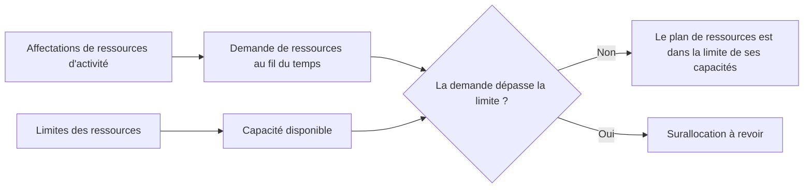

# Limites de ressources dans P6

Les limites de ressources dans Primavera P6 définissent la quantité de ressource disponible pendant une période donnée. Ils sont utilisés pour comparer la demande de ressources créée par les affectations d’activités à la capacité dont dispose réellement le projet.

En termes simples, une limite de ressources répond à la question : quelle quantité de cette ressource le projet peut-il utiliser ?

Si un planning indique qu'une équipe doit travailler sur cinq activités en même temps, P6 peut afficher la demande. Mais sans limite de ressources, le calendrier ne peut pas indiquer clairement si cette demande est réaliste. La limite est ce qui permet au planificateur de voir les surcharges, les problèmes de capacité et les éventuels problèmes de planification liés aux ressources.

## Quelles sont les limites de ressources

Une limite de ressource est la disponibilité maximale d'une ressource. Il peut être défini en unités par période de temps, comme les heures par jour, les heures par semaine ou le nombre d'unités disponibles pendant une période de travail.

Par exemple:

- Un agenda disponible 8 heures par jour.
- Trois électriciens disponibles 24 heures sur 24.
- Une grue disponible 8 heures d'équipement par jour.
- Deux inspecteurs disponibles 16 heures de travail par jour.

Lorsque les activités sont chargées en ressources, P6 calcule la demande de ressources créée par ces affectations. La limite de ressources fournit la ligne de capacité à laquelle la demande est comparée.

## Pourquoi les limites des ressources sont importantes

Les limites des ressources sont importantes car les planifications sont souvent techniquement possibles mais pratiquement impossibles.

Un réseau logique peut calculer que plusieurs activités peuvent se dérouler en parallèle. Les dates peuvent sembler acceptables. Le chemin critique peut paraître raisonnable. Mais si toutes ces activités nécessitent le même équipage, le même spécialiste ou le même équipement limité, le plan risque de ne pas être exécutable.

Les limites de ressources permettent d'exposer cette différence entre un calendrier calculé et un calendrier de livrables.

Ils sont utiles pour :

- Identifier les équipes de travail surchargées.
- Vérification de la demande d'équipement.
- Prise en charge des histogrammes de ressources.
- Révision des plans de main d'œuvre.
- Préparation du nivellement des ressources.
- Expliquer pourquoi certains travaux ne peuvent pas démarrer même si la logique le permet.
- Tester si le plan correspond à la capacité disponible.

Dans les contrôles de projet, cela est particulièrement utile lorsque le calendrier est utilisé pour la dotation en personnel, le support aux achats, la planification de la construction ou le reporting de la valeur acquise.

## Limites des ressources en main d’œuvre

Les limites de main d’œuvre définissent le nombre de personnes ou d’heures de travail disponibles.

Par exemple, si le projet compte 10 électriciens travaillant 8 heures par jour, la limite de travail journalière peut être de 80 heures par jour. Si le calendrier demande 120 heures d'électricien le même jour, le calendrier demande plus d'électriciens que le projet n'en a.

Cela ne signifie pas automatiquement que le calendrier est erroné. Cela signifie que le planificateur doit revoir le plan. La solution peut consister à ajouter des équipes, à modifier la séquence, à déplacer les tâches non critiques, à recourir aux heures supplémentaires ou à accepter un pic temporaire si cela est réaliste et approuvé.

Les limites de ressources en main-d’œuvre sont utiles lorsque la disponibilité de la main-d’œuvre constitue une réelle contrainte. Ils sont moins utiles lorsque le calendrier n'est pas maintenu au niveau de détail nécessaire pour prendre en charge le contrôle des ressources.

## Limites des ressources hors main d'œuvre

Des limites hors main d’œuvre s’appliquent aux équipements et autres actifs réutilisables.

Les exemples incluent les grues, les excavatrices, les équipements de test, les outils spécialisés, les générateurs ou les installations temporaires. Si une seule grue est disponible, les activités nécessitant la même grue ne peuvent pas toutes être exécutées en même temps à moins qu'une autre grue ne soit ajoutée ou que les travaux ne soient réordonnés.

C’est là que les limites de ressources peuvent s’avérer très pratiques. Les équipements constituent souvent une véritable contrainte, surtout lorsqu'ils sont chers, partagés entre zones, difficiles à mobiliser ou nécessaires à des travaux critiques.

Par exemple, deux charges lourdes peuvent être toutes deux logiquement prêtes. Mais si les deux ont besoin de la même grue, la limite des ressources peut montrer que le plan dépasse la capacité disponible.

## Ressources matérielles et limites

Les ressources matérielles se comportent différemment des ressources de travail et des ressources non liées au travail. Ils représentent généralement des quantités et non une disponibilité quotidienne du temps de travail.

Une affectation de matériaux peut indiquer le volume de béton prévu, la longueur des câbles, le tonnage d'acier ou la quantité installée. Le projet peut encore avoir des contraintes matérielles, mais celles-ci sont souvent gérées par le biais de dates d'approvisionnement, d'étapes de livraison, de suivi des stocks ou de contraintes de calendrier plutôt que par le même type de limite quotidienne de disponibilité des ressources utilisée pour les personnes ou l'équipement.

Cela ne veut pas dire que les matériaux sont sans importance. Cela signifie que le planificateur doit faire attention à ce que la limite est censée représenter.

Si le problème concerne la capacité de production, par exemple le nombre maximum de mètres cubes de béton pouvant être mis en place par jour, un modèle de ressources ou de production peut être utile. Si le problème est de savoir si le matériel est arrivé, les liens logiques ou les étapes d’approvisionnement peuvent être plus clairs.

## Comment P6 utilise les limites

P6 peut utiliser les limites de ressources dans les profils de ressources, les feuilles de calcul, les histogrammes et l'analyse des ressources. La demande provenant des affectations d'activités peut être présentée par rapport à la limite disponible.

Lorsque le nivellement des ressources est utilisé, P6 peut également utiliser la disponibilité des ressources pour retarder les activités afin que la demande reste dans les limites, en fonction des paramètres de nivellement.

C’est puissant, mais il faut le gérer avec précaution. Le nivellement des ressources peut modifier les dates de prévision. Si les limites, les calendriers, les priorités et la logique des activités ne sont pas bien respectés, le résultat nivelé peut paraître mathématique mais pas pratique.

Les limites de ressources doivent donc faire partie d'un processus de planification contrôlé, et non un bouton enfoncé à la fin d'une mise à jour.

## Quand utiliser les limites de ressources

Utilisez les limites de ressources lorsque les ressources sont vraiment limitées et que le calendrier est chargé de ressources avec suffisamment de qualité pour prendre en charge l'analyse.

Les bons cas d’utilisation incluent :

- Un projet avec un nombre fixe d'équipes.
- Grues partagées ou équipements spécialisés.
- Spécialistes limités en ingénierie ou en mise en service.
- Arrêts, redressements et pannes.
- Des plans de construction où les pics de main d’œuvre doivent être maîtrisés.
- Programmes dans lesquels le même pool de ressources prend en charge plusieurs projets.

Les limites de ressources sont également utiles lors d’une analyse de simulation. Le planificateur peut tester si le plan actuel fonctionne avec la capacité disponible ou si des équipes supplémentaires, des heures supplémentaires ou un réordonnancement sont nécessaires.

## Quand être prudent

Soyez prudent lorsque les données de ressources sont incomplètes ou symboliques.

Si les ressources ont été ajoutées uniquement pour le chargement des coûts, les unités peuvent ne pas représenter une disponibilité réelle. Si tout le travail est affecté à des ressources génériques, l'histogramme peut être trop large pour prendre en charge de véritables décisions. Si les unités réelles ne sont pas mises à jour, le plan de ressources peut rapidement s'éloigner de la réalité.

Faites également attention aux limites artificielles. Une limite trop basse peut créer des retards inutiles lors du nivellement. Une limite trop élevée peut cacher de réels problèmes de capacité.

La limite doit correspondre à la véritable question de planification. Testons-nous la disponibilité réelle de l'équipage, le personnel budgétisé, l'accès à l'équipement ou un objectif de gestion ? Chacun peut nécessiter une configuration différente.

## Erreurs courantes

Une erreur courante consiste à fixer des limites de ressources sans se mettre d’accord sur ce qu’elles représentent. Une ressource peut afficher 80 heures par jour, mais s'agit-il de l'équipage actuel, de l'équipage maximum, de l'équipage budgétisé ou de l'équipage promis par l'entrepreneur ?

Une autre erreur consiste à utiliser les résultats de mise à niveau sans les examiner. P6 peut déplacer des activités en fonction de règles de ressources, mais le planificateur doit toujours vérifier si le résultat a du sens.

Un autre problème est d'ignorer les calendriers. Une limite de ressources est liée à la disponibilité, et la disponibilité dépend du temps de travail. Si le calendrier des ressources ne correspond pas au modèle de travail réel, la limite peut produire des surcharges trompeuses ou une fausse disponibilité.

Il est également courant de surcharger les ressources et d’accepter l’histogramme comme s’il s’agissait simplement d’un rapport. Une surcharge est un signal de planification. Cela devrait déclencher un examen, et non simplement être ignoré.

## Bonne pratique

Commencez par les ressources qui comptent le plus. Toutes les ressources n’ont pas besoin d’une limite détaillée. Concentrez-vous sur les équipes critiques, les équipements rares, les spécialistes clés et les ressources qui affectent l'achèvement du projet ou les étapes majeures.

Définissez si la limite représente la capacité normale, la capacité maximale ou la capacité de pointe approuvée. Gardez cette définition cohérente.

Examinez les profils de ressources lors des mises à jour de planification. Si les prévisions changent, la demande en ressources change également. Les limites doivent être revues ainsi que la logique, les calendriers, les durées restantes et la progression.

Utilisez le nivellement des ressources avec soin et documentez les paramètres. Comparez le résultat nivelé avec le calendrier non nivelé afin que l'équipe comprenne ce qui a changé et pourquoi.

Plus important encore, validez le résultat avec les personnes qui exécutent le travail. Un histogramme n'est utile que s'il reflète un véritable plan de ressources.

## Conclusion

Les limites de ressources dans P6 définissent la capacité disponible. Ils permettent à l'équipe de projet de comparer ce que le calendrier exige avec ce que le projet peut raisonnablement fournir.

Bien utilisées, les limites de ressources aident à identifier les surcharges, à soutenir la planification de la main d’œuvre, à contrôler la demande d’équipement et à améliorer le réalisme des plannings. Mal utilisés, ils peuvent créer des histogrammes trompeurs ou des résultats de nivellement artificiels.

Les meilleures limites de ressources sont simples, intentionnelles et liées aux décisions réelles du projet. Ils aident à répondre à une question pratique : le projet peut-il exécuter ce plan avec les ressources dont il dispose réellement ?
## Contenu associé
- [Activités démarrées avec 0 % de progression dans Primavera P6 - Vue d’ensemble](../../metrics/13_activity_started_progress_zero/02_guide_template.md)
- [Types de ressources dans P6](../12_RESOURCE%20TYPES%20IN%20P6/12_RESOURCE%20TYPES%20IN%20P6.md)
- [Équilibrage des ressources dans P6](../14_RESOURCES%20BALANCING%20IN%20P6/14_RESOURCES%20BALANCING%20IN%20P6.md)
