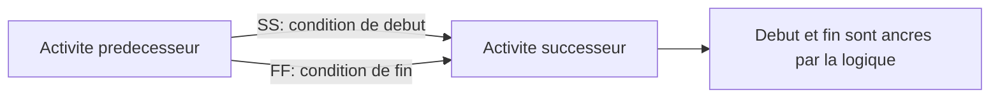

# Relations SS et FF

Les relations début-début (SS) et fin-fin (FF) sont des types de logique valides dans Primavera P6. Elles sont utiles lorsque deux activites se chevauchent et que le planning doit representer ce chevauchement mieux qu'une simple relation fin-début.

Le probleme ne vient pas de SS ou FF en soi. Il apparait lorsqu'elles sont utilisees seules alors que l'activite doit etre controlee aux deux extremites. Une relation SS controle le debut du successeur, mais pas sa fin. Une relation FF controle la fin du successeur, mais pas son debut. C'est pourquoi beaucoup de planificateurs les appellent des demi-relations lorsqu'elles ne sont pas completees par une autre logique.

## Ce Que Signifient SS et FF

Une relation SS indique que le successeur peut commencer lorsque le predecesseur commence, ou apres un lag defini depuis le debut du predecesseur.

Une relation FF indique que le successeur peut finir lorsque le predecesseur finit, ou apres un lag defini depuis la fin du predecesseur.

Les deux peuvent representer un travail reel. Une revue d'ingenierie peut commencer apres le demarrage de la production des plans. Les essais peuvent finir seulement lorsque l'installation est terminee. Dans une construction par zones, une equipe peut demarrer apres une autre, tout en ayant aussi besoin d'un controle de fin.

## Pourquoi une SS Seule Peut Etre Incomplete

Une SS seule ancre uniquement le debut du successeur. Elle n'explique pas ce qui controle sa fin.

Si la duree du successeur change, ou si l'activite s'etend au-dela de ce qui est realiste, le planning peut ne pas montrer correctement l'impact sauf si une logique aval le capture. Le debut est connecte, mais la fin peut rester margee.

Dans P6, cela peut donner l'impression que le planning est mieux connecte qu'il ne l'est vraiment.

## Pourquoi une FF Seule Peut Etre Incomplete

Une FF seule cree le probleme inverse. Elle ancre la fin du successeur, mais n'explique pas quand le successeur peut commencer.

Cela peut permettre a l'early start d'etre calcule trop loin en arriere, surtout dans un planning mis a jour. L'activite peut sembler prete a commencer a la date des données, ou meme avant, non pas parce que le travail est pret, mais parce que la condition de debut n'a pas ete definie.

Cela peut deformer la marge, le chemin critique et la planification court terme.

## La Paire SS + FF

Lorsque le travail se chevauche vraiment, le modele le plus solide est souvent une paire SS + FF.

La SS controle quand le successeur peut commencer. La FF controle quand il peut finir. Ensemble, elles definissent l'enveloppe logique du travail chevauchant.

Ce modele est utile pour les travaux continus, la construction par zones, les cycles conception-revue, l'installation et les essais, ou les sequences repetitives.

## Quand une SS ou FF Seule Peut Etre Acceptable

Toute SS ou FF isolee n'est pas automatiquement incorrecte.

Une SS seule peut etre acceptable si la fin du successeur est controlee par une autre relation aval valide. Une FF seule peut etre acceptable si le debut du successeur est controle par un autre predecesseur valide. La question cle est de savoir si les deux extremites de l'activite sont controlees quelque part dans le reseau.

Le planificateur doit pouvoir expliquer pourquoi la relation seule est suffisante.

## Comment Revoir Dans P6

Dans P6, examinez les activites avec predecesseurs SS, successeurs SS, predecesseurs FF et successeurs FF. Portez une attention particuliere aux activites dont le seul predecesseur est FF ou dont le seul successeur est SS.

Les champs utiles incluent ID d'activité, nom de l'activité, Start, Finish, Activity Status, Total marge, Predecessors, Successors, type de relation, Lag, Constraints et Relation pilotante si disponible.

Posez les questions suivantes:

- Qu'est-ce qui permet a cette activite de commencer?
- Qu'est-ce qui controle sa fin?
- Le chevauchement est-il reel physiquement ou contractuellement?
- Le lag cache-t-il un detail manquant?
- La relation explique-t-elle le plan d'execution?
- Un reviewer independant comprendrait-il cette logique?

## Problemes Courants

Un probleme courant consiste a utiliser SS pour avancer le travail sans modeliser la vraie condition qui permet le chevauchement.

Un autre probleme consiste a utiliser FF pour tenir une date de fin tout en laissant le debut ouvert.

SS et FF sont aussi parfois utilisees lorsque le travail aurait du etre decompose en activites plus petites. Si l'activite est trop large, le planner peut forcer le resultat avec une relation au lieu de modeliser des etapes plus claires.

## Bonnes Pratiques

Utilisez SS et FF avec intention. Elles doivent representer une sequence reelle, pas une commodite de planning.

Lorsqu'une SS est utilisee, confirmez que la fin du successeur est aussi controlee logiquement. Lorsqu'une FF est utilisee, confirmez que le debut du successeur est aussi controle logiquement.

Utilisez des paires SS + FF pour les travaux chevauchants lorsque le debut et la fin doivent etre lies. Documentez les exceptions lorsqu'une SS ou FF seule est volontaire et defendable.

## Conclusion

SS et FF sont des outils utiles dans P6, mais ils exigent de la discipline. Utilises seuls, ils peuvent creer une logique incomplete en ne controlant qu'une extremite de l'activite.

Un planning CPM fiable doit expliquer pourquoi le travail peut commencer et ce qui controle sa fin. Lorsque SS et FF aident a repondre a ces questions, elles renforcent le planning. Lorsqu'elles laissent une extremite ouverte, elles creent une logique faible a revoir.
## Contenu associé
- [Activités commençant à la date des données sans logique pilotante : pourquoi cette mesure de planification est importante - Vue d’ensemble](../../metrics/01_activities_starting_in_dd_with_no_logic_driving/02_guide_template.md)
- [Équilibrage des ressources dans P6](../14_RESOURCES%20BALANCING%20IN%20P6/14_RESOURCES%20BALANCING%20IN%20P6.md)
- [CPM (Critical Path Method)](../16_CPM%20(CRITICAL%20PATH%20METHOD)/16_CPM%20(CRITICAL%20PATH%20METHOD).md)
