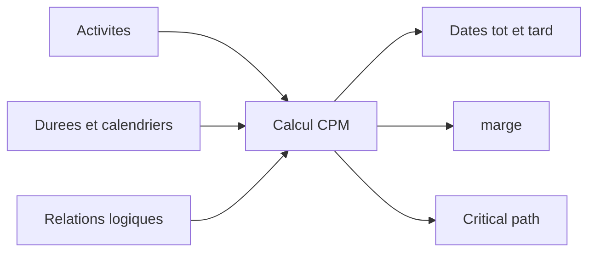

# CPM (Critical Path Method)

Le Critical Path Method, ou CPM, est la methode de calcul derriere tout planning projet serieux. Il transforme une liste d'activites en modele logique capable de repondre aux questions essentielles: quand le projet peut-il finir, quelles activites controlent cette date, et ou se trouve la flexibilite du planning?

Dans Primavera P6, le CPM est souvent cache derriere le bouton planning. Le logiciel calcule rapidement les dates, la marge et les activites critiques. Mais la methode reste importante. Si le planner ne comprend pas le CPM, le planning peut se calculer sans que le resultat represente vraiment le plan d'execution.

## Ce Que Fait le CPM

Le CPM calcule la duree du projet a partir d'un reseau d'activites, de durees, de calendriers et de relations.

L'idee centrale est simple: la duree du projet n'est pas la somme de toutes les activites. C'est la duree du plus long chemin connecte de travail dependant dans le reseau. Ce chemin est le chemin critique.

Si une activite sur ce chemin est retardee, la fin du projet est retardee, sauf si l'equipe recupere le temps sur ce meme chemin.

## Les Entrees Necessaires

Le CPM depend de la qualite du reseau du planning.

D'abord, le planning a besoin d'activites qui representent des parties claires du travail. Chaque activite doit avoir un scope defini, une duree raisonnable et un critere clair de fin.

Ensuite, chaque activite a besoin d'une duree. Dans la plupart des plannings P6, il s'agit d'une estimation deterministic basee sur la productivite, les ressources, les calendriers et les hypotheses d'execution.

Enfin, les activites ont besoin de logique. Les relations definissent ce qui doit arriver avant quoi, ce qui peut se derouler en parallele, et quelles conditions permettent a un successeur de commencer ou de finir.

Le CPM ne sait pas si la logique est bonne. Il calcule a partir de ce qu'il recoit. Si le reseau contient une logique manquante, des contraintes faibles, trop de lag ou des relations SS/FF incompletes, le resultat peut etre mathematiquement correct mais peu fiable en pratique.

## Forward Pass et Backward Pass

Le CPM calcule le planning en deux passages principaux.

Le forward pass avance depuis la date des données vers la fin du projet. Il calcule les dates les plus tot auxquelles chaque activite peut commencer et finir, selon la logique, les durees, les calendriers et les contraintes.

Ce sont Early Start et Early Finish.

Le backward pass part de la fin du projet vers le debut. Il calcule les dates les plus tard auxquelles chaque activite peut commencer et finir sans retarder la fin du projet ou la cible choisie.

Ce sont Late Start et Late Finish.

Avec ces dates tot et tard, P6 peut calculer la marge.

## marge

La marge est le temps pendant lequel une activite peut se deplacer avant d'affecter une cible definie du planning.

Total marge est souvent la valeur principale revue dans P6. Il montre de combien une activite peut etre retardee avant d'affecter la fin du projet ou le chemin controlant.

Free marge est plus local. Il montre de combien une activite peut etre retardee sans affecter l'early start de son successeur immediat.

La marge n'est pas du temps libre a consommer sans controle. C'est une flexibilite du planning. Quand la marge est consomme, le projet a moins de protection contre les retards futurs.

## Critical Path

Le chemin critique est le plus long chemin connecte d'activites dependantes qui controle la fin du projet. Dans beaucoup de plannings, les activites critiques sont identifiees par un total marge nul ou negatif, mais la meilleure revue consiste a comprendre le longest path et verifier s'il est logique.

Un bon chemin critique doit raconter une histoire d'execution credible. Il doit passer par les activites qui controlent vraiment la fin: releases d'ingenierie, approvisionnement, sequences de construction, essais, mise en service, handover ou autres vrais drivers.

Si le chemin critique passe par des milestones etranges, des contraintes inutiles, une logique manquante ou des activites qui ne controlent pas vraiment la fin, le planning peut envoyer un faux signal.

## Travail Near-Critical

L'equipe ne doit pas regarder seulement les activites avec zero marge.

Les activites quasi critique ont peu de marge et peuvent devenir critiques avec un retard modere. Le seuil depend de la taille et de la sensibilite du projet. Sur de grands projets, les activites avec moins de 10 ou 20 jours ouvrables de marge peuvent meriter un suivi proche.

Les chemins quasi critique comptent parce que le risque reste rarement sur une seule ligne. Pendant une construction dense, le mise en service ou un shutdown, plusieurs chemins peuvent etre proches de devenir critiques.

## CPM et Analyse de Risque

Le CPM donne une reponse deterministic: si chaque activite prend la duree prevue, voici la date de fin du projet.

analyse des risques du planning va plus loin. Il teste l'incertitude en appliquant des plages ou distributions probabilistes aux durees et en executant de nombreuses simulations. Cela aide a estimer la probabilite de finir a une date cible.

Mais l'analyse de risque depend du reseau CPM. Si la logique est faible, la sortie risque sera faible aussi. Monte Carlo ne corrige pas une logique manquante, des durees irrealisites ou une mauvaise structure.

## CPM Dans Primavera P6

P6 rend le calcul CPM rapide, mais cette rapidite peut cacher les hypotheses.

Quand le planning est calcule, P6 utilise la date des données, les calendriers, les durees, les relations, les contraintes, les données réelles, les durées restantes et les planning options. De petits changements dans ces parametres peuvent modifier la marge, le chemin critique et les dates prévision.

C'est pourquoi le planner ne doit pas simplement appuyer sur F9 et accepter le resultat. Il doit verifier ce que le calcul produit et challenger si cela correspond au plan reel d'execution.

## Bonnes Pratiques

Construisez le reseau CPM a partir d'une logique d'execution reelle. Evitez d'ajouter des relations seulement pour passer un controle ou produire une date voulue.

Revoyez le chemin critique apres chaque mise a jour. Confirmez qu'il commence et finit d'une maniere logique pour le statut actuel du projet.

Suivez l'evolution de la marge dans le temps. Un projet peut sembler conforme au plan pendant que la marge est consomme silencieusement.

Revoyez les chemins quasi critique. Ils montrent souvent ou apparaitra le prochain probleme de planning.

Gardez le planning suffisamment propre pour supporter le CPM. Open starts, open finishes, hard contraintes, lag excessif et relations incompletes reduisent la valeur du calcul.

## Conclusion

Le CPM est le moteur qui transforme un planning Primavera P6 en outil de contrôle de projet. Il calcule les dates tot, les dates tard, la marge et le chemin critique a partir du reseau d'activites.

Mais le CPM est aussi fiable que le planning qu'il calcule. Des activites bien definies, des durees realistes, des calendriers corrects et une logique solide rendent le resultat significatif.

La valeur du CPM n'est pas seulement de montrer une date finale. Sa vraie valeur est d'expliquer pourquoi cette date est controlee, ou se trouve la flexibilite et ou l'attention du gestion doit se concentrer.
## Contenu associé
- [Chemin critique ou chemin de marge commençant par une contrainte - Vue d’ensemble](../../08_metrics_fr/09_cp_or_float_path_starting_with_constraint/01_overview_template.md)
- [Relations SS et FF](../15_SS%20&%20FF%20RELATIONS/15_SS%20&%20FF%20RELATIONS.md)
- [Developper un Planning Projet](../17_DEVELOPE%20A%20PROJECT%20SCHEDULE/17_DEVELOPE%20A%20PROJECT%20SCHEDULE.md)
