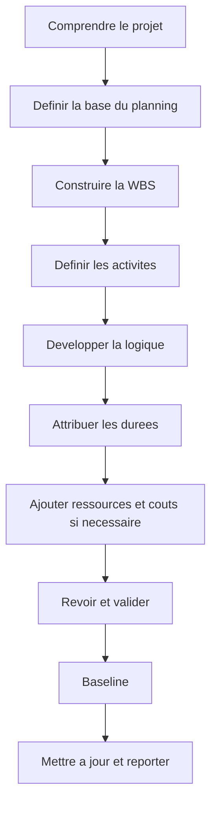

# Developper un Planning Projet

Developper un planning projet depuis zero ne consiste pas seulement a saisir des activites dans Primavera P6. C'est transformer le scope, la strategie d'execution, les contraintes, les ressources et les engagements du projet en modele temps qui peut etre revu, approuve, mis a jour et utilise pour decider.

Un bon planning est construit avant d'etre calcule. La qualite du fichier P6 depend de la reflexion faite avant la premiere activite.

## Flux de Developpement

## Comprendre le Projet D'abord

Ne commencez pas dans P6 avant de comprendre le projet.

Revoyez le contrat, le scope, les specifications, les milestones cles, la strategie d'execution, les contraintes de approvisionnement, les permis, les acces et les exigences de handover. Puis parlez avec project gestion, engineering, approvisionnement, construction, mise en service, subcontractors et suppliers si necessaire.

Le planning est un modele de la maniere dont l'equipe veut livrer le projet. Si le planner ne comprend pas cette intention, le planning sera base sur des hypotheses.

## Definir la Base du Planning

La scheduling basis explique comment le planning sera construit. Elle doit definir la WBS, les calendriers, le codage, le niveau de detail, les regles de relations, la politique de lag, les parametres P6, la convention date des données, les rapports et l'approche référence.

Ce document est important car il explique pourquoi le planning est construit ainsi. Il donne aussi une reference aux reviewers pour evaluer la qualite et comparer les mises a jour.

## Construire la WBS

La Work Breakdown Structure est le cadre d'organisation du planning. Elle doit refleter la facon dont le projet sera gere et reporte.

La WBS peut etre organisee par phase, zone, systeme, discipline, deliverable, lot contractuel ou combinaison. Elle doit soutenir le filtrage, la mesure du progres, les responsabilites et le reporting.

Si la WBS ne correspond pas a la maniere de controler le projet, le planning sera difficile a utiliser meme si les activites sont correctes.

## Definir les Activites

Les activites doivent representer des morceaux de travail clairs et mesurables. Chaque activite doit avoir un scope defini, une condition de debut, une condition de fin et un responsable.

Des activites trop larges sont difficiles a mettre a jour. Des activites trop petites rendent le planning lourd a maintenir. Le bon niveau de detail depend de la phase, du contrat, du reporting et du controle attendu.

Les noms d'activites comptent. Un bon nom doit indiquer quel travail est realise, ou il est realise et a quel objet, systeme ou livrable il se rattache.

## Developper la Logique

La logique est le coeur du planning CPM. Elle definit ce qui doit arriver avant quoi, ce qui peut se faire en parallele et quelle condition permet a chaque activite de commencer ou finir.

La logique doit etre developpee avec les personnes qui connaissent le travail. Dans P6, evitez de construire la sequence seul au bureau. Revoyez-la avec discipline leads, construction managers, mise en service, approvisionnement et subcontractors.

Utilisez FS lorsque cela represente bien le travail. Utilisez SS et FF avec prudence lorsque le chevauchement est reel. Evitez le negative lag et SF sauf raison claire et approuvee. Chaque activite doit normalement avoir predecessor et successor, sauf milestones valides de debut et fin.

## Attribuer les Durees

Les durees doivent etre realistes, pas aspirational. Elles doivent etre basees sur scope, productivite, ressources, calendriers, input vendors, subcontractors et experience comparable.

Une duree n'est pas seulement un nombre. Elle suppose une equipe, un taux de production, un calendrier, des conditions d'acces et une methode d'execution. Si ces hypotheses changent, la duree peut changer.

Documentez les hypotheses importantes de duree. Cela aide les revues, mises a jour, change gestion et delay analysis.

## Ajouter Ressources et Couts

Si le planning sera utilise pour resource planning, cost loading, earned value ou cash flow, ressources et couts doivent etre ajoutes avec soin.

Resource loading aide a voir la demande de main-d'oeuvre, equipement, materiaux et surcharges possibles. Cost loading relie le planning aux budgets, prévisions et courbes de paiement ou progres.

N'ajoutez pas des ressources seulement pour l'apparence. Si le projet depend de ces donnees, elles doivent etre maintenues lors des mises a jour.

## Revoir et Valider

Avant l'approbation référence, le planning doit etre revu techniquement et operationnellement.

Controlez open starts, open finishes, types de relations, lags, contraintes, longues durees, logique manquante, distribution de la marge et coherence du chemin critique. Les controles type DCMA sont utiles, mais demandent toujours du jugement projet.

Parcourez le planning avec l'equipe projet. Demandez si logique, durees, ressources et milestones correspondent au vrai plan d'execution. Un planning qui passe les metriques mais echoue devant l'equipe terrain n'est pas pret.

## Baseline du Planning

Une fois revu et approuve, le planning devient référence. La référence est la reference pour mesurer progres, ecarts, retards, recovery et performance.

La référence doit etre formelle. Sauvegardez la version approuvee, protegez-la des changements non controles et documentez les approvals. Les changements ulterieurs doivent suivre change control.

Une référence qui change chaque fois que le projet glisse n'est pas une référence. C'est une cible mobile.

## Etablir le Cycle de Mise a Jour

Le planning reste utile seulement s'il est mis a jour de maniere consistente.

Definissez qui fournit l'avancement, quand les donnees sont collectees, quelles preuves sont requises, comment les actual dates sont verifiees, comment les durées restantes sont revues et quels reports sont emis. Construction et mise en service actifs peuvent demander des updates hebdomadaires ou bihebdomadaires. Les phases initiales peuvent etre mensuelles.

Le cycle de mise a jour transforme la référence en outil vivant de controle.

## Conclusion

Developper un planning projet est un processus structure. Comprendre le projet, definir la base, construire la WBS, creer les activites, developper la logique, attribuer les durees, charger les ressources si besoin, valider, référencer et maintenir par updates.

Les meilleurs plannings ne viennent pas d'une ouverture rapide de P6. Ils viennent de la comprehension du travail, du challenge des hypotheses et d'un modele auquel l'equipe peut faire confiance.
## Contenu associé
- [Activités commençant à la date des données sans logique pilotante : pourquoi cette mesure de planification est importante - Vue d’ensemble](../../metrics/01_activities_starting_in_dd_with_no_logic_driving/02_guide_template.md)
- [CPM (Critical Path Method)](../16_CPM%20(CRITICAL%20PATH%20METHOD)/16_CPM%20(CRITICAL%20PATH%20METHOD).md)
- [codes d'activité](../18_ACTIVITY%20CODES/18_ACTIVITY%20CODES.md)
