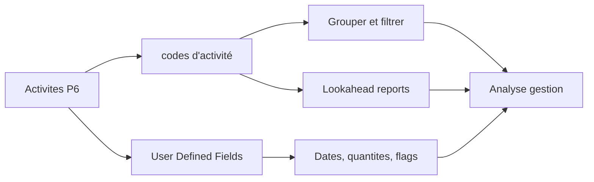

# codes d'activité

Les codes d'activité dans Primavera P6 sont l'un des principaux outils qui transforment un planning d'une liste d'activites en base de donnees utile pour le contrôle de projets. Ils permettent de grouper, filtrer, trier, reporter et analyser le planning selon differentes perspectives de gestion.

Un planning n'est pas seulement un bar chart. Dans P6, chaque activite est aussi un enregistrement qui peut porter des informations sur le responsable, la phase, la zone, le systeme, la discipline, le contrat, le type de milestone et d'autres attributs projet. Les codes d'activité organisent cette information de facon controlee.

## Ce Que Sont les codes d'activité

Les codes d'activité sont des champs structures de classification assignes aux activites. Chaque code type represente une dimension de reporting, et chaque code value represente une option dans cette dimension.

Par exemple:

- Code type: Area.
- Code values: Unit 1, Unit 2, Tank Farm, Utilities.

Ou:

- Code type: Discipline.
- Code values: Civil, Mechanical, Electrical, Instrumentation, Commissioning.

La WBS montre ou se trouve le travail dans la structure du projet. Les codes d'activité montrent comment ce travail peut etre vu pour le reporting et l'analyse.

## Ce Qu'ils Ne Sont Pas

Les codes d'activité ne remplacent pas la WBS. La WBS est la hierarchie du scope. Les codes sont des vues supplementaires des memes activites.

Les codes d'activité ne remplacent pas la logique. La logique definit la sequence de travail.

Les codes d'activité ne remplacent pas les ressources. Les ressources definissent la main-d'oeuvre, l'equipement, les materiaux et le cost loading.

Lorsque ces concepts sont melanges, le planning devient plus difficile a maintenir. Un planning P6 propre utilise WBS, logique, ressources, codes d'activité et UDFs pour des objectifs differents.

## Global et Project codes d'activité

P6 contient des Global codes d'activité et des Project codes d'activité.

Les Global codes d'activité sont partages entre projets. Ils sont utiles lorsque la meme classification doit etre utilisee dans un portfolio, comme des phases standard, des groupes de responsabilite corporate ou des categories de reporting programme.

Les Project codes d'activité appartiennent a un projet specifique. Ils sont utiles pour les besoins propres au projet, comme zones, systemes, contract packages, work fronts, turnover packages ou categories locales de reporting.

Utilisez les global codes avec prudence car les changements peuvent affecter d'autres projets. Utilisez les project codes pour les attributs qui n'ont de sens que dans un seul projet.

## Types Courants d'codes d'activité

Les code types utiles dependent du projet, mais les exemples courants incluent:

- Responsible Party.
- Discipline.
- Project Phase.
- Area or Location.
- System or Subsystem.
- Contract Package.
- Work Package.
- Milestone Type.
- Turnover Package.
- Reporting Level.

Les meilleurs code types viennent des besoins de reporting. Avant de creer des codes, demandez: quelles questions le planning doit-il repondre?

Exemples:

- Quel travail est prevu en Area A le mois prochain?
- Quelles activites appartiennent au contractor electrique?
- Quels systemes pilotent le mise en service?
- Quel contract package glisse?
- Quels milestones doivent etre reportes au client?

## User Defined Fields

Les User Defined Fields, ou UDFs, sont differents des codes d'activité. Les codes classent les activites en categories. Les UDFs stockent des donnees personnalisees comme dates, nombres, texte, couts, quantites ou indicateurs oui/non.

Utilisez les UDFs lorsque l'information n'est pas simplement une categorie.

Exemples:

- Contractual finish date.
- Forecast finish date.
- Risk flag.
- Quantity planned.
- Quantity installed.
- Change order number.
- Drawing reference.
- Inspection status.

Les codes d'activité sont meilleurs pour grouper et filtrer. Les UDFs sont meilleurs pour stocker l'information supplementaire que P6 ne fournit pas par defaut.

## Pourquoi Ils Comptent Pour le Reporting

Un bon codage rend les reports plus rapides et plus fiables.

Avec des codes d'activité coherents, le planificateur peut produire des lookaheads par discipline, des reports par zone, des resumes par contract package, des reports de systemes mise en service, des reports milestones et des dashboards sans reconstruire les filtres a chaque fois.

Sans codes, le reporting devient souvent manuel. L'equipe exporte les donnees, modifie des spreadsheets, ajoute des labels a la main et repete cela a chaque update. Cela cree des erreurs et consomme du temps.

Les codes font du planning une source de donnees reutilisable.

## Gouvernance

Les codes d'activité ont besoin de gouvernance. Si chacun cree des values librement, le planning devient vite incoherent.

Par exemple, une personne utilise "Electrical", une autre "Elec", une autre "E&I". Le report peut manquer des activites parce que la meme categorie est separee en plusieurs labels.

Definissez les code types et les valeurs valides avant la référence lorsque possible. Documentez ce que chaque code signifie, qui le maintient et s'il est obligatoire.

La completude du codage doit etre controlee comme tout autre indicateur de qualite du planning. Si beaucoup d'activites manquent de codes obligatoires, les reports bases sur ces codes ne sont pas fiables.

## Eviter la Sur-Ingenierie

Plus de codes ne signifie pas automatiquement meilleur controle.

Chaque code et UDF cree un travail de maintenance. Si un code n'est jamais utilise dans un report, filtre, dashboard ou analyse, il ne vaut peut-etre pas l'effort.

Commencez par les questions de reporting qui comptent. Construisez assez de structure pour y repondre, mais evitez de creer des champs seulement parce qu'ils pourraient servir un jour.

## Bonnes Pratiques

Concevez la structure de codage pendant le developpement du planning, pas apres la référence.

Alignez les codes avec le plan de reporting du projet. Si le projet reporte par zone, discipline, contrat et systeme, ces dimensions doivent exister dans P6.

Gardez les code values coherentes et controlees. Evitez les doublons et abbreviations peu claires.

Utilisez les UDFs pour dates, quantites, references et indicateurs personnalises. Ne forcez pas des donnees numeriques ou dates dans les codes d'activité.

Revoyez le codage a chaque update. Les nouvelles activites doivent recevoir les codes requis avant emission des reports.

## Conclusion

Les codes d'activité ne sont pas de simples labels administratifs. Ils permettent a un planning Primavera P6 de repondre rapidement et de facon coherente aux questions de gestion.

Bien utilises, les codes rendent le planning plus facile a filtrer, grouper, reporter et analyser. Les UDFs etendent cette capacite en stockant des informations projet specifiques que les champs standard P6 ne couvrent pas.

Le bar chart montre le temps. La structure de codes explique comment le planning peut etre lu, decoupe et utilise.
## Contenu associé
- [Dépendances manquantes dans Primavera P6 - Vue d’ensemble](../../metrics/21_missing_dependencies/02_guide_template.md)
- [Developper un Planning Projet](../17_DEVELOPE%20A%20PROJECT%20SCHEDULE/17_DEVELOPE%20A%20PROJECT%20SCHEDULE.md)
- [planning Basis](../19_SCHEDULE%20BASIS/19_SCHEDULE%20BASIS.md)
