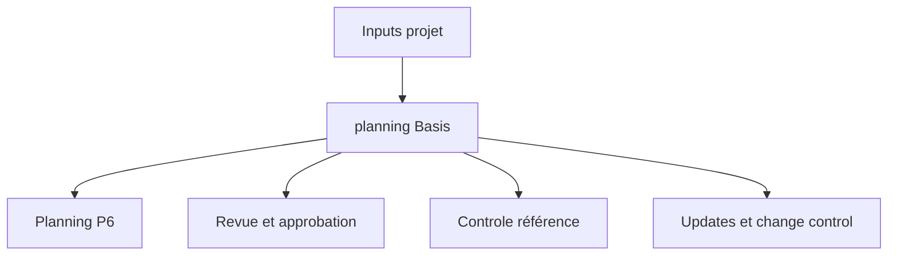

# planning Basis

La planning Basis, ou Basis of planning, est le document qui explique comment le planning a ete construit et quelles hypotheses le soutiennent. C'est le compagnon ecrit du fichier Primavera P6.

Le planning montre les dates, la logique, la marge, les milestones, les ressources et le chemin critique. La planning Basis explique pourquoi ces elements sont ainsi.

## A Quoi Elle Sert

La planning Basis soutient la revue, l'approbation, le controle référence, les updates, le change gestion et le delay analysis. Elle aide le reviewer a comprendre les regles, hypotheses, inputs et limites du planning.

Sans elle, le fichier P6 peut calculer correctement, mais l'equipe peut ne pas savoir quelles hypotheses ont ete utilisees ni si le planning convient aux decisions de gestion.

## Qui l'Ecrit et Pour Qui

Le planificateur ou planning engineer prepare generalement la planning Basis, avec l'input du project manager, engineering, approvisionnement, construction, mise en service, contrôle de projets, contracts et cost teams.

Elle s'adresse a l'equipe projet, au client, au PMO, aux reviewers, claims analysts et a toute personne qui doit comprendre comment le planning a ete construit.

## Pourquoi Elle Est Importante

Un planning contient beaucoup de decisions. Calendriers, durees, logique, equipes, milestones, cycles d'approbation, permits et resource limits affectent les dates et la marge.

La planning Basis rend ces decisions visibles. Elle reduit l'ambiguite, soutient l'audit et evite les discussions futures sur les hypotheses de référence.

## Ce Qu'elle Doit Inclure

Une Basis of planning complete doit inclure:

- Scope et exclusions.
- Objectif du planning et usage contractuel.
- Methodologie de developpement.
- WBS et structure d'activity codes.
- Calendriers, shifts, holidays, weather et periodes non travaillees.
- Hypotheses principales et contraintes.
- Milestones de start, completion, access, approvals et material delivery.
- Cycles d'approbation et permits.
- Hypotheses de handover et turnover.
- Regles de logique, relationship types et lag policy.
- Base des durees, productivity rates et norms.
- Equipes, resource availability, labor limits et equipment limits.
- Regles de couts si applicable.
- Explication du chemin critique et quasi critique path.
- Hypotheses de risque et incertitudes majeures.
- Cycle d'update, regles de status et reporting.

## Hypotheses

Les hypotheses doivent etre claires et verifiables. Elles peuvent inclure les dates d'access, engineering releases, vendor delivery, durees de permit approval, periodes de revue client, disponibilite des equipes, weather allowances et sequence de mise en service.

Si une hypothese affecte dates, marge, resources ou handover, elle doit etre dans la planning Basis.

## Calendriers et Periodes de Travail

Le document doit expliquer les principaux calendriers utilises dans P6. Inclure jours travailles, shifts, holidays, shutdowns saisonniers, calendriers meteo, travail de nuit, week-ends et periodes non travaillees.

Les calendriers affectent directement les dates et la marge. Si engineering, approvisionnement, construction, mise en service ou resources utilisent des calendriers differents, expliquez pourquoi.

## Equipes, Ressources et Limites

Les durees n'ont de sens que si les ressources supposees sont comprises. La planning Basis doit indiquer les hypotheses d'equipes, resource availability, labor limits, equipment limits et overtime ou strategie de shifts.

Si resource loading est inclus, expliquez s'il sert a manpower planning, cost loading, earned value ou resource leveling.

## Milestones, Approbations, Permits et Handover

Les milestones majeurs doivent etre listes et expliques: project start, contractual completion, access granted, client approvals, third-party interfaces, material delivery, permits, system handovers et final turnover.

Les cycles d'approbation et permits doivent montrer les durees supposees et les responsables. Si une action client ou third party drive le planning, elle doit etre visible.

## Methodologie, Productivite et Couts

La planning Basis doit expliquer comment le planning a ete developpe: sources, workshops, sequencing logic, duration estimating method, productivity rates, norms et validation process.

Si cost loading est inclus, indiquez les regles. Expliquez si les couts sont affectes par resource, expense, activity, WBS, contract package ou earned value method.

## Critical Path et Risque

La planning Basis doit resumer le chemin critique et expliquer pourquoi il est raisonnable. Elle doit aussi identifier quasi critique paths, risques majeurs, sensibilites planning et hypotheses qui peuvent changer pendant l'execution.

Cela aide l'equipe a comprendre non seulement la date finale, mais ce qui la controle.

## Bonnes Pratiques

Redigez la planning Basis avant l'approbation référence. Gardez-la alignee avec le fichier P6. Mettez-la a jour lorsque des changements approuves modifient hypotheses, calendriers, milestones, strategie ressources ou methodologie.

Ne faites pas un texte generique. Elle doit etre assez specifique pour qu'un autre planificateur comprenne comment le planning a ete construit.

## Conclusion

La planning Basis est l'explication derriere le planning. Elle dit ce que le planning suppose, comment il a ete construit, ce qu'il inclut, ce qu'il exclut et quelles conditions doivent rester vraies pour que les dates restent valides.

Une bonne Basis of planning rend le fichier P6 plus facile a revoir, defendre, mettre a jour et croire.
## Contenu associé
- [Activités commençant à la date des données sans logique pilotante : pourquoi cette mesure de planification est importante - Vue d’ensemble](../../metrics/01_activities_starting_in_dd_with_no_logic_driving/02_guide_template.md)
- [codes d'activité](../18_ACTIVITY%20CODES/18_ACTIVITY%20CODES.md)
