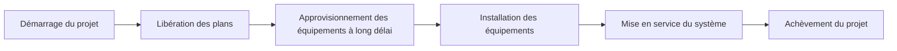

Le chemin critique (critical path) est la séquence la plus longue d'activités dépendantes dans un planning. Il détermine la durée minimale possible du projet et définit directement la date de fin du projet.

En pratique, le chemin critique est la chaîne de tâches qui ne peut pas être retardée sans affecter l'échéance finale. Si une activité du chemin critique glisse et que rien d'autre ne change, la date d'achèvement du projet glissera également.

C'est pourquoi le chemin critique est l'un des résultats les plus importants d'un planning Primavera P6. Ce n'est pas simplement un filtre, une couleur ou un rapport. C'est l'explication fournie par le planning sur ce qui pilote l'achèvement.

## Ce que signifie le chemin critique

Un planning contient de nombreuses activités, mais toutes n'ont pas le même impact sur la date de fin. Certaines activités disposent d'une marge. Elles peuvent se décaler légèrement avant d'affecter l'activité suivante ou la date de fin du projet. Les activités critiques ne bénéficient pas de cette flexibilité, ou elles en disposent le moins selon la méthode et les paramètres du planning.

Le chemin critique montre la durée minimale nécessaire pour achever le projet en tenant compte de la logique, des durées, des calendriers, des contraintes et de l'état d'avancement actuels.

Si c'est là la chaîne pilote, un retard à l'approvisionnement peut retarder l'installation. Un retard à l'installation peut retarder la mise en service. Un retard à la mise en service peut retarder l'achèvement du projet. Le chemin critique aide l'équipe à percevoir cette connexion.

## C'est la chaîne que l'on ne peut pas retarder

Le chemin critique n'est pas simplement le travail qui semble important. C'est la séquence dépendante de travaux qui définit la date de fin.

Cette distinction est importante. Une activité à forte valeur peut ne pas être critique si elle dispose d'une marge. Un jalon client visible peut ne pas être critique si un autre chemin pilote l'achèvement. Une petite activité technique peut être critique si elle se trouve dans le seul chemin menant à la réception finale.

Pour les équipes de contrôle de projet, cela fait du chemin critique un outil de décision. Il aide à répondre aux questions suivantes :

- Qu'est-ce qui pilote la date de fin du projet ?
- Quelles activités nécessitent le plus d'attention sur le planning ?
- Où un retard affecterait-il immédiatement l'achèvement ?
- Quelles actions de rattrapage pourraient protéger la date de fin ?
- Le chemin affiché est-il cohérent ?

La dernière question est celle que les planificateurs ne doivent jamais négliger.

## Ne pas accepter le filtre critique aveuglément

Primavera P6 peut identifier les activités critiques, mais le logiciel ne comprend pas l'intention du projet. Il calcule en fonction des données fournies : logique, calendriers, contraintes, durées, avancement et options de calcul.

Si les données sont de faible qualité, le chemin critique peut sembler étrange.

Des activités ou des jalons peuvent apparaître dans le filtre critique alors qu'ils ne pilotent pas réellement le projet. Cela peut se produire en raison d'une logique manquante, de contraintes rigides, de dates obsolètes, d'extrémités ouvertes, de calendriers inhabituels, d'une marge négative, d'un avancement incorrect ou de paramètres de logique conservée (retained logic).

Le planificateur doit exercer son jugement professionnel. Le chemin critique doit être remis en question. Il doit sembler raisonnable. Il doit raconter une histoire que l'équipe projet reconnaît.

Si le chemin indique que l'achèvement final est piloté par un jalon administratif sans travaux aval réels, il faut le remettre en question. Si le chemin commence par un jalon qui ne contrôle pas réellement l'exécution, il faut le remettre en question. Si le chemin saute d'une zone WBS à une autre sans interface claire, il faut le remettre en question.

Le chemin critique n'est aussi bon que le modèle de planning qui le sous-tend.

## Plannings de référence et chemin critique

Dans un planning qui n'a jamais été mis à jour, comme un premier planning de référence (baseline), le chemin critique commence souvent par le jalon de démarrage du projet et se termine par le jalon d'achèvement du projet.

C'est courant, mais ce n'est pas une règle absolue.

Certains projets ont un chemin critique qui commence à un jalon intermédiaire clé. Par exemple, la construction peut ne pas pouvoir démarrer tant qu'un maître d'ouvrage ne remet pas une zone, qu'un permis n'est pas accordé ou qu'un dossier de conception n'atteint pas le statut approuvé. Dans ce cas, le jalon de remise ou de levée peut déclencher le démarrage du chemin pilote.

La même logique s'applique vers la fin du projet. Le chemin critique peut se terminer à l'achèvement final, mais il peut aussi piloter un jalon contractuel intermédiaire, une étape de réception, un basculement système ou une date d'accès client qui est actuellement plus contraignante.

L'essentiel n'est pas de savoir si le chemin commence et se termine à l'endroit le plus traditionnel. L'essentiel est que le chemin soit logique, complet et défendable.

## Plannings en cours d'exécution

Une fois qu'un planning est en cours d'exécution, le chemin critique change de forme. Les travaux achevés ne doivent plus piloter l'achèvement futur. Le chemin doit partir de la frontière du statut actuel.

Dans un planning mis à jour, le chemin critique commence souvent par une activité en cours, une activité non démarrée prête à commencer, ou un jalon valide qui contrôle l'accès aux travaux futurs. Il peut également partir d'un jalon d'interface ou de remise de projet lorsque cet événement pilote réellement les prochains travaux critiques.

C'est là que la Date de Référence (Data Date) est importante. La Date de Référence sépare la performance réelle du travail prévisionnel. Un chemin critique après la Date de Référence doit expliquer comment les travaux restants mènent à l'achèvement.

Si le chemin commence par une activité sans logique pilote, un démarrage à la Date de Référence inexpliqué, ou un jalon douteux, le réviseur doit enquêter. Le planning peut afficher un chemin calculé, mais pas nécessairement un chemin crédible.

## Faire attention aux jalons

Les jalons sont utiles parce qu'ils marquent des points clés : ordre de démarrage, remise de zone, approbation de conception, achèvement mécanique, basculement système, achèvement substantiel et achèvement final.

Mais les jalons peuvent aussi induire en erreur lors d'une révision du chemin critique.

Un jalon peut apparaître comme critique parce qu'il est soumis à une contrainte. Il peut apparaître comme critique parce qu'il n'a pas de durée et se situe à une limite de date. Il peut apparaître comme critique parce que la logique qui l'entoure est manquante. Cela ne signifie pas automatiquement que le jalon fait véritablement partie de la chaîne d'exécution pilote.

Soyez particulièrement vigilant lorsque le chemin critique commence par un jalon. Posez-vous les questions suivantes :

- Ce jalon représente-t-il un événement pilote réel ?
- Quelle activité ou condition extérieure pilote le jalon ?
- Quels travaux le jalon libère-t-il ?
- Le jalon est-il soumis à une contrainte plutôt que piloté par la logique ?
- Le chemin resterait-il critique si la logique du jalon était corrigée ?

Si le jalon ne contrôle pas les travaux, il ne devrait pas pouvoir définir l'histoire du chemin critique.

## La logique conservée peut changer l'histoire

La logique conservée (retained logic) est un paramètre de Primavera P6 utilisé pour gérer l'avancement hors séquence. Elle peut être appropriée, mais elle peut aussi affecter le chemin critique d'une manière que les réviseurs doivent comprendre.

Lorsque la logique conservée est utilisée, P6 peut préserver la logique prédécesseur même lorsque le travail successeur a déjà commencé hors séquence. Cela peut amener les travaux restants à être retenus ou séquencés d'une façon qui modifie le chemin critique calculé.

Le problème n'est pas que la logique conservée est toujours incorrecte. Le problème est que le planificateur doit comprendre si elle produit une prévision réaliste.

Si la logique conservée fait passer le chemin critique par des relations qui ne reflètent plus la façon dont les travaux sont exécutés, l'équipe doit réviser le statut, la logique et les options de calcul. Le chemin doit refléter un plan résiduel défendable, et non pas seulement un calcul mécanique.

## Comment réviser le chemin critique

Une bonne révision du chemin critique doit combiner les résultats P6 avec le jugement du planificateur.

Commencez par générer le rapport du chemin le plus long ou du chemin critique. Passez ensuite en revue le chemin activité par activité. Examinez les prédécesseurs, les successeurs, les types de relations, les décalages (lags), les contraintes, les calendriers, les dates réelles, la durée restante et la marge totale.

Demandez-vous si le chemin est cohérent :

- Le chemin suit-il une séquence d'exécution crédible ?
- Commence-t-il à partir d'un pilote actuel valide ?
- Se termine-t-il au bon jalon d'achèvement ou de contrôle ?
- Des contraintes forcent-elles le chemin ?
- Des relations manquantes cachent-elles le vrai pilote ?
- La logique conservée affecte-t-elle le chemin de façon trompeuse ?
- L'équipe projet reconnaît-elle cela comme les travaux pilotes ?

Si la réponse est non, le planning doit être révisé avant que le chemin critique puisse être utilisé en toute confiance.

## Conclusion

Le chemin critique est la séquence de tâches dépendantes qui définit la date de fin du projet. Il montre la durée minimale nécessaire pour achever le projet et identifie les travaux qui ne peuvent pas glisser sans affecter l'échéance.

Mais le chemin critique n'est pas quelque chose à accepter aveuglément. P6 calcule ce que les données lui disent de calculer. Le planificateur doit vérifier si le résultat est raisonnable, logique et aligné avec le plan d'exécution réel.

Dans un planning solide, le chemin critique raconte une histoire claire. Il part d'un pilote actuel valide, suit de vraies dépendances, évite les contraintes trompeuses, traite correctement l'avancement et mène au bon jalon d'achèvement.

Lorsque cette histoire est cohérente, le chemin critique devient l'un des outils les plus puissants du contrôle de projet. Lorsqu'il ne l'est pas, c'est un avertissement que le planning a besoin d'une révision plus approfondie avant que la prévision puisse être considérée comme fiable.
