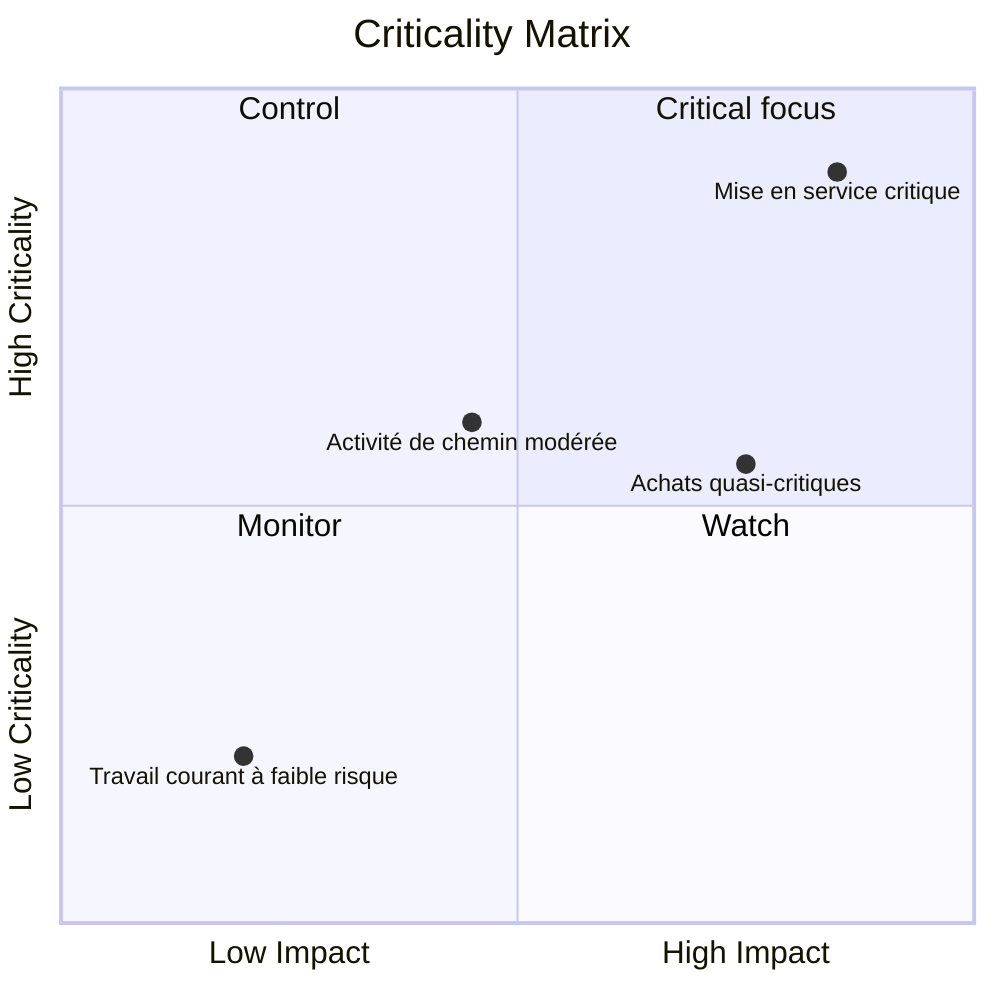

Une matrice de criticité est une méthode visuelle ou analytique utilisée pour classer et hiérarchiser les activités d'un projet en fonction de leur importance pour l'achèvement du projet. Dans un contexte Primavera P6, il aide les chefs de projet, les planificateurs et les réviseurs du PMO à identifier les activités qui créent le plus grand risque de calendrier.

Le chemin critique raconte l’histoire déterministe actuelle du calendrier. Une matrice de criticité va encore plus loin. Cela aide l’équipe à comprendre quelles activités sont déjà critiques, lesquelles sont sur le point de le devenir et lesquelles pourraient avoir de graves conséquences si elles échouent.

Cela est important car l’activité qui est critique aujourd’hui n’est pas toujours la seule qui mérite une attention particulière. Une activité quasi critique avec un impact de retard important pourrait devenir le problème de demain. Une activité d’approvisionnement de longue durée n’est peut-être pas sur le chemin critique actuel, mais elle peut comporter suffisamment de risques pour justifier un contrôle étroit.

## Ce que signifie la criticité dans P6

Dans Primavera P6, la criticité fait généralement référence à la question de savoir si une activité peut affecter la date de fin du projet si elle est retardée. Traditionnellement, P6 identifie les activités critiques à l’aide des paramètres de marge totale ou de chemin le plus long.

La définition déterministe courante est simple :

- Les activités critiques sont des activités avec une marge nulle ou négative.
- Ces activités se situent sur le chemin critique ou y sont étroitement liées.
- S'ils sont retardés, la date de fin du projet sera probablement retardée.

Cette définition est utile, mais elle n’est pas complète. Il est basé sur une condition de planification calculée. Cela n’explique pas entièrement l’incertitude, la probabilité ou l’ampleur de l’impact en cas de dérapage d’une activité.

Une matrice de criticité élargit la discussion de « cette activité est-elle critique aujourd'hui ? » à « quelle est la probabilité que cette activité devienne critique et quels dégâts pourrait-elle causer ? »

## Ce que combine une matrice de criticité

Une matrice de criticité combine normalement deux dimensions.

La première dimension est la sensibilité ou la probabilité du calendrier. Cela peut être mesuré par la fréquence à laquelle une activité devient critique au cours de la simulation Monte Carlo, ou par sa proximité avec la critique sur la base du flottement total ou des seuils quasi critiques.

La deuxième dimension est l’impact. Cela signifie la gravité du retard si l’activité glisse. L'impact peut être basé sur la durée de l'activité, l'effet de retard sur la fin du projet, l'indice de sensibilité, l'exposition aux coûts, l'impact des étapes contractuelles ou le jugement de la direction.

Ensemble, ces dimensions aident l'équipe à prioriser les activités.

Ce type de vue est utile car il sépare les activités qui apparaissent simplement dans le filtre critique des activités qui méritent une attention active de la part de la direction.

## Une structure matricielle simple

Une matrice de criticité de base peut être présentée sous forme de grille :

| Criticité / Impact | Faible impact | Impact moyen | Fort impact |
| --- | --- | --- | --- |
| Faible criticité | Moniteur | Moniteur | Montre |
| Criticité moyenne | Revoir | Contrôle | Haute priorité |
| Haute criticité | Contrôle | Haute priorité | Concentration critique |

Les étiquettes exactes peuvent changer selon l'organisation, mais l'idée reste la même. Les activités à faible criticité et à faible impact peuvent être surveillées. Les activités à haute criticité et à fort impact nécessitent un contrôle ciblé.

## Données P6 utilisées dans la matrice

Primavera P6 ne fournit généralement pas de vue matricielle de criticité intégrée par défaut. La matrice est généralement construite à l'aide de données d'activité P6 combinées à une analyse externe.

Les champs P6 utiles incluent :

- Flotteur total.
- Flotteur gratuit.
- Durée de l'activité.
- Durée restante.
- Statut d'activité.
- Dates de début et de fin.
- Contraintes.
- Logique relationnelle.
- Calendrier.
- WBS ou codes activité.
- Indicateurs de chemin critique ou le plus long.

Ces données donnent la vue du calendrier déterministe. Il montre le chemin calculé actuel, le travail quasi critique, les activités contraintes et les activités avec une exposition restante longue.

## Contributions à l'analyse des risques

Pour rendre la matrice plus puissante, l'équipe peut ajouter des données probabilistes sur les risques de calendrier issues de l'analyse de Monte Carlo. Cela peut provenir d’outils tels que Primavera Risk Analysis ou d’autres plateformes de simulation de risques.

Les mesures de risque importantes incluent l’indice de criticité, le flottement total, l’indice de sensibilité du calendrier et la durée ou la valeur d’impact.

L'indice de criticité, souvent appelé CI, montre le pourcentage de simulations où une activité apparaît sur le chemin critique. Par exemple, si une activité a un IC = 80 %, elle était critique dans 80 % des scénarios simulés.

Total Float indique à quel point une activité est sur le point d'affecter la fin du projet dans le calendrier déterministe. Un flottement proche de zéro est un signe d’avertissement.

L’indice de sensibilité du calendrier combine criticité et impact. Cela permet de montrer non seulement si l’activité devient critique, mais aussi si elle affecte de manière significative le résultat.

La durée ou la valeur de l’impact permet d’estimer la gravité. Une activité plus longue, un package d'approvisionnement à haut risque ou une tâche liée à une étape contractuelle peuvent avoir plus d'impact si elles sont retardées.

## Exemple

Considérez l’ensemble d’activités simplifié suivant :

| Activité | Flotter | Indice de criticité | Durée | Résultat de la matrice |
| --- | ---: | ---: | ---: | --- |
| UN | 0 jours | 95% | 20 jours | Concentration critique |
| B | 5 jours | 60% | 15 jours | Haute priorité |
| C | 20 jours | 15% | 10 jours | Moniteur |

L’activité A appartient à la zone de criticité élevée et d’impact élevé. Il n'a pas de flotteur, semble critique dans la plupart des simulations et a une longue durée. Cela mérite un contrôle ciblé.

L’activité B n’est peut-être pas aussi urgente que l’activité A, mais elle mérite néanmoins qu’on s’y intéresse. Son flottement est limité et sa probabilité de devenir critique est significative.

L'activité C a plus de flottement et une moindre criticité. Il ne faut pas l’ignorer, mais cela ne nécessite pas le même niveau de concentration en matière de gestion.

## Pourquoi c'est utile

Une matrice de criticité aide l'équipe de projet à éviter de s'appuyer uniquement sur un seul chemin critique déterministe. Le chemin déterministe est important, mais ce n’est qu’une vue parmi d’autres du calendrier.

La matrice aide les équipes :

- Donnez la priorité à ce qu’il faut surveiller de près.
- Concentrez l’atténuation sur les principales activités à risque.
- Identifiez les activités quasi critiques avant qu’elles ne le deviennent.
- Comprendre le risque de calendrier probabiliste.
- Comparez la probabilité et l’impact dans une seule vue.
- Communiquez plus clairement les risques liés au calendrier à la direction.

Pour les rapports PMO, cela est particulièrement utile car cela traduit la complexité du calendrier en un cadre de décision. Au lieu de présenter des centaines d'activités, l'équipe peut montrer quelles activités se trouvent dans les zones « critique », « hautement prioritaire », « contrôle » ou « surveillance ».

## Un moyen simple d'en créer un

Commencez par exporter les données d’activité depuis P6. Incluez l'ID d'activité, le nom de l'activité, le WBS, la marge totale, la durée restante, le début, la fin, le calendrier, les contraintes et les indicateurs de chemin critique ou le plus long.

Ajoutez ensuite des champs d'analyse des risques facultatifs, tels que l'indice de criticité et l'indice de sensibilité du calendrier. Si les données de simulation ne sont pas disponibles, utilisez des seuils pratiques basés sur le flottant et la durée. Par exemple, une criticité élevée peut signifier un flottant total inférieur ou égal à 0 jour, ou un IC supérieur à 70 %. Une criticité moyenne peut signifier un flottement quasi critique ou un IC compris entre 40 % et 70 %.

Définir des seuils d’impact. Une activité à fort impact peut être de longue durée, liée à une étape contractuelle, faire partie d'un ensemble à haut risque ou être démontrée par simulation comme affectant la fin du projet.

Enfin, tracez les activités dans Excel, Power BI ou un autre outil de reporting. Le résultat n’a pas besoin d’être compliqué. La valeur vient du fait de rendre visible la priorité.

## Faites preuve de jugement

Une matrice de criticité est un outil d’aide à la décision et non une réponse automatique. Les seuils doivent être examinés par l'équipe de contrôle du projet et ajustés en fonction du type de projet, de la sensibilité du contrat et de l'échéance du calendrier.

N'oubliez pas non plus que la matrice dépend de la qualité du planning. Si le calendrier P6 présente une logique manquante, des durées irréalistes, des contraintes strictes, des calendriers médiocres ou des mises à jour de statut faibles, la matrice héritera de ces faiblesses.

La meilleure utilisation de la matrice consiste à combiner les résultats analytiques avec le jugement professionnel en matière de planification.

## Conclusion

Une matrice de criticité classe les activités du projet en fonction de leur probabilité de devenir critiques et de l'impact qu'elles auraient si elles étaient retardées. Il utilise des données P6 telles que le flottant total, la durée, les contraintes et la logique, et peut être renforcé avec des résultats de Monte Carlo tels que l'indice de criticité et l'indice de sensibilité du calendrier.

Pour les chefs de projet et les réviseurs du PMO, la matrice transforme le risque lié au calendrier en une conversation de gestion plus claire. Cela aide l'équipe à se concentrer sur les activités qui comptent le plus, et pas seulement sur celles qui apparaissent dans le filtre critique d'aujourd'hui.

Bien utilisée, une matrice de criticité aide l’équipe de projet à passer d’un reporting réactif à un contrôle proactif du calendrier.
