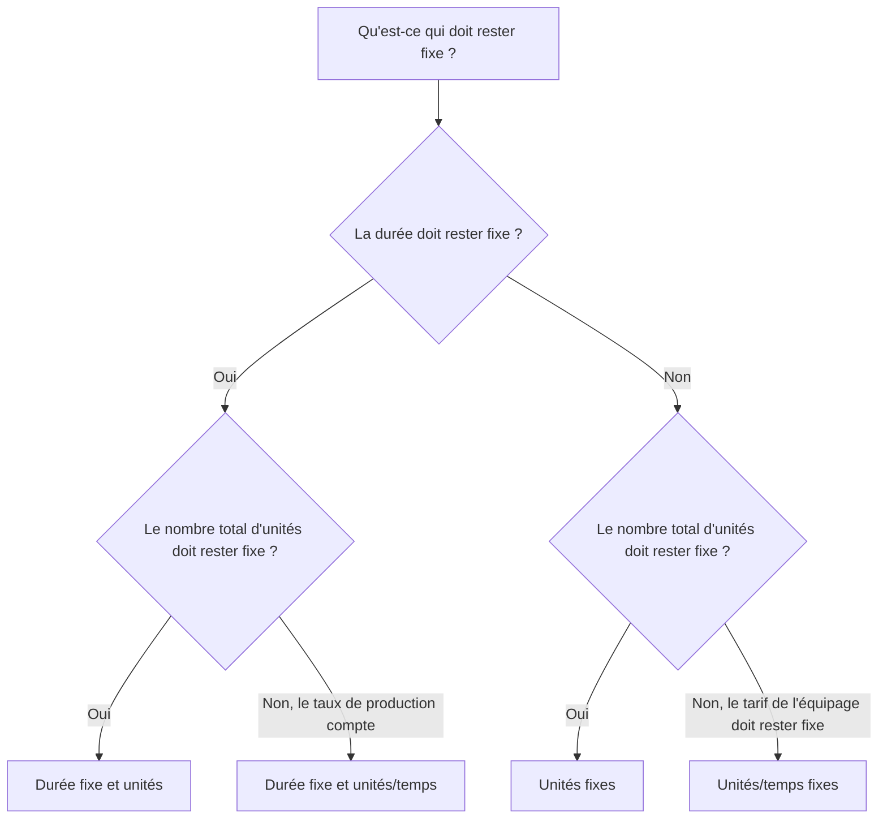

Le type de durée est l'un des champs de Primavera P6 qui contrôle le comportement d'une activité lorsque la durée, les unités et la productivité des ressources changent. Il est facile de l'ignorer, mais cela peut affecter les dates de planification, le chargement des ressources, les prévisions de coûts, la valeur acquise et le comportement des mises à jour.

De nombreux planificateurs considèrent la durée uniquement en nombre de jours. Dans P6, la durée est plus qu'un nombre. Une activité peut également avoir des unités de main-d'œuvre, des unités hors main-d'œuvre, des unités par temps, des calendriers de ressources, des calendriers d'activités et du travail restant. Le type de durée indique à P6 ce qui doit rester fixe lorsque le planning est recalculé ou lorsque le planificateur modifie les ressources et les durées.

Ce blog explique les principaux types de durée disponibles pour les activités dans P6, en quoi ils diffèrent, à quoi sert chacun d'eux et quand en utiliser un plutôt qu'un autre.

## Le type de durée n'est pas le même que le champ de durée

Avant d’examiner les types, il est utile de séparer deux idées.

Les champs de durée sont des valeurs telles que la durée initiale, la durée restante, la durée réelle et la durée à la fin. Ceux-ci décrivent le temps.

Le type de durée est un paramètre de calcul. Il indique à P6 comment équilibrer la durée, le nombre total d'unités et les unités par heure lorsque quelque chose change.

Par exemple, si vous ajoutez plus de ressources à une activité, l’activité doit-elle se terminer plus tôt ? Ou la durée doit-elle rester la même et l’effort total augmenter ? La réponse dépend du type de durée.

## Les principaux types de durée

Les types de durée P6 courants sont :

- Durée et unités fixes.
- Durée et unités/temps fixes.
- Unités fixes.
- Unités/temps fixes.

Les noms peuvent sembler techniques au premier abord, mais chacun répond à une question pratique : quelle partie de l’activité P6 doit-il protéger en cas de changement ?

## Durée fixe et unités

La durée et les unités fixes maintiennent la durée de l'activité et le nombre total d'unités fixes. Si les unités par temps changent, P6 ajuste le taux plutôt que de modifier la durée ou l'effort total.

Ce type est utile lorsque la fenêtre temporelle planifiée et l'effort total doivent rester stables.

Exemple:

Une activité est prévue sur 10 jours avec 400 heures de travail. L'équipe de planification souhaite que la durée reste de 10 jours et que l'effort total budgétisé reste de 400 heures. Si les détails de l'affectation des ressources changent, la durée planifiée et le nombre total d'unités ne doivent pas automatiquement changer.

Utilisez une durée et des unités fixes lorsque :

- L'activité a une fenêtre de travail fixe.
- L'effort total est déjà convenu.
- Les changements de taux de ressources ne devraient pas automatiquement modifier la durée de l’activité.
- Le calendrier est utilisé pour un contrôle stable des coûts ou de la valeur acquise.

Ceci est souvent utile pour les lots de travaux gérés où la durée du planning et l'effort budgétisé sont contrôlés.

## Durée fixe et unités/temps

La durée fixe et les unités/temps maintiennent la durée et le taux de ressources fixes. Si des ressources sont ajoutées ou supprimées, P6 peut ajuster le total des unités.

Ce type est utile lorsque l'activité doit se produire pendant une fenêtre de temps fixe et que le taux de chargement des ressources doit rester cohérent.

Exemple:

Une activité d'accompagnement à maîtrise d'ouvrage dure 20 jours. L'équipe affecte un ingénieur de projet à 8 heures par jour. La durée devrait rester de 20 jours et le tarif journalier devrait rester de 8 heures par jour. Le nombre total d'unités résulte de la fenêtre de temps et du taux.

Utilisez la durée et les unités/heure fixes lorsque :

- La durée de l'activité est fixe.
- Le taux de ressource journalier ou horaire est important.
- Le total des unités doit être calculé à partir de la durée et du taux.
- L'activité représente un soutien continu ou une période de travail fixe.

Cela peut être utile pour la supervision, la gestion, le support d’inspection ou les activités de support basées sur le temps.

## Unités fixes

Unités fixes maintient le nombre total d'unités fixes. Si le taux de ressource change, P6 peut ajuster la durée.

Ce type est utile lorsque la quantité de travail est fixe, mais que la durée dépend de la productivité ou de la disponibilité des ressources.

Exemple:

Une activité nécessite 800 heures de travail. Si l'équipe attribue plus de capacité d'équipage, l'activité peut se terminer plus tôt. Si la capacité de l’équipage est inférieure, l’activité peut prendre plus de temps. Le travail total reste 800 heures.

Utilisez des unités fixes lorsque :

- La quantité de travail ou d'effort total est fixe.
- La durée doit répondre à la disponibilité des ressources ou à la productivité.
- La taille de l'équipage peut modifier le temps nécessaire pour réaliser l'activité.
- La planification des ressources est active et maintenue.

Cela peut être utile pour les travaux de production où l'effort total est connu et la durée est censée répondre à la charge de l'équipe.

## Unités/temps fixes

Les unités/temps fixes maintiennent le taux de ressources fixe. Si la durée change, le total des unités change avec elle.

Ce type est utile lorsqu'une équipe ou une ressource travaille à un tarif fixe aussi longtemps que dure l'activité.

Exemple:

Une activité de supervision de chantier utilise un superviseur à raison de 8 heures par jour. Si la durée de l'activité passe de 10 jours à 15 jours, le nombre total d'unités devrait augmenter car le superviseur est nécessaire pendant plus de jours. Le tarif journalier reste fixe.

Utilisez des unités/temps fixes lorsque :

- Le tarif de l'équipage ou des ressources est fixe.
- Le total des unités devrait augmenter ou diminuer lorsque la durée change.
- L’activité représente un effort basé sur le temps.
- La ressource est affectée pour toute la durée de l'activité.

Ceci est souvent utile pour les activités de support, de supervision, d’inspection et de gestion où le temps détermine l’effort total.

## Comment choisir le bon type de durée

Le meilleur type de durée dépend de ce que représente l'activité et de la manière dont l'équipe de contrôle du projet s'attend à ce que P6 calcule les changements.

Une façon simple de choisir est de demander :

- La durée est-elle fixée par plan, contrat, fenêtre ou accès ?
- L’effort total est-il fixé par quantité, budget ou estimation ?
- Le taux de ressources est-il fixé par le plan d'équipage ou le plan de dotation en personnel ?
- L’ajout de ressources devrait-il raccourcir l’activité ?
- L’extension de l’activité doit-elle augmenter le total d’unités ?

Si la durée et le nombre total d'unités doivent rester fixes, utilisez Durée et unités fixes.

Si la durée et le taux de production doivent rester fixes, utilisez Durée fixe et unités/temps.

Si le travail total doit rester fixe et que la durée doit répondre à la charge des ressources, utilisez des unités fixes.

Si le taux de ressource doit rester fixe et que les unités doivent changer avec la durée, utilisez Unités/Temps fixes.

## Exemples pratiques

Pour une coulée de béton planifiée comme une opération fixe d'une journée avec une équipe et un budget de coûts définis, la durée et les unités fixes peuvent être appropriées.

Pour le soutien à la gestion de projet attribué à un taux quotidien stable sur une période de rapport fixe, la durée et les unités/temps fixes ou les unités/temps fixes peuvent être appropriés selon que le nombre total d'unités ou les changements de durée doivent déterminer les prévisions.

Pour une activité d'installation avec une quantité totale de travail connue et où la taille de l'équipe affecte le temps de réalisation, les unités fixes peuvent être appropriées.

Pour la surveillance du chantier qui se poursuit aussi longtemps que la période de construction s'étend, des unités/durée fixes peuvent être appropriées.

Le point important est que le choix doit refléter la méthode de contrôle du projet et non l’habitude.

## Erreurs courantes

Une erreur courante consiste à laisser le type de durée par défaut pour chaque activité sans vérifier s'il correspond à l'objectif de l'activité.

Une autre erreur consiste à utiliser un comportement de durée basé sur les ressources lorsque le projet ne gère pas soigneusement les affectations de ressources. Si les données sur les ressources sont faibles, le calcul basé sur les ressources peut produire des résultats peu fiables.

Une troisième erreur consiste à modifier les durées lors des mises à jour sans comprendre comment P6 va recalculer les unités ou les tarifs. Cela peut affecter le chargement des coûts, la valeur acquise et les histogrammes des ressources.

Enfin, évitez de traiter le type de durée comme un paramètre purement technique. Cela affecte le comportement du calendrier lorsque le plan change.

## Type de durée et qualité du calendrier

Le type de durée fait partie de la qualité du planning car il affecte la crédibilité de la prévision. Si la durée, les unités et le taux de ressources d'une activité ne se comportent pas comme prévu, le calendrier peut afficher des dates ou une demande de ressources trompeuses.

Pour les révisions PMO, il est utile de vérifier si les types de durée sont cohérents entre des groupes d'activités similaires. Les activités d’ingénierie, les activités d’approvisionnement, les activités de construction, les activités LOE et les activités de support peuvent nécessiter des règles différentes, mais les choix doivent être intentionnels.

Si le planning est chargé en ressources, le type de durée devient encore plus important. Cela permet de déterminer si les modifications des ressources affectent la durée, le nombre total d'unités ou les unités par heure.

## Conclusion

Les types de durée dans P6 définissent la façon dont les activités réagissent lorsque la durée, les unités totales et les taux de ressources changent. Ce ne sont pas seulement des paramètres d’arrière-plan.

La durée et les unités fixes protègent à la fois le temps et l'effort total. La durée fixe et les unités/temps protègent le temps et le tarif. Les unités fixes protègent l'effort total. Les unités/temps fixes protègent le taux de ressources.

Choisir le bon type de durée permet au calendrier de calculer d'une manière qui correspond au plan du projet. Cela facilite également la compréhension et la défense du chargement des ressources, des mises à jour des progrès, des prévisions de coûts et des rapports de calendrier.
