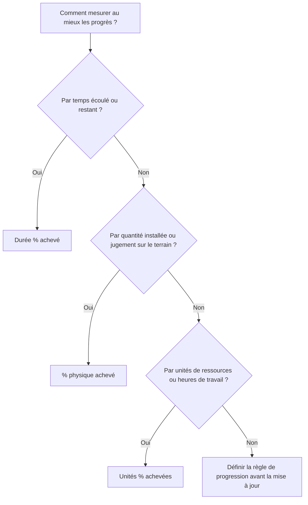

Le pourcentage d'avancement est l'un des champs de progression les plus visibles de Primavera P6, mais c'est aussi l'un des plus mal compris. Une valeur de 50 % d'achèvement peut signifier différentes choses selon la façon dont l'activité est configurée et la façon dont le projet mesure l'avancement.

Dans P6, le type de pourcentage achevé contrôle la manière dont le % achevé de l'activité est calculé ou mis à jour. Il indique à P6 si les progrès doivent être basés sur le temps, les performances physiques ou les unités de ressources.

Les principaux types de pourcentage d’achèvement pour les activités sont :

- Durée % achevé.
- % physique achevé.
- Unités % achevées.

Choisir le bon est important car les progrès ne sont pas seulement un chiffre. Cela affecte la durée restante, la valeur acquise, les rapports sur les ressources, la crédibilité du calendrier et la qualité de chaque cycle de mise à jour.

## Pourquoi le type de pourcentage complet est important

Différentes activités nécessitent différentes manières de mesurer les progrès.

Pour certaines activités, le temps est un indicateur raisonnable. Si une tâche dure 10 jours et que 5 jours ouvrables sont terminés, il peut être raisonnable de dire que l'activité est terminée à environ 50 %.

Pour d’autres activités, le temps ne suffit pas. Une équipe peut consacrer 5 jours à une tâche de 10 jours et effectuer seulement 20 % du travail physique. Un autre équipage peut réaliser 80 % de la quantité dans la première moitié de la durée. Dans ces cas-là, les progrès basés sur la durée peuvent induire l’équipe de projet en erreur.

Pour les plannings chargés en ressources, les unités peuvent constituer la meilleure base de progression. Si une activité est prévue pour 1 000 heures de travail et que 600 heures de travail ont été gagnées ou consommées, le % d’unités achevées peut mieux refléter la progression.

Le bon type de pourcentage achevé dépend de ce que représente l’activité et de la manière dont les progrès sont réellement mesurés.

## Activité % achevée

Le % d'activité achevé est la valeur de progression générale affichée pour l'activité. Sa source dépend du type de pourcentage achevé sélectionné.

Si l'activité utilise Durée % achevé, le % achevé de l'activité est déterminé par la relation entre la durée initiale, réelle et restante.

Si l'activité utilise le % physique achevé, le % physique achevé suit la valeur du % physique achevé saisie par l'utilisateur.

Si l'activité utilise le % d'achèvement des unités, le % d'achèvement de l'activité est basé sur la progression des unités de ressources.

C’est pourquoi deux activités peuvent toutes deux être réalisées à 50 % mais avoir des significations très différentes.

## Durée % achevé

Durée % achevé mesure la progression en fonction du temps. Il compare la durée consommée par rapport à la durée totale attendue.

En termes simples, si une activité a 10 jours de durée planifiée ou en cours d'achèvement et que 5 jours ont été consommés, l'activité peut afficher environ 50 % de durée % achevé.

La durée % achevé est utile lorsque la progression est raisonnablement proportionnelle au temps.

Les exemples incluent :

- Délais de révision administrative.
- Périodes d'attente ou de durcissement.
- Tâches de support basées sur le temps.
- Quelques activités simples où la production de travail est constante.

Utilisez Durée % terminé lorsque le temps est une mesure juste du progrès et que la durée restante est soigneusement maintenue.

Le risque est que le temps passé ne soit pas toujours égal au travail réalisé. Une tâche peut consommer la moitié de sa durée prévue et être encore loin physiquement. Si le planificateur se fie uniquement à la durée, les rapports d'avancement peuvent paraître meilleurs que la réalité.

## % physique achevé

Le % physique achevé est saisi manuellement ou mis à jour en fonction de la progression physique réelle. Il représente ce qui a réellement été réalisé dans le travail, indépendamment de la durée ou des unités de ressources.

Il s'agit souvent de la meilleure option pour la construction, les livrables d'ingénierie, les travaux d'installation, les packages de mise en service ou toute activité où les progrès doivent être basés sur des réalisations mesurables.

Les exemples incluent :

- 40% des dessins émis.
- 60% du chemin de câbles installé.
- 75% de la tuyauterie soudée.
- 30 % du package de test est terminé.
- 100 % de l’alignement des équipements est terminé.

Utilisez le % physique achevé lorsque les progrès doivent être mesurés par la quantité, l’état des livrables, la vérification sur le terrain ou le jugement du propriétaire responsable.

L’avantage est qu’il peut mieux refléter la réalité que le temps écoulé. Le risque est que cela nécessite de la discipline. L'équipe de projet doit définir comment les progrès physiques sont mesurés, qui les approuve et comment les preuves sont collectées.

## Unités % achevées

Unités % achevées mesure les progrès en fonction des unités de ressources. Il compare les unités réelles aux unités achevées.

Ceci est utile lorsque le calendrier est chargé en ressources et que la progression est suivie via les heures de main-d'œuvre, les heures d'équipement ou d'autres unités de ressources mesurables.

Les exemples incluent :

- Heures de travail réelles gagnées par rapport aux heures de travail budgétisées.
- Heures d'équipement utilisées par rapport aux heures d'équipement planifiées.
- Travaux installés liés à la progression de l’unité de ressources.
- Workflows de valeur acquise basés sur les unités.

Utilisez le % d’achèvement des unités lorsque les unités de ressources sont fiables, maintenues et font partie de la méthode d’avancement du projet.

Le risque est que la consommation des ressources ne soit pas toujours égale au progrès physique. Une équipe peut passer de nombreuses heures sans terminer le travail attendu. Pour cette raison, le pourcentage d'unités achevées fonctionne mieux lorsque les rapports sur les ressources et la mesure des progrès sont bien contrôlés.

## Comment choisir le bon type

Une façon pratique de choisir le type de pourcentage achevé consiste à demander ce que signifie la progression de l’activité.

Si la progression signifie que le temps est écoulé, utilisez Durée % terminé.

Si les progrès signifient que le travail physique a été réalisé, utilisez le % physique achevé.

Si la progression signifie que des unités de ressources ont été gagnées ou consommées, utilisez Unités % achevées.

Le choix doit être cohérent entre des groupes d’activités similaires. Les livrables d’ingénierie peuvent utiliser le % physique achevé. L'installation de construction peut utiliser le % physique achevé en fonction des quantités. La prise en charge de la gestion basée sur le temps peut utiliser la durée % achevé. Les lots de travaux gourmands en ressources peuvent utiliser les unités % achevées si les données sur les ressources sont fiables.

## Relation avec la durée restante

Le pourcentage achevé et la durée restante doivent raconter une histoire cohérente.

Une activité peut être physiquement achevée à 80 % mais avoir encore 10 jours de durée restante si le travail restant est difficile, retardé ou dépendant d'une autre condition. Cela peut être valable.

Une activité peut être achevée à 50 % Durée % car la moitié du temps prévu s'est écoulée, mais si seulement 20 % du travail est physiquement effectué, la Durée Restante devrait probablement être révisée.

C’est pourquoi de bonnes mises à jour nécessitent à la fois une révision des progrès et des prévisions. Le pourcentage d'achèvement indique combien de choses ont été accomplies. La durée restante indique combien de temps est encore nécessaire.

## Erreurs courantes

Une erreur courante consiste à utiliser la durée % achevé pour des activités où la progression physique n'est pas proportionnelle au temps. Cela peut donner l’impression que les progrès sont meilleurs ou pires que le travail réel.

Une autre erreur consiste à utiliser le % physique achevé sans règle de mesure. Si une discipline rend compte des progrès physiques par quantité installée et une autre par opinion, le calendrier devient incohérent.

Une troisième erreur consiste à utiliser les unités % achevées lorsque les données sur les ressources sont incomplètes ou peu fiables. Si les unités réelles ne sont pas conservées, la valeur de progression ne sera pas fiable.

Un autre problème est la mise à jour du pourcentage achevé mais l’ignorance de la durée restante. Une activité peut montrer des progrès tout en ayant des prévisions irréalistes.

## Bonne pratique

Définissez des règles de progression avant le début du cycle de mise à jour. L'équipe de projet doit savoir quels groupes d'activités utilisent la durée, le physique ou le pourcentage d'unités achevées.

Utilisez des présentations qui affichent le type de pourcentage achevé, le % d'achèvement de l'activité, le % d'achèvement physique, la durée % d'achèvement, le % d'achèvement des unités, la durée restante, le début réel, la fin réelle et l'état de l'activité.

Vérifiez les incohérences telles que :

- Activités commencées avec 0 % de progrès.
- Durée restante = 0 mais statut non terminé.
- Progression à 100 % sans finition réelle.
- % physique achevé qui ne correspond pas aux preuves sur le terrain.
- Unités % achevées en fonction des mises à jour de ressources manquantes.

Ces contrôles contribuent à garantir que les progrès sont non seulement enregistrés, mais aussi crédibles.

## Conclusion

Le type de pourcentage achevé dans P6 définit la manière dont la progression de l'activité est mesurée. La durée % achevé mesure la progression en fonction du temps. Le % physique achevé mesure le travail réel réalisé. Unités % achevées mesure la progression des unités de ressources.

Aucun type n’est adapté à chaque activité. Le bon choix dépend de la manière dont le travail est planifié, mesuré et contrôlé.

Un planning solide utilise intentionnellement les types de pourcentage achevé. Lorsque la méthode correspond au travail, les mises à jour des progrès deviennent plus claires, la durée restante devient plus fiable et les rapports de projet deviennent plus faciles à défendre.
