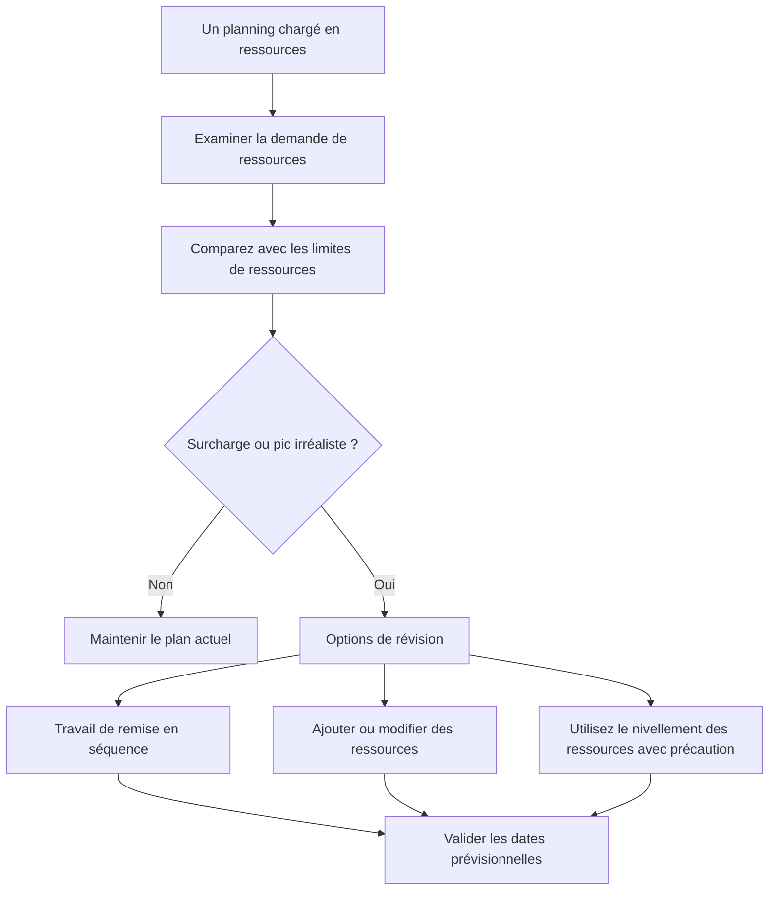

L'équilibrage des ressources dans Primavera P6 est le processus d'examen de la demande de ressources par rapport à la capacité disponible et d'ajustement du plan afin que le travail puisse être exécuté avec les ressources disponibles. Cela aide l'équipe de projet à comprendre si le calendrier est seulement logiquement correct ou également pratique du point de vue des ressources.

Dans la planification quotidienne, les gens utilisent souvent les mots équilibrage et nivellement des ressources comme s'ils signifiaient la même chose. Ils sont liés, mais ils ne sont pas exactement les mêmes.

L’équilibrage des ressources est l’examen de planification plus large. Cela comprend l'examen des histogrammes, des profils de ressources, de la disponibilité des équipages, de la demande d'équipement, des pics de main-d'œuvre et du réalisme du plan.

La mise à niveau des ressources est une fonctionnalité P6 qui permet de déplacer des activités en fonction de la disponibilité des ressources et des paramètres de mise à niveau.

La fonctionnalité peut être utile, mais elle doit être utilisée avec contrôle. P6 peut calculer un résultat nivelé, mais le planificateur doit décider si ce résultat a du sens pour le projet.

## Qu'est-ce que l'équilibrage des ressources

L’équilibrage des ressources pose une question pratique : le projet peut-il exécuter ce calendrier avec les ressources dont il dispose réellement ?

Un calendrier peut avoir une bonne logique, des dates acceptables et un chemin critique raisonnable. Mais s’il nécessite la même équipe ou le même équipement limité pour travailler dans trop d’endroits en même temps, le plan risque de ne pas être réaliste.

Équilibrer les ressources signifie examiner cette demande et décider comment la gérer.

Les actions possibles incluent :

- Déplacement de travaux non critiques.
- Ajout de ressources.
- Répartir le travail en différentes équipes ou zones.
- Modification du séquençage des activités.
- Utiliser les heures supplémentaires ou le travail posté.
- Ajustement des calendriers.
- Mise à jour des limites de ressources.
- Accepter un pic temporaire s'il est réaliste et approuvé.

Le but n’est pas de rendre l’histogramme parfaitement plat. Les vrais projets ont des hauts et des bas. L’objectif est de s’assurer que la demande de ressources est comprise, réalisable et alignée sur le plan d’exécution.

## Pourquoi c'est important

L'équilibrage des ressources est important car le calendrier est censé prendre en charge l'exécution, pas seulement le calcul.

Si le plan nécessite 50 soudeurs la semaine prochaine mais que l’entrepreneur ne peut en fournir que 30, le calendrier indique une demande qui ne peut être satisfaite. Si deux activités critiques nécessitent la même grue en même temps, au moins l’une d’entre elles devra peut-être se déplacer. Si les activités d’examen technique nécessitent toutes le même spécialiste, le goulot d’étranglement peut apparaître avant même le début de la construction.

Sans équilibrage des ressources, le projet peut croire qu’il dispose de plus de capacités qu’il n’en a réellement.

Cela peut affecter :

- Planification prospective à court terme.
- Prévisions de main d'œuvre.
- Planification des équipements.
- Crédibilité du chemin critique.
- Prévisions de valeur acquise.
- Courbes de coûts et de flux de trésorerie.
- Des engagements de progrès.
- Plans de relance.

L'équilibrage des ressources permet de relier le calendrier CPM à la capacité réelle du terrain et du bureau.

## Équilibrage des ressources vs nivellement des ressources

L’équilibrage des ressources est une activité de gestion et de planification.

Le nivellement des ressources est un calcul de planification.

Cette distinction est importante. Un planificateur peut équilibrer les ressources manuellement en examinant les histogrammes et en ajustant le calendrier en fonction de la connaissance du projet. Le nivellement des ressources P6 peut également être utile en retardant automatiquement les activités lorsque la demande en ressources dépasse la disponibilité.

Les deux approches peuvent être utiles.

L'équilibrage manuel est préférable lorsque le planificateur a besoin de jugement, de saisie sur le terrain, d'examen de constructibilité ou d'un contrôle minutieux des activités déplacées.

Le nivellement des ressources P6 est utile lorsque les données sur les ressources sont fiables, que les limites des ressources sont définies, que les calendriers sont corrects et que le planificateur souhaite tester la façon dont la planification change lorsque la disponibilité des ressources est appliquée.

Le nivellement ne doit pas remplacer le jugement en matière de planification. Il devrait le soutenir.

## Ce dont P6 a besoin avant la mise à niveau

Avant d'utiliser la fonctionnalité de nivellement des ressources P6, le planning doit être prêt pour l'analyse des ressources.

Au minimum, vérifiez :

- Les activités ont des affectations de ressources significatives.
- Les unités de ressources reflètent la demande réelle.
- Les limites des ressources reflètent la disponibilité réelle.
- Les calendriers de ressources sont corrects.
- Les calendriers d'activités sont corrects.
- La logique est suffisamment complète pour prendre en charge les décisions de planification.
- Les contraintes sont comprises.
- Les priorités sont définies ou revues.
- Le calendrier actuel a été enregistré afin que le résultat nivelé puisse être comparé.

Si ces éléments sont faibles, le nivellement peut produire un résultat qui semble précis mais qui n'est pas utile.

Par exemple, si toute la main-d'œuvre de construction est affectée à une ressource générique « équipe de construction », P6 peut afficher une surcharge de ressources, mais le résultat peut ne pas indiquer au projet si le problème est civil, de tuyauterie, électrique ou mécanique. La configuration des ressources doit correspondre à la décision de planification.

## Comment P6 utilise le nivellement des ressources

Le nivellement des ressources P6 examine les affectations et la disponibilité des ressources. Selon les paramètres, cela peut retarder les activités visant à réduire ou supprimer la surallocation des ressources.

Le calcul peut prendre en compte les limites de ressources, la logique d'activité, la marge, les calendriers, les priorités et les options de nivellement. Le résultat exact dépend de la façon dont le projet est configuré.

Concrètement, P6 recherche les situations dans lesquelles la demande de ressources est supérieure à la disponibilité, puis tente de déplacer les activités vers les dates où les ressources sont disponibles.

Cela peut créer un calendrier plus réaliste en termes de ressources, mais cela peut également modifier le chemin critique, retarder des jalons ou déplacer le travail d'une manière qui nécessite une révision.

Après le nivellement, le planificateur doit comparer le résultat à la prévision initiale :

- Quelles activités ont bougé ?
- Quels jalons ont changé ?
- Le chemin critique a-t-il changé ?
- Le nivellement a-t-il utilisé le flottement disponible ou retardé la fin du projet ?
- Les nouvelles dates sont-elles constructibles ?
- Le résultat a-t-il résolu le problème de ressources ou en a-t-il créé un autre ?

Le calendrier nivelé ne doit pas être accepté aveuglément.

## Quand utiliser l’équilibrage des ressources

Utilisez l'équilibrage des ressources chaque fois que la disponibilité des ressources affecte l'exécution.

Il est particulièrement utile dans :

- Calendriers de construction avec limitations d’équipage.
- Arrêts, redressements et pannes.
- Plans de mise en service avec un nombre limité de spécialistes.
- Calendriers d’ingénierie avec réviseurs partagés.
- Projets avec des équipements coûteux ou partagés.
- Programmes dans lesquels un pool de ressources prend en charge plusieurs projets.
- Plans de rétablissement où des ressources supplémentaires sont envisagées.

L’équilibrage des ressources est également utile avant l’approbation de la ligne de base. Une base de référence qui suppose une disponibilité irréaliste de main-d’œuvre ou d’équipement peut devenir difficile à défendre par la suite.

Lors des mises à jour, l'équilibrage des ressources permet de confirmer si le travail restant peut toujours être effectué avec l'équipe et l'équipement actuels.

## Quand être prudent

Soyez prudent lorsque les données de ressources ne sont pas conservées.

Si les unités réelles ne sont pas mises à jour, les courbes de ressources peuvent s'éloigner de la réalité. Si les ressources sont affectées uniquement pour le chargement des coûts, les unités peuvent ne pas représenter la capacité réelle. Si les calendriers sont erronés, la disponibilité des ressources peut également l'être.

Soyez également prudent lorsque vous utilisez le nivellement des ressources selon un calendrier contractuel ou de référence. La mise à niveau peut déplacer les dates et affecter le flottement. L'équipe doit comprendre si le calendrier nivelé est le plan officiel, un scénario de simulation ou une vue de planification interne.

Le nivellement peut également masquer des faiblesses logiques. Si une activité se déplace en raison du nivellement, les réviseurs risquent de ne pas remarquer que la logique d'origine était incomplète ou incorrecte. Examinez toujours d’abord la logique, puis les ressources.

## Comment l'utiliser en pratique

Commencez par identifier les ressources qui comptent le plus. N'essayez pas d'équilibrer chaque ressource mineure avec le même niveau de détail. Concentrez-vous sur les équipes clés, les spécialistes critiques, les équipements partagés et les ressources qui pourraient affecter les jalons.

Examinez ensuite le profil de ressource ou l'histogramme dans P6. Recherchez les pics, les surcharges, les écarts et les changements soudains de la demande.

Comparez la demande aux limites des ressources. Si la demande dépasse la limite, discutez du problème avec l’équipe responsable. La réponse est peut-être opérationnelle, et pas seulement programmatique.

Ensuite, décidez de la méthode de correction :

- Si la limite de ressources est erronée, mettez à jour la limite de ressources.
- Si la demande de ressources est erronée, corrigez l'affectation.
- Si la séquence n’est pas réaliste, ajustez la logique ou le calendrier des activités.
- Si la surcharge est réelle, décidez si vous souhaitez ajouter des ressources, utiliser des heures supplémentaires, déplacer le travail ou accepter le pic.
- Si le nivellement automatisé est approprié, exécutez-le comme un scénario contrôlé et comparez le résultat.

Conservez une copie de la planification non nivelée avant d'exécuter le nivellement des ressources. Cela donne à l’équipe un point de référence et aide à expliquer ce qui a changé.

## Bonne pratique

Utilisez l’équilibrage des ressources dans le cadre de la révision du calendrier et non comme un exercice de nettoyage ponctuel.

Examinez les courbes de ressources pendant le développement de la ligne de base, les reprévisions majeures, la planification de la récupération et les cycles de mise à jour réguliers.

Ne nivelez pas un planning de mauvaise qualité et attendez-vous à ce que le résultat devienne fiable. Corrigez d’abord la logique, les calendriers, l’état des activités, les durées restantes et les affectations de ressources.

Paramètres de mise à niveau du document lorsque la fonctionnalité P6 est utilisée. Le nivellement des ressources peut produire des résultats différents selon les options sélectionnées. Les paramètres font donc partie de l'enregistrement de planification.

Plus important encore, validez le plan de ressources auprès des personnes propriétaires de l’œuvre. L'équipe de projet doit confirmer si les pics de ressources sont réalisables, si la séquence est pratique et si des ressources supplémentaires sont réellement disponibles.

## Conclusion

L'équilibrage des ressources dans P6 aide l'équipe de projet à tester si le calendrier peut être exécuté avec les ressources disponibles. Il relie les dates et la logique à la main d’œuvre, aux équipements, à la disponibilité des spécialistes et à la capacité de production réelle.

Le nivellement des ressources P6 peut prendre en charge cet examen en déplaçant les activités en fonction de la disponibilité des ressources, mais il doit être utilisé avec précaution et revu après le calcul.

Un emploi du temps équilibré n’est pas nécessairement un emploi du temps parfaitement fluide. Il s'agit d'un calendrier dans lequel la demande de ressources est visible, réaliste et alignée sur la manière dont le projet sera réellement réalisé.
