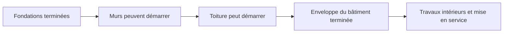
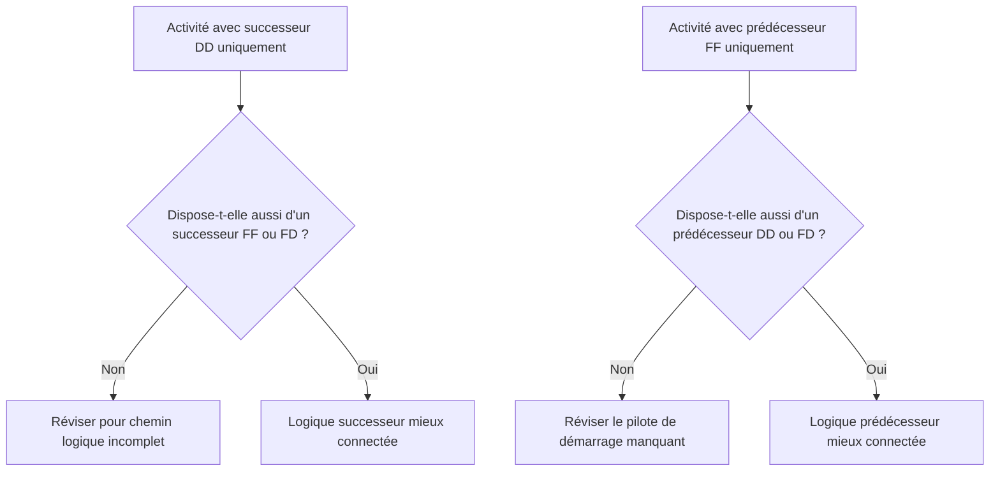

La logique est la représentation mathématique du séquencement et des dépendances à l'intérieur d'un planning de projet. Elle explique ce qui doit se passer avant quoi, quelles activités peuvent se dérouler simultanément et comment l'équipe projet entend progresser de la première activité à l'achèvement final.

Dans un bon planning Primavera P6, la logique n'est pas un ornement. C'est le moteur qui permet au planning de calculer les dates, la marge (float), le chemin critique et les mouvements prévisionnels. Elle raconte l'histoire de l'exécution d'une façon qui peut être révisée, remise en question et améliorée.

Si le planning dit « couler les fondations, puis bâtir les murs, puis construire la toiture », la logique est ce qui transforme cette séquence en un réseau calculable. Le planificateur ne dessine pas seulement un calendrier. Il définit le chemin de livraison.

## La logique raconte l'histoire des travaux

Chaque équipe projet a une façon prévue d'exécuter le projet. L'ingénierie peut publier les plans par zone. L'approvisionnement peut livrer les équipements par lot. Les travaux de génie civil peuvent préparer les accès avant que les travaux de charpente commencent. L'achèvement mécanique peut devoir intervenir avant que la mise en service puisse commencer.

Les liens logiques sont l'expression mathématique de ce plan.

Ce diagramme simple n'est pas seulement une séquence. C'est un modèle décisionnel. Si les fondations sont en retard, les murs peuvent être en retard. Si les murs sont en retard, la toiture peut être en retard. Si la toiture est en retard, les travaux intérieurs peuvent être affectés. Le planning ne peut montrer cet impact que si la logique est présente.

Une logique robuste signifie que le planning peut expliquer pourquoi les activités démarrent, pourquoi elles se terminent et ce qui se passe lorsqu'une partie du plan bouge.

## Pourquoi la logique robuste est importante à la Date de Référence

La métrique « Activités démarrant à la Date de Référence sans logique pilote » est un test solide de la qualité du planning.

La Date de Référence (Data Date) est la frontière entre la performance réelle et le travail prévisionnel. Quand une activité démarre exactement à la Date de Référence, le réviseur doit se poser une question simple : qu'est-ce qui pilote ce démarrage ?

Si l'activité dispose d'une logique prédécesseur valide, le planning peut expliquer le démarrage. Peut-être qu'une zone a été libérée. Peut-être qu'une livraison de matériaux a été effectuée. Peut-être que l'activité prédécesseur s'est terminée et a permis à l'équipe suivante de commencer.

Si l'activité n'a pas de logique pilote, le démarrage est plus fragile. L'activité peut se trouver à la Date de Référence parce qu'elle n'a pas de prédécesseur, parce que la logique est incomplète, parce qu'une contrainte la force là, ou parce que la mise à jour n'a pas été entièrement actualisée.

C'est pourquoi la logique robuste est importante. Un planning ne doit pas permettre à des travaux d'apparaître prêts simplement parce que la Date de Référence a bougé. Il doit montrer la condition réelle qui permet aux travaux de commencer.

## L'équilibre : assez de logique, sans redondance

Une bonne logique est équilibrée. Le planning a besoin de suffisamment de relations pour connecter correctement les activités à leurs prédécesseurs et successeurs. En même temps, il doit éviter une logique redondante qui répète la même dépendance de façon inutile.

Trop peu de logique crée des démarrages ouverts, des fins ouvertes, une marge non fiable et des résultats de chemin critique faibles. Trop de logique peut rendre le réseau difficile à réviser et peut masquer le vrai pilote d'une activité.

L'objectif n'est pas de maximiser le nombre de relations. L'objectif est de représenter clairement les dépendances obligatoires et requises.

Pour chaque activité, le planificateur doit être en mesure de répondre aux questions suivantes :

- Qu'est-ce qui permet à cette activité de démarrer ?
- Qu'est-ce que cette activité permet ensuite ?
- Quelle relation pilote vraiment l'activité ?
- Une relation est-elle dupliquée ou inutile ?
- Un réviseur comprendrait-il la séquence prévue ?

Cet équilibre est au cœur des révisions de planning PMO. Un réseau dense n'est pas automatiquement un réseau solide. Un réseau léger n'est pas automatiquement un réseau propre. Le bon réseau explique le plan d'exécution sans encombrement.

## Chaque activité a besoin d'un pilote de démarrage

Une logique robuste signifie que chaque activité a un prédécesseur qui permet ou déclenche son démarrage, sauf pour les exceptions valides liées au démarrage du projet ou à des autorisations externes.

Pour une activité de construction, le pilote de démarrage peut être l'accès à la zone, l'achèvement du prédécesseur, la disponibilité des matériaux, la publication des plans, l'approbation du permis ou l'achèvement du corps de métier précédent. Pour une activité d'approvisionnement, il peut s'agir de l'approbation de la conception ou de l'émission du bon de commande. Pour la mise en service, il peut s'agir de l'achèvement mécanique, de la disponibilité du dossier d'essai ou du basculement système.

Lorsque ce pilote de démarrage est manquant, l'activité peut dériver vers une position artificielle dans le planning. Lors des mises à jour, elle peut apparaître à la Date de Référence. Cela crée une fausse impression de préparation.

Prenons l'exemple d'une activité « Installation des pompes ». Si elle démarre à la Date de Référence mais n'a pas de prédécesseur pour l'achèvement des fondations, la livraison des pompes ou la remise de la zone, le planning n'explique pas pourquoi l'installation peut commencer. L'activité peut être planifiée, mais la logique n'est pas robuste.

## DD et FF sont des relations à moitié complètes

Les relations Début-Début (DD, ou Start-to-Start) et Fin-Fin (FF, ou Finish-to-Finish) sont utiles, mais elles doivent être utilisées avec précaution. Dans de nombreuses révisions de plannings, elles sont mieux comprises comme des relations « à moitié complètes » parce qu'elles ne placent pas complètement l'activité dans un chemin logique complet par elles-mêmes.

Une relation DD peut expliquer quand une activité peut démarrer, mais elle peut ne pas expliquer quand l'activité doit se terminer ou ce qu'elle transmet ensuite. Une relation FF peut expliquer l'alignement de fin, mais elle peut ne pas expliquer quand l'activité est autorisée à démarrer.

Cela ne signifie pas que DD ou FF sont incorrects. Le chevauchement de travaux est courant et souvent réaliste. Le problème est de savoir si l'activité est entièrement connectée.

Par exemple :

- Une activité avec un successeur DD devrait généralement aussi avoir un successeur FF ou FD (Fin-Début).
- Une activité avec un prédécesseur FF devrait généralement aussi avoir un prédécesseur DD ou FD.

Cela aide à éviter que les activités soient connectées uniquement d'un côté de leur durée. Le planning doit expliquer à la fois comment les travaux démarrent et comment ils s'achèvent.

## La logique robuste en pratique

Une révision logique pratique doit commencer par les activités proches de la Date de Référence, les travaux critiques et quasi critiques, et les grands chemins de remise. Ces zones ont le plus grand impact sur la prise de décision actuelle.

Dans P6, les colonnes de révision utiles comprennent l'ID d'activité, le nom d'activité, le WBS, le début, la fin, le statut d'activité, la marge totale, les prédécesseurs, les successeurs, le type de relation, le décalage, les contraintes, le calendrier et les indicateurs de relation pilote si disponibles.

Pour chaque activité démarrant à la Date de Référence, demandez :

- L'activité est-elle vraiment prête à démarrer ?
- Quel prédécesseur permet le démarrage ?
- Ce prédécesseur est-il terminé, en cours ou prévisionnel ?
- La relation est-elle pilote ?
- Une contrainte ou une date attendue remplace-t-elle la logique ?
- L'activité dispose-t-elle également d'une logique successeur valide ?

Si la réponse n'est pas claire, l'activité doit être révisée avec le responsable concerné. La correction peut consister à ajouter un prédécesseur manquant, à modifier le type de relation, à supprimer une contrainte, à mettre à jour les données réelles ou à documenter une exception valide.

## Éviter la logique artificielle

Une erreur consiste à ajouter des relations uniquement pour satisfaire une métrique. Cela ne crée pas une logique robuste. Cela crée une logique artificielle.

Les relations doivent représenter de vraies dépendances. Si un lien ne reflète pas la séquence de construction, la publication d'ingénierie, le besoin d'approvisionnement, l'accès, l'approbation, les essais, la mise en service ou la remise, il n'a peut-être pas sa place dans le réseau.

Une autre erreur est de laisser une logique redondante parce qu'elle semble plus sûre. Si la même dépendance est déjà représentée par une relation plus claire, des liens supplémentaires peuvent brouiller le chemin critique et rendre le réseau plus difficile à auditer.

Une logique robuste est claire, intentionnelle et défendable.

## Conclusion

La logique est l'histoire mathématique de la façon dont le projet sera exécuté. Elle définit ce qui doit se passer en premier, ce qui peut se passer simultanément et ce qui suit ensuite.

Une logique robuste ne signifie pas ajouter le plus de liens possible. Elle signifie ajouter les bons liens : suffisamment pour connecter chaque activité à de vrais prédécesseurs et successeurs, mais pas au point que le réseau devienne redondant ou trompeur.

Quand des activités démarrent à la Date de Référence sans logique pilote, le planning expose une faiblesse dans cette histoire. L'activité peut être affichée comme prête, mais le réseau n'explique pas pourquoi.

Un planning fiable doit répondre clairement à cette question. Qu'est-ce qui permet à ce travail de commencer ? Qu'est-ce qu'il permet ensuite ? Si le planning peut répondre aux deux, la logique devient robuste. Si ce n'est pas le cas, l'équipe projet a encore du travail de séquencement à faire avant que la prévision puisse être considérée comme fiable.
