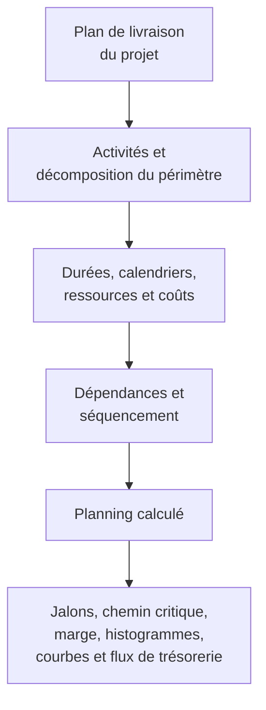

Un planning de projet est bien plus qu'une liste de dates. C'est une représentation graphique et logique du plan de livraison du projet. Il explique comment le projet sera exécuté du début à la fin, comment les lots de travaux s'articulent, à quel moment les jalons (milestones) majeurs doivent être atteints, et quelles informations l'équipe projet doit utiliser pour prendre ses décisions.

En termes simples, le planning transforme le plan de projet en feuille de route. Il aide tous les intervenants à comprendre ce qui doit être fait, quand cela doit se produire et qui est responsable de sa réalisation. Pour les chefs de projet, les planificateurs, les équipes construction, les ingénieurs, les responsables approvisionnements et les réviseurs PMO, le planning devient l'un des principaux outils de coordination et de pilotage.

Le planning est un calendrier, mais il n'est pas que cela. Un planning faible peut afficher des dates. Un planning solide explique pourquoi ces dates sont crédibles.

## Le planning comme feuille de route de livraison

Chaque projet commence par une intention. L'équipe sait ce qui doit être livré : un bâtiment, une installation industrielle, un système, un arrêt de maintenance, une infrastructure ou un lot de travaux. Mais la livraison exige davantage que la connaissance de l'objectif final. L'équipe doit comprendre la séquence.

Qu'est-ce qui vient en premier ? Qu'est-ce qui peut se dérouler en parallèle ? Qu'est-ce qui doit attendre l'approbation de conception, la livraison de matériaux, l'accès au chantier, l'obtention d'un permis, les essais ou la réception ? Quelles activités pilotent la date de fin ? Quels jalons importent le plus au client ?

Un planning répond à ces questions en convertissant le plan en activités, durées, dépendances, calendriers, ressources, coûts et jalons.

Le calendrier graphique est utile parce que les intervenants peuvent visualiser le travail. Le réseau logique est utile parce que le logiciel peut calculer le travail. Ensemble, ils permettent au planning de jouer à la fois le rôle d'outil de communication et d'outil de pilotage.

## Ce qui alimente le planning

Un planning n'est fiable que si les informations utilisées pour le construire le sont elles-mêmes. Dans Primavera P6, le planning est alimenté par plusieurs données d'entrée majeures.

La première donnée est la liste des activités. Les activités décomposent le projet en tâches gérables. Chaque activité doit être suffisamment précise pour pouvoir être planifiée, suivie et mesurée.

La deuxième donnée est la durée déterministe. C'est le temps de travail prévu pour réaliser chaque activité. La durée doit refléter la méthode d'exécution, les hypothèses de productivité, la taille des équipes, les conditions d'accès, les contraintes de chantier et les conditions du projet.

La troisième donnée est la logique de dépendances. Les dépendances expliquent comment les activités se relient entre elles. Une activité peut devoir se terminer avant qu'une autre démarre. Deux activités peuvent démarrer ensemble. Deux fins peuvent devoir s'aligner. Ces relations constituent le réseau CPM.

La quatrième donnée est le séquencement. Le séquencement est l'ordre pratique d'exécution. Il tient compte de la constructabilité, du flux d'ingénierie, du calendrier des approvisionnements, des accès, de la logique de mise en service, de la stratégie de réception et des priorités du client.

La cinquième donnée est les ressources et les coûts. Le chargement en ressources permet au planning d'afficher la demande en main-d'œuvre, en équipements et en matériaux dans le temps. Le chargement en coûts permet au planning de soutenir les flux de trésorerie, la valeur acquise et les prévisions financières.

Lorsque ces données sont complètes et réalistes, le planning peut produire des résultats utiles.

## Ce que le planning nous dit

Un planning bien construit indique la durée globale du projet. Il montre les jalons d'achèvement prévus et les livrables intermédiaires. Il génère des histogrammes de ressources qui indiquent quand la demande en main-d'œuvre ou en équipements augmente et diminue. Il soutient les courbes d'avancement, les courbes de flux de trésorerie, le reporting en valeur acquise et la planification à court terme.

Surtout, il identifie le chemin critique (critical path) ou le chemin le plus long. C'est la chaîne de travaux qui pilote la date de fin du projet. Si des activités sur ce chemin glissent, la date d'achèvement du projet peut également glisser. C'est pourquoi la logique est si importante. Sans de bonnes dépendances, le chemin critique peut ne pas montrer les vrais pilotes du projet.

La marge (float) est une autre donnée de sortie importante. La marge indique la flexibilité dont dispose une activité avant d'affecter une autre activité ou la date de fin du projet. Mais la marge n'a de sens que lorsque le réseau du planning est complet. Si des activités manquent de logique, la marge peut paraître meilleure ou moins bonne que la réalité.

## Pourquoi la logique rend le calendrier crédible

C'est là que la métrique « Activités démarrant à la Date de Référence sans logique pilote » devient importante.

La Date de Référence (Data Date) dans P6 est la frontière entre la performance réelle et la prévision. Tout ce qui est antérieur à la Date de Référence doit représenter ce qui s'est déjà produit. Tout ce qui est postérieur doit représenter le plan à partir de maintenant.

Quand des activités démarrent exactement à la Date de Référence sans qu'aucune logique ne les pilote, le planning émet un signal d'alerte. Il peut sembler que le travail est prêt à commencer immédiatement, mais le planning peut ne pas être en mesure d'expliquer pourquoi. Il peut ne pas y avoir de prédécesseur indiquant que la zone est disponible, aucun lien vers la livraison de matériaux, aucun lien vers l'approbation de conception, aucune connexion à la levée d'inspection et aucune logique issue des travaux antérieurs.

Cela compte parce qu'un planning ne doit pas simplement placer du travail à une date. Il doit expliquer le chemin vers cette date.

Si une activité démarre à la Date de Référence parce que tous les travaux prédécesseurs requis sont achevés et que la logique soutient ce démarrage, la date est défendable. Si elle démarre là parce que l'activité est ouverte, non pilotée, contrainte ou mal mise à jour, la date est fragile. L'équipe projet peut croire que le travail est prêt alors que les conditions d'activation réelles n'ont pas été modélisées.

## Un exemple concret

Imaginez un planning avec une Date de Référence au 1er juin. Après la mise à jour, plusieurs activités démarrent au 1er juin :

- Pose des chemins de câbles en Zone B.
- Début des essais de pression sur la tuyauterie.
- Début de l'alignement des équipements.
- Mobilisation de l'équipe d'isolation.

À première vue, le programme à court terme paraît chargé et prêt. Mais quand le planificateur examine la logique, le problème devient évident. La pose des chemins de câbles n'est pas liée à la livraison des matériaux. Les essais de pression ne sont pas liés à l'achèvement de la tuyauterie. L'alignement des équipements ne dispose pas du prédécesseur d'achèvement mécanique. La mobilisation de l'équipe d'isolation n'a pas de prédécesseur de levée d'accès.

Le planning affiche du travail à la Date de Référence, mais il n'explique pas pourquoi ce travail peut démarrer. Ce n'est pas une feuille de route fiable. C'est une liste d'intentions à court terme.

La correction consiste à ajouter ou à rectifier une véritable logique CPM. Si la livraison de matériaux pilote la pose des chemins de câbles, établir le lien. Si l'achèvement de la tuyauterie pilote les essais de pression, établir le lien. Si la levée d'accès pilote l'isolation, modéliser cette condition. Après recalcul, certaines activités peuvent toujours démarrer près de la Date de Référence, mais le planning peut désormais expliquer pourquoi.

## Ce que doit faire un bon planning

Un bon planning doit aider l'équipe à visualiser le plan, à le tester et à le piloter.

Il doit montrer ce qui doit être fait. Il doit expliquer l'ordre des travaux. Il doit identifier qui doit agir et quand. Il doit révéler le chemin critique. Il doit soutenir la planification des ressources, la mesure de l'avancement, les prévisions de trésorerie et le reporting PMO.

Il doit également rendre les points faibles visibles. La logique manquante, les contraintes rigides, les dates obsolètes, les démarrages ouverts, les fins ouvertes et les activités qui se regroupent à la Date de Référence ne sont pas seulement des problèmes techniques. Ils affectent la compréhension qu'a l'équipe projet de la préparation, du risque et du pilotage.

## Conclusion

Un planning est le plan de livraison du projet exprimé en termes de temps, de logique et de travaux mesurables. C'est une feuille de route, un modèle de calcul et un outil de communication.

Lorsqu'il est bien construit, il indique à l'équipe projet ce qui doit se passer, quand cela doit se passer et pourquoi les dates sont crédibles. Quand des activités démarrent à la Date de Référence sans logique pilote, cette crédibilité est affaiblie. Le planning cesse d'expliquer le plan et se met à deviner la prochaine étape.

Pour cette raison, les révisions de qualité du planning doivent toujours poser une question simple : le planning explique-t-il pourquoi le travail démarre quand il démarre ? Si la réponse est oui, le planning fait son travail. Si la réponse est non, la feuille de route a besoin de plus de logique avant de pouvoir être considérée comme fiable.
