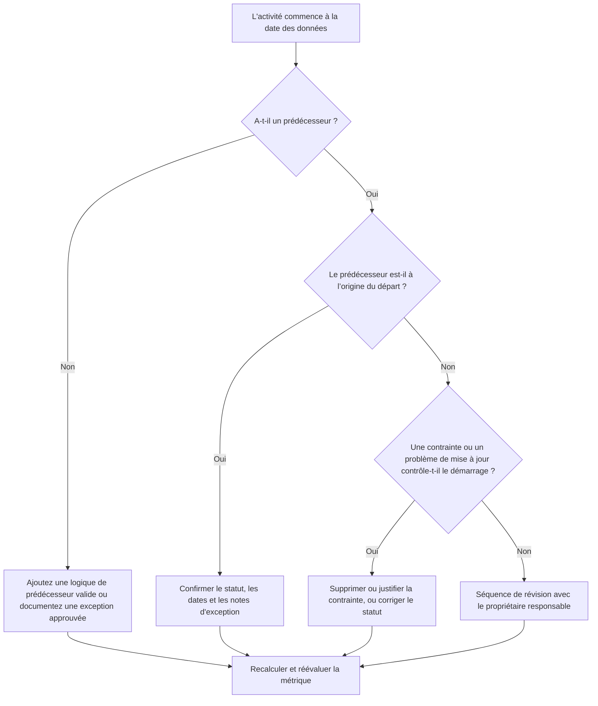

## But

Ce guide aide les planificateurs et les équipes de contrôle de projet à réduire ou à éliminer les activités dont le démarrage est prévu à la date de données Primavera P6 sans qu'une logique de prédécesseur valide ne détermine le démarrage. Il s'applique à la planification des examens de qualité, aux contrôles de santé du PMO et à la validation du cycle de mise à jour.

L'objectif est de confirmer que le travail à court terme est soutenu par une logique CPM claire et que les activités ne démarrent pas à la date des données uniquement en raison de relations manquantes, de contraintes, de dates manuelles ou de mises à jour de progression incomplètes.

## Avant de commencer

Rassemblez les informations suivantes avant d’agir :

- Résultat de l'évaluation actuelle pour cette métrique.
- Données du projet Date utilisée dans le dernier calcul du calendrier.
- Liste des activités ouvertes ou non démarrées avec une date de début égale à la Date des Données.
- Détails des relations prédécesseurs et successeurs pour chaque activité.
- Contraintes, dates prévues, dates réelles et affectations de calendrier.
- Options de planification P6 utilisées pour la mise à jour, y compris les paramètres de logique conservée ou de remplacement de la progression, le cas échéant.
- Toutes les exceptions approuvées, telles que les activités de démarrage du projet, les jalons de l'interface externe ou les démarrages dirigés par le propriétaire.

## Comprenez votre résultat

Un bon résultat est zéro activité non résolue à partir de la date de données sans piloter la logique du prédécesseur. Cela signifie que le travail en cours et à court terme est connecté au réseau de planification et que la date des données ne cache pas le séquençage manquant.

Un résultat acceptable peut inclure un petit nombre d’exceptions documentées. Ceux-ci doivent être examinés et approuvés, et non ignorés. Par exemple, une étape de notification de poursuite ou une activité autorisée en externe peut ne pas nécessiter de prédécesseur normal, mais la raison doit être visible pour les réviseurs.

Un résultat faible signifie que plusieurs activités démarrent à la date des données sans pilote logique clair. Cela peut indiquer des démarrages ouverts, des relations de prédécesseur manquantes, des contraintes excessives, des mises à jour de progression incomplètes ou des activités qui n'ont pas été correctement réordonnées après la dernière mise à jour.

## Objectif d'amélioration

L'objectif est de 0 activité non résolue à partir de la date des données sans logique pilotante valide.

L’objectif d’amélioration n’est pas seulement de réduire le nombre. L'objectif le plus profond est de s'assurer que chaque activité proche de la date de données a une raison défendable pour le début de sa prévision. Après correction, chaque activité affectée doit avoir soit une logique de prédécesseur appropriée, une exception documentée ou une condition de statut/date corrigée.

## Plan d'action

### Étape 1 : Identifiez le problème principal

Créez une présentation ou un rapport P6 qui filtre les activités ouvertes ou non démarrées avec une date de début égale à la date des données. Incluez des colonnes pour l'ID d'activité, le nom de l'activité, le WBS, le début, la fin, le statut, la marge totale, le calendrier, la contrainte principale, les prédécesseurs, les successeurs et les indicateurs de relation pilotante, le cas échéant.

Passez en revue chaque activité et demandez :

- L'activité a-t-elle des prédécesseurs ?
- Si des prédécesseurs existent, sont-ils réellement à l’origine du lancement ?
- L'activité est-elle retenue ou déplacée par une contrainte ?
- L'activité manque-t-elle d'un début réel ou d'une mise à jour de la progression ?
- L'activité constitue-t-elle une exception valide, telle qu'un jalon de début de projet ?
- L’activité appartient-elle à un domaine WBS où la logique est généralement faible ?

Regroupez les résultats en causes pratiques : prédécesseurs manquants, prédécesseurs non moteurs, contraintes ou dates prévues, erreurs de mise à jour/statut ou exceptions approuvées.

### Étape 2 : appliquer les correctifs recommandés

Commencez par une logique manquante ou faible. Ajoutez des relations de prédécesseur valides qui représentent la séquence réelle de travail, telles que des relations de fin à début, de début à début ou de fin à fin, le cas échéant. Évitez d'ajouter des relations uniquement pour satisfaire la métrique ; chaque relation doit refléter une véritable dépendance en matière de construction, d'ingénierie, d'approvisionnement, d'accès, d'approbation ou de transfert.

Passez ensuite en revue les contraintes. Si une activité démarre à la Date de Données en raison d'une contrainte de démarrage, confirmez si la contrainte est justifiée contractuellement ou opérationnellement. Supprimez les contraintes inutiles et permettez à l’activité d’être pilotée par la logique. Si la contrainte est valide, documentez la raison et confirmez qu'elle ne fausse pas le chemin critique.

Vérifiez l'état d'avancement. Si les travaux ont déjà commencé, mettez à jour correctement le début réel et la durée restante. Si les travaux n'ont pas commencé, confirmez que le début prévu doit rester à la date des données. Une activité ne doit pas apparaître prête à démarrer simplement parce que le cycle de mise à jour l'a ramenée à la date actuelle.

Une fois les modifications apportées, recalculez le calendrier et examinez à nouveau les activités concernées. Confirmez que la date de début est désormais motivée par la logique, correctement statutée ou documentée comme une exception approuvée.

### Étape 3 : Supprimer les bloqueurs courants

Les obstacles courants incluent des retours sur le terrain peu clairs, des informations d'interface manquantes et des pressions pour que le travail à court terme semble prêt. Résolvez ces problèmes en examinant les activités concernées avec les responsables de discipline, les responsables de la construction, les responsables des achats ou les gestionnaires de packages.

Un autre obstacle courant est l’utilisation abusive des contraintes comme substitut à la logique. Des contraintes peuvent être nécessaires dans certains cas, mais elles ne doivent pas remplacer le réseau horaire. Si une contrainte est conservée, documentez pourquoi elle existe et comment elle affecte la marge et le chemin le plus long.

Vérifiez également si le problème est dû aux paramètres de calcul du calendrier ou aux pratiques de mise à jour. Si le remplacement de la progression, la logique conservée, la progression hors séquence ou l'actualisation incomplète affectent le résultat, alignez la méthode de mise à jour avec la procédure de contrôle du projet avant de réévaluer la métrique.

### Étape 4 : Validez les modifications

Validez le planning corrigé avant la prochaine évaluation. Réexécutez le filtre pour les activités ouvertes ou non démarrées commençant à la date des données sans logique de pilotage. Confirmez que chaque élément restant est soit corrigé, soit documenté comme une exception approuvée.

Examinez la marge totale, le chemin le plus long et les activités d’anticipation à court terme après le recalcul. Une correction logique peut modifier le chemin critique ou révéler des problèmes de séquençage supplémentaires. Si le changement de calendrier est important, communiquez l'impact au responsable des contrôles du projet ou à l'examinateur du PMO.

## Calendrier d'amélioration

### Jour 1 : Examiner et diagnostiquer

Exécutez la métrique, confirmez la date des données et produisez la liste des activités. Séparez les résultats en logique manquante, logique non motrice, contraintes, erreurs d'état et exceptions potentielles.

### Jours 2-3 : Mettre en œuvre les actions prioritaires

Corrigez d’abord les activités ayant l’impact le plus élevé, en particulier les activités critiques ou quasi critiques. Ajoutez une logique de prédécesseur valide, supprimez les contraintes inutiles, mettez à jour les statuts incorrects et documentez les exceptions.

### Jours 4 et 5 : surveiller les premiers résultats

Recalculez le calendrier et vérifiez si les activités concernées sont désormais logiques. Recherchez les changements inattendus dans la marge totale, le chemin le plus long et les dates des jalons.

### Jour 6 : derniers ajustements

Résolvez les bloqueurs restants avec la discipline responsable ou le propriétaire du package. Confirmez que toutes les exceptions retenues sont justifiées et clairement documentées.

### Jour 7 : Réévaluer et comparer

Réexécutez l’évaluation et comparez le nouveau résultat au résultat précédent et au seuil cible. Confirmez si la métrique est désormais à zéro activité non résolue ou si une action supplémentaire est requise.

## Suivi des progrès

Utilisez un simple tracker pour gérer les corrections et les approbations.

| Date | Mesure prise | Impact attendu | Résultat / Observation | Étape suivante |
| --- | --- | --- | --- | --- |
| [Date] | Activités révisées à partir de la date de données sans logique pilotante | Identifier la logique manquante ou faible | [Résultat observé] | Attribuer les corrections au propriétaire responsable |
| [Date] | Ajout de relations de prédécesseur valides | Améliorer le séquençage du CPM | [Résultat observé] | Recalculer et examiner l'impact de la marge |
| [Date] | Contraintes supprimées ou justifiées | Réduire les départs artificiels | [Résultat observé] | Confirmer les exceptions restantes |
| [Date] | Statut d'activité incorrect mis à jour | Améliorer la précision des mises à jour | [Résultat observé] | Réexécuter l'évaluation |

## Si les résultats ne s'améliorent pas

Si le résultat ne s'améliore pas, vérifiez si les mêmes activités échouent toujours ou si de nouvelles activités apparaissent à la date des données. Des échecs répétés peuvent indiquer un problème de développement de calendrier plus large, tel qu'une logique incomplète dans une zone WBS, une discipline de mise à jour faible ou une utilisation incohérente des contraintes.

Signalez les problèmes persistants au responsable des contrôles du projet, au responsable de la planification ou au réviseur du PMO. Pour les calendriers importants, envisagez un atelier de révision logique ciblé pour les lots de travaux concernés. Si le calendrier est utilisé à des fins de reporting contractuel, d'analyse des retards ou de prévision de la valeur acquise, les éléments non résolus doivent être traités comme un problème de qualité.

## Entretien

Examinez cette métrique à chaque cycle de mise à jour avant de publier la planification. La vérification doit faire partie de l’examen de l’état de santé du calendrier standard, en particulier après les mises à jour des progrès, le reséquencement, les changements majeurs de portée ou la planification de la récupération.

Les bonnes habitudes de maintenance incluent la conservation des colonnes prédécesseur et successeur visibles dans les mises en page P6, l'examen des débuts ouverts avant chaque soumission, la documentation des exceptions approuvées et la vérification que le mouvement de la date des données ne crée pas un nouveau groupe d'activités non pilotées.

## Liste de contrôle récapitulative

- [ ] Résultat actuel examiné
- [ ] Seuil cible confirmé
- [ ] Date des données confirmée
- [ ] Activités commençant à la date de données identifiée
- [ ] Principal problème identifié
- [ ] Logique manquante ou faible corrigée
- [ ] Contraintes revues et justifiées ou supprimées
- [ ] Dates de statut vérifiées
- [ ] Exceptions approuvées documentées
- [ ] Horaire recalculé
- [ ] Résultats surveillés
- [ ] Évaluation répétée
- [ ] Prochaines étapes documentées
## Contenu associé
- [Modèle de blog](03_blog_template.md)
- [Qu'est-ce qu'un horaire](../../08b_blogs_fr/01_WHAT%20A%20SCHEDULE%20IS/01_blog.md)
- [Logique robuste](../../08b_blogs_fr/02_ROBUST%20LOGIC/02_ROBUST%20LOGIC.md)
