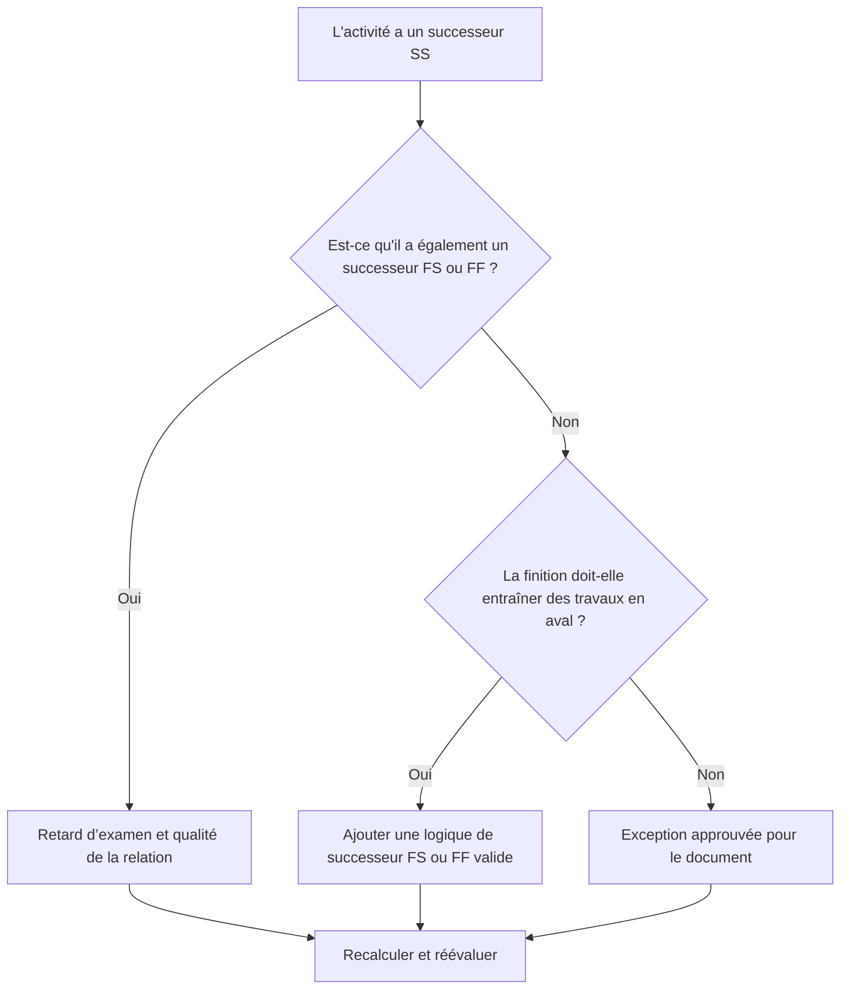

## But

Ce guide aide les planificateurs à examiner et à corriger les activités qui ont des successeurs de début à début mais pas de successeurs de fin à début ou de fin à fin. Il prend en charge une logique CPM plus forte en confirmant que les fins d'activité, et pas seulement les démarrages, sont connectées au réseau de planification en aval.

## Avant de commencer

Rassemblez les informations suivantes avant d’agir :

- Résultat de l'évaluation actuelle pour cette métrique.
- Liste des activités avec des successeurs SS et aucun successeur FS ou FF.
- Détails de la relation successeur pour chaque activité.
- Type d'activité, durée, statut, calendrier, solde total et WBS.
- Tout décalage, contrainte ou date prévue affectant l'activité ou ses successeurs.
- Informations pertinentes sur la construction, l'ingénierie, l'approvisionnement ou la séquence de transfert.

## Comprenez votre résultat

Un résultat fort est zéro activité non résolue dans cette condition. Cela signifie que les activités qui démarrent le travail en aval ont également une logique basée sur la fin où l'achèvement du travail compte.

Un résultat acceptable peut inclure des exceptions documentées, telles que des activités nécessitant un niveau d'effort, des activités administratives ou un chevauchement intentionnel de travaux où la logique de fin n'est pas nécessaire. Ceux-ci devraient être examinés plutôt que présumés valides.

Un résultat faible signifie que plusieurs activités peuvent démarrer des successeurs mais ne contrôlent pas la fin ou le démarrage d'un successeur par leur propre achèvement. Cela peut permettre aux travaux inachevés de cesser d’influencer le calendrier.

## Objectif d'amélioration

L’objectif est de 0 activité non résolue avec des successeurs SS et aucun successeur FS ou FF.

L'objectif est de confirmer que chaque activité a un successeur réaliste axé sur la finition, où l'achèvement affecte le travail en aval, ou que l'absence de logique de finition est justifiée et documentée.

## Plan d'action

### Étape 1 : Identifiez le problème principal

Créez une présentation ou une exportation P6 qui répertorie les activités avec au moins un successeur SS et aucun successeur FS ou FF. Incluez l'ID d'activité, le nom de l'activité, le WBS, la durée d'origine, la durée restante, la marge totale, les successeurs, le type de relation, le décalage, les contraintes et l'état de l'activité.

Passez en revue chaque activité et demandez :

- Quel travail commence parce que cette activité démarre ?
- Quel travail, étape, transfert ou inspection dépend de la fin de cette activité ?
- Il manque un successeur FS ou FF ?
- La relation SS est-elle utilisée correctement pour modéliser les travaux qui se chevauchent ?
- L'activité constitue-t-elle une exception valable, telle qu'un niveau d'effort ou une activité de support ?

### Étape 2 : appliquer les correctifs recommandés

Ajoutez une logique basée sur la fin où l'achèvement de l'activité devrait contrôler le travail ultérieur. Utilisez FS lorsque le successeur ne peut pas démarrer avant la fin de l'activité. Utilisez FF lorsque le successeur peut se chevaucher mais ne peut pas se terminer tant que le prédécesseur n'a pas terminé.

Examinez les relations SS avec décalage. Si le décalage est utilisé pour approximer la dépendance à l'arrivée, remplacez-le ou complétez-le par une relation FS ou FF plus claire. Évitez d'ajouter de la logique uniquement pour satisfaire la métrique ; chaque relation doit refléter la séquence de travail réelle.

Si l'activité constitue une exception valide, documentez la raison dans une rubrique de bloc-notes, une FDU, un champ de commentaire ou un outil de suivi de la qualité du planning.

### Étape 3 : Supprimer les bloqueurs courants

Les bloqueurs courants incluent une logique copiée à partir d'anciens plannings, des relations SS excessives, des points de transfert peu clairs et des informations manquantes de la part des responsables de terrain ou de discipline. Résolvez ces problèmes en examinant la séquence de travail réelle avec le propriétaire responsable.

Un autre obstacle est la croyance selon laquelle les travaux qui se chevauchent ne nécessitent toujours que la logique SS. Le chevauchement peut être valide, mais la finition du prédécesseur doit souvent encore contrôler la finition, l'inspection, le chiffre d'affaires ou l'activité de suivi du successeur.

### Étape 4 : Validez les modifications

Recalculez le planning après corrections. Réexécutez la métrique et confirmez que chaque activité restante est soit corrigée, soit documentée en tant qu'exception approuvée.

Examinez l’impact sur la marge totale, le chemin critique, le chemin le plus long et les jalons à court terme. Si l'ajout d'une logique de fin modifie les dates clés, communiquez le résultat au responsable des contrôles du projet ou au réviseur du PMO.

## Calendrier d'amélioration

### Jour 1 : Examiner et diagnostiquer

Exécutez la métrique, confirmez la liste des activités concernées et séparez les activités en logique de fin manquante, logique SS faible, problèmes de décalage et exceptions possibles.

### Jours 2-3 : Mettre en œuvre les actions prioritaires

Corrigez d’abord les activités critiques et quasi-critiques. Ajoutez des successeurs FS ou FF valides, ajustez la logique SS inappropriée et documentez les exceptions justifiées.

### Jours 4 et 5 : surveiller les premiers résultats

Recalculez le calendrier et examinez les mouvements dans les dates margees, de chemin le plus long et de jalon.

### Jour 6 : derniers ajustements

Résolvez les éléments incertains restants avec la discipline responsable, le propriétaire du package ou le responsable de la construction.

### Jour 7 : Réévaluer et comparer

Réexécutez l’évaluation et comparez le résultat au seuil cible.

## Suivi des progrès

Utilisez un simple tracker pour gérer les corrections et les approbations.

| Date | Mesure prise | Impact attendu | Résultat / Observation | Étape suivante |
| --- | --- | --- | --- | --- |
| [Date] | Activités des successeurs SS uniquement examinées | Identifier la logique de finition manquante | [Résultat observé] | Attribuer des corrections |
| [Date] | Ajout de la logique successeur FS ou FF | Améliorer la continuité du CPM | [Résultat observé] | Recalculer le planning |
| [Date] | Exceptions valides documentées | Améliorer la traçabilité des avis | [Résultat observé] | Réévaluer la métrique |

## Si les résultats ne s'améliorent pas

Si les résultats ne s'améliorent pas, vérifiez si le filtre identifie des exceptions valides, une logique en double ou des activités dans une zone WBS spécifique avec un faible développement de réseau. Un problème répété peut indiquer que l'équipe s'appuie trop sur les relations SS lors de la planification.

Transmettez les éléments non résolus au responsable de la planification ou au réviseur du PMO lorsqu'ils affectent un travail critique, quasi critique, contractuel ou lié au transfert.

## Entretien

Examinez cette mesure lors de chaque mise à jour du calendrier et avant l’approbation de la ligne de base. Portez une attention particulière après le reséquençage, la planification de la récupération, l'élaboration d'un calendrier copié ou des modifications majeures de la portée.

## Liste de contrôle récapitulative

- [ ] Résultat actuel examiné
- [ ] Seuil cible confirmé
- [ ] Principal problème identifié
- [ ] Les successeurs SS examinés
- [ ] Logique FS ou FF manquante corrigée
- [ ] Décalages et contraintes vérifiés
- [ ] Exceptions valides documentées
- [ ] Horaire recalculé
- [ ] Résultats surveillés
- [ ] Évaluation répétée
- [ ] Prochaines étapes documentées
## Contenu associé
- [Modèle de blog](03_blog_template.md)
- [Qu'est-ce qu'un horaire](../../08b_blogs_fr/01_WHAT%20A%20SCHEDULE%20IS/01_blog.md)
- [Logique robuste](../../08b_blogs_fr/02_ROBUST%20LOGIC/02_ROBUST%20LOGIC.md)
