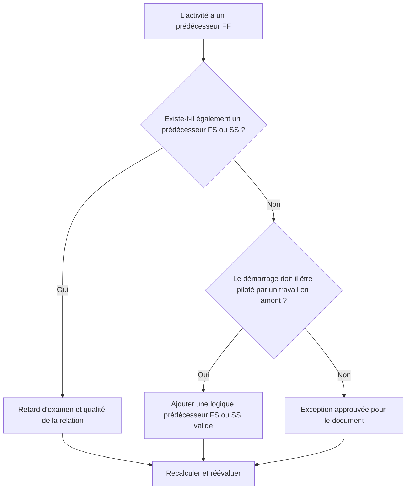

# Activités avec des prédécesseurs FF et aucun prédécesseur FS ou SS - Guide d’amélioration

## But

Ce guide aide les planificateurs à examiner et à corriger les activités qui ont des prédécesseurs de fin à fin mais aucun prédécesseur de fin à début ou de début à début. Il prend en charge une logique CPM plus forte en confirmant que les débuts d'activité, et pas seulement les fins, sont connectés au réseau de planification en amont.

## Avant de commencer

Rassemblez les informations suivantes avant d’agir :

- Résultat de l'évaluation actuelle pour cette métrique.
- Liste des activités avec des prédécesseurs FF et aucun prédécesseur FS ou SS.
- Détails de la relation prédécesseur pour chaque activité.
- Type d'activité, durée, statut, calendrier, solde total et WBS.
- Tout décalage, contrainte ou date prévue affectant l'activité ou ses prédécesseurs.
- Informations pertinentes sur la construction, l'ingénierie, l'approvisionnement, l'accès, l'approbation ou la séquence de transfert.

## Comprenez votre résultat

Un résultat fort est zéro activité non résolue dans cette condition. Cela signifie que les activités dont les finitions sont liées à des travaux antérieurs disposent également d'une logique de démarrage et de conduite valide lorsque cela est nécessaire.

Un résultat acceptable peut inclure des exceptions documentées, telles que des activités nécessitant un niveau d'effort, des activités administratives ou un travail parallèle intentionnellement modélisé pour lequel la logique de démarrage n'est pas requise. Ceux-ci devraient être examinés plutôt que présumés valides.

Un résultat faible signifie que plusieurs activités peuvent se terminer par rapport aux précédentes, mais que leurs démarrages ne sont pas contrôlés par le travail en amont. Cela peut permettre aux activités de démarrer plus tôt que ne le permet la séquence réelle.

## Objectif d'amélioration

L'objectif est de 0 activité non résolue avec des prédécesseurs FF et aucun prédécesseur FS ou SS.

L'objectif est de confirmer que chaque activité a un prédécesseur de démarrage-pilotage réaliste où le démarrage dépend d'un travail en amont, ou que l'absence de logique de démarrage est justifiée et documentée.

## Plan d'action

### Étape 1 : Identifiez le problème principal

Créez une présentation ou une exportation P6 qui répertorie les activités avec au moins un prédécesseur FF et aucun prédécesseur FS ou SS. Incluez l'ID d'activité, le nom de l'activité, le WBS, la durée d'origine, la durée restante, la marge totale, les prédécesseurs, le type de relation, le décalage, les contraintes et l'état de l'activité.

Passez en revue chaque activité et demandez :

- Que doit-il se passer avant que cette activité puisse démarrer ?
- Le prédécesseur de FF contrôle-t-il uniquement l'alignement de la finition ?
- Un prédécesseur FS ou SS manque-t-il ?
- La relation FF est-elle utilisée correctement pour modéliser les travaux qui se chevauchent ?
- L'activité constitue-t-elle une exception valable, telle qu'un niveau d'effort ou une activité de support ?

### Étape 2 : appliquer les correctifs recommandés

Ajoutez une logique de démarrage-conduite où le démarrage de l'activité doit dépendre du travail préalable. Utilisez FS lorsque l'activité ne peut pas démarrer tant que le prédécesseur n'est pas terminé. Utilisez SS lorsque l'activité peut démarrer après le démarrage du prédécesseur ou après avoir atteint un point de progression défini.

Examinez les relations FF avec décalage. Si le décalage est utilisé pour approximer la dépendance au démarrage, remplacez-le ou complétez-le par une logique FS ou SS plus claire. Évitez d'ajouter des relations uniquement pour satisfaire la métrique ; chaque relation doit refléter la séquence de travail réelle.

Si l'activité constitue une exception valide, documentez la raison dans une rubrique de bloc-notes, une FDU, un champ de commentaire ou un outil de suivi de la qualité du planning.

### Étape 3 : Supprimer les bloqueurs courants

Les bloqueurs courants incluent la logique copiée à partir d'anciens calendriers, la surutilisation des relations FF, les points d'accès ou de libération peu clairs et les entrées manquantes des responsables de terrain ou de discipline. Résolvez ces problèmes en examinant les conditions de démarrage réelles avec le propriétaire responsable.

Un autre obstacle est la croyance selon laquelle la logique FF est suffisante lorsque deux activités doivent se terminer ensemble. L'alignement final peut être valide, mais l'activité successeur nécessite souvent une condition de départ claire.

### Étape 4 : Validez les modifications

Recalculez le planning après corrections. Réexécutez la métrique et confirmez que chaque activité restante est soit corrigée, soit documentée en tant qu'exception approuvée.

Examinez l'impact sur les premières dates, la marge totale, le chemin critique, le chemin le plus long et les jalons à court terme. Si l'ajout d'une logique de démarrage modifie les dates clés, communiquez le résultat au responsable des contrôles du projet ou au réviseur du PMO.

## Calendrier d'amélioration

### Jour 1 : Examiner et diagnostiquer

Exécutez la métrique, confirmez la liste des activités concernées et séparez les activités en logique de démarrage manquante, logique FF faible, problèmes de décalage et exceptions possibles.

### Jours 2-3 : Mettre en œuvre les actions prioritaires

Corrigez d’abord les activités critiques et quasi-critiques. Ajoutez des prédécesseurs FS ou SS valides, ajustez la logique FF inappropriée et documentez les exceptions justifiées.

### Jours 4 et 5 : surveiller les premiers résultats

Recalculez le calendrier et examinez les mouvements dans les dates anticipées, les dates margees, le chemin le plus long et les dates jalons.

### Jour 6 : derniers ajustements

Résolvez les éléments incertains restants avec la discipline responsable, le propriétaire du package ou le responsable de la construction.

### Jour 7 : Réévaluer et comparer

Réexécutez l’évaluation et comparez le résultat au seuil cible.

## Suivi des progrès

Utilisez un simple tracker pour gérer les corrections et les approbations.

| Date | Mesure prise | Impact attendu | Résultat / Observation | Étape suivante |
| --- | --- | --- | --- | --- |
| [Date] | Activités précédentes examinées uniquement en FF | Identifier la logique de démarrage manquante | [Résultat observé] | Attribuer des corrections |
| [Date] | Ajout de la logique prédécesseur FS ou SS | Améliorer la continuité du CPM | [Résultat observé] | Recalculer le planning |
| [Date] | Exceptions valides documentées | Améliorer la traçabilité des avis | [Résultat observé] | Réévaluer la métrique |

## Si les résultats ne s'améliorent pas

Si les résultats ne s'améliorent pas, vérifiez si le filtre identifie des exceptions valides, une logique en double ou des activités dans une zone WBS spécifique avec un faible développement de réseau. Un problème répété peut indiquer que l'équipe s'appuie trop sur les relations FF lors de la planification.

Transmettez les éléments non résolus au responsable de la planification ou au réviseur du PMO lorsqu'ils affectent un travail critique, quasi critique, contractuel, lié à l'accès ou au transfert.

## Entretien

Examinez cette mesure lors de chaque mise à jour du calendrier et avant l’approbation de la ligne de base. Portez une attention particulière après le reséquençage, la planification de la récupération, l'élaboration d'un calendrier copié ou des modifications majeures de la portée.

## Liste de contrôle récapitulative

- [ ] Résultat actuel examiné
- [ ] Seuil cible confirmé
- [ ] Principal problème identifié
- [ ] Les prédécesseurs de FF examinés
- [ ] Logique FS ou SS manquante corrigée
- [ ] Décalages et contraintes vérifiés
- [ ] Exceptions valides documentées
- [ ] Horaire recalculé
- [ ] Résultats surveillés
- [ ] Évaluation répétée
- [ ] Prochaines étapes documentées
## Contenu associé
- [Activités avec des prédécesseurs FF et aucun prédécesseur FS ou SS - Vue d’ensemble](01_overview_template.md)
- [Modèle de blog](03_blog_template.md)
- [Qu'est-ce qu'un horaire](../../08b_blogs_fr/01_WHAT%20A%20SCHEDULE%20IS/01_blog.md)
- [Logique robuste](../../08b_blogs_fr/02_ROBUST%20LOGIC/02_ROBUST%20LOGIC.md)
