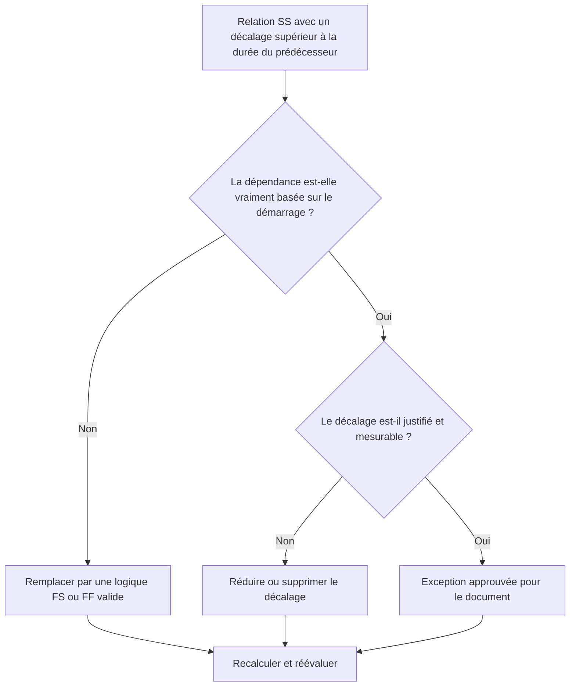

## But

Ce guide aide les planificateurs à examiner et à corriger les relations de début à début lorsque le décalage est supérieur à la durée de l'activité précédente. Il prend en charge une logique CPM plus claire en remplaçant le décalage SS excessif par une logique relationnelle qui représente mieux la séquence de travail réelle.

## Avant de commencer

Rassemblez les informations suivantes avant d’agir :

- Résultat de l'évaluation actuelle pour cette métrique.
- Liste des relations SS dans lesquelles le décalage est supérieur à la durée du prédécesseur.
- ID d’activité prédécesseur et successeur, noms, WBS, durées, calendriers et statut.
- Décalage relationnel, type de relation et toutes contraintes associées.
- Paramètres de calcul du calendrier et base de calendrier utilisées pour le décalage.
- Logique de terrain, d'ingénierie, d'approvisionnement ou de transfert expliquant la dépendance prévue.

## Comprenez votre résultat

Un résultat important est l’absence de relations SS non résolues où le décalage dépasse la durée du prédécesseur.

Un résultat acceptable peut inclure des exceptions documentées, mais celles-ci doivent être rares. Un long décalage SS indique souvent que le type de relation ne correspond pas à la dépendance modélisée.

Un résultat faible signifie que la planification contient plusieurs liens début à début où le successeur ne démarre qu'après un délai plus long que la durée du prédécesseur. Cela peut cacher une logique axée sur la fin derrière une relation SS.

## Objectif d'amélioration

L'objectif est de zéro relation SS non résolue avec un décalage supérieur à la durée du prédécesseur.

L'objectif est de confirmer si chaque relation doit rester SS, être convertie en logique FS ou FF, voir le décalage réduit ou être documentée comme une exception valide.

## Plan d'action

### Étape 1 : Identifiez le problème principal

Créez une mise en page ou une exportation P6 qui répertorie les relations SS dans lesquelles le décalage est supérieur à la durée du prédécesseur. Incluez l'ID d'activité du prédécesseur et du successeur, le nom de l'activité, le WBS, la durée d'origine, la durée restante, le type de relation, le décalage, le calendrier, la marge totale et l'état de l'activité.

Examinez chaque relation et demandez :

- Pourquoi le successeur commence-t-il après un si long retard ?
- Le successeur dépend-il réellement du démarrage du prédécesseur ou de la fin du prédécesseur ?
- Le décalage est-il supérieur à la durée initiale du prédécesseur, à la durée restante, ou aux deux ?
- Le décalage est-il utilisé pour modéliser l’approvisionnement, le traitement, le délai d’examen, l’accès ou une autre période d’attente réelle ?
- Une relation FS ou FF rendrait-elle la dépendance plus claire ?

### Étape 2 : appliquer les correctifs recommandés

Si le successeur doit commencer après la fin du prédécesseur, remplacez la relation SS par une relation FS. Si le travail peut se chevaucher mais que le successeur ne peut pas se terminer tant que le prédécesseur n'a pas terminé, utilisez la logique FF.

Si la relation est réellement basée sur le démarrage, examinez la valeur de décalage. Réduisez le décalage excessif là où il a été utilisé comme espace réservé approximatif ou hérité d'une logique copiée. Si le décalage représente une période d'attente réelle, confirmez que l'unité, le calendrier et l'explication sont corrects.

Évitez d'utiliser un long décalage pour remplacer des activités qui devraient être visibles dans le calendrier. Si le décalage représente le temps de révision, de traitement, de livraison, de mobilisation ou d'approbation, envisagez la modélisation qui fonctionne comme une activité distincte.

### Étape 3 : Supprimer les bloqueurs courants

Les bloqueurs courants incluent la logique copiée des horaires précédents, les périodes d'attente masquées, la confusion dans les calendriers et la pression pour garder le réseau simple. Résolvez-les en confirmant la dépendance prévue auprès du propriétaire responsable.

Un autre bloqueur considère le décalage comme inoffensif. Long lag can be difficult to review, can hide risk, and can make delay analysis harder because the waiting period is not visible as an activity.

### Étape 4 : Validez les modifications

Recalculez le planning après corrections. Réexécutez la métrique et confirmez que chaque élément restant est soit corrigé, soit documenté en tant qu'exception approuvée.

Examinez la marge totale, le chemin le plus long, le chemin critique et les jalons à court terme. Si les changements dans la relation déplacent les dates clés, communiquez le résultat au responsable des contrôles du projet ou au réviseur du PMO.

## Calendrier d'amélioration

### Jour 1 : Examiner et diagnostiquer

Exécutez la métrique, confirmez la liste des relations concernées et séparez les éléments en type de relation incorrect, décalage excessif, activité masquée, problème de calendrier et exception possible.

### Jours 2-3 : Mettre en œuvre les actions prioritaires

Corrigez d’abord les relations critiques et quasi critiques. Convertissez la logique SS en FS ou FF le cas échéant, réduisez les décalages injustifiés et documentez les exceptions valides.

### Jours 4 et 5 : surveiller les premiers résultats

Recalculez le calendrier et examinez les mouvements dans les dates margees, de chemin le plus long et de jalon.

### Jour 6 : derniers ajustements

Résolvez les éléments incertains restants avec la discipline responsable, le propriétaire du package ou le responsable de la construction.

### Jour 7 : Réévaluer et comparer

Réexécutez l’évaluation et comparez le résultat au seuil cible.

## Suivi des progrès

Utilisez un simple tracker pour gérer les corrections et les approbations.

| Date | Mesure prise | Impact attendu | Résultat / Observation | Étape suivante |
| --- | --- | --- | --- | --- |
| [Date] | Décalage SS révisé supérieur à la durée du prédécesseur | Identifier une logique faible ou peu claire | [Résultat observé] | Attribuer des corrections |
| [Date] | Relation convertie en FS ou FF | Améliorer la clarté de la logique CPM | [Résultat observé] | Recalculer le planning |
| [Date] | Décalage réduit ou documenté | Améliorer la traçabilité des avis | [Résultat observé] | Réévaluer la métrique |

## Si les résultats ne s'améliorent pas

Si les résultats ne s'améliorent pas, vérifiez si les mêmes modèles de relation se répètent dans un domaine WBS spécifique, une discipline ou une section de planning copiée. Des résultats répétés peuvent indiquer que l'équipe utilise le décalage SS comme raccourci standard au lieu de modéliser de véritables dépendances.

Faites remonter les éléments non résolus lorsqu'ils affectent des travaux critiques, quasi-critiques, contractuels, liés à l'approvisionnement, à l'approbation ou au transfert.

## Entretien

Examinez cette mesure lors de chaque mise à jour du calendrier et avant l’approbation de la ligne de base. Portez une attention particulière après l'élaboration d'un calendrier copié, le reséquençage, la planification de la récupération ou des modifications majeures de la portée.

## Liste de contrôle récapitulative

- [ ] Résultat actuel examiné
- [ ] Seuil cible confirmé
- [ ] Principal problème identifié
- [ ] Les relations SS revues
- [ ] Décalage excessif corrigé ou justifié
- [ ] Remplacements FS ou FF appliqués si nécessaire
- [ ] Travail caché modélisé le cas échéant
- [ ] Horaire recalculé
- [ ] Résultats surveillés
- [ ] Évaluation répétée
- [ ] Prochaines étapes documentées
## Contenu associé
- [Modèle de blog](03_blog_template.md)
- [Qu'est-ce qu'un horaire](../../08b_blogs_fr/01_WHAT%20A%20SCHEDULE%20IS/01_blog.md)
- [Logique robuste](../../08b_blogs_fr/02_ROBUST%20LOGIC/02_ROBUST%20LOGIC.md)
