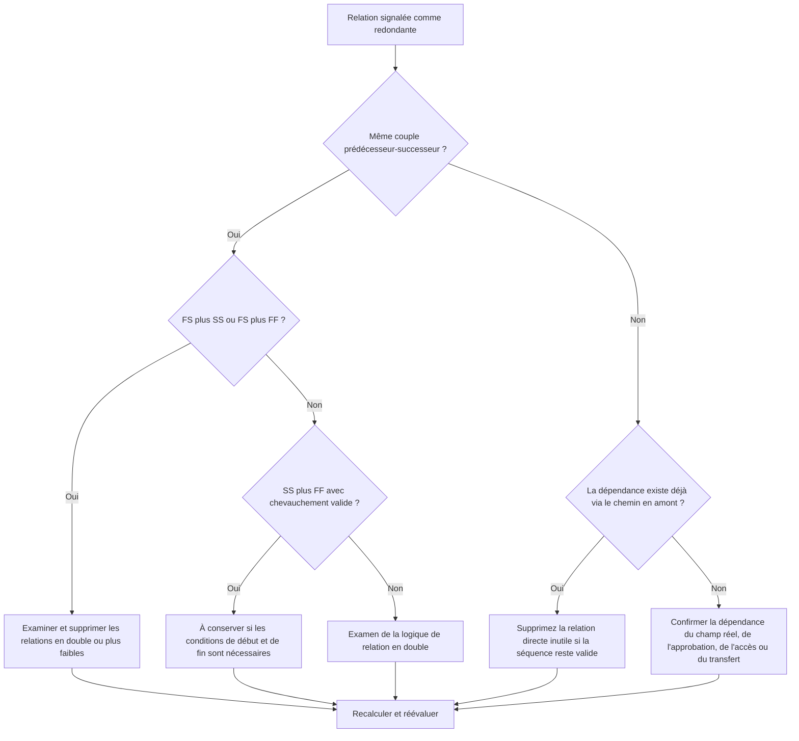

# Logique redondante dans les planifications Primavera P6 - Guide d’amélioration

## But

Ce guide aide les planificateurs à identifier et à supprimer la logique redondante d'une planification Primavera P6. Cela s'applique aux modèles de relations en double, à la logique répétée des prédécesseurs et aux dépendances inutiles qui ne représentent pas une véritable séquence de travail.

## Avant de commencer

Rassemblez les informations suivantes avant d’agir :

- Résultat de l'évaluation actuelle pour cette métrique.
- Liste des activités et des relations signalées comme logiques redondantes.
- Détails du prédécesseur et du successeur pour chaque activité signalée.
- Types de relations, décalages, calendriers, marge totale et indicateurs de relation de conduite.
- WBS, codes d'activité et propriété des disciplines ou des lots de travaux.
- Informations sur le terrain, l'ingénierie, l'approvisionnement, l'approbation ou le transfert qui expliquent la véritable dépendance.

## Comprenez votre résultat

Un résultat important est l’absence de relations redondantes non résolues.

Un résultat acceptable peut inclure de rares exceptions documentées où une logique d'apparence dupliquée est intentionnellement utilisée pour une raison défendable. Ces cas doivent être examinés attentivement car la logique redondante est généralement un problème de qualité de planification.

Un résultat faible signifie que le planning contient une logique relationnelle répétée ou inutile. Cela peut se produire lorsque les sections de planification copiées ne sont pas nettoyées, que des relations sont ajoutées sans vérifier les chemins existants ou que plusieurs types de dépendances sont utilisés entre les mêmes activités.

## Objectif d'amélioration

L’objectif est de zéro relation redondante non résolue.

L’objectif est de conserver uniquement les relations qui représentent des dépendances réelles et de supprimer la logique qui duplique, masque ou surestime la séquence de travail réelle.

## Plan d'action

### Étape 1 : Identifiez le problème principal

Créez une mise en page P6, un rapport ou un examen des relations externes qui identifie la logique probablement redondante. Focus sur ces cas :

- Le même prédécesseur s'est connecté plus d'une fois au même successeur, notamment FS plus SS ou FS plus FF.
- SS plus FF entre les deux mêmes activités peuvent être valides lorsque le chevauchement est correctement modélisé et que les conditions de début et de fin sont importantes.
- Une activité avec le même prédécesseur et le même type de relation que son propre prédécesseur, créant une logique héritée répétée tout au long de la chaîne.
- Chaînes de prédécesseurs répétées plus longues où la même dépendance apparaît plusieurs pas en arrière.
- Dépendances qui ne modifient pas le séquençage, les dates, la marge, le transfert, l'accès ou le contrôle des risques.

Examinez chaque relation signalée et demandez :

- Cette relation ajoute-t-elle une réelle dépendance ?
- La dépendance est-elle déjà représentée par une autre relation entre les mêmes activités ?
- La dépendance est-elle déjà représentée par un chemin en amont ?
- La suppression de la relation modifierait-elle la logique de planification valide ou simplifierait-elle seulement le réseau ?
- La relation détermine-t-elle les dates pour une raison légitime, ou uniquement parce qu'une logique redondante a été ajoutée ?

### Étape 2 : appliquer les correctifs recommandés

Commencez par des doublons exacts et des paires prédécesseur-successeur répétées. Si les deux mêmes activités sont liées à FS plus SS ou FS plus FF, déterminez quelle relation représente la véritable dépendance. Supprimez la relation qui duplique ou affaiblit la logique.

Examinez les paires SS et FF séparément. Cette combinaison peut être valide lorsqu'une relation contrôle le moment où les travaux superposés peuvent commencer et les autres contrôles le moment où ils peuvent se terminer. Conservez-le uniquement lorsque les deux conditions sont réelles et documentées par la séquence de travail.

Ensuite, passez en revue la logique héritée du prédécesseur. Si l'activité C a la même relation de prédécesseur que l'activité B et que l'activité B est déjà un prédécesseur de l'activité C, la relation directe avec l'activité précédente peut s'avérer inutile. Supprimez-le si la séquence CPM reste correcte via le chemin existant.

Enfin, supprimez les dépendances inutiles qui ne prennent pas en charge la séquence de travail, l'accès, l'approbation, le transfert, le contrôle des risques ou la logique contractuelle.

### Étape 3 : Supprimer les bloqueurs courants

Les bloqueurs courants incluent la copie de la logique à partir d'anciennes planifications, la sur-modélisation pour donner l'impression que le réseau est connecté et l'ajout de relations lors des mises à jour sans vérifier le chemin existant.

Un autre obstacle est la crainte que la suppression des relations affaiblisse le calendrier. L’objectif n’est pas de supprimer les contrôles valides ; il s'agit de supprimer les relations qui font double emploi avec des contrôles déjà présents dans le réseau.

### Étape 4 : Validez les modifications

Recalculez la planification après avoir supprimé ou ajusté la logique redondante. Examinez la marge totale, les relations déterminantes, le chemin le plus long, le chemin critique et les dates des étapes clés.

Si la suppression d'une relation modifie les dates de manière inattendue, vérifiez si le lien supprimé servait réellement une dépendance valide ou si une autre relation manquante doit être ajoutée avec plus de précision.

## Calendrier d'amélioration

### Jour 1 : Examiner et diagnostiquer

Exécutez la métrique, confirmez la liste des relations concernées et séparez les résultats en paires en double, combinaisons FS plus SS/FF, logique prédécesseur héritée et dépendances inutiles.

### Jours 2-3 : Mettre en œuvre les actions prioritaires

Corrigez d’abord les relations critiques et quasi critiques. Supprimez les doublons exacts, nettoyez les paires de prédécesseurs répétées et documentez les combinaisons SS et FF valides.

### Jours 4 et 5 : surveiller les premiers résultats

Recalculez le calendrier et examinez les mouvements en termes de marge, de chemin le plus long, de relations de conduite et de dates de jalons.

### Jour 6 : derniers ajustements

Résolvez les éléments incertains avec la discipline responsable, le propriétaire du package ou le responsable de la construction.

### Jour 7 : Réévaluer et comparer

Réexécutez l’évaluation et comparez le résultat au seuil cible.

## Suivi des progrès

Utilisez un simple tracker pour gérer les corrections et les approbations.

| Date | Mesure prise | Impact attendu | Résultat / Observation | Étape suivante |
| --- | --- | --- | --- | --- |
| [Date] | Liste des relations redondantes révisée | Identifiez la logique en double ou inutile | [Résultat observé] | Attribuer des corrections |
| [Date] | Relations en double supprimées | Simplifiez le réseau CPM | [Résultat observé] | Recalculer le planning |
| [Date] | Exceptions valides documentées | Améliorer la traçabilité des avis | [Résultat observé] | Réévaluer la métrique |

## Si les résultats ne s'améliorent pas

Si les résultats ne s'améliorent pas, vérifiez si la logique redondante est concentrée dans une zone WBS spécifique, une section de projet copiée, une discipline ou une période de mise à jour du planning. Des constatations répétées peuvent indiquer que le nettoyage des relations ne fait pas partie du flux de travail de planification normal.

Faites remonter la logique redondante non résolue lorsqu'elle affecte un travail critique, quasi critique, contractuel, d'accès, d'approbation ou de transfert.

## Entretien

Examinez cette mesure lors de chaque mise à jour du calendrier et avant l’approbation de la ligne de base. Portez une attention particulière après l'élaboration d'un calendrier copié, le reséquençage, la planification de récupération ou les révisions logiques importantes.

## Liste de contrôle récapitulative

- [ ] Résultat actuel examiné
- [ ] Seuil cible confirmé
- [ ] Principal problème identifié
- [ ] Examen des paires prédécesseur-successeur en double
- [ ] Combinaisons FS plus SS ou FS plus FF corrigées
- [ ] Combinaisons SS plus FF valides documentées
- [ ] La logique du prédécesseur hérité a été revue
- [ ] Dépendances inutiles supprimées
- [ ] Horaire recalculé
- [ ] Résultats surveillés
- [ ] Évaluation répétée
- [ ] Prochaines étapes documentées
## Contenu associé
- [Logique redondante dans les planifications Primavera P6 - Vue d’ensemble](01_overview_template.md)
- [Modèle de blog](03_blog_template.md)
- [Qu'est-ce qu'un horaire](../../08b_blogs_fr/01_WHAT%20A%20SCHEDULE%20IS/01_blog.md)
- [Logique robuste](../../08b_blogs_fr/02_ROBUST%20LOGIC/02_ROBUST%20LOGIC.md)
