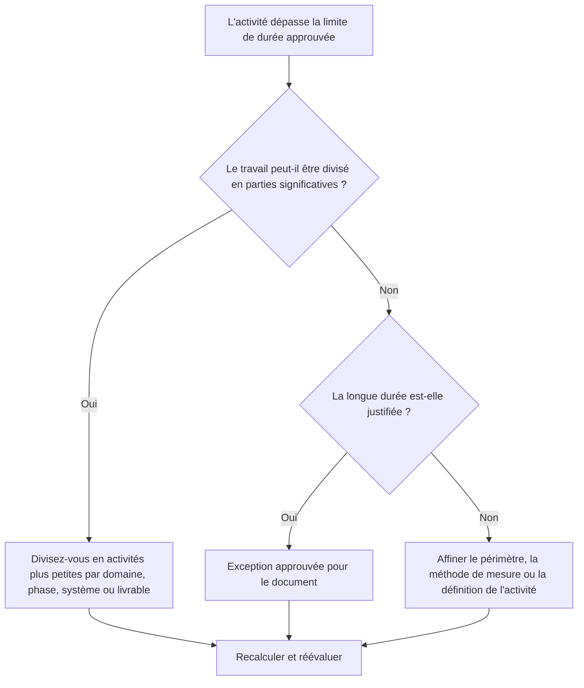

## But

Ce guide aide les planificateurs à examiner et à améliorer les activités dont la durée est supérieure au seuil approuvé du projet. La durée acceptable dépend du type de projet, du niveau de détail, du cycle de reporting, des exigences du contrat et de la sensibilité du client aux activités longues.

## Avant de commencer

Rassemblez les informations suivantes avant d’agir :

- Résultat de l'évaluation actuelle pour cette métrique.
- Durée d'activité maximale approuvée pour le niveau du projet ou du calendrier.
- Liste des activités au-dessus du seuil de durée.
- Durée initiale, durée restante, type d'activité, statut, WBS, calendrier et solde total.
- Exigences de base, attentes des clients en matière de rapports et règles de qualité du planning du PMO.
- Période de planification anticipée, cycle de mise à jour des progrès et propriété de la discipline ou du package.
- Toute exception justifiée, telle que les activités d'approvisionnement, de traitement, de livraison, d'examen, de test ou de niveau d'effort.

## Comprenez votre résultat

Un bon résultat est l’absence d’activités non résolues au-dessus du seuil de longue durée approuvé.

An acceptable result may include documented exceptions, especially for activities that cannot reasonably be broken down or are intentionally managed as summary-like control activities. Celles-ci doivent être limitées et clairement justifiées.

Un résultat faible signifie que le calendrier contient de nombreuses activités trop vastes pour une planification et un contrôle efficaces. Cela peut réduire la visibilité des progrès et rendre plus difficile la compréhension des travaux qui déterminent réellement le calendrier.

## Objectif d'amélioration

L’objectif est de 0 activité non résolue au-dessus de la limite de durée approuvée.

L’objectif est de diviser les activités longues en activités plus petites et significatives où un meilleur contrôle est nécessaire, tout en documentant les exceptions valables lorsqu’une longue durée est appropriée.

## Plan d'action

### Étape 1 : Identifiez le problème principal

Créez une mise en page ou un rapport P6 répertoriant les activités dépassant le seuil de durée défini par le projet. Incluez l'ID d'activité, le nom de l'activité, le WBS, le type d'activité, la durée initiale, la durée restante, le début, la fin, le calendrier, le solde total et l'état de l'activité.

Passez en revue chaque activité et demandez :

- La durée de l'activité est-elle plus longue que le seuil approuvé pour ce type de projet et ce niveau de calendrier ?
- L’activité couvre-t-elle plusieurs étapes de travail, emplacements, systèmes, zones ou livrables ?
- Les progrès peuvent-ils être mesurés objectivement au cours de chaque cycle de mise à jour ?
- L’activité nécessite-t-elle plus de détails car le client ou le PMO est sensible aux longues durées ?
- L'activité est-elle une exception valable qui doit rester longue ?

### Étape 2 : appliquer les correctifs recommandés

Divisez les activités longues où le travail peut être planifié et mesuré en morceaux plus petits. Les méthodes de répartition courantes incluent l'emplacement, la zone WBS, la discipline, le système, le livrable, la phase, la séquence d'équipage ou la période de reporting.

Lors du fractionnement d'une activité, conservez la séquence logique réelle. Ajoutez les prédécesseurs et successeurs appropriés, attribuez le calendrier correct et confirmez que les nouvelles activités reflètent la manière dont le travail sera réellement exécuté.

Ne divisez pas les activités uniquement pour satisfaire la métrique. La répartition devrait améliorer le contrôle, la mesure des progrès, la planification prospective ou la clarté des rapports.

### Étape 3 : Supprimer les bloqueurs courants

Les bloqueurs courants incluent une définition incomplète de la portée, une structure WBS faible, une saisie sur le terrain limitée et une pression pour maintenir le nombre d'activités à un faible niveau. Résolvez ces problèmes en examinant les longues activités avec la discipline responsable, le propriétaire du package ou le responsable de la construction.

Un autre bloqueur utilise une longue activité pour représenter un travail qui devrait être planifié sous forme de séquence. Si l'activité contient plusieurs transferts, faces de travail, livrables ou points de contrôle, elle nécessite probablement plus de détails.

### Étape 4 : Validez les modifications

Recalculez le planning après avoir fractionné ou ajusté de longues activités. Confirmez que chaque nouvelle activité a une logique, une durée, un calendrier et une mesure de progression appropriés.

Examinez la marge totale, le chemin critique, le chemin le plus long et les dates des jalons. Si la répartition change les dates clés, communiquez la raison au responsable des contrôles du projet ou à l'examinateur du PMO.

## Calendrier d'amélioration

### Jour 1 : Examiner et diagnostiquer

Exécutez la métrique, confirmez le seuil de durée et séparez les activités en candidats fractionnés, exceptions valides et éléments nécessitant la contribution du propriétaire.

### Jours 2-3 : Mettre en œuvre les actions prioritaires

Corrigez d’abord les activités critiques, quasi-critiques et sensibles au client. Décomposez les grandes activités et documentez les exceptions valides.

### Jours 4 et 5 : surveiller les premiers résultats

Recalculez le calendrier et examinez les mouvements en termes de marge, de chemin le plus long, de dates jalons et de visibilité anticipée.

### Jour 6 : derniers ajustements

Résolvez les éléments incertains restants avec la discipline responsable, le propriétaire du package ou le responsable des contrôles du projet.

### Jour 7 : Réévaluer et comparer

Réexécutez l’évaluation et comparez le résultat au seuil cible.

## Suivi des progrès

Utilisez un simple tracker pour gérer les corrections et les approbations.

| Date | Mesure prise | Impact attendu | Résultat / Observation | Étape suivante |
| --- | --- | --- | --- | --- |
| [Date] | Activités de longue durée revues | Identifier les activités nécessitant une ventilation | [Résultat observé] | Attribuer des propriétaires |
| [Date] | Divisez l'activité en étapes de travail plus petites | Améliorer la visibilité des progrès | [Résultat observé] | Recalculer le planning |
| [Date] | Exception valide documentée | Améliorer la traçabilité des avis | [Résultat observé] | Réévaluer la métrique |

## Si les résultats ne s'améliorent pas

Si les résultats ne s'améliorent pas, vérifiez si le seuil de durée n'est pas clair, s'il est appliqué de manière incohérente ou s'il n'est pas aligné sur le niveau du calendrier. Vérifiez également si les activités longues sont concentrées dans un domaine WBS, une discipline ou une phase de projet spécifique.

Augmentez les activités de longue durée non résolues lorsqu'elles affectent un travail critique, quasi critique, contractuel, de reporting ou sensible au client.

## Entretien

Examinez cette mesure lors de chaque mise à jour du calendrier, développement de la ligne de base et exercice majeur de reséquençage. Mettez à jour le seuil si le projet passe à une phase ou un niveau de détail différent.

## Liste de contrôle récapitulative

- [ ] Résultat actuel examiné
- [ ] Seuil cible confirmé
- [ ] Principal problème identifié
- [ ] Activités longues revues
- [ ] Candidats divisés identifiés
- [ ] Activités décomposées là où c'est utile
- [ ] Exceptions valides documentées
- [ ] Horaire recalculé
- [ ] Résultats surveillés
- [ ] Évaluation répétée
- [ ] Prochaines étapes documentées
## Contenu associé
- [Modèle de blog](03_blog_template.md)
- [Qu'est-ce qu'un horaire](../../08b_blogs_fr/01_WHAT%20A%20SCHEDULE%20IS/01_blog.md)
- [Logique robuste](../../08b_blogs_fr/02_ROBUST%20LOGIC/02_ROBUST%20LOGIC.md)
