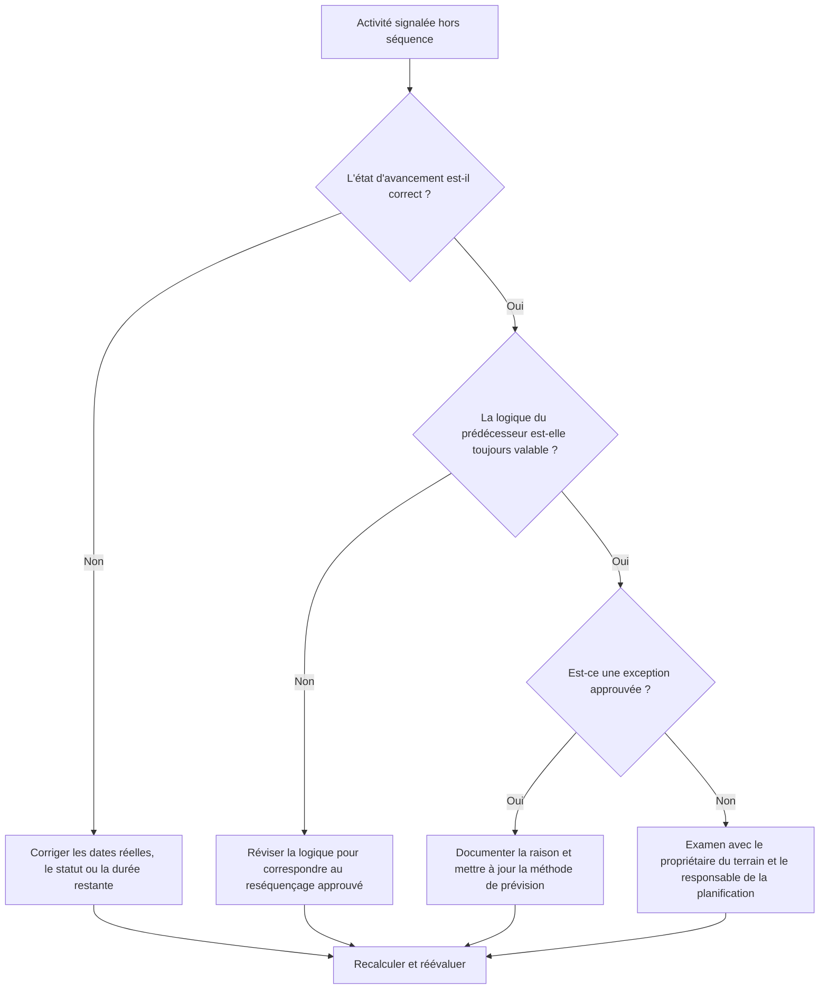

## But

Ce guide aide les planificateurs à examiner et à corriger les activités hors séquence dans Primavera P6. Cela s'applique lorsqu'une activité a démarré ou progressé avant que la logique de son prédécesseur requise n'ait été satisfaite.

## Avant de commencer

Rassemblez les informations suivantes avant d’agir :

- Résultat de l'évaluation actuelle pour cette métrique.
- Liste des activités signalées comme étant hors séquence.
- Date des données utilisée dans la dernière mise à jour.
- Début réel, fin réelle, durée restante et statut de l'activité.
- Détails des relations prédécesseurs et successeurs, y compris le type de relation et le décalage.
- Planifiez les paramètres de calcul, en particulier la logique conservée et le remplacement de la progression.
- Explication sur le terrain de la raison pour laquelle les travaux ont progressé avant que la logique planifiée ne soit terminée.

## Comprenez votre résultat

Un résultat fort est zéro activité hors séquence non résolue.

Un résultat acceptable peut inclure des exceptions documentées où le travail a été intentionnellement rééchelonné et la logique du calendrier a été mise à jour pour refléter le nouveau plan.

Un résultat faible signifie que la mise à jour du planning contient une progression qui entre en conflit avec le réseau logique existant. Cela peut indiquer un statut incorrect, des valeurs réelles manquantes, une logique obsolète ou un réordonnancement des champs réels qui n'a pas encore été reflété dans les prévisions.

## Objectif d'amélioration

L’objectif est de 0 activité hors séquence non résolue.

L'objectif est de déterminer si chaque élément est une erreur d'état, une erreur logique ou un événement de remise en séquence réel, puis de corriger le planning afin qu'il représente le plan actuel.

## Plan d'action

### Étape 1 : Identifiez le problème principal

Créez une mise en page P6 ou un rapport répertoriant les activités hors séquence. Inclut l'ID d'activité, le nom de l'activité, le WBS, le statut, le début réel, la fin réelle, la durée restante, le début, la fin, la marge totale, les prédécesseurs, les successeurs, le type de relation, le décalage et les indicateurs de relation directrice.

Passez en revue chaque activité et demandez :

- L’activité a-t-elle réellement démarré avant que l’exigence précédente ne soit satisfaite ?
- Le statut de prédécesseur est-il correct ?
- Le statut de successeur est-il correct ?
- La relation est-elle toujours valide après le reséquençage des champs ?
- La logique du calendrier doit-elle être modifiée ou la mise à jour de la progression doit-elle être corrigée ?
- Quelle option de planification P6 est utilisée : logique conservée ou remplacement de la progression ?

### Étape 2 : appliquer les correctifs recommandés

Corrigez d’abord les erreurs d’état. Si un début réel, une fin réelle, une durée restante ou un statut de prédécesseur sont erronés, mettez à jour les données d'activité avant de modifier la logique.

Si la séquence de champs a changé, révisez la logique pour représenter le plan actuel approuvé. Ne supprimez pas simplement les relations de prédécesseur pour effacer la métrique. Remplacez la logique obsolète par des relations qui correspondent à la séquence d'exécution réelle.

Examinez la logique conservée et les paramètres de remplacement de la progression. La logique conservée préserve généralement la logique du prédécesseur d'origine pour le travail restant, tandis que le remplacement de la progression peut permettre au travail restant de continuer malgré une logique du prédécesseur incomplète. Le paramètre doit être conforme à la procédure de contrôle du projet et être compris avant de rendre compte du résultat.

### Étape 3 : Supprimer les bloqueurs courants

Les bloqueurs courants incluent les mises à jour tardives des champs, les dates réelles incomplètes, la pression pour accepter les progrès sans examen logique et la confusion concernant les options de calcul du calendrier.

Un autre bloqueur consiste à traiter les progrès hors séquence comme un simple problème logiciel. La vraie question est de savoir si le projet a modifié la séquence des travaux et si le calendrier reflète désormais la séquence approuvée.

### Étape 4 : Validez les modifications

Recalculez le planning après corrections. Réexécutez la vérification hors séquence et confirmez que chaque élément restant est corrigé, justifié ou affecté au suivi.

Examinez la marge totale, le chemin le plus long, le chemin critique et les jalons à court terme. Les corrections hors séquence peuvent modifier les dates de prévision, alors communiquez les impacts significatifs au responsable des contrôles du projet ou au réviseur du PMO.

## Calendrier d'amélioration

### Jour 1 : Examiner et diagnostiquer

Exécutez la métrique, confirmez la date des données et séparez les résultats en erreurs d'état, erreurs logiques, reséquençage réel et exceptions possibles.

### Jours 2-3 : Mettre en œuvre les actions prioritaires

Corrigez d’abord les activités critiques, quasi critiques et anticipées. Mettez à jour le statut, révisez la logique obsolète et documentez le reséquençage approuvé.

### Jours 4 et 5 : surveiller les premiers résultats

Recalculez le calendrier et examinez les mouvements dans les dates de marge, de chemin le plus long, de chemin critique et de jalon.

### Jour 6 : derniers ajustements

Résolvez les éléments restants avec les responsables de terrain, les propriétaires de discipline ou le responsable de la planification.

### Jour 7 : Réévaluer et comparer

Réexécutez l’évaluation et comparez le résultat au seuil cible.

## Suivi des progrès

Utilisez un simple tracker pour gérer les corrections et les approbations.

| Date | Mesure prise | Impact attendu | Résultat / Observation | Étape suivante |
| --- | --- | --- | --- | --- |
| [Date] | Activités hors séquence examinées | Identifier l'état ou le problème de logique | [Résultat observé] | Attribuer un propriétaire |
| [Date] | Statut corrigé ou dates réelles | Améliorer la précision des mises à jour | [Résultat observé] | Recalculer le planning |
| [Date] | Logique révisée pour un reséquençage approuvé | Améliorer la fiabilité des prévisions | [Résultat observé] | Réévaluer la métrique |

## Si les résultats ne s'améliorent pas

Si les résultats ne s’améliorent pas, vérifiez si les mêmes domaines de travail progressent de manière répétée dans le désordre. Cela peut indiquer une faible discipline de mise à jour, une logique irréaliste, une coordination incomplète sur le terrain ou un réordonnancement fréquent et non approuvé.

Faites remonter les éléments non résolus lorsqu'ils affectent un travail critique, quasi critique, contractuel, d'accès, de transfert ou sensible au client.

## Entretien

Examinez cette métrique à chaque cycle de mise à jour avant de publier la planification. Confirmez que les progrès hors séquence sont résolus avant que les rapports de planification ne soient utilisés pour les rapports PMO, l'analyse des retards ou la planification de la reprise.

## Liste de contrôle récapitulative

- [ ] Résultat actuel examiné
- [ ] Seuil cible confirmé
- [ ] Date des données confirmée
- [ ] Principal problème identifié
- [ ] Erreurs de statut corrigées
- [ ] Erreurs logiques corrigées
- [ ] Reséquençage approuvé et documenté
- [ ] Paramètre de calcul du calendrier révisé
- [ ] Horaire recalculé
- [ ] Résultats surveillés
- [ ] Évaluation répétée
- [ ] Prochaines étapes documentées
## Contenu associé
- [Modèle de blog](03_blog_template.md)
- [Qu'est-ce qu'un horaire](../../08b_blogs_fr/01_WHAT%20A%20SCHEDULE%20IS/01_blog.md)
- [Logique robuste](../../08b_blogs_fr/02_ROBUST%20LOGIC/02_ROBUST%20LOGIC.md)
