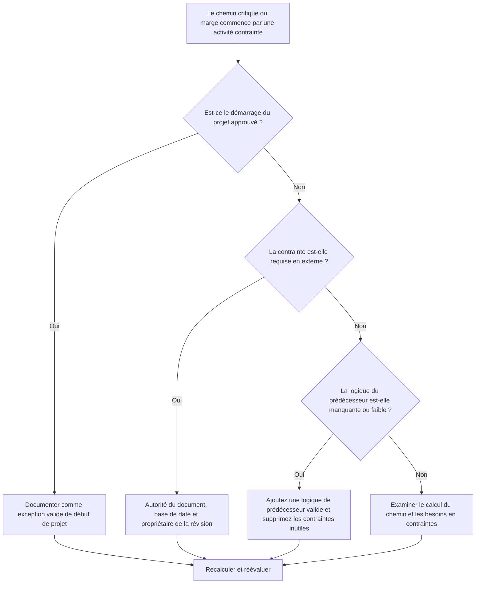

## But

Ce guide aide les planificateurs à examiner les chaînes de chemin critique ou de chemin de marge qui commencent par une activité contrainte. Le début du projet approuvé constitue normalement une exception valable ; le problème est lorsqu'un chemin en aval commence à partir d'une contrainte au lieu d'une séquence logique.

## Avant de commencer

Rassemblez les informations suivantes avant d’agir :

- Résultat de l'évaluation actuelle pour cette métrique.
- Rapport de chemin critique ou de chemin de marge de Primavera P6.
- Première activité sur chaque chemin balisé.
- Type de contrainte, date de contrainte et toutes dates attendues.
- Relations de prédécesseur et de successeur pour l’activité de début de chemin.
- Date des données, jalon de début du projet, exigences de base et règles de planification du PMO ou du client.
- Explication de toute contrainte externe approuvée.

## Comprenez votre résultat

Un résultat fort est zéro chemin critique ou marge non résolu commençant par une contrainte, à l'exception du début du projet approuvé.

Un résultat acceptable peut inclure des contraintes externes documentées, telles qu'un avis de poursuite, une autorisation d'accès du propriétaire, une autorisation ou des points d'arrêt contractuels. Celles-ci doivent être clairement justifiées.

Un résultat faible signifie que le chemin peut être contrôlé par des dates imposées au lieu de la logique du réseau. Cela peut rendre le chemin critique ou le chemin de marge moins fiable pour les prévisions, les rapports et l'analyse des retards.

## Objectif d'amélioration

La cible est 0 chemin non résolu commençant par une contrainte.

L'objectif est de confirmer si le chemin doit partir du début du projet approuvé, d'une logique prédécesseur valide ou d'une contrainte externe documentée.

## Plan d'action

### Étape 1 : Identifiez le problème principal

Créez une mise en page ou un rapport P6 qui affiche le chemin critique et les chemins marges sélectionnés. Pour la première activité de chaque chemin, indiquez l'ID d'activité, le nom de l'activité, le WBS, le début, la fin, la marge totale, la marge libre, la contrainte principale, la date de contrainte, les prédécesseurs, les successeurs et le statut de l'activité.

Examinez chaque chemin signalé et demandez :

- S'agit-il d'un début de projet approuvé ou d'une activité faisant l'objet d'un avis de poursuite ?
- La contrainte est-elle requise contractuellement ou extérieurement ?
- L'activité comporte-t-elle une logique de prédécesseur manquante ?
- La contrainte masque-t-elle un réseau horaire faible ou incomplet ?
- Le chemin commencerait-il différemment si la contrainte était supprimée ?
- Le démarrage contraint est-il documenté pour l'examen du PMO ou du client ?

### Étape 2 : appliquer les correctifs recommandés

Si l'activité contrainte correspond au début du projet approuvé, documentez-la comme une exception valide et confirmez qu'il s'agit du point de départ prévu pour le chemin.

Si la contrainte est requise de l’extérieur, conservez-la uniquement lorsque la raison est claire. Documentez la source, telle qu'une étape contractuelle, une autorisation d'accès, un permis, une instruction du propriétaire ou une exigence réglementaire.

Si la contrainte n'est pas requise, supprimez-la et ajoutez une logique de prédécesseur valide lorsque l'activité dépend de travaux, d'approbations, de transferts, d'approvisionnement ou d'accès antérieurs. Recalculez le planning et confirmez que le chemin est désormais logique.

### Étape 3 : Supprimer les bloqueurs courants

Les bloqueurs courants incluent les contraintes héritées des anciennes références, les contraintes utilisées pour forcer les dates, la logique d'interface manquante et la propriété peu claire des dates externes.

Un autre bloqueur suppose qu'un chemin critique est fiable simplement parce que P6 l'identifie. Si le chemin commence par une contrainte inutile, il se peut qu'il reflète un contrôle de date plutôt qu'une véritable logique CPM.

### Étape 4 : Validez les modifications

Recalculez le planning après avoir modifié les contraintes ou la logique. Examinez le chemin critique, le chemin le plus long, les chemins de marge sélectionnés, la marge totale et les dates des jalons clés.

Si le chemin change de manière significative, documentez la raison et communiquez l'impact au responsable des contrôles du projet, au réviseur du PMO ou au planificateur du client.

## Calendrier d'amélioration

### Jour 1 : Examiner et diagnostiquer

Exécutez la métrique, identifiez les activités de début de chemin contraintes et séparez les résultats en exceptions de début de projet, contraintes externes valides, logique manquante et contraintes inutiles.

### Jours 2-3 : Mettre en œuvre les actions prioritaires

Corrigez d’abord les chemins critiques et sensibles au client. Supprimez les contraintes inutiles, ajoutez la logique manquante et documentez les exceptions approuvées.

### Jours 4 et 5 : surveiller les premiers résultats

Recalculez le calendrier et examinez les mouvements dans le chemin critique, le chemin le plus long, les chemins marges et les dates des jalons.

### Jour 6 : derniers ajustements

La résolution du chemin contraint restant commence par le propriétaire responsable, le responsable des contrôles du projet ou le réviseur client.

### Jour 7 : Réévaluer et comparer

Réexécutez l’évaluation et comparez le résultat au seuil cible.

## Suivi des progrès

Utilisez un simple tracker pour gérer les corrections et les approbations.

| Date | Mesure prise | Impact attendu | Résultat / Observation | Étape suivante |
| --- | --- | --- | --- | --- |
| [Date] | Activités de démarrage de chemin contraintes examinées | Identifier les débuts de chemins basés sur la date | [Résultat observé] | Attribuer un propriétaire |
| [Date] | Suppression de la contrainte inutile | Restaurer le chemin logique | [Résultat observé] | Recalculer le planning |
| [Date] | Exception approuvée et documentée | Améliorer la traçabilité des avis | [Résultat observé] | Réévaluer la métrique |

## Si les résultats ne s'améliorent pas

Si les résultats ne s'améliorent pas, vérifiez si les contraintes sont concentrées dans une zone WBS, un package d'interface ou une phase de projet spécifique. Des constatations répétées peuvent indiquer que le calendrier est contrôlé par des dates imposées plutôt que par une logique complète.

Les chemins contraints non résolus commencent lorsqu'ils affectent des travaux critiques, quasi-critiques, contractuels, sensibles au client, liés à l'accès ou au transfert.

## Entretien

Examinez cette mesure lors de chaque mise à jour du calendrier, examen de la ligne de base et exercice majeur de reséquençage. Portez une attention particulière après la planification de la récupération, les changements de date du client ou les révisions de l'interface.

## Liste de contrôle récapitulative

- [ ] Résultat actuel examiné
- [ ] Seuil cible confirmé
- [ ] Rapport de chemin critique ou marge examiné
- [ ] Exceptions au démarrage du projet identifiées
- [ ] Base de contraintes vérifiée
- [ ] Logique manquante corrigée
- [ ] Contraintes inutiles supprimées
- [ ] Exceptions approuvées documentées
- [ ] Horaire recalculé
- [ ] Résultats surveillés
- [ ] Évaluation répétée
- [ ] Prochaines étapes documentées
## Contenu associé
- [Modèle de blog](03_blog_template.md)
- [Qu'est-ce qu'un horaire](../../08b_blogs_fr/01_WHAT%20A%20SCHEDULE%20IS/01_blog.md)
- [Logique robuste](../../08b_blogs_fr/02_ROBUST%20LOGIC/02_ROBUST%20LOGIC.md)
