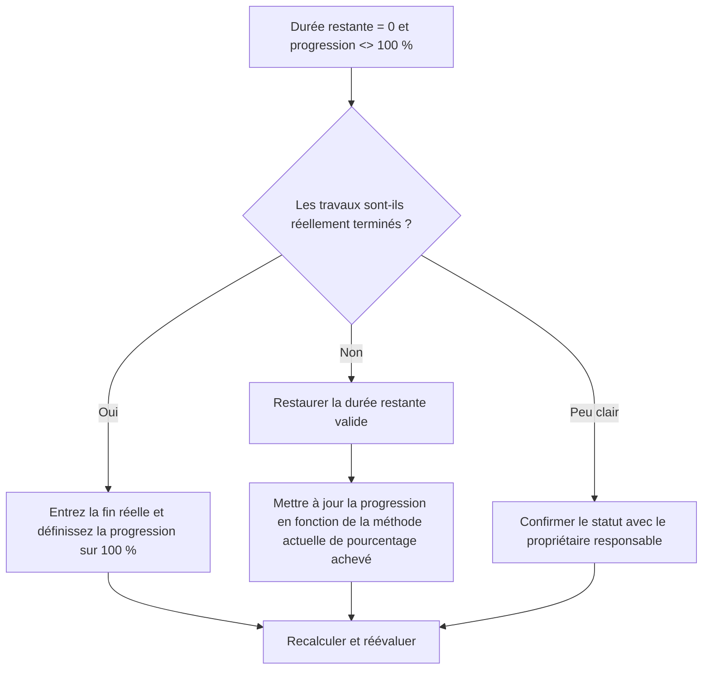

# Activités avec une durée restante de 0 et une progression non à 100 % - Guide d’amélioration

## But

Ce guide aide les planificateurs à examiner et à corriger les activités dont la durée restante est égale à 0 mais dont la progression n'est pas de 100 %. Il prend en charge des mises à jour de statut Primavera P6 plus propres en alignant la durée restante, le pourcentage de progression, la fin réelle et le statut d'activité.

## Avant de commencer

Rassemblez les informations suivantes avant d’agir :

- Résultat de l'évaluation actuelle pour cette métrique.
- Liste des activités avec Durée restante = 0 et progression <> 100%.
- Statut de l'activité, début réel, fin réelle, durée initiale, durée restante et durée de fin.
- Type de pourcentage achevé et champs de progression associés.
- Pourcentage physique achevé, pourcentage achevé pour la durée, pourcentage achevé pour les unités et pourcentage achevé pour l'activité.
- Date des données et dernières notes de mise à jour des progrès.
- Confirmation sur le terrain indiquant si le travail est terminé ou s'il reste encore du travail.

## Comprenez votre résultat

Un bon résultat est une activité nulle avec une durée restante = 0 et une progression inférieure ou supérieure à 100 %.

Un résultat acceptable peut inclure de rares cas documentés dans lesquels une méthode spécifique de pourcentage achevé crée une différence de déclaration temporaire, mais ceux-ci doivent être résolus avant la déclaration formelle.

Un résultat faible signifie que le planning contient des activités dont le travail restant et l'état d'avancement ne concordent pas. Cela peut créer des rapports inexacts, des problèmes de valeur acquise ou un statut d'achèvement trompeur.

## Objectif d'amélioration

L'objectif est de 0 activité non résolue avec une durée restante = 0 et une progression <> 100 %.

L'objectif est de confirmer si chaque activité est terminée, si sa progression n'a pas été mise à jour de manière incorrecte ou si elle utilise une méthode de pourcentage achevé qui doit être révisée.

## Plan d'action

### Étape 1 : Identifiez le problème principal

Créez une présentation ou un rapport P6 qui filtre les activités pour lesquelles la durée restante est égale à 0 et la progression n'est pas de 100 %. Incluez l'ID d'activité, le nom de l'activité, le WBS, l'état de l'activité, le début réel, la fin réelle, la durée d'origine, la durée restante, le type de pourcentage achevé, le pourcentage physique achevé, la durée % achevée, le pourcentage d'unités achevées et le pourcentage d'achèvement de l'activité.

Passez en revue chaque activité et demandez :

- Les travaux sont-ils réellement terminés ?
- Si c'est terminé, la fin réelle est-elle manquante ?
- Si ce n’est pas terminé, pourquoi la durée restante est-elle de 0 ?
- Quel type de pourcentage achevé est utilisé ?
- La valeur de progression provient-elle de la progression physique, de la durée ou des unités ?
- S'agit-il d'une erreur de mise à jour du statut ou d'un problème de calcul de progression ?

### Étape 2 : appliquer les correctifs recommandés

Si le travail est terminé, mettez à jour l'activité comme étant terminée. Entrez la fin réelle, confirmez que la durée restante est de 0 et confirmez que la progression est de 100 % selon la procédure de mise à jour du projet.

Si les travaux ne sont pas terminés, restaurez une durée restante appropriée. Confirmez le travail restant avec le propriétaire responsable et mettez à jour le champ de progression pertinent en fonction du type de pourcentage achevé de l'activité.

Si le problème est dû à une méthode de pourcentage achevé, vérifiez si l'activité doit utiliser le pourcentage physique achevé, le pourcentage achevé de durée ou le pourcentage d'unités achevées. Ne modifiez pas le type de pourcentage achevé avec désinvolture ; l'aligner sur la procédure de contrôle du projet.

### Étape 3 : Supprimer les bloqueurs courants

Les bloqueurs courants incluent des mises à jour de champ incomplètes, des dates de fin réelles manquantes, une confusion entre le pourcentage d'achèvement physique et la durée et la progression importée depuis des systèmes externes sans validation.

Un autre bloqueur traite la durée restante comme un champ de progression. La durée restante doit représenter le temps restant nécessaire pour terminer l'activité, et pas simplement la quantité de travail déclarée terminée.

### Étape 4 : Validez les modifications

Recalculez le planning après corrections. Réexécutez la métrique et confirmez que chaque élément restant est corrigé ou affecté au suivi.

Examinez les activités terminées, les dates de fin réelles, les rapports d'avancement, les résultats de la valeur acquise et les rapports prospectifs pour confirmer que la correction n'a pas créé de nouvelles incohérences.

## Calendrier d'amélioration

### Jour 1 : Examiner et diagnostiquer

Exécutez la métrique, confirmez la date des données et séparez les résultats en statut de travail terminé manquant, travail inachevé avec une durée restante nulle et pourcentage de problèmes de méthode achevés.

### Jours 2-3 : Mettre en œuvre les actions prioritaires

Corrigez d’abord les activités utilisées dans les rapports. Mettez à jour la fin réelle, restaurez la durée restante ou corrigez les valeurs de progression si nécessaire.

### Jours 4 et 5 : surveiller les premiers résultats

Recalculez le calendrier et examinez les rapports d'avancement, les listes d'activités terminées et les résultats de la valeur acquise.

### Jour 6 : derniers ajustements

Résolvez les éléments incertains restants avec la discipline responsable, le responsable de terrain ou le responsable des contrôles du projet.

### Jour 7 : Réévaluer et comparer

Réexécutez l’évaluation et comparez le résultat au seuil cible.

## Suivi des progrès

Utilisez un simple tracker pour gérer les corrections et les approbations.

| Date | Mesure prise | Impact attendu | Résultat / Observation | Étape suivante |
| --- | --- | --- | --- | --- |
| [Date] | Révision RD 0 et progression pas 100 activités | Identifier les incohérences de statut | [Résultat observé] | Attribuer un propriétaire |
| [Date] | Fin réelle saisie et progression corrigée | Aligner le statut terminé | [Résultat observé] | Recalculer le planning |
| [Date] | Durée restante restaurée | Corriger le statut d'activité inachevée | [Résultat observé] | Réévaluer la métrique |

## Si les résultats ne s'améliorent pas

Si les résultats ne s'améliorent pas, vérifiez si les mises à jour de progression sont importées, copiées ou calculées de manière incohérente. Vérifiez si différentes équipes utilisent différentes méthodes de pourcentage achevé ou si les dates de fin réelle sont manquantes dans le flux de travail de mise à jour.

Faites remonter les éléments non résolus lorsqu'ils affectent des tâches critiques, quasi-critiques, de valeur acquise, de reporting client, de paiement ou de transfert.

## Entretien

Examinez cette mesure à chaque cycle de mise à jour avant de publier des rapports. Cela doit faire partie de la validation standard des mises à jour, aux côtés des dates réelles, de la durée restante, du pourcentage achevé et des contrôles de l'état des activités.

## Liste de contrôle récapitulative

- [ ] Résultat actuel examiné
- [ ] Seuil cible confirmé
- [ ] Date des données confirmée
- [ ] Principal problème identifié
- [ ] Activités terminées mises à jour correctement
- [ ] Dates de fin réelles saisies si nécessaire
- [ ] Durée restante restaurée là où les travaux sont incomplets
- [ ] Type de pourcentage achevé examiné
- [ ] Horaire recalculé
- [ ] Résultats surveillés
- [ ] Évaluation répétée
- [ ] Prochaines étapes documentées
## Contenu associé
- [Activités avec une durée restante de 0 et une progression non à 100 % - Vue d’ensemble](01_overview_template.md)
- [Modèle de blog](03_blog_template.md)
- [Qu'est-ce qu'un horaire](../../08b_blogs_fr/01_WHAT%20A%20SCHEDULE%20IS/01_blog.md)
- [Logique robuste](../../08b_blogs_fr/02_ROBUST%20LOGIC/02_ROBUST%20LOGIC.md)
