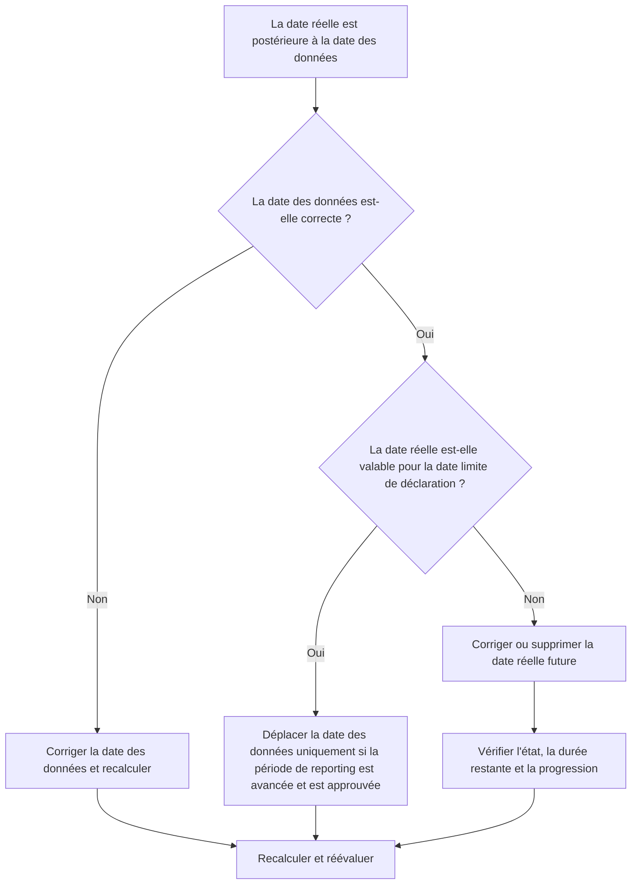

## But

Ce guide aide les planificateurs à examiner et à corriger les activités dont les dates réelles sont postérieures à la date des données Primavera P6. Il prend en charge une discipline de mise à jour propre en conservant les performances réelles au niveau ou avant la limite de mise à jour.

## Avant de commencer

Rassemblez les informations suivantes avant d’agir :

- Résultat de l'évaluation actuelle pour cette métrique.
- Données du projet Date utilisée dans la dernière mise à jour du planning.
- Liste des activités dont les dates réelles sont supérieures à la date des données.
- Champs Début réel, Fin réelle, Statut de l'activité, Durée restante et Pourcentage achevé.
- Source de la mise à jour de la progression, telle qu'un rapport de terrain, un fichier d'importation, une feuille de temps ou une mise à jour manuelle.
- Règles limites de mise à jour du projet et période de reporting.
- Toute entrée de travail future connue ou problème d’importation de données.

## Comprenez votre résultat

Un bon résultat est zéro activité avec des dates réelles postérieures à la date des données.

Un résultat acceptable devrait toujours être zéro. Les dates réelles après la date des données indiquent normalement une erreur de mise à jour ou une date de données incorrecte.

Un résultat faible signifie que le planning contient des chiffres réels futurs. Cela peut faire en sorte que le rapport de planification soit terminé ou démarré avant que la période de mise à jour n'atteigne réellement cette date.

## Objectif d'amélioration

L'objectif est de 0 activité non résolue avec des dates réelles supérieures à la date des données.

L'objectif est de confirmer si la date réelle est erronée, si la date des données est erronée ou si le processus d'importation de mise à jour autorise les chiffres réels futurs.

## Plan d'action

### Étape 1 : Identifiez le problème principal

Créez une présentation ou un rapport P6 qui filtre les activités dont le début réel, la fin réelle ou d'autres dates réelles sont supérieures à la date des données. Incluez l'ID d'activité, le nom de l'activité, le WBS, le statut de l'activité, le début réel, la fin réelle, le début, la fin, la durée restante, le pourcentage achevé, le calendrier et la référence de date des données.

Passez en revue chaque activité et demandez :

- La date des données du projet est-elle correcte ?
- La date réelle est-elle correcte ?
- La mise à jour a-t-elle inclus des progrès au-delà de la date limite ?
- Un fichier d'importation a-t-il chargé des dates réelles futures ?
- La date réelle doit-elle être modifiée ou la date des données doit-elle être déplacée ?
- Le statut de l'activité correspond-il à la date réelle corrigée ?

### Étape 2 : appliquer les correctifs recommandés

Si la date des données est erronée, corrigez-la en fonction de la période de reporting approuvée et recalculez le calendrier.

Si la date réelle est erronée, corrigez le début réel ou la fin réelle avec la date appropriée. Si le travail n'a pas réellement commencé ou terminé à la date des données, supprimez correctement le futur statut réel et de mise à jour, la durée restante et le pourcentage achevé.

Si le problème provient d'une importation, examinez le fichier d'importation et le mappage. Confirmez que les dates réelles futures sont bloquées ou vérifiées avant l'émission des rapports de planification.

### Étape 3 : Supprimer les bloqueurs courants

Les bloqueurs courants incluent les fichiers de progression couvrant les dates au-delà de la date limite de reporting, les mises à jour manuelles saisies sans vérifier la date des données et la confusion entre les dates réelles et les dates prévisionnelles.

Un autre bloqueur consiste à déplacer la date des données uniquement pour accepter les chiffres réels futurs. La date des données doit représenter la limite de mise à jour approuvée et ne doit pas être modifiée de manière fortuite pour masquer une erreur d'état.

### Étape 4 : Validez les modifications

Recalculez le planning après corrections. Réexécutez la métrique et confirmez qu'il ne reste aucune date réelle après la date des données.

Examinez les listes d'activités terminées, les listes d'activités en cours, les résultats de la valeur acquise et les rapports de comparaison de planification pour confirmer que la correction n'a pas créé d'autres incohérences de statut.

## Calendrier d'amélioration

### Jour 1 : Examiner et diagnostiquer

Exécutez la métrique, confirmez la date des données et séparez les résultats en dates réelles incorrectes, dates de données incorrectes, problèmes d'importation et problèmes de mise à jour.

### Jours 2-3 : Mettre en œuvre les actions prioritaires

Corrigez d’abord les activités utilisées dans les rapports. Corrigez les dates réelles, mettez à jour les statuts et résolvez les problèmes d’importation.

### Jours 4 et 5 : surveiller les premiers résultats

Recalculez le calendrier et examinez les rapports d'avancement, les listes d'activités terminées, les résultats de la valeur acquise et les dates des jalons.

### Jour 6 : derniers ajustements

Résolvez les éléments incertains restants avec la discipline responsable, le responsable de terrain ou le responsable des contrôles du projet.

### Jour 7 : Réévaluer et comparer

Réexécutez l’évaluation et comparez le résultat au seuil cible.

## Suivi des progrès

Utilisez un simple tracker pour gérer les corrections et les approbations.

| Date | Mesure prise | Impact attendu | Résultat / Observation | Étape suivante |
| --- | --- | --- | --- | --- |
| [Date] | Dates réelles révisées après la date des données | Identifier les futurs réels | [Résultat observé] | Attribuer un propriétaire |
| [Date] | Début réel ou fin réelle corrigée | Restaurer la limite d'état valide | [Résultat observé] | Recalculer le planning |
| [Date] | Processus d'importation révisé | Empêcher les données réelles futures répétées | [Résultat observé] | Réévaluer la métrique |

## Si les résultats ne s'améliorent pas

Si les résultats ne s'améliorent pas, vérifiez si les futurs réels sont introduits à plusieurs reprises via des importations, des feuilles de temps ou des workflows de mise à jour manuelle. Examinez la procédure limite de mise à jour et confirmez que la date des données est clairement communiquée à tous les contributeurs.

Faites remonter les éléments non résolus lorsqu'ils affectent des tâches critiques, quasi-critiques, de valeur acquise, de reporting client, de paiement ou de transfert.

## Entretien

Examinez cette mesure à chaque cycle de mise à jour avant de publier des rapports. Il doit faire partie de la validation de statut standard avec les dates réelles, la date des données, la durée restante, le pourcentage d'avancement et les vérifications de l'état de l'activité.

## Liste de contrôle récapitulative

- [ ] Résultat actuel examiné
- [ ] Seuil cible confirmé
- [ ] Date des données confirmée
- [ ] Principal problème identifié
- [ ] Dates réelles futures corrigées
- [ ] Statut d'activité vérifié
- [ ] Durée restante et progression vérifiée
- [ ] Workflow d’importation ou de mise à jour examiné
- [ ] Horaire recalculé
- [ ] Résultats surveillés
- [ ] Évaluation répétée
- [ ] Prochaines étapes documentées
## Contenu associé
- [Modèle de blog](03_blog_template.md)
- [Qu'est-ce qu'un horaire](../../08b_blogs_fr/01_WHAT%20A%20SCHEDULE%20IS/01_blog.md)
- [Logique robuste](../../08b_blogs_fr/02_ROBUST%20LOGIC/02_ROBUST%20LOGIC.md)
