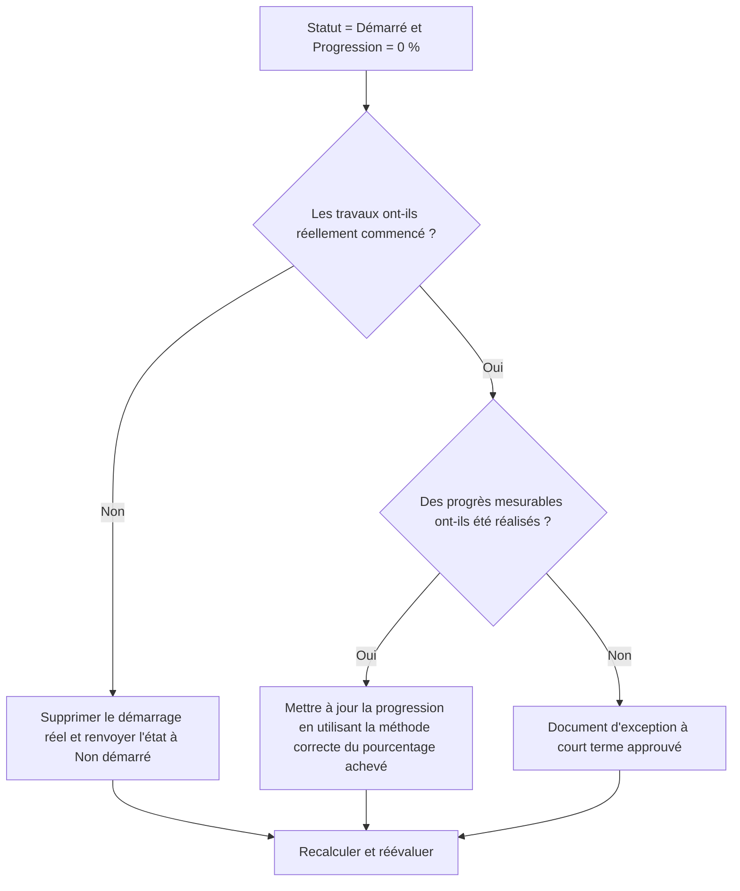

# Activités démarrées avec 0 % de progression dans Primavera P6 - Guide d’amélioration

## But

Ce guide aide les planificateurs à examiner et à corriger les activités pour lesquelles le statut d'activité est démarré mais la progression est de 0 %. Il prend en charge des mises à jour Primavera P6 plus propres en alignant le démarrage réel, l'état de l'activité, le pourcentage d'avancement et la durée restante.

## Avant de commencer

Rassemblez les informations suivantes avant d’agir :

- Résultat de l'évaluation actuelle pour cette métrique.
- Liste des activités avec Statut d'activité = Commencé et progression = 0%.
- Début réel, fin réelle, durée restante, durée initiale et statut de l'activité.
- Type de pourcentage achevé et champs de progression associés.
- Pourcentage physique achevé, pourcentage achevé pour la durée, pourcentage achevé pour les unités et pourcentage achevé pour l'activité.
- Date des données et dernières notes de mise à jour.
- Confirmation sur le terrain si les travaux ont réellement commencé et quels progrès ont été réalisés.

## Comprenez votre résultat

Un bon résultat est zéro activité avec le statut Démarré et 0 % de progression.

Un résultat acceptable peut inclure de rares cas documentés dans lesquels une activité a été démarrée à la toute fin de la période de mise à jour et aucun progrès mesurable n'a encore été réalisé. Ces cas doivent être limités et clairement expliqués.

Un résultat faible signifie que le planning contient des activités dont le statut de démarrage et la valeur de progression ne concordent pas. Cela peut créer des rapports d’avancement trompeurs, des problèmes de valeur acquise et une confusion en matière d’anticipation.

## Objectif d'amélioration

L'objectif est de 0 activité non résolue avec un statut d'activité = démarré et une progression = 0 %.

L'objectif est de confirmer si chaque activité a réellement démarré, si des progrès ont été manqués ou si l'activité doit être renvoyée à Non démarrée.

## Plan d'action

### Étape 1 : Identifiez le problème principal

Créez une présentation ou un rapport P6 qui filtre les activités avec un statut Démarré et une progression de 0 %. Inclut l'ID d'activité, le nom de l'activité, le WBS, l'état de l'activité, le début réel, la fin réelle, la durée d'origine, la durée restante, le type de pourcentage achevé, le pourcentage physique achevé, la durée en pourcentage achevé, le pourcentage d'unités achevées, le pourcentage d'activité achevé, le début, la fin et la marge total.

Passez en revue chaque activité et demandez :

- Les travaux ont-ils réellement commencé ?
- Si les travaux commençaient, quels progrès mesurables ont été réalisés ?
- Le démarrage réel est-il correct ?
- Quel type de pourcentage achevé est utilisé ?
- Des progrès manquent-ils dans le bon champ ?
- L’activité a-t-elle démarré administrativement sans que de véritables travaux aient démarré ?

### Étape 2 : appliquer les correctifs recommandés

Si le travail n'a pas réellement démarré, supprimez le début réel incorrect et remettez l'activité à Non démarré. Confirmez que la durée restante et les dates prévisionnelles sont toujours valides.

Si le travail a commencé et que des progrès ont été réalisés, mettez à jour le champ de progression correct en fonction du type de pourcentage achevé. Pour Pourcentage physique achevé, saisissez la progression physique. Pour Durée Pourcentage achevé, confirmez que la Durée restante reflète le travail effectué. Pour le pourcentage d’unités achevées, confirmez que la progression des unités est mise à jour.

Si le travail a commencé mais qu’aucun progrès mesurable n’a été réalisé, documentez la raison. Cela devrait être rare et temporaire, comme un début de mobilisation enregistré près de la date limite de mise à jour sans aucun progrès gagné pour l'instant.

### Étape 3 : Supprimer les bloqueurs courants

Les bloqueurs courants incluent les quantités de champs manquantes, les démarrages réels importés sans valeurs de progression, la confusion sur le type de pourcentage achevé et la pression pour afficher le travail comme commencé avant que des progrès mesurables ne soient disponibles.

Un autre bloqueur traite le démarrage réel comme un signal de planification au lieu d'un fait de statut. Le début réel doit représenter le véritable début du travail, et non l’intention de commencer bientôt.

### Étape 4 : Validez les modifications

Recalculez le planning après corrections. Réexécutez la métrique et confirmez que chaque élément restant est corrigé, justifié ou affecté au suivi.

Examinez les rapports d'avancement, les résultats de la valeur acquise, les rapports prospectifs et les listes d'activités en cours pour confirmer que la correction n'a pas créé de nouvelles incohérences.

## Calendrier d'amélioration

### Jour 1 : Examiner et diagnostiquer

Exécutez la métrique, confirmez la date des données et séparez les résultats en démarrages incorrects, progression manquante, problèmes de méthode achevés en pourcentage et exceptions possibles.

### Jours 2-3 : Mettre en œuvre les actions prioritaires

Corrigez d’abord les activités utilisées dans les rapports. Supprimez les démarrages réels incorrects, mettez à jour les valeurs de progression ou documentez les exceptions valides.

### Jours 4 et 5 : surveiller les premiers résultats

Recalculez le calendrier et examinez les rapports d'avancement, les résultats de la valeur acquise, les listes d'activités en cours et les rapports prospectifs.

### Jour 6 : derniers ajustements

Résolvez les éléments incertains restants avec la discipline responsable, le responsable de terrain ou le responsable des contrôles du projet.

### Jour 7 : Réévaluer et comparer

Réexécutez l’évaluation et comparez le résultat au seuil cible.

## Suivi des progrès

Utilisez un simple tracker pour gérer les corrections et les approbations.

| Date | Mesure prise | Impact attendu | Résultat / Observation | Étape suivante |
| --- | --- | --- | --- | --- |
| [Date] | Activités démarrées examinées avec 0 % de progrès | Identifier les incohérences de statut | [Résultat observé] | Attribuer un propriétaire |
| [Date] | Suppression du démarrage réel incorrect | Restaurer un statut précis | [Résultat observé] | Recalculer le planning |
| [Date] | Valeur de progression mise à jour | Aligner le statut démarré avec la progression | [Résultat observé] | Réévaluer la métrique |

## Si les résultats ne s'améliorent pas

Si les résultats ne s'améliorent pas, vérifiez si les départs réels sont importés sans correspondre aux valeurs de progression ou si les équipes utilisent des règles différentes pour ce qui compte comme commencé. Passez en revue la procédure limite de mise à jour et la méthode de pourcentage achevé.

Faites remonter les éléments non résolus lorsqu'ils affectent des tâches critiques, quasi-critiques, de valeur acquise, de reporting client, de paiement ou de transfert.

## Entretien

Examinez cette mesure à chaque cycle de mise à jour avant de publier des rapports. Il doit faire partie de la validation standard des mises à jour, avec les dates réelles, la durée restante, le pourcentage d'avancement et les contrôles de l'état des activités.

## Liste de contrôle récapitulative

- [ ] Résultat actuel examiné
- [ ] Seuil cible confirmé
- [ ] Date des données confirmée
- [ ] Principal problème identifié
- [ ] Démarrages réels incorrects supprimés
- [ ] Progression manquante mise à jour
- [ ] Type de pourcentage achevé examiné
- [ ] Exceptions valides documentées
- [ ] Horaire recalculé
- [ ] Résultats surveillés
- [ ] Évaluation répétée
- [ ] Prochaines étapes documentées
## Contenu associé
- [Activités démarrées avec 0 % de progression dans Primavera P6 - Vue d’ensemble](01_overview_template.md)
- [Modèle de blog](03_blog_template.md)
- [Qu'est-ce qu'un horaire](../../08b_blogs_fr/01_WHAT%20A%20SCHEDULE%20IS/01_blog.md)
- [Logique robuste](../../08b_blogs_fr/02_ROBUST%20LOGIC/02_ROBUST%20LOGIC.md)
