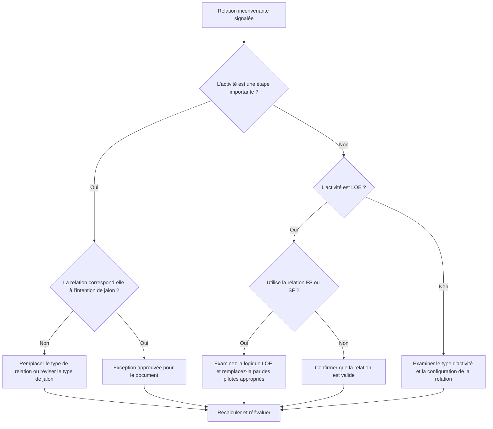

# Relations inconvenantes dans Primavera P6 - Guide d’amélioration

## But

Ce guide aide les planificateurs à examiner et à corriger les relations inconvenantes impliquant les activités de jalons de fin, de jalons de début et de niveau d'effort (LOE) dans Primavera P6.

## Avant de commencer

Rassemblez les informations suivantes avant d’agir :

- Résultat de l'évaluation actuelle pour cette métrique.
- Liste des relations marquées par prédécesseur, successeur, type d'activité et type de relation.
- ID d'activité, nom de l'activité, WBS, type d'activité, début, fin, marge totale et statut du chemin critique ou le plus long.
- Type de relation, décalage, type d'activité prédécesseur et type d'activité successeur.
- Objectif du jalon, objectif de la LOE et exigence de déclaration connexe.
- Date des données et dernière sortie du calcul du calendrier.

## Comprenez votre résultat

Un résultat fort est zéro relation inconvenante non résolue.

La métrique doit signaler ces cas :

- Terminez Milestone avec le successeur SS ou SF.
- Terminez Milestone avec le prédécesseur SS.
- Démarrez Milestone avec le prédécesseur FF ou SF.
- Démarrez Milestone avec le successeur FS ou FF.
- Relation LOE avec FS.
- Relation LOE avec SF.

De rares exceptions peuvent exister, mais elles doivent être documentées et faciles à expliquer lors d'une révision du calendrier.

## Objectif d'amélioration

L’objectif est de zéro relation inconvenante non résolue.

L'objectif est de faire en sorte que chaque jalon et relation LOE correspondent au comportement de planification prévu sans forcer les dates ni cacher une logique faible.

## Plan d'action

### Étape 1 : Identifiez le problème principal

Créez une mise en page ou un rapport P6 qui affiche toutes les activités de jalon et de LOE avec les détails du prédécesseur et du successeur. Incluez les indicateurs de type d’activité, de type de relation, de décalage, de début, de fin, de marge totale et de chemin critique ou le plus long.

Examinez chaque relation signalée et demandez :

- Le type d'activité est-il correct ?
- Le type de relation correspond-il à l’objectif du jalon ou de la LOE ?
- La relation essaie-t-elle de forcer une date de début, de fin ou de rapport ?
- Une relation normale FS, SS ou FF représenterait-elle mieux la logique ?
- La relation est-elle une exception approuvée ?

### Étape 2 : appliquer les correctifs recommandés

Pour les jalons de fin, confirmez que la logique détermine ou répond à l'achèvement. Remplacez les relations SS ou SF lorsqu'elles ne représentent pas une véritable dépendance basée sur la finition.

Pour Start Milestones, confirmez que la logique prend en charge l’événement de démarrage. Remplacez FF, SF, FS successeur ou d'autres relations inappropriées lorsqu'elles sont utilisées pour forcer une date de reporting.

Pour les activités LOE, vérifiez si les relations FS ou SF font en sorte que la LOE génère un travail discret. Les activités LOE résument ou couvrent normalement d’autres travaux, leurs relations doivent donc être traitées avec soin.

Si la relation est valide par contrat, méthode client ou conception de calendrier spécial, documentez la raison et l'approbation.

### Étape 3 : Supprimer les bloqueurs courants

Les bloqueurs courants incluent la copie de la logique d'anciens plannings, une mauvaise compréhension du comportement des jalons, l'utilisation des relations SF comme raccourci et l'utilisation des activités LOE pour contrôler le travail qui devrait être piloté par des activités discrètes.

Un autre obstacle consiste à considérer le nettoyage des relations comme un aspect cosmétique. Ces liens peuvent affecter la marge, les rapports sur le chemin critique, les dates des jalons et la crédibilité du calendrier.

### Étape 4 : Validez les modifications

Recalculez le planning après corrections. Réexécutez la métrique et confirmez que chaque élément restant est corrigé, justifié ou affecté au suivi.

Examinez les dates des jalons, les dates de LOE, la marge totale, le chemin critique ou le plus long et les principaux résultats des rapports pour confirmer que la correction n'a pas créé de nouveaux problèmes.

## Calendrier d'amélioration

### Jour 1 : Examiner et diagnostiquer

Exécutez la métrique et regroupez les résultats par type d’activité et modèle de relation.

### Jours 2-3 : Mettre en œuvre les actions prioritaires

Corrigez d’abord les relations sur les jalons critiques, quasi critiques, contractuels, de transfert et face au client.

### Jours 4 et 5 : surveiller les premiers résultats

Recalculez le calendrier et examinez la marge, le chemin critique, le mouvement des jalons et le comportement de la LOE.

### Jour 6 : derniers ajustements

Résolvez les exceptions restantes avec le planificateur, le responsable des contrôles du projet ou le réviseur du PMO.

### Jour 7 : Réévaluer et comparer

Réexécutez l’évaluation et comparez le résultat au seuil cible.

## Suivi des progrès

Utilisez un simple tracker pour gérer les corrections et les approbations.

| Date | Mesure prise | Impact attendu | Résultat / Observation | Étape suivante |
| --- | --- | --- | --- | --- |
| [Date] | Revue des relations inconvenantes | Identifier les problèmes de type relationnel | [Résultat observé] | Attribuer un propriétaire |
| [Date] | Relation de jalon corrigée | Aligner la logique avec l'objectif du jalon | [Résultat observé] | Recalculer le planning |
| [Date] | Relations LOE examinées | Empêcher LOE de conduire des travaux discrets de manière incorrecte | [Résultat observé] | Réévaluer la métrique |

## Si les résultats ne s'améliorent pas

Si les résultats ne s'améliorent pas, vérifiez si les mêmes relations sont réintroduites via des importations, une logique copiée, des modifications globales ou une intégration de planification externe.

Faites remonter les éléments non résolus lorsqu'ils affectent les jalons contractuels, les rapports sur le chemin critique, les soumissions des clients, les événements de paiement ou les dates de transfert.

## Entretien

Examinez cette mesure lors de chaque cycle de mise à jour et avant l’approbation de base. Il est particulièrement utile après des importations planifiées, des fragments copiés, un reséquençage majeur et des révisions de jalons.

## Liste de contrôle récapitulative

- [ ] Résultat actuel examiné
- [ ] Seuil cible confirmé
- [ ] Types d’activités de jalon et de LOE examinés
- [ ] Types de relations signalés vérifiés
- [ ] Relations incorrectes corrigées
- [ ] Exceptions valides documentées
- [ ] Horaire recalculé
- [ ] Flotteur et chemin critique examinés
- [ ] Résultats surveillés
- [ ] Évaluation répétée
- [ ] Prochaines étapes documentées
## Contenu associé
- [01_overview_template](../14_unusual_relations/01_overview_template.md)
- [03_blog_template](../14_unusual_relations/03_blog_template.md)
- [Qu'est-ce qu'un horaire](../../08b_blogs_fr/01_WHAT%20A%20SCHEDULE%20IS/01_blog.md)
- [Logique robuste](../../08b_blogs_fr/02_ROBUST%20LOGIC/02_ROBUST%20LOGIC.md)
