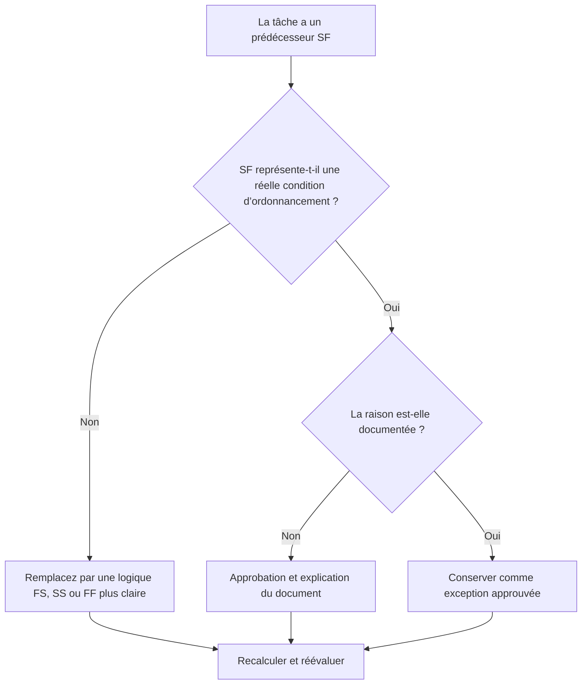

## But

Ce guide aide les planificateurs à examiner et à corriger les activités de tâches qui ont des relations de prédécesseur du début à la fin (SF) dans Primavera P6.

## Avant de commencer

Rassemblez les informations suivantes avant d’agir :

- Résultat de l'évaluation actuelle pour cette métrique.
- Liste des activités de tâches avec au moins un prédécesseur SF.
- ID d'activité, nom de l'activité, WBS, type d'activité, début, fin, marge totale et statut du chemin critique ou le plus long.
- ID d’activité prédécesseur, type d’activité prédécesseur, type de relation et décalage.
- Toutes les contraintes, calendriers, conditions de fin attendues et notes de mise à jour associées.
- Date des données et dernière sortie du calcul du calendrier.

## Comprenez votre résultat

Un résultat important est l’absence d’activités de tâches non résolues avec les relations de prédécesseur SF.

Une relation SF signifie que l'activité successeur ne peut pas se terminer tant que l'activité prédécesseur n'a pas commencé. Ceci est rare dans la logique normale de construction, d’ingénierie, d’approvisionnement ou de mise en service. La plupart des relations de tâches doivent être représentées avec la logique FS, SS ou FF lorsqu'elles reflètent un séquençage réel.

Un résultat faible signifie que la fin des activités de tâche peut être contrôlée par une logique difficile à justifier ou qui a été copiée depuis une autre partie du planning sans examen.

## Objectif d'amélioration

L'objectif est de 0 relation de prédécesseur SF non résolue sur les activités de tâche.

L'objectif est de confirmer si chaque relation SF est un modèle d'ordonnancement valide ou doit être remplacée par une logique plus claire.

## Plan d'action

### Étape 1 : Identifiez le problème principal

Créez une présentation ou un rapport P6 qui filtre les activités de tâches avec un prédécesseur SF. Incluez les ID de prédécesseur et de successeur, le type d'activité, le type de relation, le décalage, le début, la fin, la marge totale, les contraintes et les indicateurs de chemin critique ou le plus long.

Examinez chaque relation et demandez :

- Quelle condition réelle la relation SF tente-t-elle de représenter ?
- Le début du prédécesseur devrait-il vraiment contrôler la fin du successeur ?
- La logique FS, SS ou FF décrirait-elle la séquence plus clairement ?
- Le décalage est-il utilisé pour forcer une date ?
- La relation est-elle sur le chemin critique ou quasi critique ?
- Existe-t-il une raison documentée pour utiliser SF ?

### Étape 2 : appliquer les correctifs recommandés

Si la relation SF ne représente pas une condition réelle, remplacez-la par le type de relation qui décrit le mieux la séquence. Utilisez FS lorsque le successeur doit démarrer après l'achèvement du prédécesseur, SS lorsque les démarrages sont liés et FF lorsque l'alignement final est la logique prévue.

Si la relation SF a été ajoutée pour contrôler une date de fin, vérifiez si la planification a besoin d'un prédécesseur, d'un jalon, d'une révision de contrainte ou d'une répartition d'activité appropriés.

Si la relation SF est valide, documentez pourquoi elle est requise et qui l'a approuvée. Cela devrait être une exception rare et non un modèle de planification courant.

### Étape 3 : Supprimer les bloqueurs courants

Les bloqueurs courants incluent les relations copiées, la logique externe importée, la mauvaise compréhension du comportement de SF et l'utilisation de SF avec décalage pour forcer une date de fin.

Un autre bloqueur quitte la relation parce que la date calculée semble acceptable. La relation doit encore être logiquement défendable.

### Étape 4 : Validez les modifications

Recalculez le planning après corrections. Réexécutez la métrique et confirmez que chaque prédécesseur SF restant est corrigé, justifié ou affecté au suivi.

Examinez la marge totale, le chemin critique ou le plus long, les jalons concernés et les résultats d'anticipation pour confirmer que le changement logique n'a pas créé de nouveaux problèmes.

## Calendrier d'amélioration

### Jour 1 : Examiner et diagnostiquer

Exécutez la métrique, confirmez la date des données et séparez les résultats en relations SF non valides, exceptions possibles et éléments nécessitant la saisie du propriétaire.

### Jours 2-3 : Mettre en œuvre les actions prioritaires

Corrigez d'abord les relations SF sur les activités critiques, quasi critiques, contractuelles et à court terme.

### Jours 4 et 5 : surveiller les premiers résultats

Recalculez le calendrier et examinez la marge, le chemin critique, les dates d'anticipation et le mouvement des jalons.

### Jour 6 : derniers ajustements

Résolvez les exceptions restantes avec le planificateur, le responsable de la discipline, le responsable des contrôles du projet ou le réviseur du PMO.

### Jour 7 : Réévaluer et comparer

Réexécutez l’évaluation et comparez le résultat au seuil cible.

## Suivi des progrès

Utilisez un simple tracker pour gérer les corrections et les approbations.

| Date | Mesure prise | Impact attendu | Résultat / Observation | Étape suivante |
| --- | --- | --- | --- | --- |
| [Date] | Activités de tâches révisées avec les prédécesseurs de SF | Identifier une logique relationnelle inhabituelle | [Résultat observé] | Attribuer un propriétaire |
| [Date] | Relation SF invalide remplacée | Améliorer la clarté logique | [Résultat observé] | Recalculer le planning |
| [Date] | Exception SF valide et documentée | Conserver la logique spéciale approuvée | [Résultat observé] | Réévaluer la métrique |

## Si les résultats ne s'améliorent pas

Si les résultats ne s'améliorent pas, vérifiez si les relations SF sont réintroduites via des importations, des fragments copiés, des modifications globales ou une intégration de planification externe.

Faites remonter les éléments non résolus lorsqu'ils affectent le chemin critique, les jalons contractuels, les soumissions des clients, les événements de paiement ou le travail d'exécution à court terme.

## Entretien

Examinez cette mesure à chaque cycle de mise à jour et avant l’approbation de base. Il est particulièrement utile après des importations planifiées, un reséquençage majeur et des exercices de nettoyage logique.

## Liste de contrôle récapitulative

- [ ] Résultat actuel examiné
- [ ] Seuil cible confirmé
- [ ] Liste des prédécesseurs SF générée
- [ ] Éléments critiques et quasi-critiques priorisés
- [ ] Relations SF invalides corrigées
- [ ] Exceptions valides documentées
- [ ] Horaire recalculé
- [ ] Flotteur et chemin critique examinés
- [ ] Résultats surveillés
- [ ] Évaluation répétée
- [ ] Prochaines étapes documentées
## Contenu associé
- [Activités de tâches avec les prédécesseurs SF dans Primavera P6](03_blog_template.md)
- [Qu'est-ce qu'un horaire](../../08b_blogs_fr/01_WHAT%20A%20SCHEDULE%20IS/01_blog.md)
- [Logique robuste](../../08b_blogs_fr/02_ROBUST%20LOGIC/02_ROBUST%20LOGIC.md)
