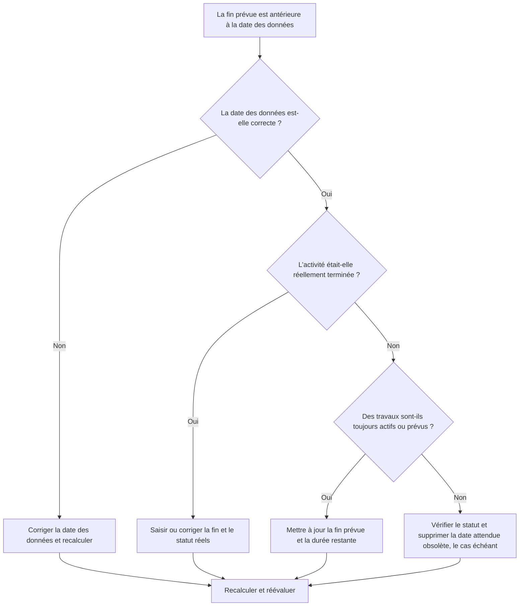

## But

Ce guide aide les planificateurs à examiner et à corriger les activités dont la date de fin prévue est antérieure à la date des données Primavera P6. Il prend en charge une discipline de mise à jour plus propre en gardant les dates prévues alignées sur la limite actuelle des rapports.

## Avant de commencer

Rassemblez les informations suivantes avant d’agir :

- Résultat de l'évaluation actuelle pour cette métrique.
- Données du projet Date utilisée dans la dernière mise à jour du planning.
- Liste des activités pour lesquelles la fin prévue est antérieure à la date des données.
- Statut de l'activité, début réel, fin réelle, durée restante, pourcentage achevé, début, fin et marge totale.
- Source de fin attendue, telle qu'une saisie manuelle, un fichier d'importation, une prévision de terrain ou un flux de travail de mise à jour P6.
- Règles limites de mise à jour du projet et dernières notes d'avancement.

## Comprenez votre résultat

Un bon résultat est une activité nulle avec une fin prévue antérieure à la date des données.

Une fin prévue avant la date des données signifie généralement que les informations de prévision ou d'achèvement prévu n'ont pas été mises à jour lorsque le calendrier a avancé. Cela peut également indiquer que l'activité doit avoir une fin réelle, une durée restante révisée ou un statut corrigé.

Un résultat faible signifie que le calendrier contient des dates d'achèvement prévues qui se situent dans le passé par rapport à la limite de mise à jour actuelle.

## Objectif d'amélioration

La cible est 0 activité non résolue avec une fin prévue antérieure à la date des données.

L'objectif est de confirmer si chaque activité a été terminée, toujours en cours, non démarrée ou mal mise à jour.

## Plan d'action

### Étape 1 : Identifiez le problème principal

Créez une présentation ou un rapport P6 qui filtre les activités pour lesquelles la fin prévue est antérieure à la date des données. Incluez l'ID d'activité, le nom de l'activité, le WBS, l'état de l'activité, la fin prévue, le début réel, la fin réelle, la durée restante, le pourcentage achevé, le début, la fin, le solde total et le calendrier.

Passez en revue chaque activité et demandez :

- La date des données est-elle correcte ?
- L'activité a-t-elle réellement été terminée avant la date des données ?
- Si l'opération est terminée, la fin réelle est-elle manquante ?
- Si l’opération ne s’est pas terminée, la fin attendue doit-elle être mise à jour ?
- La durée restante représente-t-elle toujours le travail restant ?
- Une importation ou une mise à jour manuelle a-t-elle laissé derrière elle une ancienne valeur de fin attendue ?

### Étape 2 : appliquer les correctifs recommandés

Si la date des données est erronée, corrigez-la en fonction de la période de reporting approuvée et recalculez le calendrier.

Si l'activité s'est terminée avant la date des données, saisissez ou corrigez la fin réelle et confirmez que le statut de l'activité, le pourcentage achevé et la durée restante sont cohérents.

Si l'activité est toujours active ou n'est pas terminée, mettez à jour la fin prévue avec une date valide égale ou ultérieure à la date des données. Confirmez la durée restante et les dates de prévision reflètent les dernières informations sur le terrain.

Si la fin attendue a été introduite via une importation, examinez le fichier d'importation et le mappage afin que des dates attendues obsolètes ne soient pas chargées à plusieurs reprises.

### Étape 3 : Supprimer les bloqueurs courants

Les bloqueurs courants incluent les prévisions de terrain obsolètes, les importations de progression qui mettent à jour le pourcentage achevé mais pas les dates prévues, et la confusion entre fin attendue, fin prévue et fin réelle.

Un autre bloqueur ignore la fin attendue car les dates planifiées semblent acceptables. Dans P6, les dates prévues peuvent influencer le calcul du calendrier en fonction des paramètres et des flux de travail. Les valeurs obsolètes doivent donc être révisées.

### Étape 4 : Validez les modifications

Recalculez le planning après corrections. Réexécutez la métrique et confirmez qu’il ne reste aucune date de fin prévue non résolue avant la date des données.

Examinez les activités en cours, les prévisions à court terme, le solde total, les dates d'étape et les rapports de comparaison des calendriers pour confirmer que la correction n'a pas créé de nouvelles incohérences.

## Calendrier d'amélioration

### Jour 1 : Examiner et diagnostiquer

Exécutez la métrique, confirmez la date des données et séparez les résultats en travaux terminés, dates attendues obsolètes, problèmes de durée restante et problèmes d'importation.

### Jours 2-3 : Mettre en œuvre les actions prioritaires

Corrigez d’abord les activités utilisées dans les rapports. Mettez à jour la fin réelle, la fin prévue, la durée restante, le pourcentage achevé ou l'état de l'activité selon vos besoins.

### Jours 4 et 5 : surveiller les premiers résultats

Recalculez le calendrier et examinez les rapports prospectifs, les listes d'activités en cours, les mouvements de jalons et les modifications margees.

### Jour 6 : derniers ajustements

Résolvez les éléments incertains restants avec la discipline responsable, le responsable de terrain ou le responsable des contrôles du projet.

### Jour 7 : Réévaluer et comparer

Réexécutez l’évaluation et comparez le résultat au seuil cible.

## Suivi des progrès

Utilisez un simple tracker pour gérer les corrections et les approbations.

| Date | Mesure prise | Impact attendu | Résultat / Observation | Étape suivante |
| --- | --- | --- | --- | --- |
| [Date] | Fin prévue révisée avant la date des données | Identifier les dates attendues obsolètes | [Résultat observé] | Attribuer un propriétaire |
| [Date] | Fin attendue ou fin réelle mise à jour | Aligner le statut avec la limite de mise à jour | [Résultat observé] | Recalculer le planning |
| [Date] | Processus d'importation révisé | Empêcher les dates attendues obsolètes et répétées | [Résultat observé] | Réévaluer la métrique |

## Si les résultats ne s'améliorent pas

Si les résultats ne s'améliorent pas, vérifiez si les dates prévues sont importées depuis les systèmes de terrain, les feuilles de calcul ou les fichiers de mise à jour précédents sans validation. Examinez le flux de travail de mise à jour et confirmez à qui appartient les mises à jour de fin attendue.

Faites remonter les éléments non résolus lorsqu'ils affectent un travail critique, quasi critique, de reporting client, de paiement, de transfert ou d'exécution à court terme.

## Entretien

Examinez cette mesure à chaque cycle de mise à jour avant de publier des rapports. Il doit faire partie de la validation de statut standard avec les vérifications de la date des données, des dates réelles, de la durée restante, du pourcentage achevé et du statut de l'activité.

## Liste de contrôle récapitulative

- [ ] Résultat actuel examiné
- [ ] Seuil cible confirmé
- [ ] Date des données confirmée
- [ ] Liste de fin attendue générée
- [ ] Travaux terminés compte tenu de la fin réelle
- [ ] Dates de fin attendues périmées mises à jour
- [ ] Durée restante vérifiée
- [ ] Statut d'activité et pourcentage d'avancement vérifiés
- [ ] Workflow d’importation ou de mise à jour examiné
- [ ] Horaire recalculé
- [ ] Évaluation répétée
- [ ] Prochaines étapes documentées
## Contenu associé
- [Fin prévue avant la date des données dans Primavera P6](03_blog_template.md)
- [Qu'est-ce qu'un horaire](../../08b_blogs_fr/01_WHAT%20A%20SCHEDULE%20IS/01_blog.md)
- [Logique robuste](../../08b_blogs_fr/02_ROBUST%20LOGIC/02_ROBUST%20LOGIC.md)
