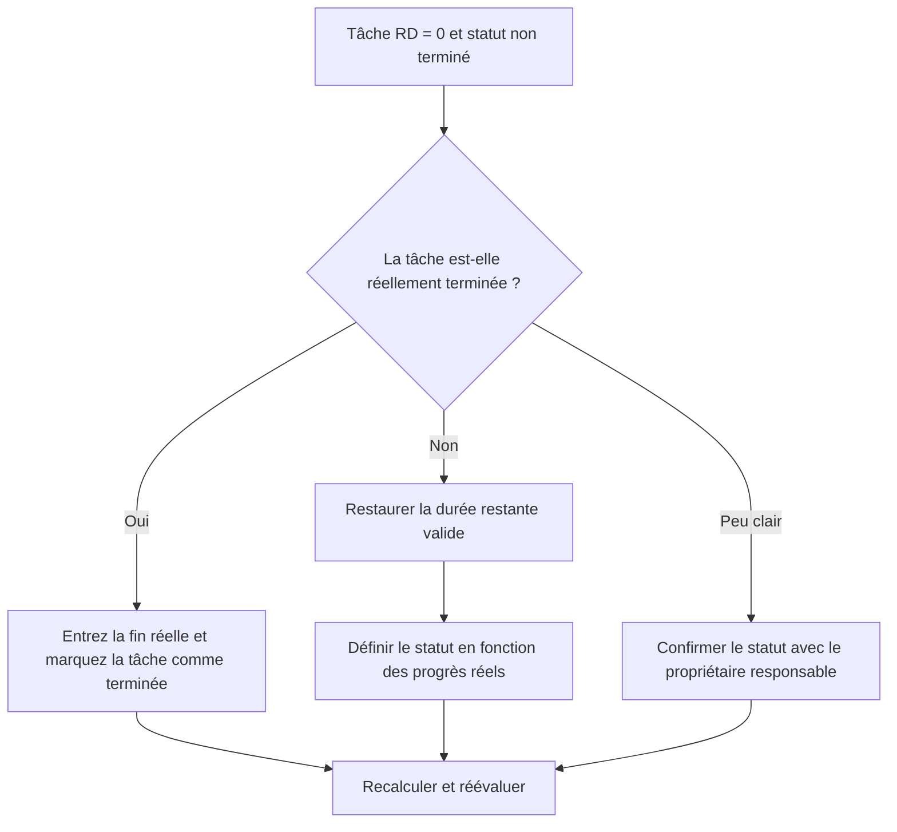

## But

Ce guide aide les planificateurs à examiner et à corriger les activités de tâche dont la durée restante est égale à 0 mais dont le statut de la tâche n'est pas terminé. Il prend en charge les mises à jour propres de Primavera P6 en alignant le travail restant, la fin réelle et l'état de l'activité.

## Avant de commencer

Rassemblez les informations suivantes avant d’agir :

- Résultat de l'évaluation actuelle pour cette métrique.
- Liste des activités de tâche avec durée restante = 0 et statut non terminé.
- ID d'activité, nom de l'activité, WBS, type d'activité, statut de l'activité, début réel, fin réelle, durée initiale, durée restante et durée de fin.
- Type de pourcentage achevé et champs de progression clés.
- Date des données et dernières notes de mise à jour.
- Confirmation sur le terrain indiquant si la tâche est terminée ou s'il reste encore du travail.

## Comprenez votre résultat

Un bon résultat est une activité de tâche nulle avec une durée restante = 0 et un statut non terminé.

Cette mesure est limitée aux activités de tâches, de sorte que l'examen se concentre sur les activités de travail normales, et non sur les jalons ou les enregistrements LOE. Une tâche avec une durée restante nulle doit normalement avoir un statut terminé et une fin réelle.

Un résultat faible signifie que le planning contient des tâches dont le temps restant et l'état d'avancement ne concordent pas.

## Objectif d'amélioration

L'objectif est de 0 activité de tâche non résolue avec une durée restante = 0 et un statut non terminé.

L'objectif est de confirmer si chaque tâche est terminée et doit être fermée, ou incomplète et doit avoir une durée restante valide restaurée.

## Plan d'action

### Étape 1 : Identifiez le problème principal

Créez une présentation ou un rapport P6 qui filtre les activités de tâche pour lesquelles la durée restante est égale à 0 et le statut de l'activité n'est pas terminé. Incluez l'ID d'activité, le nom de l'activité, le WBS, le type d'activité, le statut de l'activité, le début réel, la fin réelle, la durée initiale, la durée restante, le type de pourcentage achevé, le pourcentage d'activité achevé, le début, la fin et la marge totale.

Passez en revue chaque tâche et demandez :

- La tâche est-elle réellement terminée ?
- Si terminé, pourquoi le statut n'est-il pas terminé ?
- La fin réelle est-elle manquante ?
- Si le travail n’est pas terminé, pourquoi la durée restante est-elle de 0 ?
- Le statut a-t-il été importé ou mis à jour manuellement ?
- La méthode du pourcentage achevé correspond-elle à la mise à jour effectuée ?

### Étape 2 : appliquer les correctifs recommandés

Si la tâche est terminée, mettez à jour l'activité comme Terminée. Entrez la fin réelle, confirmez que la durée restante est 0 et confirmez que les valeurs de progression s'alignent sur la procédure de mise à jour du projet.

Si la tâche n'est pas terminée, restaurez une durée restante appropriée. Confirmez le travail restant avec le propriétaire responsable et conservez le statut de la tâche comme En cours ou Non démarré en fonction de l'avancement réel.

Si le problème provient des données de progression importées, examinez le mappage d'importation et mettez à jour le workflow. Le processus de mise à jour ne doit pas laisser les activités de tâche avec un temps restant nul mais un statut incomplet.

### Étape 3 : Supprimer les bloqueurs courants

Les bloqueurs courants incluent les dates de fin réelle manquantes, la confirmation de champ incomplète, les données de mise à jour importées et la confusion entre le statut de durée et le statut d'activité.

Un autre bloqueur réduit la durée restante à 0 pour afficher la progression sans terminer formellement la tâche. La durée restante et le statut d'activité devraient raconter la même histoire quant à savoir si le travail reste.

### Étape 4 : Validez les modifications

Recalculez le planning après corrections. Réexécutez la métrique et confirmez que chaque élément restant est corrigé ou affecté au suivi.

Examinez les listes de tâches terminées, les dates de fin réelles, les rapports d'avancement, les résultats de la valeur acquise et les rapports prospectifs pour confirmer que la correction n'a pas créé de nouvelles incohérences.

## Calendrier d'amélioration

### Jour 1 : Examiner et diagnostiquer

Exécutez la métrique, confirmez la date des données et séparez les résultats en tâches terminées sans statut Terminé, tâches incomplètes avec une durée restante nulle et problèmes d'importation ou de flux de travail.

### Jours 2-3 : Mettre en œuvre les actions prioritaires

Corrigez d'abord les tâches utilisées dans les rapports. Entrez la fin réelle, marquez les tâches comme terminées ou restaurez la durée restante selon vos besoins.

### Jours 4 et 5 : surveiller les premiers résultats

Recalculez le calendrier et examinez les rapports sur les tâches terminées, les rapports d'avancement, les résultats de la valeur acquise et les rapports prospectifs.

### Jour 6 : derniers ajustements

Résolvez les éléments incertains restants avec la discipline responsable, le responsable de terrain ou le responsable des contrôles du projet.

### Jour 7 : Réévaluer et comparer

Réexécutez l’évaluation et comparez le résultat au seuil cible.

## Suivi des progrès

Utilisez un simple tracker pour gérer les corrections et les approbations.

| Date | Mesure prise | Impact attendu | Résultat / Observation | Étape suivante |
| --- | --- | --- | --- | --- |
| [Date] | Tâche révisée RD 0 et statut non terminé | Identifier les incohérences du statut des tâches | [Résultat observé] | Attribuer un propriétaire |
| [Date] | Fin réelle saisie et marqué Terminé | Aligner le statut terminé | [Résultat observé] | Recalculer le planning |
| [Date] | Durée restante restaurée | Corriger le statut de la tâche inachevée | [Résultat observé] | Réévaluer la métrique |

## Si les résultats ne s'améliorent pas

Si les résultats ne s'améliorent pas, vérifiez si les mises à jour de progression sont importées, copiées ou modifiées manuellement de manière incohérente. Vérifiez si les dates de fin réelle sont manquantes dans le flux de travail de mise à jour ou si les utilisateurs définissent la durée restante sur 0 sans terminer les tâches.

Faites remonter les éléments non résolus lorsqu'ils affectent des tâches critiques, quasi-critiques, de valeur acquise, de reporting client, de paiement ou de transfert.

## Entretien

Examinez cette mesure à chaque cycle de mise à jour avant de publier des rapports. Cela doit faire partie de la validation standard de l'état des tâches, aux côtés des dates réelles, de la durée restante, du pourcentage achevé et des contrôles de l'état des activités.

## Liste de contrôle récapitulative

- [ ] Résultat actuel examiné
- [ ] Seuil cible confirmé
- [ ] Date des données confirmée
- [ ] Filtre de tâches uniquement confirmé
- [ ] Principal problème identifié
- [ ] Tâches terminées marquées correctement
- [ ] Dates de fin réelles saisies si nécessaire
- [ ] Durée restante restaurée là où les travaux sont incomplets
- [ ] Workflow d'importation ou de mise à jour coché
- [ ] Horaire recalculé
- [ ] Évaluation répétée
- [ ] Prochaines étapes documentées
## Contenu associé
- [La durée restante de la tâche est nulle alors que l'état n'est pas terminé](03_blog_template.md)
- [Qu'est-ce qu'un horaire](../../08b_blogs_fr/01_WHAT%20A%20SCHEDULE%20IS/01_blog.md)
- [Logique robuste](../../08b_blogs_fr/02_ROBUST%20LOGIC/02_ROBUST%20LOGIC.md)
