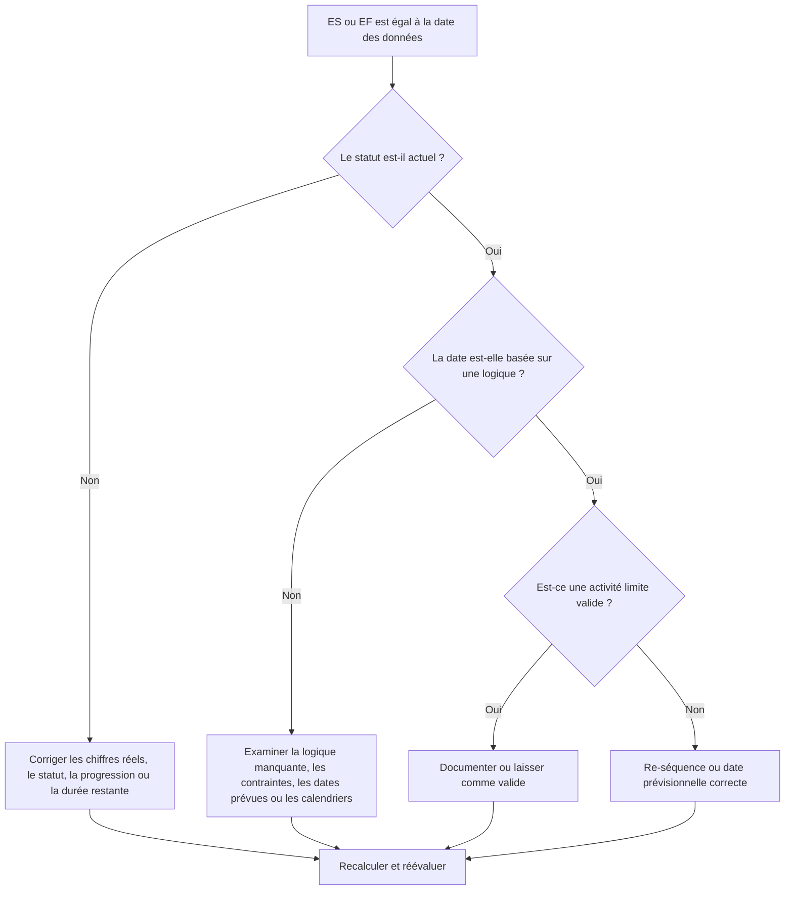

# Activités à la date des données - Guide d’amélioration

## But

Ce guide aide les planificateurs à examiner les activités dont le début ou la fin anticipée correspond exactement à la date des données Primavera P6. Il prend en charge les contrôles du cycle de mise à jour en indiquant où le travail s'accumule à la limite entre les performances réelles et le travail prévu.

## Avant de commencer

Rassemblez les informations suivantes avant d’agir :

- Résultat de l'évaluation actuelle pour cette métrique.
- Données du projet Date utilisée dans le dernier calcul du calendrier.
- Liste des activités pour lesquelles Début anticipé = Date des données.
- Liste des activités pour lesquelles Fin anticipée = Date des données.
- Statut de l'activité, début réel, fin réelle, durée restante, début, fin, marge totale et calendrier.
- Détails des relations entre prédécesseur et successeur.
- Contraintes, dates prévues et notes de mise à jour.

## Comprenez votre résultat

Un résultat fort est zéro activité inexpliquée avec un début anticipé ou une fin anticipée à la date des données.

Certaines activités peuvent légitimement se situer à la date des données, en particulier les travaux à court terme qui sont prêts à démarrer ou les travaux se terminant à la limite de mise à jour. Le problème n’est pas seulement la date ; le problème est de savoir si la date est expliquée par des informations de statut, de logique et de mise à jour valides.

Un résultat faible signifie que de nombreuses activités sont collectées à la date des données sans raison claire du calendrier.

## Objectif d'amélioration

L'objectif est de 0 activité inexpliquée avec ES = Date des données ou EF = Date des données.

L'objectif est de confirmer si chaque activité est correctement statutée, logiquement pilotée et prévue à partir de la bonne limite de mise à jour.

## Plan d'action

### Étape 1 : Identifiez le problème principal

Créez une présentation ou un rapport P6 qui filtre les activités pour lesquelles Début anticipé est égal à la date des données ou Fin anticipée est égale à la date des données. Inclut l'ID d'activité, le nom de l'activité, le WBS, le statut de l'activité, le début anticipé, la fin anticipée, le début, la fin, le début réel, la fin réelle, la durée restante, la marge totale, le calendrier, les contraintes, les prédécesseurs et les successeurs.

Passez en revue chaque activité et demandez :

- L'activité est-elle terminée, en cours ou n'a-t-elle pas commencé ?
- Un début réel ou une fin réelle manque-t-il ?
- L'activité est-elle logiquement dirigée vers la date des données ?
- Une contrainte, une date prévue ou un calendrier pousse-t-il l'activité à la date des données ?
- L’activité est-elle ouverte ou faiblement liée ?
- La date des données est-elle correcte pour la période de mise à jour ?

### Étape 2 : appliquer les correctifs recommandés

Si l'état est incomplet, corrigez le début réel, la fin réelle, la durée restante, le pourcentage achevé et l'état de l'activité avant de modifier la logique.

Si une activité démarre à la date de données parce que la logique prédécesseur est manquante ou non motrice, ajoutez ou corrigez les relations qui représentent la séquence de travail réelle.

Si une activité se termine à la date des données parce que la progression n'a pas été mise à jour, vérifiez si le travail est terminé dans les limites de mise à jour. Entrez la fin réelle si le travail est terminé, ou mettez à jour la durée restante et la fin prévue s'il reste du travail.

Si des contraintes ou des dates prévues poussent les activités à la date de données, supprimez-les, révisez-les ou documentez-les conformément à la procédure de contrôle du projet.

### Étape 3 : Supprimer les bloqueurs courants

Les bloqueurs courants incluent une actualisation incomplète, des débuts et des fins ouverts, des contraintes utilisées comme substituts à la logique et un mouvement de date de données sans examen suffisant de l'état.

Un autre bloqueur suppose que les activités à la date de données sont inoffensives. Un grand cluster à la limite de la mise à jour peut masquer le séquençage manquant ou rendre les prévisions à court terme plus claires qu'elles ne le sont.

### Étape 4 : Validez les modifications

Recalculez le planning après corrections. Réexécutez la métrique et confirmez que chaque activité restante à la date de données est expliquée par l'état actuel, une logique valide ou une exception approuvée.

Examinez la marge totale, le chemin critique ou le plus long, les dates des jalons et les rapports prospectifs à court terme pour confirmer que la correction n'a pas créé de nouvelles incohérences.

## Calendrier d'amélioration

### Jour 1 : Examiner et diagnostiquer

Exécutez la métrique, confirmez la date des données et séparez les résultats en ES à la date des données, EF à la date des données, problèmes d'état, problèmes de logique, contraintes et activités de limite valides.

### Jours 2-3 : Mettre en œuvre les actions prioritaires

Corrigez d’abord les activités critiques, quasi critiques et à court terme. Mettez à jour le statut, ajoutez ou corrigez la logique et examinez les contraintes.

### Jours 4 et 5 : surveiller les premiers résultats

Recalculez le calendrier et examinez les sorties anticipées, les modifications margees, le mouvement des jalons et les activités toujours en cours à la date des données.

### Jour 6 : derniers ajustements

Résolvez les éléments incertains restants avec la discipline responsable, le responsable de terrain ou le responsable des contrôles du projet.

### Jour 7 : Réévaluer et comparer

Réexécutez l’évaluation et comparez le résultat au seuil cible.

## Suivi des progrès

Utilisez un simple tracker pour gérer les corrections et les approbations.

| Date | Mesure prise | Impact attendu | Résultat / Observation | Étape suivante |
| --- | --- | --- | --- | --- |
| [Date] | ES/EF examinés à la date des données | Identifier le regroupement de limites | [Résultat observé] | Attribuer un propriétaire |
| [Date] | Statut corrigé ou dates réelles | Aligner le statut de travail avec la limite de mise à jour | [Résultat observé] | Recalculer le planning |
| [Date] | Logique ou contraintes corrigées | Réduire le clustering inexpliqué des dates de données | [Résultat observé] | Réévaluer la métrique |

## Si les résultats ne s'améliorent pas

Si les résultats ne s'améliorent pas, vérifiez si les activités sont ramenées à plusieurs reprises à la date des données en raison d'une logique manquante, de contraintes, de dates attendues obsolètes ou de procédures de mise à jour incomplètes.

Faites remonter les éléments non résolus lorsqu'ils affectent le travail critique ou quasi critique, le reporting client, le transfert, le paiement ou l'exécution à court terme.

## Entretien

Examinez cette mesure à chaque cycle de mise à jour avant de publier des rapports. Ceci est particulièrement utile après avoir déplacé la date des données, importé une progression, réordonné le travail ou recalculé après des changements de statut majeurs.

## Liste de contrôle récapitulative

- [ ] Résultat actuel examiné
- [ ] Seuil cible confirmé
- [ ] Date des données confirmée
- [ ] ES = Données Date activités examinées
- [ ] EF = Données Date activités examinées
- [ ] Statut et dates réelles vérifiés
- [ ] Durée restante vérifiée
- [ ] Logique et contraintes revues
- [ ] Activités limites valides documentées
- [ ] Horaire recalculé
- [ ] Évaluation répétée
- [ ] Prochaines étapes documentées
## Contenu associé
- [Activités à la date des données : contrôles de début et de fin anticipés dans Primavera P6 - Vue d’ensemble](01_overview_template.md)
- [Activités à la date des données : contrôles de début et de fin anticipés dans Primavera P6](03_blog_template.md)
- [Qu'est-ce qu'un horaire](../../08b_blogs_fr/01_WHAT%20A%20SCHEDULE%20IS/01_blog.md)
- [Logique robuste](../../08b_blogs_fr/02_ROBUST%20LOGIC/02_ROBUST%20LOGIC.md)
