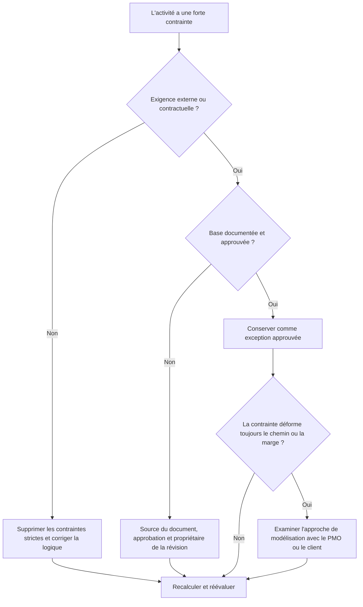

## But

Ce guide aide les planificateurs à examiner et à réduire les contraintes strictes dans Primavera P6. Il se concentre sur les contraintes qui contrôlent fortement les dates d'activité, notamment le début obligatoire et la fin obligatoire.

## Avant de commencer

Rassemblez les informations suivantes avant d’agir :

- Résultat de l'évaluation actuelle pour cette métrique.
- Liste des activités avec des contraintes fortes.
- Type de contrainte et date de contrainte pour chaque activité.
- ID d'activité, nom de l'activité, WBS, statut de l'activité, début, fin, marge totale et statut du chemin critique ou le plus long.
- Détails des relations entre prédécesseur et successeur.
- Contrat, client, permis, accès, réglementation ou transfert pour toute contrainte requise.
- Comparaison de référence ou de mise à jour antérieure indiquant quand la contrainte a été ajoutée.

## Comprenez votre résultat

Un résultat fort est zéro contrainte dure inexpliquée.

Des contraintes strictes peuvent remplacer ou restreindre considérablement le calcul normal du CPM. Ils peuvent être valables pour les dates de contrat, les fenêtres d'accès, les autorisations de délivrance de permis, les points d'arrêt réglementaires ou les exigences imposées par le propriétaire, mais ils ne doivent pas être utilisés pour remplacer une logique manquante.

Un résultat faible signifie que le planning contient des dates imposées qui peuvent contrôler les prévisions plutôt que la logique du réseau.

## Objectif d'amélioration

L’objectif est de 0 contrainte dure inexpliquée.

L’objectif est de supprimer les contraintes strictes inutiles et de documenter toutes les contraintes réellement nécessaires.

## Plan d'action

### Étape 1 : Identifiez le problème principal

Créez une présentation ou un rapport P6 qui filtre les activités avec des types de contraintes strictes. Incluez l'ID d'activité, le nom de l'activité, le WBS, le statut de l'activité, le début, la fin, le type de contrainte, la date de contrainte, la marge totale, l'état du chemin critique ou le plus long, les prédécesseurs et les successeurs.

Passez en revue chaque activité contrainte et demandez :

- Quelle est la source de la contrainte dure ?
- Est-ce requis contractuellement ou en externe ?
- Remplace-t-il la logique manquante du prédécesseur ou du successeur ?
- Est-ce que cela impose une date cible qui devrait être prévue par le calendrier ?
- Cela affecte-t-il la marge totale, le chemin critique ou les rapports sur les jalons ?
- La raison est-elle documentée et approuvée ?

### Étape 2 : appliquer les correctifs recommandés

Si la contrainte matérielle n'est pas requise en externe, supprimez-la et ajoutez ou corrigez la logique CPM. Utilisez des relations, un séquencement d'activités, des calendriers et des durées réalistes pour modéliser le travail au lieu de forcer les dates.

Si la contrainte stricte est requise, documentez la base. Capturez la source, l'approbation, la date, le propriétaire responsable et la raison pour laquelle il ne peut pas être modélisé avec une logique normale.

Si la contrainte est utilisée pour conserver une date cible, vérifiez si une contrainte, un jalon, un délai ou une note de rapport plus souple serait plus approprié.

### Étape 3 : Supprimer les bloqueurs courants

Les bloqueurs courants incluent les contraintes héritées des anciennes références, les dates cibles des clients saisies comme dates obligatoires, les plans de récupération qui laissent derrière eux des contraintes temporaires et la logique d'interface manquante.

Un autre bloqueur suppose qu'une contrainte stricte est acceptable car la date est importante. Les dates importantes doivent être visibles, mais le planning doit quand même expliquer comment les travaux les atteignent.

### Étape 4 : Validez les modifications

Recalculez le planning après corrections. Réexécutez la métrique et confirmez que les contraintes strictes restantes sont approuvées et documentées.

Examinez la marge totale, le chemin critique ou le plus long, les dates des jalons et les résultats de la comparaison du calendrier pour confirmer que la correction n'a pas créé de mouvement inattendu.

## Calendrier d'amélioration

### Jour 1 : Examiner et diagnostiquer

Exécutez les résultats des métriques et de groupe par WBS, type de contrainte, criticité et base documentée.

### Jours 2-3 : Mettre en œuvre les actions prioritaires

Remove unnecessary hard contraintes from critical, quasi critique, contractual, and near-term activities first. Ajoutez la logique manquante si nécessaire.

### Jours 4 et 5 : surveiller les premiers résultats

Recalculez le calendrier et examinez le mouvement du flotteur, les modifications du chemin critique et les impacts des jalons.

### Jour 6 : derniers ajustements

Résolvez les exceptions restantes avec le planificateur, le responsable des contrôles du projet, l'examinateur du PMO ou le représentant du client.

### Jour 7 : Réévaluer et comparer

Réexécutez l’évaluation et comparez le résultat au seuil cible.

## Suivi des progrès

Utilisez un simple tracker pour gérer les corrections et les approbations.

| Date | Mesure prise | Impact attendu | Résultat / Observation | Étape suivante |
| --- | --- | --- | --- | --- |
| [Date] | Contraintes strictes révisées | Identifier les contrôles de date imposés | [Résultat observé] | Attribuer un propriétaire |
| [Date] | Suppression des contraintes matérielles inutiles | Restaurer le calcul logique | [Résultat observé] | Recalculer le planning |
| [Date] | Contrainte dure approuvée et documentée | Préserver l’exception justifiée | [Résultat observé] | Réévaluer la métrique |

## Si les résultats ne s'améliorent pas

Si les résultats ne s'améliorent pas, vérifiez si des contraintes strictes sont réintroduites via des importations, des fragments copiés, des mises à jour de base ou des modifications du calendrier de récupération.

Faites remonter les éléments non résolus lorsqu'ils affectent le chemin critique, les jalons contractuels, les rapports clients, l'analyse des retards, les événements de paiement ou les dates de transfert.

## Entretien

Examinez cette mesure à chaque cycle de mise à jour et avant l’approbation de base. Les contraintes strictes doivent faire partie des contrôles de santé du calendrier standard, en particulier après un reséquençage majeur, la planification de la récupération et la préparation de la soumission du client.

## Liste de contrôle récapitulative

- [ ] Résultat actuel examiné
- [ ] Seuil cible confirmé
- [ ] Liste de contraintes matérielles générée
- [ ] Type de contrainte et date de vérification
- [ ] Base externe confirmée
- [ ] Contraintes strictes inutiles supprimées
- [ ] Logique manquante corrigée
- [ ] Exceptions approuvées documentées
- [ ] Horaire recalculé
- [ ] Flotteur et chemin critique examinés
- [ ] Évaluation répétée
- [ ] Prochaines étapes documentées
## Contenu associé
- [Contraintes difficiles dans Primavera P6](03_blog_template.md)
- [Qu'est-ce qu'un horaire](../../08b_blogs_fr/01_WHAT%20A%20SCHEDULE%20IS/01_blog.md)
- [Logique robuste](../../08b_blogs_fr/02_ROBUST%20LOGIC/02_ROBUST%20LOGIC.md)
