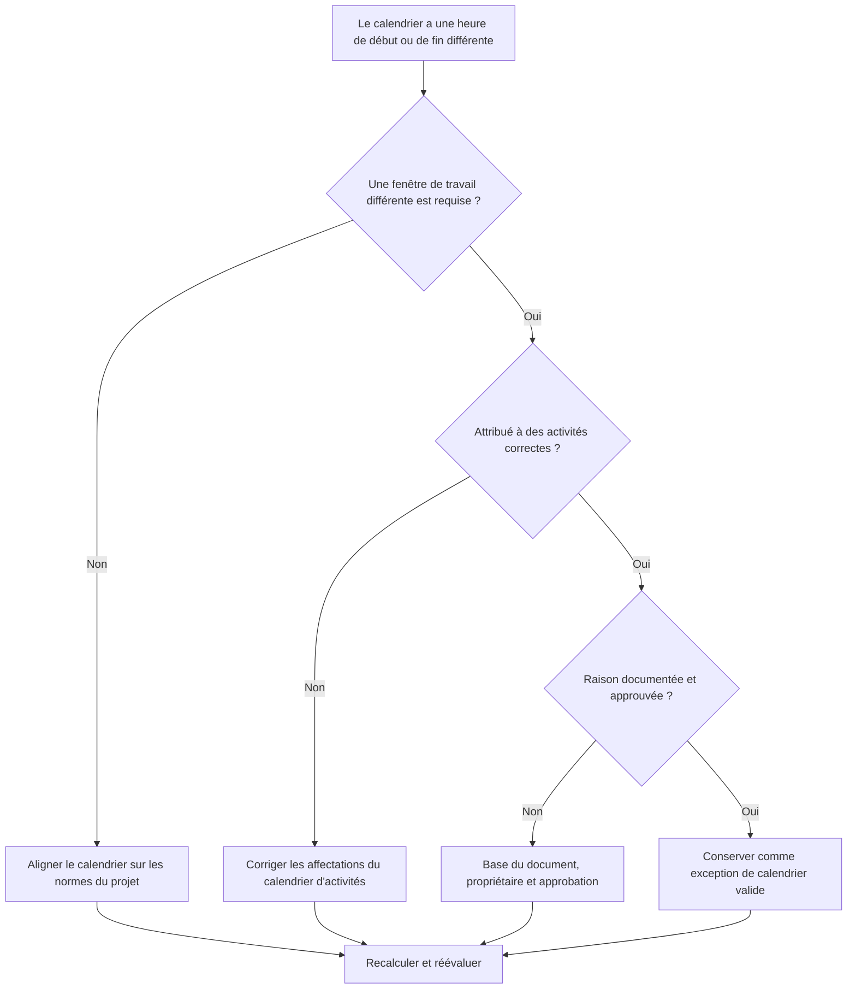

# Calendriers avec différentes heures de début et de fin dans Primavera P6 - Guide d’amélioration

## But

Ce guide aide les planificateurs à examiner les calendriers Primavera P6 qui utilisent différentes heures de début ou de fin de journée de travail. Il prend en charge les contrôles de qualité des horaires en confirmant que les différences horaires du calendrier sont intentionnelles, approuvées et comprises.

## Avant de commencer

Rassemblez les informations suivantes avant d’agir :

- Résultat de l'évaluation actuelle pour cette métrique.
- Norme de calendrier de projet approuvée et fenêtre de travail quotidienne normale.
- Liste de calendriers avec différentes heures de début, heures de fin, fenêtres de travail ou modèles de journée partielle.
- Activités attribuées à chaque calendrier concerné.
- Type de calendrier, tel qu'un calendrier global, de projet ou de ressources.
- Activités critiques ou quasi critiques utilisant les calendriers concernés.
- Raison de chaque calendrier non standard, tel qu'un quart de nuit, un travail en panne, un accès restreint ou un horaire d'équipe spécial.

## Comprenez votre résultat

Un bon résultat est zéro calendrier inexpliqué avec des heures de début ou de fin différentes.

Les différences de calendrier peuvent être valables lorsque le travail suit réellement des équipes, des fenêtres d'accès ou une disponibilité des ressources différentes. Le problème, c'est lorsque les calendriers diffèrent selon l'heure de la journée sans raison claire.

Un résultat faible signifie que la planification peut contenir des hypothèses de calendrier cachées qui affectent les dates, la marge et le comportement logique.

## Objectif d'amélioration

L’objectif est de 0 calendriers inexpliqués avec des heures de début ou de fin différentes.

L'objectif est de confirmer si chaque fenêtre de travail différente est requise, documentée et affectée uniquement aux bonnes activités.

## Plan d'action

### Étape 1 : Identifiez le problème principal

Créez une exportation de révision de calendrier à partir de P6 ou d'un outil d'évaluation de calendrier qui répertorie chaque calendrier, son heure de début normale de la journée de travail, son heure de fin, ses heures quotidiennes, ses exceptions et ses activités assignées.

Examinez chaque calendrier non standard et demandez :

- Quelle est la journée de travail standard approuvée pour le projet ?
- Quels calendriers utilisent des heures de début ou de fin différentes ?
- Les différences sont-elles intentionnelles ou accidentelles ?
- Quelles activités utilisent chaque calendrier ?
- Les activités critiques ou quasi critiques sont-elles affectées ?
- La différence de calendrier est-elle documentée et approuvée ?

### Étape 2 : appliquer les correctifs recommandés

Si la différence de calendrier est accidentelle, alignez l'heure de début, l'heure de fin et les périodes de travail quotidiennes sur la norme approuvée du projet.

Si la différence de calendrier est valide, documentez la raison. Les cas valides courants incluent les quarts de nuit, le travail le week-end, les fenêtres d'arrêt, les restrictions d'accès des propriétaires, les restrictions environnementales ou les périodes de travail spécifiques aux ressources.

Si les activités sont affectées au mauvais calendrier, corrigez l'affectation du calendrier d'activités avant de modifier le calendrier lui-même. Un calendrier spécial valide peut toujours créer des problèmes s'il est attribué de manière trop large.

### Étape 3 : Supprimer les bloqueurs courants

Les bloqueurs courants incluent les calendriers copiés à partir d'anciens plannings, les calendriers importés avec des paramètres d'heure masqués, les calendriers de ressources utilisés comme calendriers d'activités et les petits décalages horaires qui ne sont pas visibles dans les présentations de date standard.

Un autre bloqueur examine uniquement la date sans l'heure. Dans P6, l’heure de la journée peut affecter le placement de l’activité, la marge, le comportement relationnel et le mouvement apparent d’une date sur un jour.

### Étape 4 : Validez les modifications

Recalculez le planning après les corrections du calendrier. Réexécutez la métrique et confirmez que les différences de calendrier restantes sont valides et documentées.

Examinez les dates d'activité affectées, la marge totale, le chemin critique ou le plus long, les liens relationnels et les rapports prospectifs à court terme pour confirmer que la correction n'a pas créé de mouvement inattendu.

## Calendrier d'amélioration

### Jour 1 : Examiner et diagnostiquer

Exécutez les métriques et regroupez les résultats par calendrier, fenêtre de travail, type de calendrier, activités affectées et criticité.

### Jours 2-3 : Mettre en œuvre les actions prioritaires

Corrigez d'abord les décalages horaires accidentels et les mauvaises affectations de calendrier d'activités pour les activités critiques, quasi critiques et à court terme.

### Jours 4 et 5 : surveiller les premiers résultats

Recalculez le calendrier et examinez le mouvement des fonds marges, les décalages de date, les impacts des jalons et les modifications anticipées.

### Jour 6 : derniers ajustements

Résolvez les exceptions de calendrier restantes avec le planificateur, le propriétaire de discipline, le responsable des contrôles de projet ou le réviseur du PMO.

### Jour 7 : Réévaluer et comparer

Réexécutez l’évaluation et comparez le résultat au seuil cible.

## Suivi des progrès

Utilisez un simple tracker pour gérer les corrections et les approbations.

| Date | Mesure prise | Impact attendu | Résultat / Observation | Étape suivante |
| --- | --- | --- | --- | --- |
| [Date] | Heures de début et de fin du calendrier révisées | Identifier les fenêtres de travail non standards | [Résultat observé] | Attribuer un propriétaire |
| [Date] | Calendrier aligné sur les normes du projet | Supprimer le décalage horaire accidentel | [Résultat observé] | Recalculer le planning |
| [Date] | Exception de calendrier valide documentée | Conserver la fenêtre de travail justifiée | [Résultat observé] | Réévaluer la métrique |

## Si les résultats ne s'améliorent pas

Si les résultats ne s'améliorent pas, vérifiez si des calendriers non standard sont réintroduits via des importations, des planifications copiées, des affectations de ressources ou des mises à jour de référence.

Faites remonter les différences de calendrier non résolues lorsqu'elles affectent le chemin critique, les rapports clients, les étapes de paiement, les interruptions de travail, les dates de transfert ou l'exécution à court terme.

## Entretien

Examinez cette métrique lors du développement de base, de la planification des importations et de chaque cycle de mise à jour majeur. Les paramètres d’heure du calendrier doivent faire partie des vérifications d’état de planification standard avant l’émission des rapports.

## Liste de contrôle récapitulative

- [ ] Résultat actuel examiné
- [ ] Seuil cible confirmé
- [ ] Norme de calendrier de projet confirmée
- [ ] Horaires calendaires non standards identifiés
- [ ] Activités assignées examinées
- [ ] Impacts critiques et quasi critiques vérifiés
- [ ] Différences de calendrier accidentelles corrigées
- [ ] Exceptions de calendrier valides documentées
- [ ] Horaire recalculé
- [ ] Modifications de date et de marge examinées
- [ ] Évaluation répétée
- [ ] Prochaines étapes documentées
## Contenu associé
- [Calendriers avec différentes heures de début et de fin dans Primavera P6 - Vue d’ensemble](01_overview_template.md)
- [Calendriers avec différentes heures de début et de fin dans Primavera P6](03_blog_template.md)
- [Qu'est-ce qu'un horaire](../../08b_blogs_fr/01_WHAT%20A%20SCHEDULE%20IS/01_blog.md)
- [Logique robuste](../../08b_blogs_fr/02_ROBUST%20LOGIC/02_ROBUST%20LOGIC.md)
