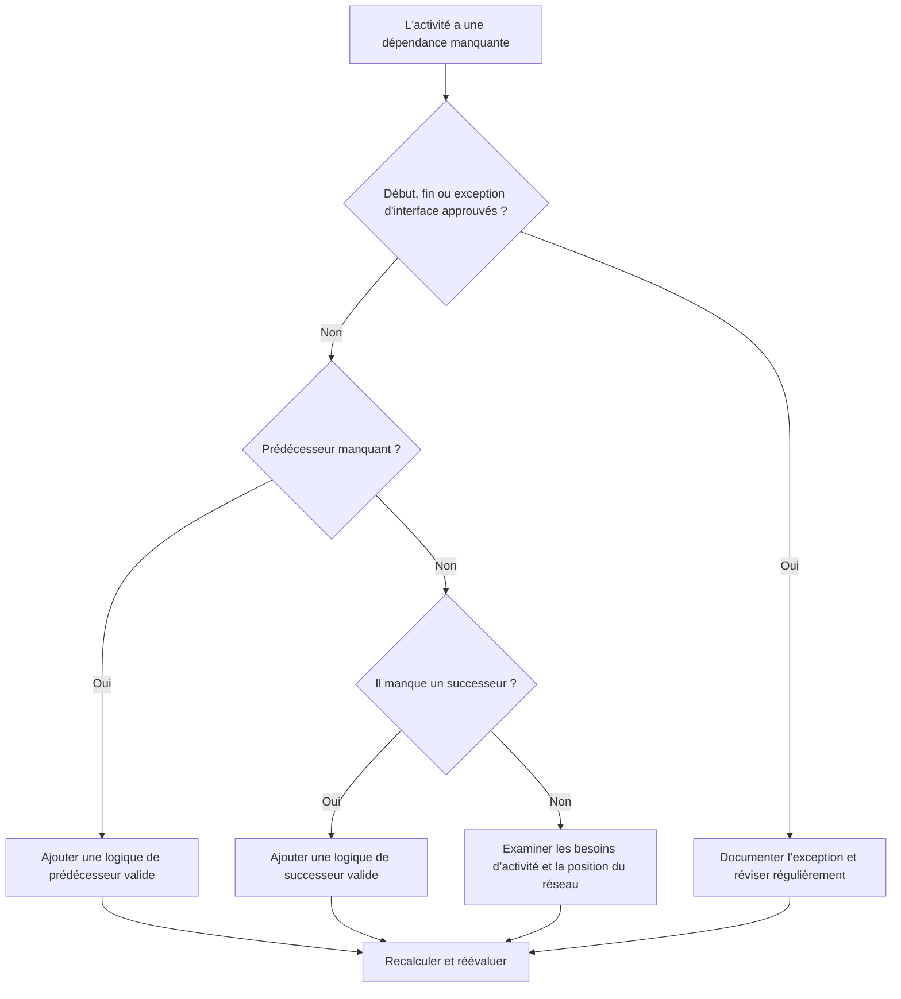

# Dépendances manquantes dans Primavera P6 - Guide d’amélioration

## But

Ce guide aide les planificateurs à identifier et à corriger la logique manquante du prédécesseur ou du successeur dans Primavera P6. Il prend en charge la qualité du planning en améliorant l'exhaustivité du réseau CPM.

## Avant de commencer

Rassemblez les informations suivantes avant d’agir :

- Résultat de l'évaluation actuelle pour cette métrique.
- Liste des activités sans prédécesseurs.
- Liste des activités sans successeurs.
- Liste des activités sans logique de prédécesseur ni de successeur.
- ID d'activité, nom de l'activité, WBS, type d'activité, statut de l'activité, début, fin, marge totale et calendrier.
- Début du projet approuvé, fin du projet, interface externe et liste d’exceptions contractuelles.
- Dernières notes de mise à jour et discipline responsable ou propriétaire du package.

## Comprenez votre résultat

Un résultat fort est zéro activité non résolue avec une logique de dépendance manquante.

Certaines activités peuvent légitimement n'avoir ni prédécesseur ni successeur, comme le jalon de début de projet approuvé, le jalon d'achèvement final ou les jalons d'interface externe approuvés. Ceux-ci doivent être limités et documentés.

Un résultat faible signifie que le planning contient des activités qui ne sont pas correctement connectées au réseau CPM.

## Objectif d'amélioration

La cible est 0 activité non résolue avec dépendances manquantes.

L'objectif est de connecter chaque activité à une logique valide de prédécesseur et de successeur, ou de documenter la raison approuvée pour laquelle il s'agit d'une exception.

## Plan d'action

### Étape 1 : Identifiez le problème principal

Créez une présentation ou un rapport P6 qui filtre les activités sans prédécesseurs, sans successeurs ou ni l'un ni l'autre. Incluez l'ID d'activité, le nom de l'activité, le WBS, le type d'activité, le statut de l'activité, le début, la fin, la marge totale, le calendrier, les contraintes, les prédécesseurs et les successeurs.

Passez en revue chaque activité et demandez :

- Cette activité est-elle un élément de début ou de fin de projet approuvé ?
- S'agit-il d'une interface externe, d'une date contrôlée par le propriétaire ou d'une exception contractuelle ?
- Quels travaux doivent être réalisés avant que cette activité puisse démarrer ?
- Quel travail dépend de la fin ou du démarrage de cette activité ?
- L'activité est-elle obsolète, dupliquée ou mal statutée ?
- Quel propriétaire peut confirmer la réelle dépendance ?

### Étape 2 : appliquer les correctifs recommandés

Pour les démarrages ouverts, ajoutez une logique prédécesseur qui représente la condition réelle requise avant que l'activité puisse commencer. Cela peut inclure des travaux préalables, des approbations, un accès, un approvisionnement, une autorisation de conception, une inspection ou un transfert.

Pour les finitions ouvertes, ajoutez une logique successeur qui représente ce qui dépend de l'activité. Cela peut inclure des travaux de suivi, des tests, une mise en service, un chiffre d'affaires, une clôture ou une étape d'achèvement.

Pour les activités isolées sans prédécesseurs ni successeurs, confirmez si l'activité est toujours nécessaire. S'il s'agit d'un travail valide, connectez-le au réseau. S'il est obsolète, supprimez-le ou fermez-le selon la procédure de contrôle du projet.

### Étape 3 : Supprimer les bloqueurs courants

Les bloqueurs courants incluent les activités copiées, les fragments incomplets, les transferts peu clairs entre les disciplines, les informations d'interface manquantes et la pression pour charger les activités avant que le séquençage ne soit connu.

Un autre bloqueur consiste à ajouter des relations d'espace réservé uniquement pour transmettre la métrique. Les relations doivent représenter de véritables dépendances et non des liens artificiels.

### Étape 4 : Validez les modifications

Recalculez le planning après corrections. Réexécutez la métrique et confirmez que chaque activité restante est soit connectée, soit documentée comme une exception approuvée.

Examinez la marge totale, le chemin critique ou le plus long, les dates des jalons et les rapports prospectifs à court terme pour confirmer que la logique ajoutée n'a pas créé de mouvement inattendu.

## Calendrier d'amélioration

### Jour 1 : Examiner et diagnostiquer

Exécutez les résultats des métriques et des groupes sur les prédécesseurs manquants, les successeurs manquants, les activités isolées, les exceptions valides et les activités obsolètes.

### Jours 2-3 : Mettre en œuvre les actions prioritaires

Corrigez d’abord les activités critiques, quasi critiques, contractuelles et à court terme. Ajoutez une logique valide et supprimez les activités obsolètes le cas échéant.

### Jours 4 et 5 : surveiller les premiers résultats

Recalculez le calendrier et examinez la marge, le chemin critique, les dates d'anticipation et les impacts des jalons.

### Jour 6 : derniers ajustements

Résolvez les questions de dépendance restantes avec les responsables de discipline, les propriétaires de packages, les directeurs de construction ou les responsables des contrôles de projet.

### Jour 7 : Réévaluer et comparer

Réexécutez l’évaluation et comparez le résultat au seuil cible.

## Suivi des progrès

Utilisez un simple tracker pour gérer les corrections et les approbations.

| Date | Mesure prise | Impact attendu | Résultat / Observation | Étape suivante |
| --- | --- | --- | --- | --- |
| [Date] | Dépendances manquantes examinées | Identifier les départs ouverts et les arrivées ouvertes | [Résultat observé] | Attribuer un propriétaire |
| [Date] | Logique prédécesseur ajoutée | Améliorer la logique de démarrage d’activité | [Résultat observé] | Recalculer le planning |
| [Date] | Logique de successeur ajoutée | Améliorer la continuité de fin d’activité | [Résultat observé] | Réévaluer la métrique |

## Si les résultats ne s'améliorent pas

Si les résultats ne s'améliorent pas, vérifiez si de nouvelles activités sont ajoutées sans logique, si les fragments importés sont incomplets ou si les règles d'exception sont trop souples.

Faites remonter les éléments non résolus lorsqu'ils affectent le chemin critique, les rapports clients, les étapes de paiement, le transfert, l'approvisionnement ou l'exécution à court terme.

## Entretien

Examinez cette métrique à chaque cycle de mise à jour, après la planification des importations et avant l'approbation de la ligne de base. Les dépendances manquantes doivent faire partie des contrôles de santé du calendrier standard.

## Liste de contrôle récapitulative

- [ ] Résultat actuel examiné
- [ ] Seuil cible confirmé
- [ ] Les départs ouverts examinés
- [ ] Finitions ouvertes revues
- [ ] Activités isolées revues
- [ ] Exceptions valides documentées
- [ ] Logique prédécesseur manquante ajoutée
- [ ] Logique de successeur manquante ajoutée
- [ ] Activités obsolètes résolues
- [ ] Horaire recalculé
- [ ] Évaluation répétée
- [ ] Prochaines étapes documentées
## Contenu associé
- [Dépendances manquantes dans Primavera P6 - Vue d’ensemble](01_overview_template.md)
- [Dépendances manquantes dans Primavera P6](03_blog_template.md)
- [Qu'est-ce qu'un horaire](../../08b_blogs_fr/01_WHAT%20A%20SCHEDULE%20IS/01_blog.md)
- [Logique robuste](../../08b_blogs_fr/02_ROBUST%20LOGIC/02_ROBUST%20LOGIC.md)
