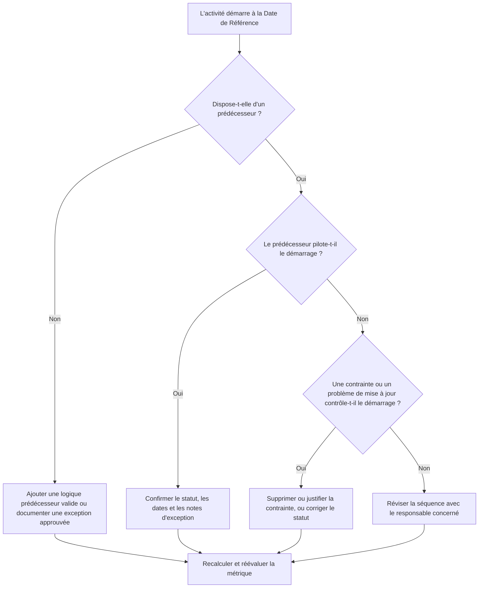

## Objectif

Ce guide aide les planificateurs et les équipes de contrôle de projet à réduire ou à éliminer les activités dont le démarrage prévu se situe à la Date de Référence (Data Date) de Primavera P6 sans logique prédécesseur valide pilotant ce démarrage. Il s'applique aux révisions qualité du planning, aux contrôles de santé PMO et à la validation lors des cycles de mise à jour.

L'objectif est de confirmer que les travaux à court terme sont soutenus par une logique CPM claire et que les activités ne démarrent pas à la Date de Référence uniquement en raison de relations manquantes, de contraintes, de dates manuelles ou de mises à jour d'avancement incomplètes.

## Avant de commencer

Rassemblez les informations suivantes avant d'agir :

- Résultat actuel de l'évaluation pour cette métrique.
- Date de Référence utilisée dans le dernier calcul du planning.
- Liste des activités ouvertes ou non démarrées avec une date de démarrage égale à la Date de Référence.
- Détails des relations prédécesseur et successeur pour chaque activité.
- Contraintes, dates attendues, dates réelles et affectations de calendrier.
- Options de calcul P6 utilisées pour la mise à jour, y compris les paramètres de logique conservée (retained logic) ou de priorité à l'avancement (progress override) le cas échéant.
- Exceptions approuvées, telles que les activités de démarrage de projet, les jalons d'interface externe ou les démarrages dirigés par le maître d'ouvrage.

## Comprendre votre résultat

Un bon résultat est zéro activité non résolue démarrant à la Date de Référence sans logique prédécesseur pilote. Cela signifie que les travaux actuels et à court terme sont connectés au réseau du planning et que la Date de Référence ne cache pas de séquencement manquant.

Un résultat acceptable peut inclure un petit nombre d'exceptions documentées. Celles-ci doivent être révisées et approuvées, et non ignorées. Par exemple, un jalon d'ordre de démarrage ou une activité autorisée extérieurement peut ne pas nécessiter un prédécesseur normal, mais la raison doit être visible pour les réviseurs.

Un résultat faible signifie que plusieurs activités démarrent à la Date de Référence sans pilote logique clair. Cela peut indiquer des démarrages ouverts, des relations prédécesseur manquantes, des contraintes excessives, des mises à jour d'avancement incomplètes ou des activités qui n'ont pas été correctement reséquencées après la dernière mise à jour.

## Objectif d'amélioration

La cible est 0 activité non résolue démarrant à la Date de Référence sans logique pilote valide.

L'objectif d'amélioration n'est pas seulement de réduire le nombre. L'objectif plus profond est de s'assurer que chaque activité proche de la Date de Référence a une raison défendable pour sa date de démarrage prévisionnelle. Après correction, chaque activité concernée doit soit avoir une logique prédécesseur appropriée, une exception documentée, ou un statut/une condition de date corrigée.

## Plan d'action

### Étape 1 : Identifier le problème principal

Créez une présentation ou un rapport P6 qui filtre les activités ouvertes ou non démarrées avec une date de démarrage égale à la Date de Référence. Incluez des colonnes pour l'ID d'activité, le nom d'activité, le WBS, le début, la fin, le statut, la marge totale, le calendrier, la contrainte principale, les prédécesseurs, les successeurs et les indicateurs de relation pilote si disponibles.

Révisez chaque activité et demandez :

- L'activité a-t-elle des prédécesseurs ?
- Si des prédécesseurs existent, pilotent-ils réellement le démarrage ?
- L'activité est-elle retenue ou déplacée par une contrainte ?
- L'activité manque-t-elle d'un démarrage réel ou d'une mise à jour d'avancement ?
- L'activité est-elle une exception valide, comme un jalon de démarrage de projet ?
- L'activité appartient-elle à une zone WBS où la logique est généralement faible ?

Regroupez les résultats en causes pratiques : prédécesseurs manquants, prédécesseurs non pilotes, contraintes ou dates attendues, erreurs de mise à jour/statut, ou exceptions approuvées.

### Étape 2 : Appliquer les corrections recommandées

Commencez par la logique manquante ou faible. Ajoutez des relations prédécesseur valides qui représentent la vraie séquence de travaux, comme des relations Fin-Début, Début-Début ou Fin-Fin selon le cas. Évitez d'ajouter des relations uniquement pour satisfaire la métrique ; chaque relation doit refléter une vraie dépendance de construction, d'ingénierie, d'approvisionnement, d'accès, d'approbation ou de remise.

Révisez ensuite les contraintes. Si une activité démarre à la Date de Référence en raison d'une contrainte de démarrage, confirmez si la contrainte est justifiée sur le plan contractuel ou opérationnel. Supprimez les contraintes inutiles et permettez à l'activité d'être pilotée par la logique. Si la contrainte est valide, documentez la raison et confirmez qu'elle ne déforme pas le chemin critique.

Vérifiez le statut d'avancement. Si le travail a déjà commencé, mettez à jour le démarrage réel et la durée restante correctement. Si le travail n'a pas commencé, confirmez que le démarrage prévisionnel doit rester à la Date de Référence. Une activité ne doit pas paraître prête à démarrer simplement parce que le cycle de mise à jour l'a tirée vers la date actuelle.

Après les modifications, recalculez le planning et révisez de nouveau les activités concernées. Confirmez que la date de démarrage est maintenant pilotée par la logique, correctement actualisée, ou documentée comme exception approuvée.

### Étape 3 : Supprimer les blocages courants

Les blocages courants comprennent les retours terrain peu clairs, les informations d'interface manquantes et la pression de faire paraître les travaux à court terme prêts. Résolvez-les en révisant les activités concernées avec les responsables de discipline, les directeurs de construction, les responsables approvisionnements ou les gestionnaires de lots.

Un autre blocage courant est l'utilisation abusive des contraintes comme substitut à la logique. Les contraintes peuvent être nécessaires dans certains cas, mais elles ne doivent pas remplacer le réseau du planning. Si une contrainte est conservée, documentez pourquoi elle existe et comment elle affecte la marge et le chemin le plus long.

Vérifiez également si le problème est causé par des paramètres de calcul du planning ou des pratiques de mise à jour. Si la priorité à l'avancement (progress override), la logique conservée (retained logic), l'avancement hors séquence ou une actualisation incomplète affectent le résultat, alignez la méthode de mise à jour avec la procédure de contrôle de projet avant de réévaluer la métrique.

### Étape 4 : Valider les modifications

Validez le planning corrigé avant la prochaine évaluation. Relancez le filtre pour les activités ouvertes ou non démarrées démarrant à la Date de Référence sans logique pilote. Confirmez que chaque élément restant est soit corrigé, soit documenté comme exception approuvée.

Révisez la marge totale, le chemin le plus long et les activités de planification à court terme après le recalcul. Une correction logique peut modifier le chemin critique ou révéler des problèmes de séquencement supplémentaires. Si le mouvement du planning est significatif, communiquez l'impact au responsable du contrôle de projet ou au réviseur PMO.

## Programme d'amélioration

### Jour 1 : Réviser et diagnostiquer

Lancer la métrique, confirmer la Date de Référence et produire la liste d'activités. Séparer les résultats en logique manquante, logique non pilote, contraintes, erreurs de statut et exceptions potentielles.

### Jours 2-3 : Mettre en œuvre les actions prioritaires

Corriger en priorité les activités à fort impact, notamment les activités critiques ou quasi critiques. Ajouter une logique prédécesseur valide, supprimer les contraintes inutiles, mettre à jour le statut incorrect et documenter les exceptions.

### Jours 4-5 : Surveiller les premiers résultats

Recalculer le planning et vérifier si les activités concernées sont maintenant pilotées par la logique. Contrôler les changements inattendus de marge totale, de chemin le plus long et de dates de jalons.

### Jour 6 : Ajustements finaux

Résoudre les blocages restants avec la discipline ou le responsable de lot concerné. Confirmer que les exceptions conservées sont justifiées et clairement documentées.

### Jour 7 : Réévaluer et comparer

Relancer l'évaluation et comparer le nouveau résultat avec le résultat précédent et le seuil cible. Confirmer si la métrique est maintenant à zéro activité non résolue ou si d'autres actions sont nécessaires.

## Suivi des progrès

Utilisez un tableau de suivi simple pour gérer les corrections et les approbations.

| Date | Action effectuée | Impact attendu | Résultat / Observation | Prochaine étape |
| --- | --- | --- | --- | --- |
| [Date] | Révision des activités démarrant à la Date de Référence sans logique pilote | Identifier la logique manquante ou faible | [Résultat observé] | Affecter les corrections au responsable concerné |
| [Date] | Ajout de relations prédécesseur valides | Améliorer le séquencement CPM | [Résultat observé] | Recalculer et réviser l'impact sur la marge |
| [Date] | Suppression ou justification des contraintes | Réduire les démarrages artificiels | [Résultat observé] | Confirmer les exceptions restantes |
| [Date] | Mise à jour du statut d'activité incorrect | Améliorer la précision de la mise à jour | [Résultat observé] | Relancer l'évaluation |

## Si les résultats ne s'améliorent pas

Si le résultat ne s'améliore pas, vérifiez si les mêmes activités sont toujours en défaut ou si de nouvelles activités apparaissent à la Date de Référence. Des défaillances répétées peuvent indiquer un problème plus large de développement du planning, comme une logique incomplète dans une zone WBS, une discipline de mise à jour faible ou une utilisation incohérente des contraintes.

Escaladez les problèmes persistants au responsable du contrôle de projet, au directeur de planification ou au réviseur PMO. Pour les grands plannings, envisagez un atelier de révision logique ciblé pour les lots de travaux concernés. Si le planning est utilisé pour le reporting contractuel, l'analyse des retards ou les prévisions de valeur acquise, les éléments non résolus doivent être traités comme une préoccupation de qualité.

## Maintenance

Révisez cette métrique lors de chaque cycle de mise à jour avant d'émettre le planning. La vérification doit faire partie de la révision standard de santé du planning, notamment après les mises à jour d'avancement, le reséquencement, les changements de périmètre majeurs ou la planification de rattrapage.

Les bonnes habitudes de maintenance comprennent le maintien des colonnes de prédécesseurs et de successeurs visibles dans les présentations P6, la révision des démarrages ouverts avant chaque soumission, la documentation des exceptions approuvées et la vérification que le déplacement de la Date de Référence ne crée pas un nouveau groupe d'activités non pilotées.

## Liste de contrôle récapitulative

- [ ] Résultat actuel révisé
- [ ] Seuil cible confirmé
- [ ] Date de Référence confirmée
- [ ] Activités démarrant à la Date de Référence identifiées
- [ ] Problème principal identifié
- [ ] Logique manquante ou faible corrigée
- [ ] Contraintes révisées et justifiées ou supprimées
- [ ] Dates de statut vérifiées
- [ ] Exceptions approuvées documentées
- [ ] Planning recalculé
- [ ] Résultats surveillés
- [ ] Évaluation répétée
- [ ] Prochaines étapes documentées
