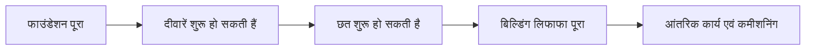
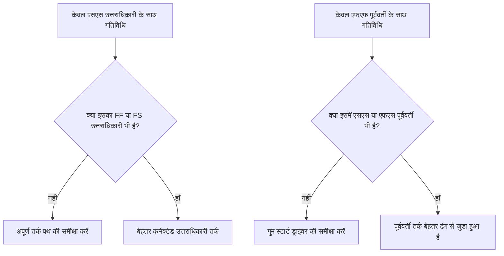

# मजबूत तर्क

तर्क एक परियोजना अनुसूची के अंदर अनुक्रमण और निर्भरता का गणितीय प्रतिनिधित्व है। यह बताता है कि क्या से पहले क्या होना चाहिए, कौन सी गतिविधियाँ एक ही समय में हो सकती हैं, और प्रोजेक्ट टीम पहली गतिविधि से अंतिम समापन तक कैसे जाने का इरादा रखती है।

एक अच्छे प्रिमावेरा पी6 शेड्यूल में, तर्क सजावट नहीं है। यह वह इंजन है जो शेड्यूल को तिथियों, फ़्लोट, महत्वपूर्ण पथ और पूर्वानुमान गति की गणना करने की अनुमति देता है। यह निष्पादन की कहानी को इस तरह से बताता है जिसकी समीक्षा की जा सकती है, चुनौती दी जा सकती है और सुधार किया जा सकता है।

यदि शेड्यूल कहता है "नींव रखें, फिर दीवारें बनाएं, फिर छत बनाएं," तर्क वह है जो उस अनुक्रम को गणना योग्य नेटवर्क में बदल देता है। योजनाकार केवल एक समयरेखा नहीं बना रहा है। योजनाकार वितरण पथ को परिभाषित कर रहा है।

## तर्क कार्य की कहानी बताता है

प्रत्येक प्रोजेक्ट टीम के पास प्रोजेक्ट को निष्पादित करने का एक इच्छित तरीका होता है। इंजीनियरिंग क्षेत्र के अनुसार डिज़ाइन जारी कर सकती है। खरीद पैकेज द्वारा उपकरण वितरित कर सकती है। संरचनात्मक कार्य शुरू होने से पहले सिविल कार्य पहुंच तैयार कर सकता है। कमीशनिंग शुरू होने से पहले यांत्रिक पूर्णता की आवश्यकता हो सकती है।

तर्क लिंक उस योजना की गणितीय अभिव्यक्ति हैं।

यह सरल आरेख केवल एक अनुक्रम नहीं है। यह एक निर्णय मॉडल है. यदि नींव देर से बनी, तो दीवारें भी देर से बनीं। यदि दीवारें देर से बनीं, तो छत भी देर से बनी। यदि छत देर से बनी तो आंतरिक कार्य प्रभावित हो सकते हैं। शेड्यूल तभी प्रभाव दिखा सकता है जब तर्क मौजूद हो।

मजबूत तर्क का मतलब है कि शेड्यूल यह बता सकता है कि गतिविधियाँ क्यों शुरू होती हैं, क्यों खत्म होती हैं, और जब योजना का एक हिस्सा आगे बढ़ता है तो क्या होता है।

## डेटा तिथि पर मजबूत तर्क क्यों मायने रखता है

मीट्रिक "बिना ड्राइविंग लॉजिक के डेटा तिथि पर शुरू होने वाली गतिविधियाँ" शेड्यूल गुणवत्ता का एक मजबूत परीक्षण है।

डेटा दिनांक वास्तविक प्रदर्शन और पूर्वानुमान कार्य के बीच की सीमा है। जब कोई गतिविधि ठीक डेटा तिथि पर शुरू होती है, तो समीक्षक को एक सरल प्रश्न पूछना चाहिए: इस शुरुआत का कारण क्या है?

यदि गतिविधि में वैध पूर्ववर्ती तर्क है, तो शेड्यूल शुरुआत की व्याख्या कर सकता है। शायद एक क्षेत्र जारी किया गया था. शायद एक सामग्री वितरण पूरा हो गया था. शायद पूर्ववर्ती गतिविधि समाप्त हो गई और अगले दल को शुरू करने की अनुमति मिल गई।

यदि गतिविधि में कोई ड्राइविंग तर्क नहीं है, तो शुरुआत कमज़ोर है। गतिविधि डेटा दिनांक पर हो सकती है क्योंकि इसका कोई पूर्ववर्ती नहीं है, क्योंकि तर्क अधूरा है, क्योंकि एक बाधा इसे मजबूर कर रही है, या क्योंकि अद्यतन पूरी तरह से स्थितिबद्ध नहीं था।

इसीलिए मजबूत तर्क मायने रखता है। किसी शेड्यूल को केवल डेटा दिनांक स्थानांतरित होने के कारण कार्य को तैयार नहीं दिखने देना चाहिए। इसमें वास्तविक स्थिति दिखनी चाहिए जिससे काम शुरू हो सके।

## संतुलन: पर्याप्त तर्क, निरर्थक तर्क नहीं

अच्छा तर्क संतुलित होता है. गतिविधियों को पूर्ववर्तियों और उत्तराधिकारियों से ठीक से जोड़ने के लिए शेड्यूल को पर्याप्त संबंधों की आवश्यकता होती है। साथ ही, उसे अनावश्यक तर्क से बचना चाहिए जो अनावश्यक तरीकों से एक ही निर्भरता को दोहराता है।

बहुत कम तर्क खुली शुरुआत, खुली समाप्ति, अविश्वसनीय फ़्लोट और कमज़ोर महत्वपूर्ण पथ परिणाम बनाता है। बहुत अधिक तर्क नेटवर्क की समीक्षा करना कठिन बना सकता है और किसी गतिविधि के वास्तविक ड्राइवर को छिपा सकता है।

लक्ष्य रिश्तों की संख्या को अधिकतम करना नहीं है। लक्ष्य अनिवार्य और आवश्यक निर्भरताओं को स्पष्ट रूप से प्रस्तुत करना है।

प्रत्येक गतिविधि के लिए, अनुसूचक को उत्तर देने में सक्षम होना चाहिए:

- कौन सी चीज़ इस गतिविधि को शुरू करने की अनुमति देती है?
- यह गतिविधि आगे क्या सक्षम बनाती है?
- कौन सा रिश्ता वास्तव में गतिविधि को संचालित कर रहा है?
- क्या कोई रिश्ता दोहरा या अनावश्यक है?
- क्या कोई समीक्षक इच्छित अनुक्रम को समझ पाएगा?

यह संतुलन पीएमओ शेड्यूल समीक्षा के केंद्र में है। एक सघन नेटवर्क स्वचालित रूप से एक मजबूत नेटवर्क नहीं होता है। एक लाइट नेटवर्क स्वचालित रूप से एक स्वच्छ नेटवर्क नहीं है। सही नेटवर्क बिना किसी अव्यवस्था के निष्पादन योजना की व्याख्या करता है।

## प्रत्येक गतिविधि के लिए एक स्टार्ट ड्राइवर की आवश्यकता होती है

मजबूत तर्क का मतलब है कि वैध प्रोजेक्ट-स्टार्ट या बाहरी रूप से अधिकृत अपवादों को छोड़कर, प्रत्येक गतिविधि में एक पूर्ववर्ती होता है जो इसकी शुरुआत की अनुमति देता है या ट्रिगर करता है।

किसी निर्माण गतिविधि के लिए, प्रारंभ चालक क्षेत्र पहुंच, पूर्ववर्ती पूर्णता, सामग्री उपलब्धता, डिज़ाइन रिलीज़, परमिट अनुमोदन, या पूर्व व्यापार समापन हो सकता है। किसी खरीद गतिविधि के लिए, यह डिज़ाइन अनुमोदन या खरीद आदेश जारी करना हो सकता है। कमीशनिंग के लिए, यह यांत्रिक पूर्णता, परीक्षण पैकेज की तैयारी या सिस्टम टर्नओवर हो सकता है।

जब यह स्टार्ट ड्राइवर गायब होता है, तो गतिविधि शेड्यूल में कृत्रिम स्थिति में तैर सकती है। अपडेट के दौरान, यह डेटा दिनांक पर दिखाई दे सकता है। इससे तत्परता की झूठी भावना पैदा होती है।

"पंप स्थापित करें" नामक गतिविधि पर विचार करें। यदि यह डेटा तिथि पर शुरू होता है, लेकिन नींव पूरा करने, पंप वितरण, या क्षेत्र हैंडओवर के लिए कोई पूर्ववर्ती नहीं है, तो शेड्यूल यह नहीं समझा रहा है कि स्थापना क्यों शुरू हो सकती है। गतिविधि की योजना बनाई जा सकती है, लेकिन तर्क मजबूत नहीं है।

## एसएस और एफएफ आधे रिश्ते हैं

प्रारंभ से प्रारंभ और अंत से अंत तक संबंध उपयोगी हैं, लेकिन उनका उपयोग सावधानी से किया जाना चाहिए। कई शेड्यूल समीक्षाओं में, उन्हें "आधे" रिश्तों के रूप में सबसे अच्छी तरह से समझा जाता है क्योंकि वे गतिविधि को पूरी तरह से अपने आप में पूर्ण तर्क पथ में नहीं रखते हैं।

एक एसएस संबंध यह बता सकता है कि कोई गतिविधि कब शुरू हो सकती है, लेकिन यह यह नहीं समझा सकता कि गतिविधि कब समाप्त होनी चाहिए या यह क्या सौंपती है। एक एफएफ संबंध पूर्ण संरेखण की व्याख्या कर सकता है, लेकिन यह यह नहीं समझा सकता कि गतिविधि को कब शुरू करने की अनुमति है।

यह एसएस या एफएफ को गलत नहीं बनाता है। ओवरलैपिंग कार्य सामान्य और अक्सर यथार्थवादी होता है। मुद्दा यह है कि क्या गतिविधि पूरी तरह से जुड़ी हुई है।

उदाहरण के लिए:

- एसएस उत्तराधिकारी वाली गतिविधि में आमतौर पर एफएफ या एफएस उत्तराधिकारी भी होना चाहिए।
- एफएफ पूर्ववर्ती वाली गतिविधि में आमतौर पर एसएस या एफएस पूर्ववर्ती भी होना चाहिए।

इससे गतिविधियों को उनकी अवधि के केवल एक तरफ से जुड़े होने से रोकने में मदद मिलती है। शेड्यूल में यह स्पष्ट होना चाहिए कि काम कैसे शुरू होता है और काम कैसे पूरा होता है।

## अभ्यास में मजबूत तर्क

एक व्यावहारिक तर्क समीक्षा डेटा तिथि के निकट की गतिविधियों, महत्वपूर्ण और निकट-महत्वपूर्ण कार्य और प्रमुख हैंडओवर पथों से शुरू होनी चाहिए। इन क्षेत्रों का वर्तमान निर्णय लेने पर सबसे अधिक प्रभाव पड़ता है।

P6 में, उपयोगी समीक्षा कॉलम में गतिविधि आईडी, गतिविधि नाम, WBS, प्रारंभ, समाप्ति, गतिविधि स्थिति, कुल फ़्लोट, पूर्ववर्ती, उत्तराधिकारी, संबंध प्रकार, अंतराल, बाधाएं, कैलेंडर और यदि उपलब्ध हो तो ड्राइविंग संबंध संकेतक शामिल हैं।

डेटा दिनांक से शुरू होने वाली प्रत्येक गतिविधि के लिए, पूछें:

- क्या गतिविधि वास्तव में शुरू करने के लिए तैयार है?
- कौन सा पूर्ववर्ती प्रारंभ की अनुमति देता है?
- क्या वह पूर्ववर्ती पूर्ण है, प्रगति पर है, या पूर्वानुमानित है?
- क्या रिश्ता चल रहा है?
- क्या कोई बाधा या अपेक्षित तारीख तर्क की जगह ले रही है?
- क्या गतिविधि में वैध उत्तराधिकारी तर्क भी है?

यदि उत्तर अस्पष्ट है, तो जिम्मेदार स्वामी के साथ गतिविधि की समीक्षा की जानी चाहिए। सुधार में एक लापता पूर्ववर्ती को जोड़ना, संबंध प्रकार को बदलना, एक बाधा को दूर करना, वास्तविक अपडेट करना या एक वैध अपवाद का दस्तावेजीकरण करना शामिल हो सकता है।

## कृत्रिम तर्क से बचना

एक गलती केवल मीट्रिक पास करने के लिए रिश्ते जोड़ना है। इससे मजबूत तर्क नहीं बनता. यह कृत्रिम तर्क पैदा करता है.

रिश्तों को वास्तविक निर्भरता का प्रतिनिधित्व करना चाहिए। यदि कोई लिंक निर्माण अनुक्रम, इंजीनियरिंग रिलीज, खरीद की आवश्यकता, पहुंच, अनुमोदन, परीक्षण, कमीशनिंग या हैंडओवर को प्रतिबिंबित नहीं करता है, तो यह नेटवर्क से संबंधित नहीं हो सकता है।

एक और गलती अनावश्यक तर्क को छोड़ना है क्योंकि यह अधिक सुरक्षित दिखता है। यदि वही निर्भरता पहले से ही एक स्पष्ट संबंध द्वारा दर्शाई गई है, तो अतिरिक्त लिंक महत्वपूर्ण पथ को भ्रमित कर सकते हैं और नेटवर्क का ऑडिट करना कठिन बना सकते हैं।

मजबूत तर्क स्पष्ट, उद्देश्यपूर्ण और बचाव योग्य है।

## निष्कर्ष

तर्क गणितीय कहानी है कि परियोजना कैसे क्रियान्वित की जाएगी। यह परिभाषित करता है कि पहले क्या होना चाहिए, एक साथ क्या हो सकता है और उसके बाद क्या होगा।

मजबूत तर्क का अर्थ यथासंभव अधिक से अधिक लिंक जोड़ना नहीं है। इसका मतलब है सही लिंक जोड़ना: प्रत्येक गतिविधि को वास्तविक पूर्ववर्तियों और उत्तराधिकारियों से जोड़ने के लिए पर्याप्त है, लेकिन इतने नहीं कि नेटवर्क अनावश्यक या भ्रामक हो जाए।

जब गतिविधियाँ बिना किसी ड्राइविंग तर्क के डेटा तिथि पर शुरू होती हैं, तो शेड्यूल उस कहानी में एक कमजोरी को उजागर कर रहा है। गतिविधि को तैयार के रूप में दिखाया जा सकता है, लेकिन नेटवर्क इसका कारण नहीं बताता है।

एक विश्वसनीय शेड्यूल को उस प्रश्न का स्पष्ट उत्तर देना चाहिए। इस कार्य को प्रारंभ करने की क्या अनुमति है? यह आगे क्या सक्षम करता है? यदि अनुसूची दोनों का उत्तर दे सकती है, तो तर्क मजबूत होता जा रहा है। यदि ऐसा नहीं हो सकता है, तो पूर्वानुमान पर भरोसा करने से पहले प्रोजेक्ट टीम को अधिक अनुक्रमण कार्य करना होगा।
## संबंधित सामग्री
- [प्रिमावेरा पी6 में गुम निर्भरताएँ - अवलोकन](../../05_metrics_hi/21_missing_dependencies/01_overview_template.md)
- [प्रिमावेरा पी6 अनुसूचियों में निरर्थक तर्क - अवलोकन](../../05_metrics_hi/06_redundant_logic/01_overview_template.md)
- [शेड्यूल क्या है](../01_WHAT%20A%20SCHEDULE%20IS/01_blog.md)
- [गंभीर पथ](../03_CRITICAL%20PATH/03_CRITICAL%20PATH.md)
