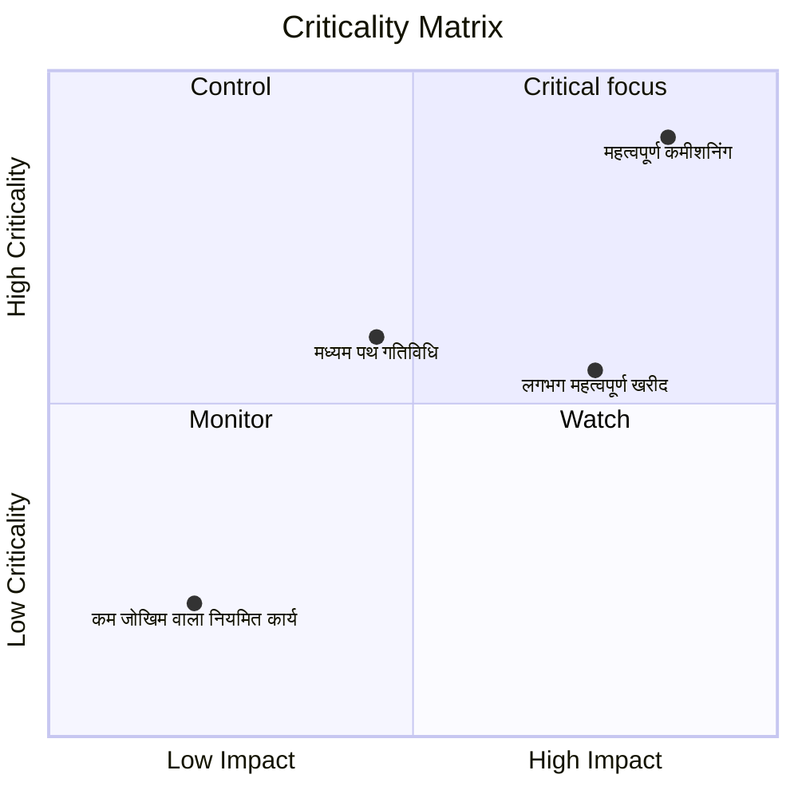

क्रिटिकैलिटी मैट्रिक्स एक दृश्य या विश्लेषणात्मक विधि है जिसका उपयोग प्रोजेक्ट गतिविधियों को वर्गीकृत करने और प्राथमिकता देने के लिए किया जाता है, जो इस आधार पर होता है कि वे प्रोजेक्ट पूरा करने के लिए कितने महत्वपूर्ण हैं। प्रिमावेरा पी6 संदर्भ में, यह परियोजना प्रबंधकों, योजनाकारों और पीएमओ समीक्षकों को यह पहचानने में मदद करता है कि कौन सी गतिविधियाँ सबसे बड़ा शेड्यूल जोखिम पैदा करती हैं।

महत्वपूर्ण पथ अनुसूची की वर्तमान नियतिवादी कहानी बताता है। एक आलोचनात्मकता मैट्रिक्स एक कदम आगे जाता है। इससे टीम को यह समझने में मदद मिलती है कि कौन सी गतिविधियाँ पहले से ही महत्वपूर्ण हैं, कौन सी गतिविधियाँ गंभीर होने के करीब हैं, और यदि वे चूक गईं तो गंभीर प्रभाव डाल सकती हैं।

यह मायने रखता है क्योंकि जो गतिविधि आज महत्वपूर्ण है वह हमेशा एकमात्र गतिविधि नहीं है जो ध्यान देने योग्य है। उच्च विलंब प्रभाव वाली लगभग-महत्वपूर्ण गतिविधि कल की समस्या बन सकती है। लंबी अवधि की खरीद गतिविधि वर्तमान महत्वपूर्ण पथ पर नहीं हो सकती है, लेकिन इसमें करीबी नियंत्रण को उचित ठहराने के लिए पर्याप्त जोखिम हो सकता है।

## पी6 में आलोचनात्मकता का क्या अर्थ है?

प्रिमावेरा पी6 में, गंभीरता आमतौर पर संदर्भित करती है कि क्या कोई गतिविधि देरी होने पर परियोजना समाप्ति तिथि को प्रभावित कर सकती है। परंपरागत रूप से, P6 कुल फ़्लोट या सबसे लंबे पथ सेटिंग्स का उपयोग करके महत्वपूर्ण गतिविधियों की पहचान करता है।

सामान्य नियतिवादी परिभाषा सरल है:

- महत्वपूर्ण गतिविधियाँ शून्य या नकारात्मक फ़्लोट वाली गतिविधियाँ हैं।
- ये गतिविधियाँ महत्वपूर्ण पथ पर हैं, या उससे निकटता से जुड़ी हुई हैं।
- यदि उनमें देरी होती है, तो परियोजना समाप्ति तिथि में देरी होने की संभावना है।

वह परिभाषा उपयोगी है, परंतु पूर्ण नहीं है। यह एक परिकलित शेड्यूल स्थिति पर आधारित है। यदि कोई गतिविधि विफल हो जाती है तो यह अनिश्चितता, संभावना या प्रभाव के आकार की पूरी तरह से व्याख्या नहीं करता है।

एक आलोचनात्मकता मैट्रिक्स "क्या यह गतिविधि आज महत्वपूर्ण है?" से चर्चा का विस्तार करती है। "इस गतिविधि के गंभीर होने की कितनी संभावना है, और इससे कितना नुकसान हो सकता है?"

## क्रिटिकैलिटी मैट्रिक्स क्या जोड़ता है

एक आलोचनात्मकता मैट्रिक्स आम तौर पर दो आयामों को जोड़ती है।

पहला आयाम शेड्यूल संवेदनशीलता या संभावना है। इसे इस बात से मापा जा सकता है कि मोंटे कार्लो सिमुलेशन के दौरान कोई गतिविधि कितनी बार महत्वपूर्ण हो जाती है, या कुल फ्लोट या निकट-महत्वपूर्ण सीमा के आधार पर यह महत्वपूर्ण के कितने करीब है।

दूसरा आयाम है प्रभाव. इसका मतलब है कि यदि गतिविधि धीमी हो जाती है तो देरी की गंभीरता होगी। प्रभाव गतिविधि की अवधि, परियोजना समाप्ति पर विलंब प्रभाव, संवेदनशीलता सूचकांक, लागत जोखिम, संविदात्मक मील का पत्थर प्रभाव, या प्रबंधन निर्णय पर आधारित हो सकता है।

साथ में, ये आयाम टीम को गतिविधियों को प्राथमिकता देने में मदद करते हैं।

इस प्रकार का दृश्य उपयोगी है क्योंकि यह उन गतिविधियों को अलग करता है जो केवल महत्वपूर्ण फ़िल्टर में दिखाई देती हैं उन गतिविधियों से जो सक्रिय प्रबंधन ध्यान देने योग्य हैं।

## एक सरल मैट्रिक्स संरचना

एक बुनियादी आलोचना मैट्रिक्स को ग्रिड के रूप में दिखाया जा सकता है:

| गंभीरता/प्रभाव | कम प्रभाव | मध्यम प्रभाव | उच्च प्रभाव |
| --- | --- | --- | --- |
| कम आलोचनात्मकता | निगरानी करना | निगरानी करना | घड़ी |
| मध्यम गंभीरता | समीक्षा | नियंत्रण | उच्च प्राथमिकता |
| उच्च आलोचनात्मकता | नियंत्रण | उच्च प्राथमिकता | गंभीर फोकस |

सटीक लेबल संगठन के अनुसार बदल सकते हैं, लेकिन विचार वही रहता है। कम गंभीरता और कम प्रभाव वाली गतिविधियों की निगरानी की जा सकती है। उच्च आलोचनात्मकता और उच्च प्रभाव वाली गतिविधियों पर केंद्रित नियंत्रण की आवश्यकता होती है।

## मैट्रिक्स में प्रयुक्त P6 डेटा

प्रिमावेरा पी6 आमतौर पर डिफ़ॉल्ट रूप से एक अंतर्निहित क्रिटिकलिटी मैट्रिक्स दृश्य प्रदान नहीं करता है। मैट्रिक्स आमतौर पर बाहरी विश्लेषण के साथ संयुक्त P6 गतिविधि डेटा का उपयोग करके बनाया जाता है।

उपयोगी P6 फ़ील्ड में शामिल हैं:

- कुल फ्लोट.
- मुक्त प्रवाह।
- गतिविधि की अवधि.
- शेष अवधि.
- गतिविधि स्थिति.
- आरंभ और समाप्ति तिथियां.
- प्रतिबंध।
- संबंध तर्क.
- कैलेंडर.
- WBS या गतिविधि कोड.
- महत्वपूर्ण या सबसे लंबा पथ संकेतक.

यह डेटा नियतात्मक अनुसूची दृश्य देता है। यह वर्तमान गणना पथ, निकट-महत्वपूर्ण कार्य, बाधित गतिविधियों और लंबे समय तक शेष जोखिम वाली गतिविधियों को दिखाता है।

## जोखिम विश्लेषण इनपुट

मैट्रिक्स को और अधिक शक्तिशाली बनाने के लिए, टीम मोंटे कार्लो विश्लेषण से संभाव्य अनुसूची जोखिम डेटा जोड़ सकती है। यह प्रिमावेरा जोखिम विश्लेषण या अन्य जोखिम सिमुलेशन प्लेटफ़ॉर्म जैसे टूल से आ सकता है।

महत्वपूर्ण जोखिम मेट्रिक्स में क्रिटिकैलिटी इंडेक्स, टोटल फ्लोट, शेड्यूल सेंसिटिविटी इंडेक्स और अवधि या प्रभाव मूल्य शामिल हैं।

क्रिटिकैलिटी इंडेक्स, जिसे अक्सर सीआई कहा जाता है, सिमुलेशन का प्रतिशत दिखाता है जहां एक गतिविधि महत्वपूर्ण पथ पर दिखाई देती है। उदाहरण के लिए, यदि किसी गतिविधि में सीआई = 80% है, तो यह 80% सिम्युलेटेड परिदृश्यों में महत्वपूर्ण था।

टोटल फ़्लोट दिखाता है कि नियतात्मक अनुसूची में परियोजना समाप्ति को प्रभावित करने के लिए कोई गतिविधि कितनी करीब है। लगभग-शून्य फ्लोट एक चेतावनी संकेत है।

अनुसूची संवेदनशीलता सूचकांक गंभीरता और प्रभाव को जोड़ती है। यह न केवल यह दिखाने में मदद करता है कि क्या गतिविधि महत्वपूर्ण हो गई है, बल्कि यह भी कि क्या यह परिणाम को सार्थक रूप से प्रभावित करती है।

अवधि या प्रभाव मान गंभीरता का अनुमान लगाने में मदद करता है। एक लंबी गतिविधि, एक उच्च जोखिम वाला खरीद पैकेज, या एक संविदात्मक मील के पत्थर से जुड़ा कार्य विलंब होने पर अधिक प्रभाव डाल सकता है।

## उदाहरण

निम्नलिखित सरलीकृत गतिविधि सेट पर विचार करें:

| गतिविधि | तैरना | आलोचनात्मकता सूचकांक | अवधि | मैट्रिक्स परिणाम |
| --- | ---: | ---: | ---: | --- |
| ए | 0 दिन | 95% | 20 दिन | गंभीर फोकस |
| बी | 5 दिन | 60% | 15 दिन | उच्च प्राथमिकता |
| सी | 20 दिन | 15% | 10 दिन | निगरानी करना |

गतिविधि ए उच्च गंभीरता और उच्च प्रभाव क्षेत्र से संबंधित है। इसमें कोई फ़्लोट नहीं है, अधिकांश सिमुलेशन में महत्वपूर्ण प्रतीत होता है, और इसकी लंबी अवधि होती है। यह केन्द्रित नियंत्रण का पात्र है।

गतिविधि बी गतिविधि ए जितनी जरूरी नहीं हो सकती है, लेकिन फिर भी यह ध्यान देने योग्य है। इसमें फ्लोट सीमित है और महत्वपूर्ण बनने की सार्थक संभावना है।

गतिविधि सी में अधिक फ़्लोट और कम आलोचनात्मकता है। इसे नजरअंदाज नहीं किया जाना चाहिए, लेकिन इसके लिए समान स्तर के प्रबंधन फोकस की आवश्यकता नहीं है।

## यह उपयोगी क्यों है

एक क्रिटिकलिटी मैट्रिक्स प्रोजेक्ट टीम को केवल एकल नियतात्मक महत्वपूर्ण पथ पर निर्भर रहने से बचने में मदद करता है। नियतिवादी पथ महत्वपूर्ण है, लेकिन यह अनुसूची का केवल एक दृश्य है।

मैट्रिक्स टीमों की मदद करता है:

- जिस चीज़ पर बारीकी से निगरानी रखनी है उसे प्राथमिकता दें।
- प्रमुख जोखिम गतिविधियों पर ध्यान केंद्रित करें।
- निकट-महत्वपूर्ण गतिविधियों को महत्वपूर्ण बनने से पहले पहचानें।
- संभाव्य अनुसूची जोखिम को समझें।
- एक दृश्य में संभावना और प्रभाव की तुलना करें।
- प्रबंधन को शेड्यूल जोखिम के बारे में अधिक स्पष्ट रूप से बताएं।

पीएमओ रिपोर्टिंग के लिए, यह विशेष रूप से उपयोगी है क्योंकि यह शेड्यूल जटिलता को निर्णय ढांचे में बदल देता है। सैकड़ों गतिविधियाँ प्रस्तुत करने के बजाय, टीम यह दिखा सकती है कि कौन सी गतिविधियाँ "महत्वपूर्ण फोकस," "उच्च प्राथमिकता," "नियंत्रण," या "मॉनिटर" क्षेत्रों में हैं।

## एक बनाने का एक सरल तरीका

P6 से गतिविधि डेटा निर्यात करके प्रारंभ करें। गतिविधि आईडी, गतिविधि नाम, डब्लूबीएस, कुल फ्लोट, शेष अवधि, प्रारंभ, समाप्ति, कैलेंडर, बाधाएं, और महत्वपूर्ण या सबसे लंबे पथ संकेतक शामिल करें।

फिर वैकल्पिक जोखिम विश्लेषण फ़ील्ड जोड़ें, जैसे क्रिटिकलिटी इंडेक्स और शेड्यूल सेंसिटिविटी इंडेक्स। यदि सिमुलेशन डेटा उपलब्ध नहीं है, तो फ़्लोट और अवधि के आधार पर व्यावहारिक सीमा का उपयोग करें। उदाहरण के लिए, उच्च गंभीरता का मतलब कुल फ्लोट 0 दिनों से कम या उसके बराबर या सीआई 70% से ऊपर हो सकता है। मध्यम गंभीरता का मतलब 40% और 70% के बीच निकट-महत्वपूर्ण फ्लोट या सीआई हो सकता है।

प्रभाव सीमाएँ परिभाषित करें। एक उच्च-प्रभाव वाली गतिविधि लंबी अवधि की हो सकती है, एक संविदात्मक मील के पत्थर से जुड़ी हो सकती है, एक उच्च-जोखिम पैकेज का हिस्सा हो सकती है, या परियोजना के समापन को प्रभावित करने के लिए सिमुलेशन द्वारा दिखाई जा सकती है।

अंत में, एक्सेल, पावर बीआई, या किसी अन्य रिपोर्टिंग टूल में गतिविधियों को प्लॉट करें। परिणाम को जटिल होने की आवश्यकता नहीं है. प्राथमिकता को दृश्यमान बनाने से मूल्य आता है।

## निर्णय का प्रयोग करें

आलोचनात्मकता मैट्रिक्स एक निर्णय-समर्थन उपकरण है, स्वचालित उत्तर नहीं। थ्रेसहोल्ड की समीक्षा परियोजना नियंत्रण टीम द्वारा की जानी चाहिए और परियोजना प्रकार, अनुबंध संवेदनशीलता और अनुसूची परिपक्वता के अनुसार समायोजित की जानी चाहिए।

यह भी याद रखें कि मैट्रिक्स शेड्यूल गुणवत्ता पर निर्भर करता है। यदि P6 शेड्यूल में तर्क गायब है, अवास्तविक अवधि, कठिन बाधाएं, खराब कैलेंडर, या कमजोर स्थिति अपडेट हैं, तो मैट्रिक्स उन कमजोरियों को प्राप्त करेगा।

मैट्रिक्स का सबसे अच्छा उपयोग विश्लेषणात्मक आउटपुट को पेशेवर शेड्यूलिंग निर्णय के साथ जोड़ना है।

## निष्कर्ष

क्रिटिकलिटी मैट्रिक्स परियोजना गतिविधियों को इस आधार पर रैंक करता है कि उनके महत्वपूर्ण होने की कितनी संभावना है और देरी होने पर उनका कितना प्रभाव पड़ेगा। यह कुल फ्लोट, अवधि, बाधाओं और तर्क जैसे पी 6 डेटा का उपयोग करता है, और इसे क्रिटिकैलिटी इंडेक्स और शेड्यूल सेंसिटिविटी इंडेक्स जैसे मोंटे कार्लो परिणामों के साथ मजबूत किया जा सकता है।

परियोजना प्रबंधकों और पीएमओ समीक्षकों के लिए, मैट्रिक्स शेड्यूल जोखिम को स्पष्ट प्रबंधन वार्तालाप में बदल देता है। यह टीम को उन गतिविधियों पर ध्यान केंद्रित करने में मदद करता है जो सबसे महत्वपूर्ण हैं, न कि केवल उन गतिविधियों पर जो आज के महत्वपूर्ण फ़िल्टर में दिखाई देती हैं।

अच्छी तरह से उपयोग किया गया, एक क्रिटिकलिटी मैट्रिक्स प्रोजेक्ट टीम को प्रतिक्रियाशील रिपोर्टिंग से सक्रिय शेड्यूल नियंत्रण की ओर बढ़ने में मदद करता है।
## संबंधित सामग्री
- [एक बाधा से शुरू होने वाला महत्वपूर्ण पथ या फ्लोट पथ - अवलोकन](../../metrics/09_cp_or_float_path_starting_with_constraint/02_guide_template.md)
- [गंभीर पथ](../03_CRITICAL%20PATH/03_CRITICAL%20PATH.md)
- [P6 में गतिविधि प्रकार](../05_ACTIVITY%20TYPES%20IN%20P6/05_ACTIVITY%20TYPES%20IN%20P6.md)
