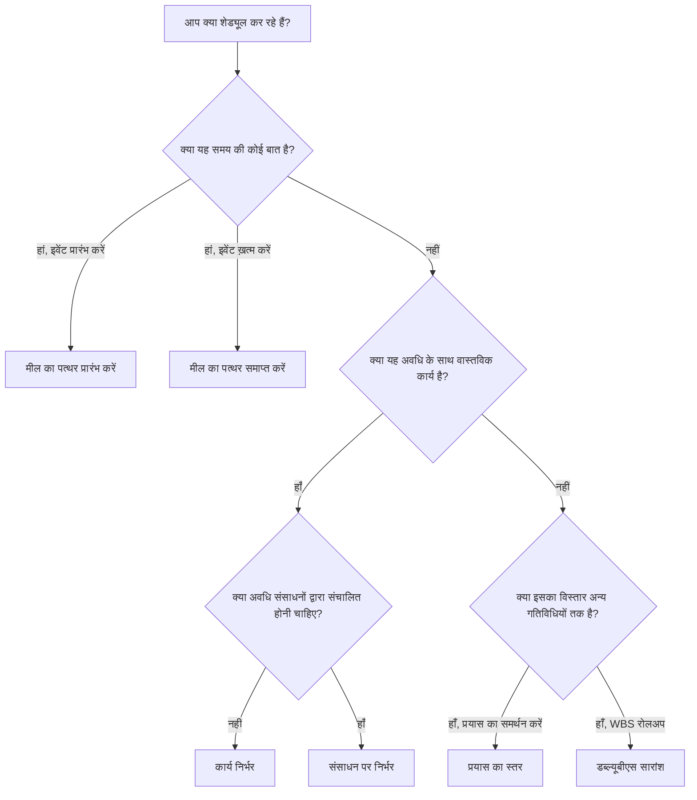

# P6 में गतिविधि प्रकार

गतिविधि प्रकार प्रिमावेरा पी6 में सबसे महत्वपूर्ण सेटअप फ़ील्ड में से एक है। यह P6 को बताता है कि वह किस प्रकार की गतिविधि की गणना कर रहा है और उस गतिविधि को शेड्यूल में कैसे व्यवहार करना चाहिए।

कई शेड्यूलर पहले गतिविधि के नाम, अवधि, तिथियां और संबंधों पर ध्यान केंद्रित करते हैं। वे आवश्यक हैं, लेकिन गतिविधि का प्रकार भी मायने रखता है। एक कार्य गतिविधि, एक मील का पत्थर, प्रयास स्तर की गतिविधि और एक डब्लूबीएस सारांश गतिविधि एक ही तरह से व्यवहार नहीं करती हैं। गलत प्रकार चुनने से दिनांक, प्रगति, संसाधन लोडिंग, फ़्लोट और रिपोर्टिंग विकृत हो सकती है।

इस ब्लॉग का उद्देश्य पी6 में उपलब्ध मुख्य गतिविधि प्रकारों की व्याख्या करना है, प्रत्येक का उपयोग किस लिए किया जाता है, और यह कैसे तय किया जाए कि कौन सा प्रकार नियोजित कार्य के लिए उपयुक्त है।

## गतिविधि प्रकार क्यों मायने रखता है

गतिविधि प्रकार को आइटम के शेड्यूलिंग उद्देश्य से मेल खाना चाहिए। क्या यह एक अवधि वाला वास्तविक कार्य है? क्या यह समय की कोई बात है? क्या यह कार्य का सारांश है जो अन्य गतिविधियों तक फैला हुआ है? क्या यह ऐसा प्रयास है जो किसी निश्चित कार्य अवधि के बजाय संसाधनों पर निर्भर करता है?

यदि गतिविधि का प्रकार उद्देश्य से मेल नहीं खाता है, तो शेड्यूल भ्रमित करने वाला हो सकता है। अवधि के साथ एक मील का पत्थर कोई मील का पत्थर नहीं है। सारांश के रूप में उपयोग किया जाने वाला एक सामान्य कार्य तर्क छिपा सकता है। कार्य को आगे बढ़ाने के लिए उपयोग की जाने वाली प्रयास स्तर की गतिविधि महत्वपूर्ण पथ को विकृत कर सकती है। गलत तरीके से उपयोग की गई संसाधन निर्भर गतिविधि अपेक्षा से भिन्न गणना कर सकती है।

पी6 में, गतिविधि प्रकार एक व्यावहारिक प्रश्न का उत्तर देने में मदद करता है: शेड्यूल की गणना करते समय इस आइटम को कैसा व्यवहार करना चाहिए?

## P6 में मुख्य गतिविधि प्रकार

सबसे आम प्रिमावेरा पी6 गतिविधि प्रकार हैं:

- कार्य निर्भर.
- संसाधन पर निर्भर.
- प्रयास का स्तर.
- मील का पत्थर प्रारंभ करें.
- मील का पत्थर समाप्त करें.
- डब्ल्यूबीएस सारांश।

प्रत्येक का एक अलग उद्देश्य है.

## कार्य पर निर्भर गतिविधियाँ

P6 में टास्क डिपेंडेंट सबसे आम गतिविधि प्रकार है। इसका उपयोग सामान्य नियोजित कार्य के लिए करें जहां गतिविधि की अवधि गतिविधि के निर्दिष्ट कैलेंडर द्वारा नियंत्रित की जाती है, न कि व्यक्तिगत संसाधन कैलेंडर द्वारा।

उदाहरणों में शामिल हैं:

- नींव खोदना.
- केबल ट्रे स्थापित करें.
- कंक्रीट स्लैब डालो.
- डिज़ाइन पैकेज तैयार करें.
- दबाव परीक्षण करें.

अधिकांश निर्माण, इंजीनियरिंग, खरीद, परीक्षण और कमीशनिंग कार्यों के लिए कार्य-निर्भर गतिविधियाँ आमतौर पर सबसे अच्छा विकल्प होती हैं। वे स्पष्ट, स्थिर और समझने में आसान हैं। शेड्यूलर अवधि को परिभाषित करता है, गतिविधि कैलेंडर निर्दिष्ट करता है, तर्क जोड़ता है, और P6 तिथियों की गणना करता है।

जब गतिविधि कार्य के अलग-अलग दायरे का प्रतिनिधित्व करती है तो टास्क डिपेंडेंट का उपयोग करें और संसाधन कैलेंडर के आधार पर कार्य की अवधि नहीं बदलनी चाहिए।

## संसाधन पर निर्भर गतिविधियाँ

संसाधन पर निर्भर गतिविधियों का उपयोग तब किया जाता है जब अवधि और शेड्यूलिंग व्यवहार गतिविधि को सौंपे गए संसाधनों से प्रभावित होना चाहिए। इस मामले में, गतिविधि कैसे निर्धारित की जाती है इसकी गणना करने के लिए P6 संसाधन कैलेंडर और संसाधन उपलब्धता का उपयोग कर सकता है।

यह तब उपयोगी हो सकता है जब संसाधन उपलब्धता कार्य का वास्तविक चालक हो। उदाहरण के लिए, एक विशेष दल, निरीक्षक, या उपकरण संसाधन केवल कुछ निश्चित दिनों या पाली में ही उपलब्ध हो सकता है।

उदाहरणों में शामिल हो सकते हैं:

- एक सीमित निरीक्षक द्वारा विशिष्ट निरीक्षण।
- विक्रेता तकनीशियन सहायता।
- एक दुर्लभ संसाधन का उपयोग करके उपकरण अंशांकन।
- संसाधन-संचालित रखरखाव कार्य।

संसाधन पर निर्भर गतिविधियों का उपयोग सावधानी से किया जाना चाहिए। यदि प्रोजेक्ट सक्रिय रूप से संसाधन-लोडेड या संसाधन-स्तरीय नहीं है, तो आदत से संसाधन निर्भर का उपयोग करने से भ्रम पैदा हो सकता है। कई शेड्यूल टास्क डिपेंडेंट को डिफ़ॉल्ट के रूप में उपयोग करते हैं क्योंकि गतिविधि कैलेंडर मुख्य शेड्यूलिंग आधार है।

जब संसाधनों और उनके कैलेंडर का उद्देश्य शेड्यूल गणना को प्रभावित करना हो तो रिसोर्स डिपेंडेंट का उपयोग करें।

## मील का पत्थर प्रारंभ करें

स्टार्ट माइलस्टोन एक शून्य-अवधि की गतिविधि है जो किसी घटना, चरण, एक्सेस विंडो, प्राधिकरण या प्रमुख कार्य स्थिति की शुरुआत का प्रतिनिधित्व करती है।

उदाहरणों में शामिल हैं:

- आगे बढ़ने की सूचना प्राप्त हुई.
- क्षेत्र में प्रवेश की अनुमति दी गई।
- निर्माण प्रारंभ.
- निष्पादन के लिए डिज़ाइन पैकेज जारी किया गया।
- विंडो चालू करना प्रारंभ करें.

प्रारंभ मील के पत्थर प्रदर्शन किए जा रहे कार्य का प्रतिनिधित्व नहीं करते हैं। वे समय में एक बिंदु का प्रतिनिधित्व करते हैं जो काम शुरू करने की अनुमति देता है या एक महत्वपूर्ण शुरुआत घटना को चिह्नित करता है।

जब शेड्यूल को किसी महत्वपूर्ण चीज़ की शुरुआत को चिह्नित करने की आवश्यकता हो तो स्टार्ट माइलस्टोन का उपयोग करें। इसे आम तौर पर तर्क से जोड़ा जाना चाहिए जो बताता है कि मील का पत्थर क्या है और यह किस काम को जारी करता है।

## मील का पत्थर समाप्त करें

फिनिश माइलस्टोन एक शून्य-अवधि की गतिविधि है जो किसी घटना, चरण, वितरण योग्य या संविदात्मक बिंदु के पूरा होने का प्रतिनिधित्व करती है।

उदाहरणों में शामिल हैं:

- यांत्रिक पूर्णता हासिल की गई।
- सिस्टम टर्नओवर पूर्ण.
- परमिट की मंजूरी मिल गई.
- पर्याप्त समापन.
- अंतिम समापन.

फिनिश माइलस्टोन रिपोर्टिंग के लिए उपयोगी होते हैं क्योंकि वे उपलब्धि को चिह्नित करते हैं। इनका उपयोग सामान्य कार्य गतिविधियों के रूप में नहीं किया जाना चाहिए। यदि लक्ष्य तक पहुंचने के लिए प्रयास की आवश्यकता है, तो उस प्रयास को लक्ष्य तक पहुंचाने वाले कार्यों के रूप में तैयार किया जाना चाहिए।

जब शेड्यूल को यह चिह्नित करने की आवश्यकता हो कि कुछ पूरा हो गया है या हासिल कर लिया गया है तो फिनिश माइलस्टोन का उपयोग करें।

## प्रयास का स्तर

प्रयास का स्तर, जिसे अक्सर एलओई कहा जाता है, का उपयोग उन गतिविधियों के लिए किया जाता है जो परियोजना को सीधे चलाने के बजाय अन्य कार्यों को फैलाते हैं। एलओई गतिविधियों का उपयोग आमतौर पर प्रबंधन, पर्यवेक्षण, निरीक्षण समर्थन, परियोजना नियंत्रण या चल रहे समन्वय के लिए किया जाता है।

उदाहरणों में शामिल हैं:

- परियोजना प्रबंधन समर्थन.
- साइट पर्यवेक्षण.
- इंजीनियरिंग प्रबंधन।
- निर्माण प्रबंधन.
- गुणवत्ता निरीक्षण समर्थन.

एक एलओई गतिविधि आम तौर पर अन्य गतिविधियों से अपनी तिथियां प्राप्त करती है। इसे उस समर्थन प्रयास का प्रतिनिधित्व करना चाहिए जो अन्य कार्य होने के दौरान भी जारी रहता है। आमतौर पर इसका उद्देश्य अलग-अलग निर्माण या इंजीनियरिंग कार्यों का चालक बनना नहीं है।

LOE का उपयोग तब करें जब गतिविधि चल रहे समर्थन, निरीक्षण, या प्रबंधन का प्रतिनिधित्व करती है जो गतिविधियों के एक समूह तक फैली होनी चाहिए।

LOE तर्क से सावधान रहें. यदि कोई एलओई गलत तरीके से लिंक किया गया है, तो यह तारीखों को बढ़ा सकता है या फ़्लोट को विकृत कर सकता है। शेड्यूल गुणवत्ता जांच के दौरान एलओई गतिविधियों की समीक्षा की जानी चाहिए, खासकर जब वे महत्वपूर्ण पथ पर दिखाई देते हैं या उनमें असामान्य एफएस या एसएफ संबंध होते हैं।

## डब्ल्यूबीएस सारांश

WBS सारांश गतिविधियाँ WBS तत्व के भीतर गतिविधियों के एक समूह का सारांश प्रस्तुत करती हैं। उनकी तारीखें डब्ल्यूबीएस के तहत गतिविधियों से ली गई हैं, न कि उनके अपने विस्तृत तर्क से।

उदाहरणों में शामिल हैं:

- इंजीनियरिंग सारांश.
- खरीद सारांश.
- क्षेत्र ए निर्माण सारांश।
- सिस्टम 01 कमीशनिंग सारांश।

WBS सारांश गतिविधियाँ उच्च-स्तरीय रिपोर्टिंग के लिए उपयोगी हो सकती हैं, लेकिन उन्हें वास्तविक गतिविधियों या तर्क को प्रतिस्थापित नहीं करना चाहिए। वे रोलअप टूल हैं, निष्पादन कार्य नहीं।

WBS सारांश गतिविधियों का उपयोग तब करें जब आपको WBS अनुभाग के सारांश-स्तरीय दृश्य की आवश्यकता हो, और केवल तभी जब प्रोजेक्ट रिपोर्टिंग विधि उनके उपयोग का समर्थन करती हो।

## सही प्रकार का चयन

एक सरल नियम मदद करता है:

- यदि यह अवधि के साथ वास्तविक कार्य है, तो टास्क डिपेंडेंट का उपयोग करें जब तक कि संसाधन कैलेंडर इसे संचालित न करें।
- यदि संसाधन उपलब्धता इसे चलाती है, तो संसाधन निर्भर का उपयोग करें।
- यदि यह एक प्रारंभ ईवेंट है, तो स्टार्ट माइलस्टोन का उपयोग करें।
- यदि यह एक समापन कार्यक्रम है, तो फिनिश माइलस्टोन का उपयोग करें।
- यदि यह चालू समर्थन है जो अन्य कार्यों तक फैला है, तो प्रयास के स्तर का उपयोग करें।
- यदि यह एक रिपोर्टिंग रोलअप है, तो WBS सारांश का उपयोग करें।

गतिविधि प्रकार से शेड्यूल को समझना आसान हो जाना चाहिए। यदि समीक्षकों को यह पूछने की ज़रूरत है कि एक मील के पत्थर की अवधि क्यों है, एक एलओई काम क्यों चला रहा है, या एक डब्ल्यूबीएस सारांश विस्तृत तर्क में क्यों दिखाई देता है, तो गतिविधि का प्रकार गलत हो सकता है।

## सामान्य गलतियां

एक आम गलती काम के लिए स्टैंड-इन के रूप में मील के पत्थर का उपयोग करना है। एक मील के पत्थर को समय में एक बिंदु को चिह्नित करना चाहिए। यदि कार्य की आवश्यकता है, तो कार्य के लिए गतिविधियाँ बनाएँ।

एक और गलती असतत कार्य को नियंत्रित करने के लिए एलओई गतिविधियों का उपयोग करना है। एलओई को काम का समर्थन या विस्तार करना चाहिए, वास्तविक गतिविधियों के बीच तर्क को प्रतिस्थापित नहीं करना चाहिए।

तीसरी गलती संसाधन-संचालित शेड्यूलिंग प्रक्रिया के बिना रिसोर्स डिपेंडेंट का उपयोग करना है। यदि संसाधन कैलेंडर का रखरखाव नहीं किया जा रहा है, तो गतिविधि प्रकार मूल्य से अधिक भ्रम पैदा कर सकता है।

अंत में, एक अच्छी तरह से निर्मित WBS और विस्तृत तर्क के विकल्प के रूप में WBS सारांश गतिविधियों का उपयोग करने से बचें। सारांश रिपोर्टिंग के लिए उपयोगी होते हैं, लेकिन शेड्यूल के तहत अभी भी वास्तविक गतिविधियों की आवश्यकता होती है।

## निष्कर्ष

P6 में गतिविधि प्रकार परिभाषित करते हैं कि गतिविधियाँ कैसे व्यवहार करती हैं। वे सिर्फ लेबल नहीं हैं. सही गतिविधि प्रकार शेड्यूल को सही ढंग से गणना करने और स्पष्ट रूप से संचार करने में मदद करता है।

कार्य पर निर्भर गतिविधियाँ सबसे सामान्य कार्य का प्रतिनिधित्व करती हैं। संसाधन पर निर्भर गतिविधियाँ तब उपयोगी होती हैं जब संसाधन कैलेंडर को शेड्यूलिंग को नियंत्रित करना चाहिए। प्रारंभ और समाप्ति मील के पत्थर समय में प्रमुख बिंदुओं को चिह्नित करते हैं। प्रयास का स्तर गतिविधियाँ उस समर्थन का प्रतिनिधित्व करती हैं जो अन्य कार्यों तक फैला हुआ है। WBS सारांश गतिविधियाँ रोलअप रिपोर्टिंग का समर्थन करती हैं।

सही गतिविधि प्रकार चुनने से शेड्यूल की समीक्षा करना आसान हो जाता है, व्याख्या करना आसान हो जाता है और प्रोजेक्ट नियंत्रण के लिए अधिक विश्वसनीय हो जाता है। एक मजबूत शेड्यूल में केवल अच्छी तारीखें और तर्क ही नहीं होते। यह प्रस्तुत किए जा रहे कार्य के लिए सही प्रकार की गतिविधि का भी उपयोग करता है।
## संबंधित सामग्री
- [बिना किसी ड्राइविंग लॉजिक के डेटा तिथि पर शुरू होने वाली गतिविधियाँ: यह शेड्यूल मीट्रिक क्यों मायने रखता है - अवलोकन](../../metrics/01_activities_starting_in_dd_with_no_logic_driving/02_guide_template.md)
- [आलोचनात्मकता मैट्रिक्स](../04_CRITICALITY%20MATRIX/04_CRITICALITY%20MATRIX.md)
- [पी6 में अवधि प्रकार](../06_DURATION%20TYPES%20IN%20P6/06_DURATION%20TYPES%20IN%20P6.md)
