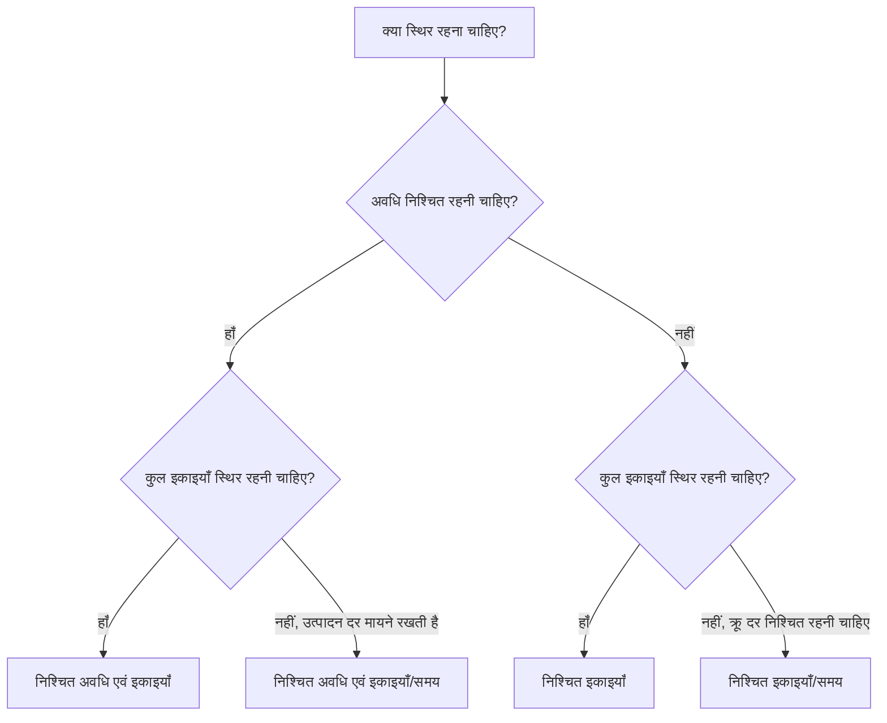

# पी6 में अवधि प्रकार

अवधि प्रकार प्रिमावेरा पी6 में उन क्षेत्रों में से एक है जो यह नियंत्रित करता है कि अवधि, इकाइयों और संसाधन उत्पादकता में परिवर्तन होने पर कोई गतिविधि कैसे व्यवहार करती है। इसे नज़रअंदाज करना आसान है, लेकिन यह शेड्यूल तिथियों, संसाधन लोडिंग, लागत पूर्वानुमान, अर्जित मूल्य और अद्यतन व्यवहार को प्रभावित कर सकता है।

कई शेड्यूलर अवधि को केवल कुछ दिनों के रूप में सोचते हैं। P6 में, अवधि एक संख्या से अधिक है। एक गतिविधि में श्रम इकाइयाँ, गैर-श्रम इकाइयाँ, प्रति समय इकाइयाँ, संसाधन कैलेंडर, गतिविधि कैलेंडर और शेष कार्य भी हो सकते हैं। अवधि प्रकार P6 को बताता है कि जब शेड्यूल पुनर्गणना करता है या जब शेड्यूलर संसाधनों और अवधियों को बदलता है तो क्या तय रहना चाहिए।

यह ब्लॉग पी6 में गतिविधियों के लिए उपलब्ध मुख्य अवधि प्रकारों की व्याख्या करता है, वे कैसे भिन्न हैं, प्रत्येक का उपयोग किस लिए किया जाता है, और एक के बजाय दूसरे का उपयोग कब करना है।

## अवधि प्रकार अवधि फ़ील्ड के समान नहीं है

प्रकारों को देखने से पहले, यह दो विचारों को अलग करने में मदद करता है।

अवधि फ़ील्ड मूल अवधि, शेष अवधि, वास्तविक अवधि और समापन अवधि जैसे मान हैं। ये समय का वर्णन करते हैं।

अवधि प्रकार एक गणना सेटिंग है. यह P6 को बताता है कि कुछ परिवर्तन होने पर अवधि, कुल इकाइयों और प्रति समय इकाइयों को कैसे संतुलित किया जाए।

उदाहरण के लिए, यदि आप किसी गतिविधि में अधिक संसाधन जोड़ते हैं, तो क्या गतिविधि पहले समाप्त होनी चाहिए? या क्या अवधि वही रहनी चाहिए और कुल प्रयास बढ़ जाना चाहिए? उत्तर अवधि प्रकार पर निर्भर करता है।

## मुख्य अवधि के प्रकार

सामान्य P6 अवधि प्रकार हैं:

- निश्चित अवधि एवं इकाइयाँ।
- निश्चित अवधि एवं इकाइयाँ/समय।
- निश्चित इकाइयाँ.
- निश्चित इकाइयाँ/समय।

नाम पहली बार में तकनीकी लग सकते हैं, लेकिन हर एक एक व्यावहारिक प्रश्न का उत्तर देता है: जब कुछ बदलता है तो P6 को गतिविधि के किस हिस्से की रक्षा करनी चाहिए?

## निश्चित अवधि एवं इकाइयाँ

निश्चित अवधि और इकाइयाँ गतिविधि की अवधि और कुल इकाइयाँ निश्चित रखती हैं। यदि प्रति समय इकाइयाँ बदलती हैं, तो P6 अवधि या कुल प्रयास को बदलने के बजाय दर को समायोजित करता है।

यह प्रकार तब उपयोगी होता है जब नियोजित समय विंडो और कुल प्रयास दोनों स्थिर रहने का इरादा रखते हैं।

उदाहरण:

400 श्रम घंटों के साथ 10 दिनों के लिए एक गतिविधि की योजना बनाई गई है। शेड्यूल टीम चाहती है कि अवधि 10 दिन रहे और कुल बजटीय प्रयास 400 घंटे रहे। यदि संसाधन असाइनमेंट विवरण बदलता है, तो नियोजित अवधि और कुल इकाइयाँ स्वचालित रूप से स्थानांतरित नहीं होनी चाहिए।

निश्चित अवधि और इकाइयों का उपयोग करें जब:

- गतिविधि में एक निश्चित कार्य विंडो होती है.
- कुल प्रयास पर पहले ही सहमति हो चुकी है।
- संसाधन दर परिवर्तन से गतिविधि की अवधि स्वचालित रूप से नहीं बदलनी चाहिए।
- शेड्यूल का उपयोग स्थिर लागत या अर्जित मूल्य नियंत्रण के लिए किया जाता है।

यह अक्सर प्रबंधित कार्य पैकेजों के लिए उपयोगी होता है जहां शेड्यूल अवधि और बजटीय प्रयास दोनों नियंत्रित होते हैं।

## निश्चित अवधि एवं इकाइयाँ/समय

निश्चित अवधि और इकाइयाँ/समय अवधि और संसाधन दर को निश्चित रखता है। यदि संसाधन जोड़े या हटाए जाते हैं, तो P6 कुल इकाइयों को समायोजित कर सकता है।

यह प्रकार तब उपयोगी होता है जब गतिविधि एक निश्चित समय विंडो के दौरान होनी चाहिए और संसाधन लोडिंग दर लगातार बनी रहनी चाहिए।

उदाहरण:

एक परियोजना प्रबंधन सहायता गतिविधि 20 दिनों तक चलती है। टीम एक प्रोजेक्ट इंजीनियर को प्रति दिन 8 घंटे नियुक्त करती है। अवधि 20 दिन और दैनिक दर 8 घंटे प्रतिदिन रहनी चाहिए। कुल इकाइयाँ समय विंडो और दर का परिणाम हैं।

निश्चित अवधि और इकाइयों/समय का उपयोग करें जब:

- गतिविधि की अवधि निश्चित है.
- दैनिक या प्रति घंटा संसाधन दर महत्वपूर्ण है.
- कुल इकाइयों की गणना अवधि और दर से की जानी चाहिए।
- गतिविधि चल रहे समर्थन या एक निश्चित कार्य अवधि का प्रतिनिधित्व करती है।

यह पर्यवेक्षण, प्रबंधन, निरीक्षण सहायता या समय-आधारित सहायता गतिविधियों के लिए उपयोगी हो सकता है।

## निश्चित इकाइयाँ

निश्चित इकाइयाँ कुल इकाइयों को निश्चित रखती हैं। यदि संसाधन दर बदलती है, तो P6 अवधि को समायोजित कर सकता है।

यह प्रकार तब उपयोगी होता है जब कार्य की मात्रा निश्चित होती है, लेकिन अवधि उत्पादकता या संसाधन उपलब्धता पर निर्भर करती है।

उदाहरण:

एक गतिविधि के लिए 800 श्रम घंटों की आवश्यकता होती है। यदि टीम अधिक क्रू क्षमता प्रदान करती है, तो गतिविधि जल्दी समाप्त हो सकती है। यदि कम क्रू क्षमता उपलब्ध है, तो गतिविधि में अधिक समय लग सकता है। कुल काम 800 घंटे रहता है.

स्थिर इकाइयों का उपयोग करें जब:

- कार्य की मात्रा या कुल प्रयास निश्चित है।
- अवधि को संसाधन उपलब्धता या उत्पादकता पर प्रतिक्रिया देनी चाहिए।
- क्रू का आकार गतिविधि को पूरा करने के लिए आवश्यक समय को बदल सकता है।
- संसाधन नियोजन सक्रिय एवं अनुरक्षित है।

यह उत्पादन-शैली के काम के लिए उपयोगी हो सकता है जहां कुल प्रयास ज्ञात होता है और अवधि से क्रू लोडिंग पर प्रतिक्रिया की उम्मीद की जाती है।

## निश्चित इकाइयाँ/समय

निश्चित इकाइयाँ/समय संसाधन दर को स्थिर रखता है। यदि अवधि बदलती है, तो उसके साथ कुल इकाइयाँ भी बदल जाती हैं।

यह प्रकार तब उपयोगी होता है जब कोई दल या संसाधन गतिविधि चलने तक एक निश्चित दर पर काम करता है।

उदाहरण:

एक साइट पर्यवेक्षण गतिविधि में प्रति दिन 8 घंटे एक पर्यवेक्षक का उपयोग होता है। यदि गतिविधि की अवधि 10 दिन से बढ़कर 15 दिन हो जाती है, तो कुल इकाइयों में वृद्धि होनी चाहिए क्योंकि पर्यवेक्षक को अधिक दिनों की आवश्यकता होती है। दैनिक दर स्थिर रहती है।

निश्चित इकाइयों/समय का उपयोग करें जब:

- चालक दल या संसाधन दर तय है.
- अवधि बदलने पर कुल इकाइयाँ बढ़नी या घटनी चाहिए।
- गतिविधि समय-आधारित प्रयास का प्रतिनिधित्व करती है।
- संसाधन को पूरी गतिविधि अवधि के लिए असाइन किया गया है।

यह अक्सर समर्थन, पर्यवेक्षण, निरीक्षण और प्रबंधन गतिविधियों के लिए उपयोगी होता है जहां समय कुल प्रयास को संचालित करता है।

## सही अवधि प्रकार का चयन कैसे करें

सबसे अच्छा अवधि प्रकार इस बात पर निर्भर करता है कि गतिविधि क्या दर्शाती है और प्रोजेक्ट नियंत्रण टीम P6 से परिवर्तनों की गणना करने की अपेक्षा कैसे करती है।

चुनने का एक आसान तरीका है पूछना:

- क्या अवधि योजना, अनुबंध, विंडो या पहुंच द्वारा तय की गई है?
- क्या कुल प्रयास मात्रा, बजट या अनुमान द्वारा तय होता है?
- क्या संसाधन दर क्रू योजना या स्टाफिंग योजना द्वारा तय की जाती है?
- क्या संसाधन जोड़ने से गतिविधि छोटी हो जानी चाहिए?
- क्या गतिविधि बढ़ाने से कुल इकाइयों में वृद्धि होनी चाहिए?

यदि अवधि और कुल इकाइयाँ निश्चित रहनी चाहिए, तो निश्चित अवधि और इकाइयों का उपयोग करें।

यदि अवधि और उत्पादन दर स्थिर रहनी चाहिए, तो निश्चित अवधि और इकाइयाँ/समय का उपयोग करें।

यदि कुल कार्य निश्चित रहना चाहिए और अवधि संसाधन लोडिंग पर प्रतिक्रिया देनी चाहिए, तो निश्चित इकाइयों का उपयोग करें।

यदि संसाधन दर स्थिर रहनी चाहिए और अवधि के साथ इकाइयाँ बदलनी चाहिए, तो निश्चित इकाइयाँ/समय का उपयोग करें।

## व्यावहारिक उदाहरण

एक परिभाषित दल और लागत बजट के साथ एक निश्चित 1-दिवसीय ऑपरेशन के रूप में योजनाबद्ध कंक्रीट डालने के लिए, निश्चित अवधि और इकाइयाँ उपयुक्त हो सकती हैं।

एक निश्चित रिपोर्टिंग अवधि में एक स्थिर दैनिक दर पर आवंटित परियोजना प्रबंधन सहायता के लिए, निश्चित अवधि और इकाइयां/समय या निश्चित इकाइयां/समय इस पर निर्भर करते हुए उपयुक्त हो सकता है कि कुल इकाइयों या अवधि में बदलाव से पूर्वानुमान लगाया जाना चाहिए या नहीं।

काम की ज्ञात कुल मात्रा के साथ एक इंस्टॉलेशन गतिविधि के लिए जहां चालक दल का आकार पूरा होने के समय को प्रभावित करता है, निश्चित इकाइयां उपयुक्त हो सकती हैं।

साइट पर्यवेक्षण के लिए जो निर्माण अवधि बढ़ने तक जारी रहता है, निश्चित इकाइयाँ/समय उपयुक्त हो सकता है।

महत्वपूर्ण बात यह है कि चयन में परियोजना नियंत्रण पद्धति प्रतिबिंबित होनी चाहिए, न कि आदत।

## सामान्य गलतियां

एक सामान्य गलती प्रत्येक गतिविधि पर डिफ़ॉल्ट अवधि प्रकार को यह जांचे बिना छोड़ देना है कि यह गतिविधि के उद्देश्य से मेल खाता है या नहीं।

एक और गलती संसाधन-संचालित अवधि व्यवहार का उपयोग करना है जब परियोजना संसाधन असाइनमेंट को सावधानीपूर्वक बनाए नहीं रखती है। यदि संसाधन डेटा कमज़ोर है, तो संसाधन-आधारित गणना अविश्वसनीय परिणाम पैदा कर सकती है।

तीसरी गलती यह समझे बिना अपडेट के दौरान अवधि बदलना है कि P6 इकाइयों या दरों की पुनर्गणना कैसे करेगा। यह लागत लोडिंग, अर्जित मूल्य और संसाधन हिस्टोग्राम को प्रभावित कर सकता है।

अंत में, अवधि प्रकार को पूरी तरह से तकनीकी सेटिंग मानने से बचें। यह प्रभावित करता है कि जब योजना बदलती है तो शेड्यूल कैसा व्यवहार करता है।

## अवधि प्रकार और अनुसूची गुणवत्ता

अवधि प्रकार शेड्यूल गुणवत्ता का हिस्सा है क्योंकि यह प्रभावित करता है कि पूर्वानुमान विश्वसनीय है या नहीं। यदि किसी गतिविधि की अवधि, इकाइयाँ और संसाधन दर अपेक्षा के अनुरूप व्यवहार नहीं करते हैं, तो शेड्यूल भ्रामक तिथियाँ या संसाधन मांग दिखा सकता है।

पीएमओ समीक्षाओं के लिए, यह जांचना उपयोगी है कि क्या अवधि प्रकार समान गतिविधि समूहों में सुसंगत हैं। इंजीनियरिंग गतिविधियों, खरीद गतिविधियों, निर्माण गतिविधियों, एलओई गतिविधियों और समर्थन गतिविधियों के लिए अलग-अलग नियमों की आवश्यकता हो सकती है, लेकिन विकल्प जानबूझकर होने चाहिए।

यदि शेड्यूल संसाधन-भरा हुआ है, तो अवधि प्रकार और भी महत्वपूर्ण हो जाता है। यह यह निर्धारित करने में मदद करता है कि संसाधन परिवर्तन अवधि, कुल इकाइयों या प्रति समय इकाइयों को प्रभावित करते हैं या नहीं।

## निष्कर्ष

पी6 में अवधि प्रकार परिभाषित करते हैं कि अवधि, कुल इकाइयाँ और संसाधन दरें बदलने पर गतिविधियाँ कैसे प्रतिक्रिया देती हैं। वे सिर्फ पृष्ठभूमि सेटिंग्स नहीं हैं.

निश्चित अवधि और इकाइयाँ समय और कुल प्रयास दोनों की रक्षा करती हैं। निश्चित अवधि और इकाइयाँ/समय समय और दर की सुरक्षा करता है। निश्चित इकाइयाँ कुल प्रयास की सुरक्षा करती हैं। निश्चित इकाइयाँ/समय संसाधन दर की सुरक्षा करता है।

सही अवधि प्रकार चुनने से शेड्यूल की गणना इस तरह से करने में मदद मिलती है जो प्रोजेक्ट योजना से मेल खाती है। यह संसाधन लोडिंग, प्रगति अपडेट, लागत पूर्वानुमान और शेड्यूल रिपोर्ट को समझने और बचाव करने में भी आसान बनाता है।
## संबंधित सामग्री
- [बिना किसी ड्राइविंग लॉजिक के डेटा तिथि पर शुरू होने वाली गतिविधियाँ: यह शेड्यूल मीट्रिक क्यों मायने रखता है - अवलोकन](../../05_metrics_hi/01_activities_starting_in_dd_with_no_logic_driving/01_overview_template.md)
- [P6 में गतिविधि प्रकार](../05_ACTIVITY%20TYPES%20IN%20P6/05_ACTIVITY%20TYPES%20IN%20P6.md)
- [पी6 में तिथियाँ](../07_DATES%20IN%20P6/07_DATES%20IN%20P6.md)
